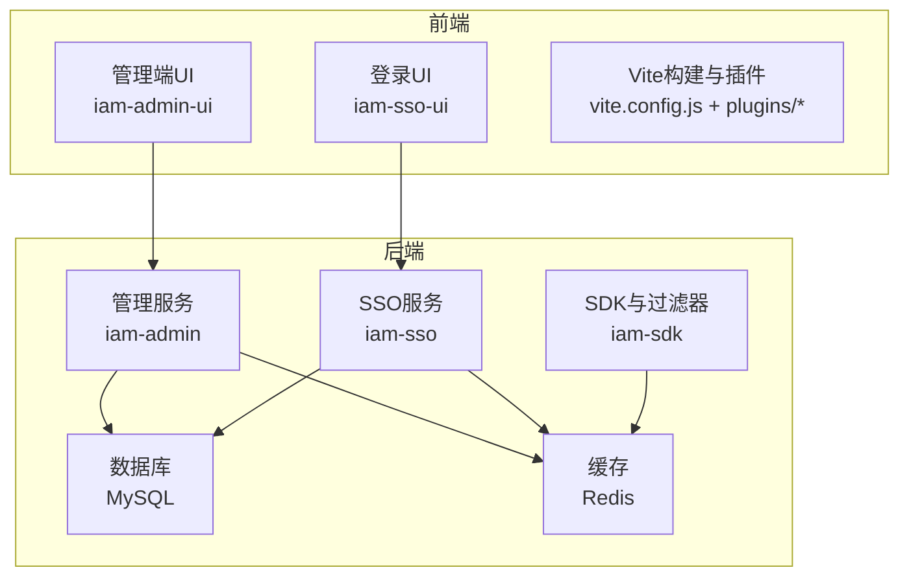
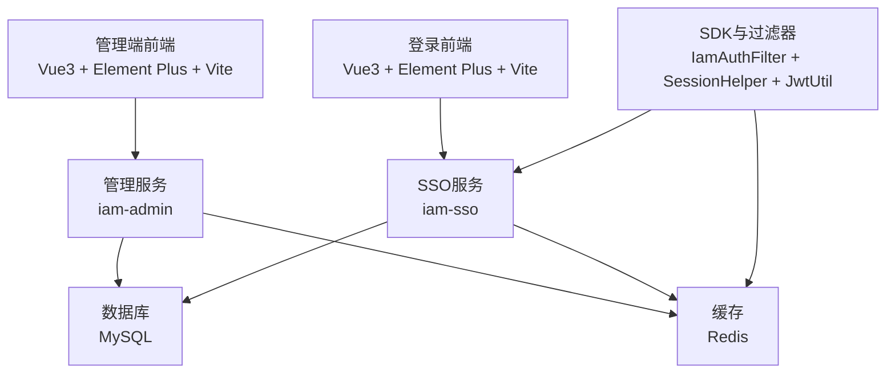
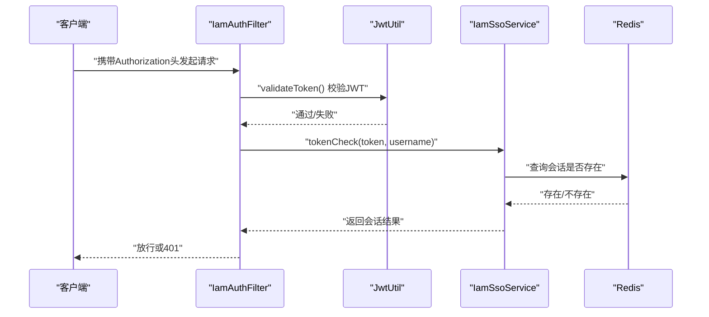
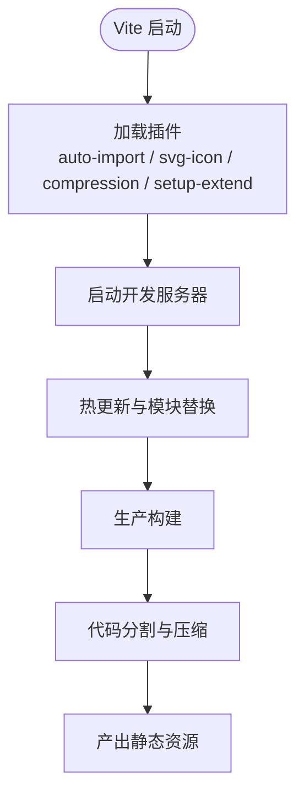
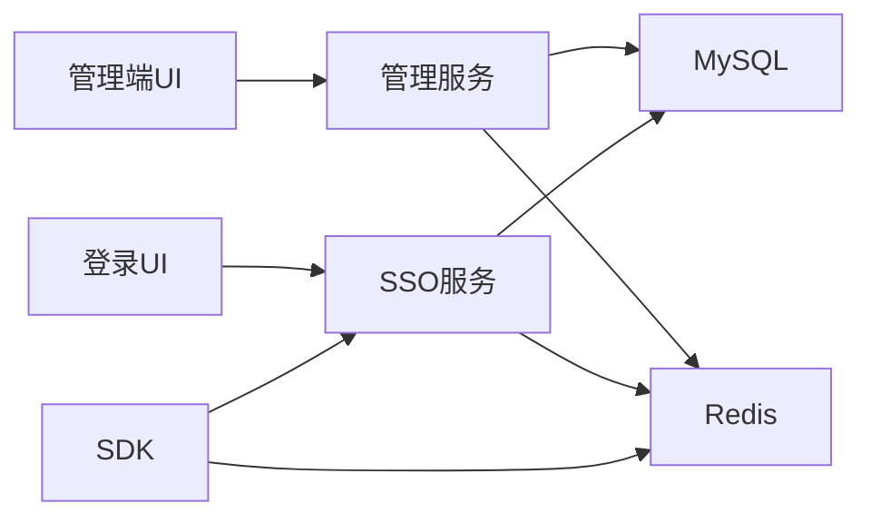

# 技术栈选型

<cite>
**本文引用的文件**
- [iam-admin-starter\src\main\resources\logback-spring.xml](file://iam-admin-starter\src\main\resources\logback-spring.xml)
- [iam-sso-ui\README.md](file://iam-sso-ui\README.md)
- [iam-admin-ui\README.md](file://iam-admin-ui\README.md)
- [iam-admin-ui\vite\plugins\index.js](file://iam-admin-ui\vite\plugins\index.js)
- [iam-sso-ui\vite\plugins\index.js](file://iam-sso-ui\vite\plugins\index.js)
- [iam-admin-ui\vite\plugins\auto-import.js](file://iam-admin-ui\vite\plugins\auto-import.js)
- [iam-sso-ui\vite\plugins\auto-import.js](file://iam-sso-ui\vite\plugins\auto-import.js)
- [iam-admin-ui\vite\plugins\setup-extend.js](file://iam-admin-ui\vite\plugins\setup-extend.js)
- [iam-sso-ui\vite\plugins\setup-extend.js](file://iam-sso-ui\vite\plugins\setup-extend.js)
- [iam-admin\src\main\resources\mapper\IamTenantMapper.xml](file://iam-admin\src\main\resources\mapper\IamTenantMapper.xml)
- [.trae\skills\sh-mybatis\SKILL.md](file://.trae\skills\sh-mybatis\SKILL.md)
- [.trae\skills\iam-sdk\SKILL.md](file://.trae\skills\iam-sdk\SKILL.md)
- [docs\stories\STORY-005-jwt-token.md](file://docs\stories\STORY-005-jwt-token.md)
- [iam-sdk\src\main\java\com\wkclz\iam\sdk\util\JwtUtil.java](file://iam-sdk\src\main\java\com\wkclz\iam\sdk\util\JwtUtil.java)
- [iam-sdk\src\main\java\com\wkclz\iam\sdk\filter\IamAuthFilter.java](file://iam-sdk\src\main\java\com\wkclz\iam\sdk\filter\IamAuthFilter.java)
- [iam-sdk\src\main\java\com\wkclz\iam\sdk\helper\SessionHelper.java](file://iam-sdk\src\main\java\com\wkclz\iam\sdk\helper\SessionHelper.java)
- [iam-sdk\src\main\java\com\wkclz\iam\sdk\service\IamSsoService.java](file://iam-sdk\src\main\java\com\wkclz\iam\sdk\service\IamSsoService.java)
- [iam-sso\src\main\java\com\wkclz\iam\sso\service\IamSsoServiceImpl.java](file://iam-sso\src\main\java\com\wkclz\iam\sso\service\IamSsoServiceImpl.java)
- [iam-sso\src\main\resources\db-script\db-base.ddl.sql](file://iam-sso\src\main\resources\db-script\db-base.ddl.sql)
- [iam-admin-starter\src\main\resources\config\application.yml](file://iam-admin-starter\src\main\resources\config\application.yml)
- [iam-sso-starter\src\main\resources\config\application.yml](file://iam-sso-starter\src\main\resources\config\application.yml)
</cite>

## 目录
1. [引言](#引言)
2. [项目结构](#项目结构)
3. [核心组件](#核心组件)
4. [架构总览](#架构总览)
5. [详细组件分析](#详细组件分析)
6. [依赖关系分析](#依赖关系分析)
7. [性能考虑](#性能考虑)
8. [故障排查指南](#故障排查指南)
9. [结论](#结论)
10. [附录](#附录)

## 引言
本文件面向 SH-IAM 系统的技术栈选型与实施建议，围绕后端技术栈（Spring Boot、MyBatis、Redis、JWT）、前端技术栈（Vue 3、Element Plus、Vite）以及数据库与缓存策略进行系统化梳理，并结合仓库中的实际实现与文档，给出选择理由、优势、版本兼容性、性能对比与替代方案分析。

## 项目结构
系统采用前后端分离架构，后端由两个子系统组成：IAM 管理后台（iam-admin）与 IAM 单点登录（iam-sso），分别提供管理端与登录认证能力；前端包含两套 UI：管理端 UI（iam-admin-ui）与登录 UI（iam-sso-ui）。构建工具与插件在前端侧统一采用 Vite，通过插件体系提升开发体验与构建效率。

图示来源
- [iam-admin-ui\vite\plugins\index.js](file://iam-admin-ui\vite\plugins\index.js)
- [iam-sso-ui\vite\plugins\index.js](file://iam-sso-ui\vite\plugins\index.js)
- [iam-admin-starter\src\main\resources\config\application.yml](file://iam-admin-starter\src\main\resources\config\application.yml)
- [iam-sso-starter\src\main\resources\config\application.yml](file://iam-sso-starter\src\main\resources\config\application.yml)

章节来源
- [iam-admin-ui\README.md](file://iam-admin-ui\README.md)
- [iam-sso-ui\README.md](file://iam-sso-ui\README.md)

## 核心组件
- 后端框架：Spring Boot（自动装配、Starter、配置隔离）
- ORM 框架：MyBatis（结合通用 Mapper 与 SQL Provider 动态 SQL）
- 缓存：Redis（用于会话校验、令牌存储、用户信息缓存）
- 安全：JWT（HS256 签名、过期控制、Redis 会话校验）
- 前端：Vue 3 + Element Plus + Vite（现代化构建与按需导入）

章节来源
- [iam-admin-starter\src\main\resources\logback-spring.xml](file://iam-admin-starter\src\main\resources\logback-spring.xml)
- [.trae\skills\sh-mybatis\SKILL.md](file://.trae\skills\sh-mybatis\SKILL.md)
- [.trae\skills\iam-sdk\SKILL.md](file://.trae\skills\iam-sdk\SKILL.md)
- [docs\stories\STORY-005-jwt-token.md](file://docs\stories\STORY-005-jwt-token.md)

## 架构总览
整体架构以“服务边界清晰、前后端分离、统一鉴权与缓存”为核心目标。管理端负责系统管理与资源维护，SSO 端负责登录认证与会话管理；两者共享 Redis 作为会话与令牌校验中心，使用 JWT 作为无状态凭证载体。

图示来源
- [iam-sdk\src\main\java\com\wkclz\iam\sdk\filter\IamAuthFilter.java](file://iam-sdk\src\main\java\com\wkclz\iam\sdk\filter\IamAuthFilter.java)
- [iam-sdk\src\main\java\com\wkclz\iam\sdk\helper\SessionHelper.java](file://iam-sdk\src\main\java\com\wkclz\iam\sdk\helper\SessionHelper.java)
- [iam-sdk\src\main\java\com\wkclz\iam\sdk\util\JwtUtil.java](file://iam-sdk\src\main\java\com\wkclz\iam\sdk\util\JwtUtil.java)
- [iam-sso\src\main\java\com\wkclz\iam\sso\service\IamSsoServiceImpl.java](file://iam-sso\src\main\java\com\wkclz\iam\sso\service\IamSsoServiceImpl.java)

## 详细组件分析

### 后端技术栈：Spring Boot、MyBatis、Redis、JWT

- Spring Boot
  - 作用：提供自动配置、Starter、Profile 隔离、日志与健康检查等基础能力。
  - 证据：日志配置文件展示了多环境日志输出策略，应用配置文件体现环境化配置。
  - 优势：快速启动、约定优于配置、生态完善、易于微服务扩展。

- MyBatis
  - 作用：ORM 映射与 SQL 控制，结合通用 Mapper 与 SQL Provider 实现动态 SQL。
  - 证据：Mapper XML 示例、sh-mybatis 模块知识库描述了通用 CRUD、拦截器、分页等能力。
  - 优势：灵活控制 SQL、易与现有数据库集成、性能可控、学习成本适中。

- Redis
  - 作用：JWT 会话校验、用户会话列表、令牌黑名单/白名单策略支撑。
  - 证据：JWT 工具类中 Redis Key 规范、SDK 过滤器中会话校验链路。
  - 优势：高性能读写、原子操作、可扩展集群、适合会话与缓存场景。

- JWT
  - 作用：无状态令牌承载用户身份，结合 Redis 实现在线会话校验。
  - 证据：JWT 工具类、过滤器鉴权流程、会话模型与存储键规范。
  - 优势：跨域友好、服务无状态、便于横向扩展；与 Redis 结合可实现强一致校验。

图示来源
- [.trae\skills\iam-sdk\SKILL.md](file://.trae\skills\iam-sdk\SKILL.md)
- [iam-sdk\src\main\java\com\wkclz\iam\sdk\util\JwtUtil.java](file://iam-sdk\src\main\java\com\wkclz\iam\sdk\util\JwtUtil.java)
- [iam-sdk\src\main\java\com\wkclz\iam\sdk\filter\IamAuthFilter.java](file://iam-sdk\src\main\java\com\wkclz\iam\sdk\filter\IamAuthFilter.java)
- [iam-sdk\src\main\java\com\wkclz\iam\sdk\helper\SessionHelper.java](file://iam-sdk\src\main\java\com\wkclz\iam\sdk\helper\SessionHelper.java)
- [iam-sdk\src\main\java\com\wkclz\iam\sdk\service\IamSsoService.java](file://iam-sdk\src\main\java\com\wkclz\iam\sdk\service\IamSsoService.java)

章节来源
- [.trae\skills\sh-mybatis\SKILL.md](file://.trae\skills\sh-mybatis\SKILL.md)
- [iam-admin\src\main\resources\mapper\IamTenantMapper.xml](file://iam-admin\src\main\resources\mapper\IamTenantMapper.xml)
- [docs\stories\STORY-005-jwt-token.md](file://docs\stories\STORY-005-jwt-token.md)

### 前端技术栈：Vue 3、Element Plus、Vite

- Vue 3
  - 作用：响应式 UI 框架，提供组合式 API 与更好的性能。
  - 证据：UI 项目 README 明确标注 Vue3 技术栈。
  - 优势：更小体积、更快渲染、更好的 TypeScript 支持、生态活跃。

- Element Plus
  - 作用：桌面端 UI 组件库，提供丰富的业务组件与主题定制。
  - 证据：样式与组件广泛使用 Element Plus。
  - 优势：组件丰富、文档完善、与 Vue 3 高度契合。

- Vite
  - 作用：现代化构建工具，提供快速冷启动与热更新。
  - 证据：Vite 插件体系（自动导入、SVG 图标、压缩、setup 语法糖）。
  - 优势：启动快、HMR 效率高、打包产物优化好。

图示来源
- [iam-admin-ui\vite\plugins\index.js](file://iam-admin-ui\vite\plugins\index.js)
- [iam-sso-ui\vite\plugins\index.js](file://iam-sso-ui\vite\plugins\index.js)
- [iam-admin-ui\vite\plugins\auto-import.js](file://iam-admin-ui\vite\plugins\auto-import.js)
- [iam-sso-ui\vite\plugins\auto-import.js](file://iam-sso-ui\vite\plugins\auto-import.js)
- [iam-admin-ui\vite\plugins\setup-extend.js](file://iam-admin-ui\vite\plugins\setup-extend.js)
- [iam-sso-ui\vite\plugins\setup-extend.js](file://iam-sso-ui\vite\plugins\setup-extend.js)

章节来源
- [iam-admin-ui\README.md](file://iam-admin-ui\README.md)
- [iam-sso-ui\README.md](file://iam-sso-ui\README.md)

### 数据库设计：MySQL 的选择与优化策略

- 选择原因
  - 成熟稳定、生态完善、社区支持强、成本低。
  - 与 MyBatis 生态契合，SQL 易于控制与优化。

- 优化策略
  - 分页与索引：利用通用分页工具与表元数据查询，确保查询走索引。
  - 动态 SQL：通过 SQL Provider 生成安全、可维护的 WHERE 条件。
  - 大字段分离：使用注解标记大字段，避免列表查询时的性能损耗。
  - 自动填充与拦截器：减少重复代码，保证一致性。

章节来源
- [.trae\skills\sh-mybatis\SKILL.md](file://.trae\skills\sh-mybatis\SKILL.md)
- [iam-admin\src\main\resources\mapper\IamTenantMapper.xml](file://iam-admin\src\main\resources\mapper\IamTenantMapper.xml)

### 缓存策略：Redis 的应用场景与配置

- 应用场景
  - 会话校验：JWT 令牌在 Redis 中进行在线校验。
  - 用户信息缓存：登录后缓存用户上下文，降低数据库压力。
  - 会话列表：记录用户当前有效会话集合，支持强制下线与并发登录控制。

- 键命名规范
  - 会话键：统一前缀与哈希格式，便于检索与清理。
  - 会话列表键：按用户名聚合，便于批量操作。

- 配置建议
  - 持久化：RDB/AOF 组合，兼顾性能与数据安全。
  - 内存：合理设置 maxmemory 与淘汰策略，避免 OOM。
  - 集群：主从复制与哨兵/Cluster，保障高可用。

章节来源
- [docs\stories\STORY-005-jwt-token.md](file://docs\stories\STORY-005-jwt-token.md)
- [iam-sdk\src\main\java\com\wkclz\iam\sdk\util\JwtUtil.java](file://iam-sdk\src\main\java\com\wkclz\iam\sdk\util\JwtUtil.java)
- [.trae\skills\iam-sdk\SKILL.md](file://.trae\skills\iam-sdk\SKILL.md)

## 依赖关系分析

图示来源
- [iam-admin-starter\src\main\resources\config\application.yml](file://iam-admin-starter\src\main\resources\config\application.yml)
- [iam-sso-starter\src\main\resources\config\application.yml](file://iam-sso-starter\src\main\resources\config\application.yml)

章节来源
- [iam-admin-starter\src\main\resources\config\application.yml](file://iam-admin-starter\src\main\resources\config\application.yml)
- [iam-sso-starter\src\main\resources\config\application.yml](file://iam-sso-starter\src\main\resources\config\application.yml)

## 性能考虑
- 前端
  - Vite 的按需导入与 Tree-shaking 减少包体积，提升首屏速度。
  - SVG 图标与压缩插件在构建阶段完成，降低运行时开销。
- 后端
  - MyBatis 动态 SQL 与拦截器减少冗余字段传输，提高 IO 效率。
  - Redis 缓存热点数据与会话校验，显著降低数据库压力。
- 安全
  - JWT 过期时间与时钟偏差容忍机制平衡安全性与用户体验。
  - 会话校验链路在过滤器层统一处理，避免重复校验逻辑。

## 故障排查指南
- 日志定位
  - 多环境日志配置：控制台与文件滚动输出，便于本地与线上问题定位。
- 常见问题
  - JWT 校验失败：检查签名密钥、过期时间与客户端时钟偏差。
  - 会话未命中：确认 Redis 键命名与过期策略是否正确。
  - SQL 性能问题：核对索引与动态 SQL 条件，必要时引入分页与缓存。

章节来源
- [iam-admin-starter\src\main\resources\logback-spring.xml](file://iam-admin-starter\src\main\resources\logback-spring.xml)
- [.trae\skills\iam-sdk\SKILL.md](file://.trae\skills\iam-sdk\SKILL.md)

## 结论
本项目在技术栈选择上遵循“成熟稳定、生态完善、性能可控”的原则：后端以 Spring Boot + MyBatis + Redis + JWT 构建高可用、可扩展的服务体系；前端以 Vue 3 + Element Plus + Vite 提供高效开发与良好用户体验。结合仓库中的实现细节与知识库文档，该技术栈在当前业务场景下具备良好的落地性与演进空间。

## 附录

### 版本兼容性与替代方案
- Spring Boot
  - 推荐使用较新 LTS 版本，保持与 Starter 生态同步。
  - 替代：Micronaut、Quarkus（更偏向云原生与无侵入）。
- MyBatis
  - 推荐配合 PageHelper 与 Druid，兼顾性能与可观测性。
  - 替代：MyBatis-Plus（增强 CRUD）、JPA（简单场景）。
- Redis
  - 推荐使用 Redis 6+，启用 ACL 与持久化。
  - 替代：Memcached（简单键值）、Cassandra（大数据场景）。
- JWT
  - HS256 简洁高效；如需跨服务信任，可考虑 RS256。
  - 替代：Opaque Token + DB 校验（更易撤销但有状态）。
- 前端
  - Vue 3 + Vite 已成为主流，Element Plus 与 Vite 生态完善。
  - 替代：React + Vite（需调整组件库与工具链）、Nuxt（服务端渲染）。