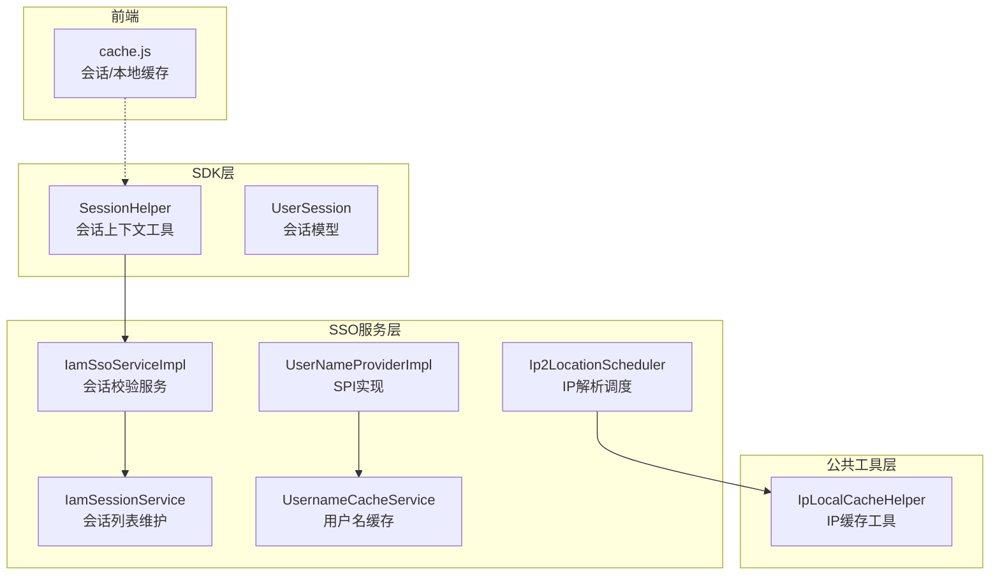
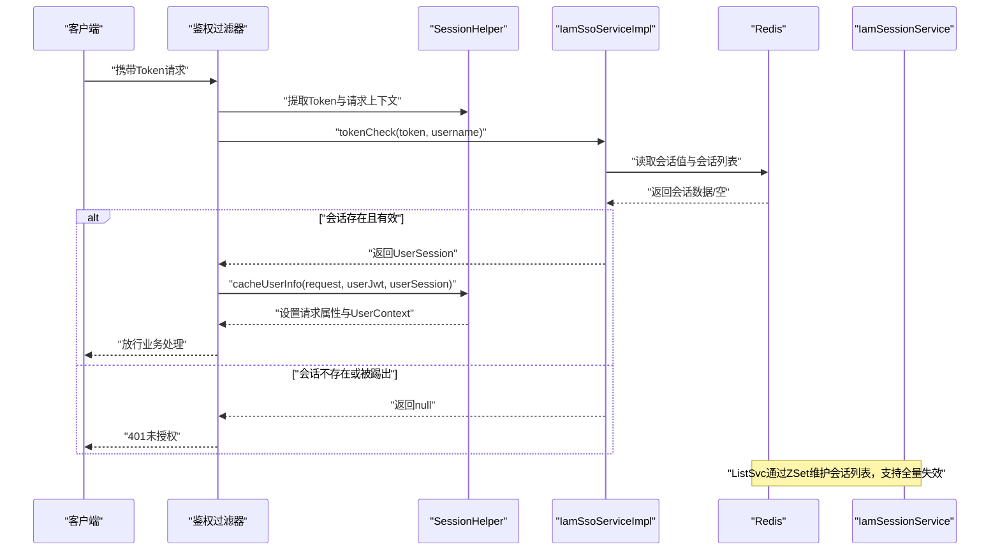
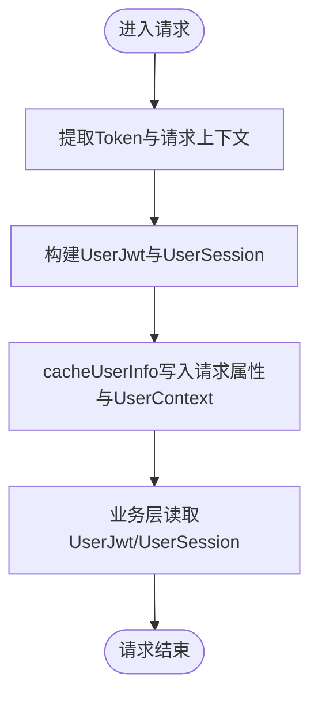
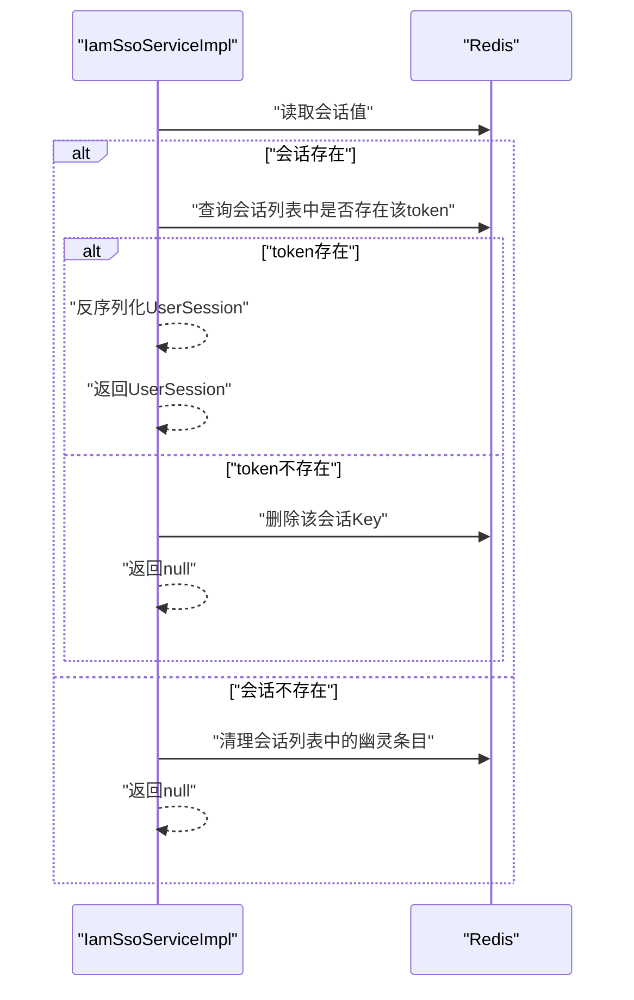
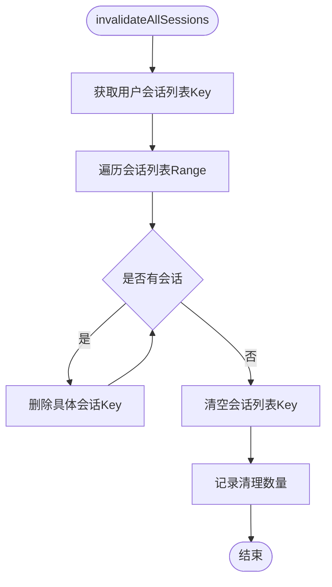
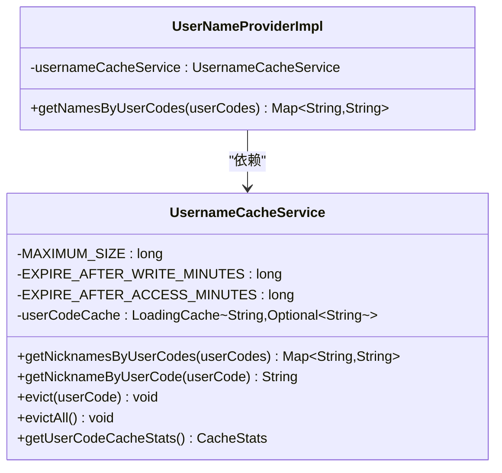
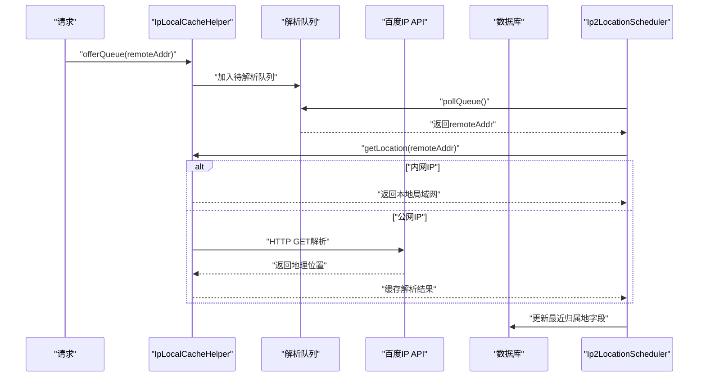
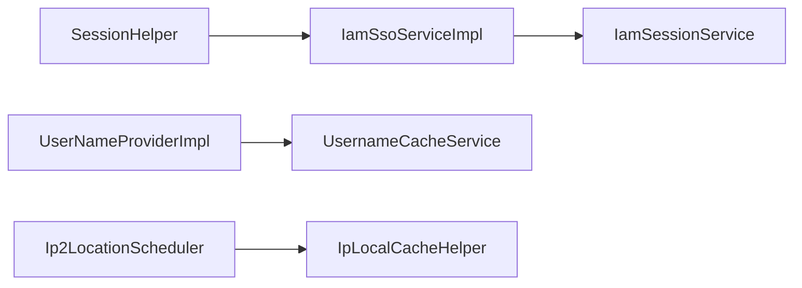

# 会话管理数据流

<cite>
**本文档引用的文件**
- [SessionHelper.java](file://iam-sdk/src/main/java/com/wkclz/iam/sdk/helper/SessionHelper.java)
- [UserSession.java](file://iam-sdk/src/main/java/com/wkclz/iam/sdk/model/UserSession.java)
- [IamSsoServiceImpl.java](file://iam-sso/src/main/java/com/wkclz/iam/sso/service/IamSsoServiceImpl.java)
- [IamSessionService.java](file://iam-sso/src/main/java/com/wkclz/iam/sso/service/IamSessionService.java)
- [UsernameCacheService.java](file://iam-sso/src/main/java/com/wkclz/iam/sso/service/UsernameCacheService.java)
- [UserNameProviderImpl.java](file://iam-sso/src/main/java/com/wkclz/iam/sso/spiimpl/UserNameProviderImpl.java)
- [IpLocalCacheHelper.java](file://iam-common/src/main/java/com/wkclz/iam/common/helper/IpLocalCacheHelper.java)
- [Ip2LocationScheduler.java](file://iam-sso/src/main/java/com/wkclz/iam/sso/schedule/Ip2LocationScheduler.java)
- [cache.js](file://iam-sso-ui/src/plugins/cache.js)
- [cache.js](file://iam-admin-ui/src/plugins/cache.js)
</cite>

## 目录
1. [引言](#引言)
2. [项目结构](#项目结构)
3. [核心组件](#核心组件)
4. [架构总览](#架构总览)
5. [详细组件分析](#详细组件分析)
6. [依赖关系分析](#依赖关系分析)
7. [性能考虑](#性能考虑)
8. [故障排查指南](#故障排查指南)
9. [结论](#结论)

## 引言
本文件聚焦SH-IAM系统会话管理的数据流，系统性阐述用户会话生命周期管理，包括会话创建、状态维护、过期处理、缓存策略等。重点说明以下组件的协作机制：
- SessionHelper：负责在请求上下文中缓存和读取用户会话信息，提供鉴权过滤器与业务层之间的会话桥接。
- IamSessionService：负责Redis中会话列表与会话数据的维护与失效，支撑跨设备踢人、全量注销等能力。
- IamSsoServiceImpl：负责从Redis读取并校验用户会话，确保会话存在性与有效性。
- UsernameCacheService：基于Guava LoadingCache的用户名缓存服务，支撑SPI自动填充创建/更新人名称。
- IP地理位置缓存：基于本地队列与缓存的异步解析机制，降低对外部API的依赖。

## 项目结构
围绕会话管理的关键模块分布如下：
- SDK层（iam-sdk）：提供会话模型、上下文工具与接口契约。
- SSO服务层（iam-sso）：实现会话服务、用户名缓存、IP解析调度等。
- 公共工具层（iam-common）：提供IP归属地解析与缓存工具。
- 前端缓存插件（iam-sso-ui、iam-admin-ui）：提供浏览器端会话级与本地缓存能力。

**图表来源**
- [SessionHelper.java:13-81](file://iam-sdk/src/main/java/com/wkclz/iam/sdk/helper/SessionHelper.java#L13-L81)
- [UserSession.java:1-21](file://iam-sdk/src/main/java/com/wkclz/iam/sdk/model/UserSession.java#L1-L21)
- [IamSsoServiceImpl.java:1-47](file://iam-sso/src/main/java/com/wkclz/iam/sso/service/IamSsoServiceImpl.java#L1-L47)
- [IamSessionService.java:1-33](file://iam-sso/src/main/java/com/wkclz/iam/sso/service/IamSessionService.java#L1-L33)
- [UsernameCacheService.java:1-189](file://iam-sso/src/main/java/com/wkclz/iam/sso/service/UsernameCacheService.java#L1-L189)
- [UserNameProviderImpl.java:1-39](file://iam-sso/src/main/java/com/wkclz/iam/sso/spiimpl/UserNameProviderImpl.java#L1-L39)
- [IpLocalCacheHelper.java:1-112](file://iam-common/src/main/java/com/wkclz/iam/common/helper/IpLocalCacheHelper.java#L1-L112)
- [Ip2LocationScheduler.java:1-61](file://iam-sso/src/main/java/com/wkclz/iam/sso/schedule/Ip2LocationScheduler.java#L1-L61)
- [cache.js:1-79](file://iam-sso-ui/src/plugins/cache.js#L1-L79)
- [cache.js:1-79](file://iam-admin-ui/src/plugins/cache.js#L1-L79)

**章节来源**
- [SessionHelper.java:13-81](file://iam-sdk/src/main/java/com/wkclz/iam/sdk/helper/SessionHelper.java#L13-L81)
- [IamSsoServiceImpl.java:1-47](file://iam-sso/src/main/java/com/wkclz/iam/sso/service/IamSsoServiceImpl.java#L1-L47)
- [IamSessionService.java:1-33](file://iam-sso/src/main/java/com/wkclz/iam/sso/service/IamSessionService.java#L1-L33)
- [UsernameCacheService.java:1-189](file://iam-sso/src/main/java/com/wkclz/iam/sso/service/UsernameCacheService.java#L1-L189)
- [IpLocalCacheHelper.java:1-112](file://iam-common/src/main/java/com/wkclz/iam/common/helper/IpLocalCacheHelper.java#L1-L112)
- [Ip2LocationScheduler.java:1-61](file://iam-sso/src/main/java/com/wkclz/iam/sso/schedule/Ip2LocationScheduler.java#L1-L61)
- [cache.js:1-79](file://iam-sso-ui/src/plugins/cache.js#L1-L79)
- [cache.js:1-79](file://iam-admin-ui/src/plugins/cache.js#L1-L79)

## 核心组件
- 会话模型：UserSession承载用户登录后的关键信息，包括用户编码、用户名、昵称、认证类型、小程序openId等。
- 会话上下文：SessionHelper负责将UserJwt与UserSession注入到当前请求属性，并设置到全局UserContext，便于后续业务读取。
- 会话校验：IamSsoServiceImpl从Redis读取会话并校验，若会话不存在或被踢出则返回null，触发401响应。
- 会话列表维护：IamSessionService通过ZSet维护用户的会话列表，支持按用户全量失效会话。
- 用户名缓存：UsernameCacheService基于Guava LoadingCache，提供userCode->nickname的缓存与批量查询，配合SPI自动填充创建/更新人名称。
- IP归属地缓存：IpLocalCacheHelper提供IP解析队列与缓存，结合Ip2LocationScheduler异步解析并更新数据库字段。

**章节来源**
- [UserSession.java:1-21](file://iam-sdk/src/main/java/com/wkclz/iam/sdk/model/UserSession.java#L1-L21)
- [SessionHelper.java:42-53](file://iam-sdk/src/main/java/com/wkclz/iam/sdk/helper/SessionHelper.java#L42-L53)
- [IamSsoServiceImpl.java:22-46](file://iam-sso/src/main/java/com/wkclz/iam/sso/service/IamSsoServiceImpl.java#L22-L46)
- [IamSessionService.java:20-31](file://iam-sso/src/main/java/com/wkclz/iam/sso/service/IamSessionService.java#L20-L31)
- [UsernameCacheService.java:56-96](file://iam-sso/src/main/java/com/wkclz/iam/sso/service/UsernameCacheService.java#L56-L96)
- [IpLocalCacheHelper.java:25-51](file://iam-common/src/main/java/com/wkclz/iam/common/helper/IpLocalCacheHelper.java#L25-L51)

## 架构总览
下图展示了会话管理在系统中的整体数据流与组件交互：

**图表来源**
- [SessionHelper.java:42-53](file://iam-sdk/src/main/java/com/wkclz/iam/sdk/helper/SessionHelper.java#L42-L53)
- [IamSsoServiceImpl.java:22-46](file://iam-sso/src/main/java/com/wkclz/iam/sso/service/IamSsoServiceImpl.java#L22-L46)
- [IamSessionService.java:20-31](file://iam-sso/src/main/java/com/wkclz/iam/sso/service/IamSessionService.java#L20-L31)

## 详细组件分析

### SessionHelper：会话上下文管理
- 功能职责
  - 提取请求头中的Token（优先Authorization，其次token），并去除Bearer前缀。
  - 将UserJwt与UserSession写入当前请求属性，并设置到全局UserContext，供业务层读取。
  - 提供Ant风格路径匹配方法，用于公开路径判定。
- 关键流程
  - cacheUserInfo：将userJwt与userSession注入request，并构造UserInfo设置到UserContext。
  - getUserJwt/getUserSession：从当前请求读取userJwt与userSession。
  - getToken/getAppCode：从请求头读取Token与应用编码。
- 与前端的衔接
  - 前端通过cache.js提供sessionStorage/localStorage封装，便于在浏览器侧进行会话级与本地缓存操作。

**图表来源**
- [SessionHelper.java:25-53](file://iam-sdk/src/main/java/com/wkclz/iam/sdk/helper/SessionHelper.java#L25-L53)
- [cache.js:1-79](file://iam-sso-ui/src/plugins/cache.js#L1-L79)

**章节来源**
- [SessionHelper.java:13-81](file://iam-sdk/src/main/java/com/wkclz/iam/sdk/helper/SessionHelper.java#L13-L81)
- [cache.js:1-79](file://iam-sso-ui/src/plugins/cache.js#L1-L79)
- [cache.js:1-79](file://iam-admin-ui/src/plugins/cache.js#L1-L79)

### IamSsoServiceImpl：会话状态校验
- 功能职责
  - 从Redis读取指定token对应的会话字符串，若不存在则清理会话列表中的幽灵条目并返回null。
  - 校验Token是否仍在用户会话列表中；若不在，则删除该会话并返回null。
  - 成功时反序列化为UserSession返回。
- 关键点
  - Redis Key格式：iam:session:{username}:{MD5(token)}。
  - 与IamSessionService共同维护会话列表的ZSet结构，确保会话存在性与一致性。
- 错误处理
  - 会话不存在或被踢出时返回null，触发401未授权响应。

**图表来源**
- [IamSsoServiceImpl.java:22-46](file://iam-sso/src/main/java/com/wkclz/iam/sso/service/IamSsoServiceImpl.java#L22-L46)

**章节来源**
- [IamSsoServiceImpl.java:1-47](file://iam-sso/src/main/java/com/wkclz/iam/sso/service/IamSsoServiceImpl.java#L1-L47)

### IamSessionService：会话列表与失效管理
- 功能职责
  - 通过ZSet维护每个用户的会话列表（token的MD5值作为成员，时间戳作为分数）。
  - 支持按用户全量失效会话：遍历会话列表，删除对应会话Key，并清空会话列表。
- 一致性保证
  - 与IamSsoServiceImpl配合，确保会话列表与实际会话数据一致。
  - 通过ZSet的有序特性，便于后续扩展会话续期、排序等需求。

**图表来源**
- [IamSessionService.java:20-31](file://iam-sso/src/main/java/com/wkclz/iam/sso/service/IamSessionService.java#L20-L31)

**章节来源**
- [IamSessionService.java:1-33](file://iam-sso/src/main/java/com/wkclz/iam/sso/service/IamSessionService.java#L1-L33)

### UsernameCacheService：用户名缓存与SPI集成
- 缓存策略
  - 基于Guava LoadingCache，key=userCode，value=Optional<String>(nickname)。
  - 最大容量限制、写入后过期（60分钟）、访问后过期（30分钟）、统计记录。
  - 支持单键与批量加载，批量查询自动合并为一次数据库查询，降低DB压力。
- SPI集成
  - UserNameProviderImpl通过UsernameCacheService实现批量查询userCode->nickname映射，供自动填充createByName/updateByName字段。
- 失效与统计
  - 支持按userCode驱逐、全量驱逐、获取缓存统计信息。

**图表来源**
- [UsernameCacheService.java:34-189](file://iam-sso/src/main/java/com/wkclz/iam/sso/service/UsernameCacheService.java#L34-L189)
- [UserNameProviderImpl.java:19-39](file://iam-sso/src/main/java/com/wkclz/iam/sso/spiimpl/UserNameProviderImpl.java#L19-L39)

**章节来源**
- [UsernameCacheService.java:1-189](file://iam-sso/src/main/java/com/wkclz/iam/sso/service/UsernameCacheService.java#L1-L189)
- [UserNameProviderImpl.java:1-39](file://iam-sso/src/main/java/com/wkclz/iam/sso/spiimpl/UserNameProviderImpl.java#L1-L39)

### IP地理位置缓存：异步解析与持久化
- 缓存机制
  - IpLocalCacheHelper提供ConcurrentLinkedQueue作为待解析队列，ConcurrentHashMap作为IP归属地缓存。
  - offerQueue/pollQueue保证线程安全；getLocation对局域网IP直接标记“本地局域网”，公网IP通过百度API解析并缓存。
- 异步调度
  - Ip2LocationScheduler在应用启动后开启独立线程，从队列中取出IP并解析，随后更新数据库字段，避免阻塞主请求链路。
- 与会话的关系
  - 主要用于登录日志与请求日志的IP归属地展示，间接提升会话审计能力。

**图表来源**
- [IpLocalCacheHelper.java:25-110](file://iam-common/src/main/java/com/wkclz/iam/common/helper/IpLocalCacheHelper.java#L25-L110)
- [Ip2LocationScheduler.java:28-56](file://iam-sso/src/main/java/com/wkclz/iam/sso/schedule/Ip2LocationScheduler.java#L28-L56)

**章节来源**
- [IpLocalCacheHelper.java:1-112](file://iam-common/src/main/java/com/wkclz/iam/common/helper/IpLocalCacheHelper.java#L1-L112)
- [Ip2LocationScheduler.java:1-61](file://iam-sso/src/main/java/com/wkclz/iam/sso/schedule/Ip2LocationScheduler.java#L1-L61)

## 依赖关系分析
- 组件耦合
  - SessionHelper与IamSsoServiceImpl通过UserSession形成松耦合：前者负责上下文注入，后者负责会话校验。
  - IamSessionService与IamSsoServiceImpl共享会话列表的ZSet结构，确保会话存在性校验的一致性。
  - UsernameCacheService与UserNameProviderImpl通过SPI解耦，便于在不同模块复用用户名解析。
  - IpLocalCacheHelper与Ip2LocationScheduler通过队列与缓存实现异步解耦。
- 外部依赖
  - Redis：会话数据与会话列表存储。
  - 百度IP解析API：公网IP归属地解析。
  - Guava Cache：用户名缓存。
- 循环依赖
  - 未发现循环依赖，各组件职责清晰。

**图表来源**
- [SessionHelper.java:42-53](file://iam-sdk/src/main/java/com/wkclz/iam/sdk/helper/SessionHelper.java#L42-L53)
- [IamSsoServiceImpl.java:22-46](file://iam-sso/src/main/java/com/wkclz/iam/sso/service/IamSsoServiceImpl.java#L22-L46)
- [IamSessionService.java:20-31](file://iam-sso/src/main/java/com/wkclz/iam/sso/service/IamSessionService.java#L20-L31)
- [UserNameProviderImpl.java:22-37](file://iam-sso/src/main/java/com/wkclz/iam/sso/spiimpl/UserNameProviderImpl.java#L22-L37)
- [UsernameCacheService.java:56-96](file://iam-sso/src/main/java/com/wkclz/iam/sso/service/UsernameCacheService.java#L56-L96)
- [Ip2LocationScheduler.java:28-56](file://iam-sso/src/main/java/com/wkclz/iam/sso/schedule/Ip2LocationScheduler.java#L28-L56)
- [IpLocalCacheHelper.java:25-51](file://iam-common/src/main/java/com/wkclz/iam/common/helper/IpLocalCacheHelper.java#L25-L51)

**章节来源**
- [SessionHelper.java:13-81](file://iam-sdk/src/main/java/com/wkclz/iam/sdk/helper/SessionHelper.java#L13-L81)
- [IamSsoServiceImpl.java:1-47](file://iam-sso/src/main/java/com/wkclz/iam/sso/service/IamSsoServiceImpl.java#L1-L47)
- [IamSessionService.java:1-33](file://iam-sso/src/main/java/com/wkclz/iam/sso/service/IamSessionService.java#L1-L33)
- [UsernameCacheService.java:1-189](file://iam-sso/src/main/java/com/wkclz/iam/sso/service/UsernameCacheService.java#L1-L189)
- [IpLocalCacheHelper.java:1-112](file://iam-common/src/main/java/com/wkclz/iam/common/helper/IpLocalCacheHelper.java#L1-L112)
- [Ip2LocationScheduler.java:1-61](file://iam-sso/src/main/java/com/wkclz/iam/sso/schedule/Ip2LocationScheduler.java#L1-L61)

## 性能考虑
- 缓存策略
  - 用户名缓存采用Guava LoadingCache，具备批量加载、容量上限、写入/访问过期等策略，兼顾内存占用与数据新鲜度。
  - IP归属地缓存采用ConcurrentHashMap+队列，避免重复请求外部API，异步解析降低主线程开销。
- Redis会话存储
  - 会话数据以JSON字符串形式存储，Key采用MD5(token)避免敏感信息泄露；会话列表使用ZSet便于后续扩展。
- 前端缓存
  - 前端提供sessionStorage与localStorage封装，便于在浏览器侧快速读取用户信息，减少重复请求。

[本节为通用性能建议，不直接分析具体文件]

## 故障排查指南
- 会话401未授权
  - 检查Redis中是否存在对应会话Key与会话列表；确认token是否被踢出或过期。
  - 参考路径：[IamSsoServiceImpl.java:22-46](file://iam-sso/src/main/java/com/wkclz/iam/sso/service/IamSsoServiceImpl.java#L22-L46)
- 会话无法全量失效
  - 检查会话列表Key与具体会话Key是否正确；确认IamSessionService的遍历与删除逻辑。
  - 参考路径：[IamSessionService.java:20-31](file://iam-sso/src/main/java/com/wkclz/iam/sso/service/IamSessionService.java#L20-L31)
- 用户名缓存未生效
  - 检查userCode是否正确传入；确认数据库中是否存在对应昵称；观察缓存统计信息。
  - 参考路径：[UsernameCacheService.java:106-147](file://iam-sso/src/main/java/com/wkclz/iam/sso/service/UsernameCacheService.java#L106-L147)
- IP归属地解析异常
  - 检查队列是否正常消费；确认外网IP可访问百度API；查看日志输出。
  - 参考路径：[IpLocalCacheHelper.java:64-110](file://iam-common/src/main/java/com/wkclz/iam/common/helper/IpLocalCacheHelper.java#L64-L110)，[Ip2LocationScheduler.java:28-56](file://iam-sso/src/main/java/com/wkclz/iam/sso/schedule/Ip2LocationScheduler.java#L28-L56)

**章节来源**
- [IamSsoServiceImpl.java:22-46](file://iam-sso/src/main/java/com/wkclz/iam/sso/service/IamSsoServiceImpl.java#L22-L46)
- [IamSessionService.java:20-31](file://iam-sso/src/main/java/com/wkclz/iam/sso/service/IamSessionService.java#L20-L31)
- [UsernameCacheService.java:106-147](file://iam-sso/src/main/java/com/wkclz/iam/sso/service/UsernameCacheService.java#L106-L147)
- [IpLocalCacheHelper.java:64-110](file://iam-common/src/main/java/com/wkclz/iam/common/helper/IpLocalCacheHelper.java#L64-L110)
- [Ip2LocationScheduler.java:28-56](file://iam-sso/src/main/java/com/wkclz/iam/sso/schedule/Ip2LocationScheduler.java#L28-L56)

## 结论
SH-IAM系统的会话管理通过SDK层的SessionHelper、SSO层的IamSsoServiceImpl与IamSessionService、以及公共层的IP缓存工具形成了清晰的职责分工与高效的数据流：
- 会话创建与上下文注入由SessionHelper完成；
- 会话校验与一致性由IamSsoServiceImpl与IamSessionService共同保障；
- 用户名缓存与SPI集成提升了数据填充效率；
- IP归属地缓存与异步调度降低了对外部API的依赖并提升了用户体验。

该设计在保证安全性的同时，兼顾了性能与可维护性，适合在多租户、多应用的复杂场景中扩展与演进。