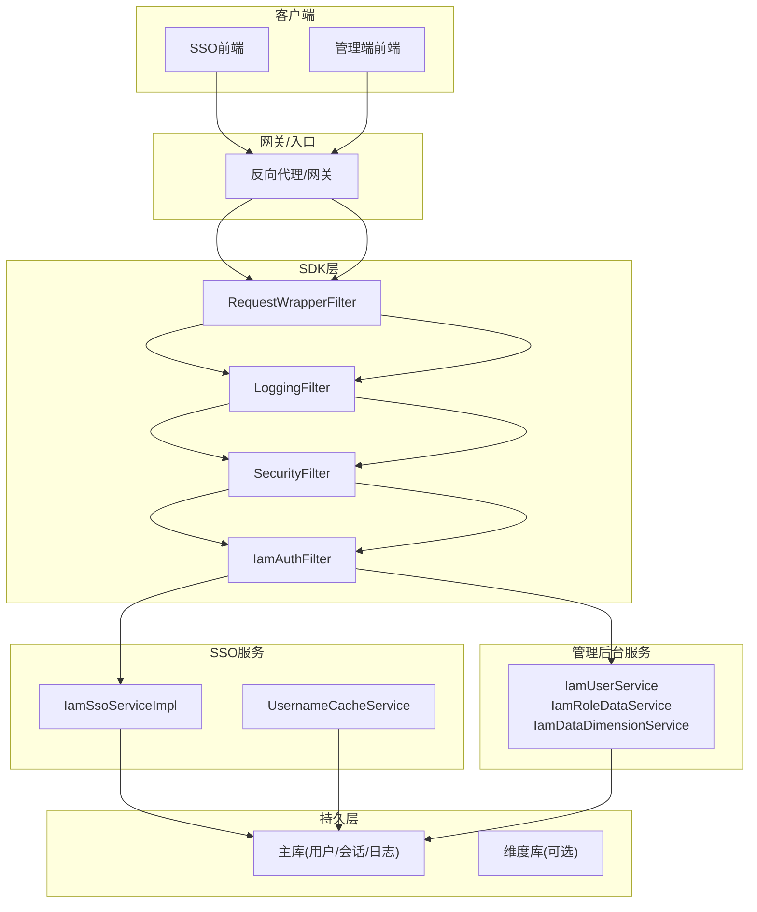
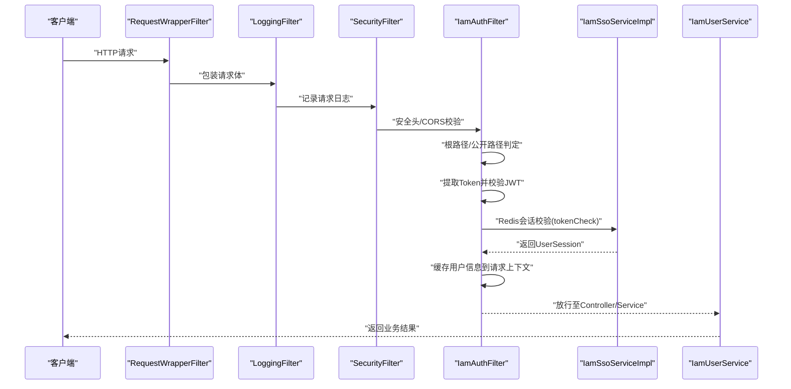
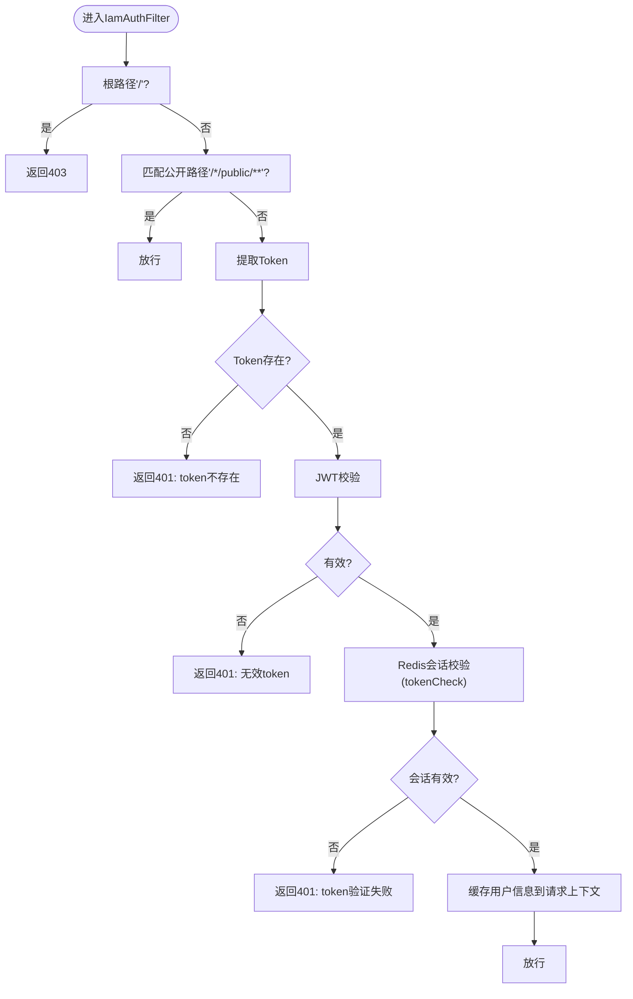
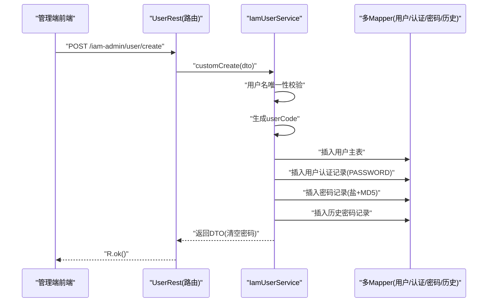
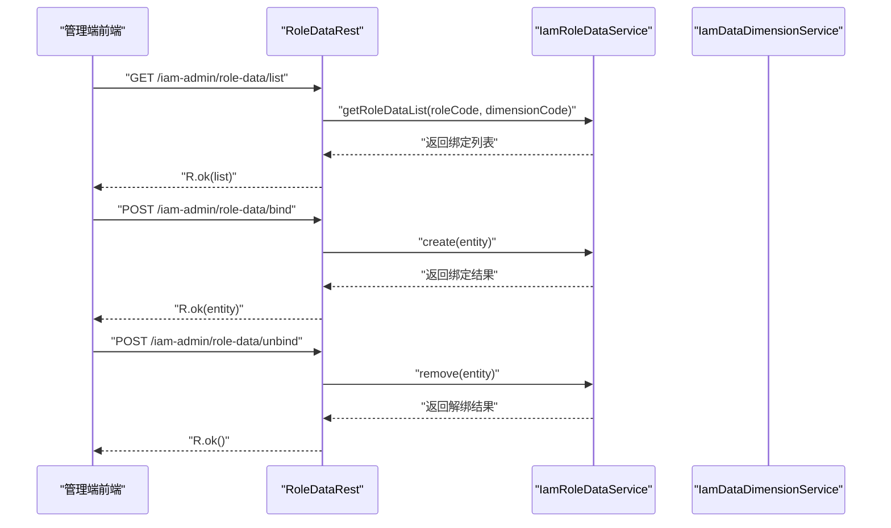
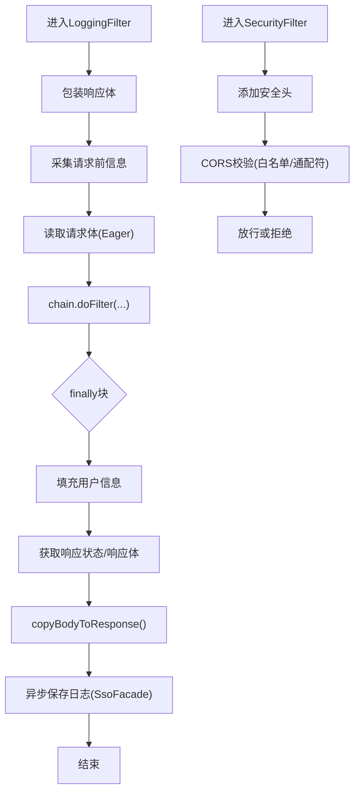
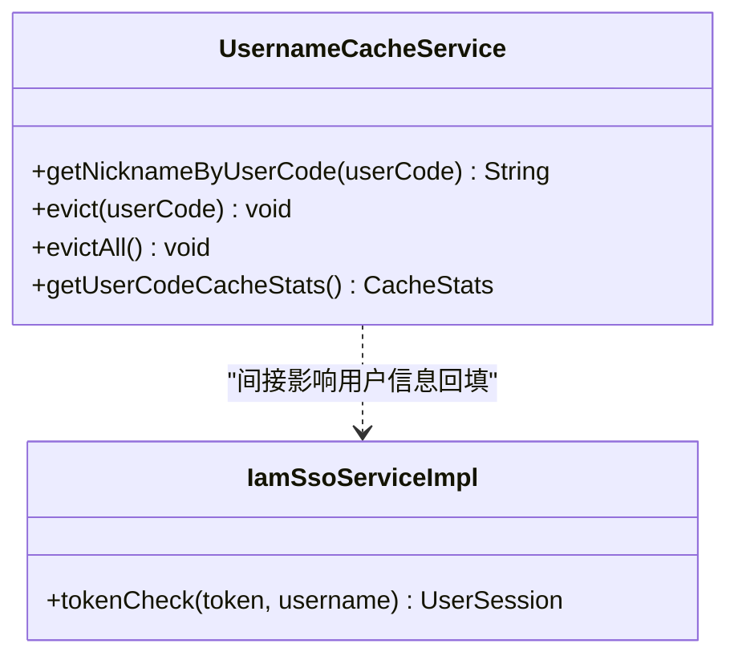
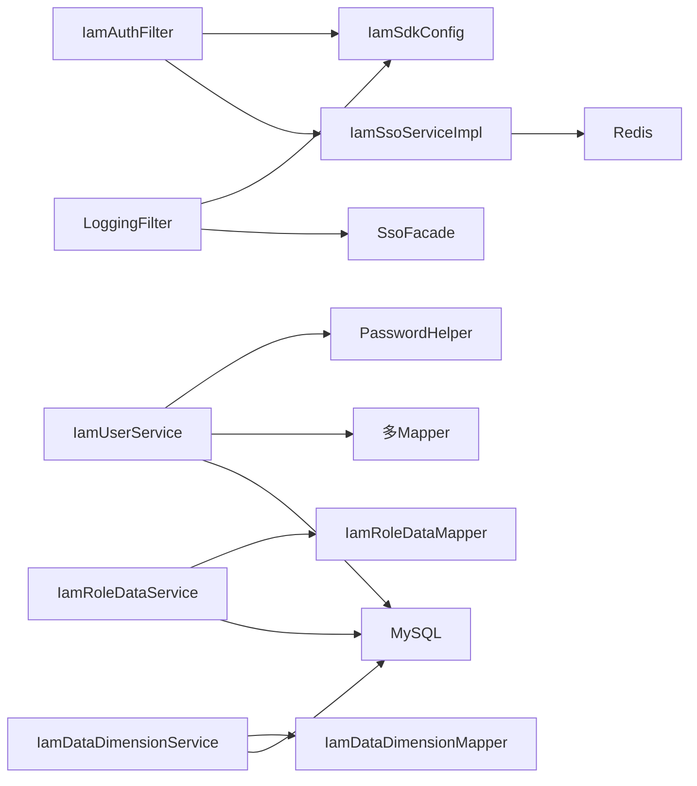

# 数据流设计

<cite>
**本文引用的文件**
- [IamAuthFilter.java](file://iam-sdk/src/main/java/com/wkclz/iam/sdk/filter/IamAuthFilter.java)
- [RequestWrapperFilter.java](file://iam-sdk/src/main/java/com/wkclz/iam/sdk/filter/RequestWrapperFilter.java)
- [EagerContentCachingRequestWrapper.java](file://iam-sdk/src/main/java/com/wkclz/iam/sdk/filter/EagerContentCachingRequestWrapper.java)
- [LoggingFilter.java](file://iam-sdk/src/main/java/com/wkclz/iam/sdk/filter/LoggingFilter.java)
- [IamSsoServiceImpl.java](file://iam-sso/src/main/java/com/wkclz/iam/sso/service/IamSsoServiceImpl.java)
- [IamUserService.java](file://iam-admin/src/main/java/com/wkclz/iam/admin/service/IamUserService.java)
- [PasswordHelper.java](file://iam-common/src/main/java/com/wkclz/iam/common/helper/PasswordHelper.java)
- [UsernameCacheService.java](file://iam-sso/src/main/java/com/wkclz/iam/sso/service/UsernameCacheService.java)
- [IamRoleDataService.java](file://iam-admin/src/main/java/com/wkclz/iam/admin/service/IamRoleDataService.java)
- [IamDataDimensionService.java](file://iam-admin/src/main/java/com/wkclz/iam/admin/service/IamDataDimensionService.java)
- [IamAdminConfig.java](file://iam-admin/src/main/java/com/wkclz/iam/admin/config/IamAdminConfig.java)
- [IamSsoConfig.java](file://iam-sso/src/main/java/com/wkclz/iam/sso/config/IamSsoConfig.java)
- [IamSdkConfig.java](file://iam-sdk/src/main/java/com/wkclz/iam/sdk/config/IamSdkConfig.java)
- [SecurityFilter.java](file://iam-sdk/src/main/java/com/wkclz/iam/sdk/filter/SecurityFilter.java)
- [SecurityConfig.java](file://iam-sdk/src/main/java/com/wkclz/iam/sdk/config/SecurityConfig.java)
- [IamSsoAutoConfig.java](file://iam-sso/src/main/java/com/wkclz/iam/sso/IamSsoAutoConfig.java)
- [IamAdminAutoConfig.java](file://iam-admin/src/main/java/com/wkclz/iam/admin/IamAdminAutoConfig.java)
- [IamSdkAutoConfig.java](file://iam-sdk/src/main/java/com/wkclz/iam/sdk/IamSdkAutoConfig.java)
- [Route.java](file://iam-admin/src/main/java/com/wkclz/iam/admin/Route.java)
- [RoleDataRest.java](file://iam-admin/src/main/java/com/wkclz/iam/admin/rest/RoleDataRest.java)
- [IamAuthFilter.md](file://docs/stories/STORY-007-iam-auth-filter.md)
- [SecurityFilter.md](file://docs/stories/STORY-010-security-filter.md)
- [UserCrudStory.md](file://docs/stories/STORY-025-user-crud.md)
- [DataDimensionStory.md](file://docs/stories/STORY-037-data-dimension-crud.md)
- [RelationEntitiesStory.md](file://docs/stories/STORY-002-iam-relation-entities.md)
- [WebSkill.md](file://.trae/skills/sh-web/SKILL.md)
- [DynamicDbSkill.md](file://.trae/skills/sh-dynamicdb/SKILL.md)
</cite>

## 目录
1. [引言](#引言)
2. [项目结构](#项目结构)
3. [核心组件](#核心组件)
4. [架构总览](#架构总览)
5. [详细组件分析](#详细组件分析)
6. [依赖分析](#依赖分析)
7. [性能考量](#性能考量)
8. [故障排查指南](#故障排查指南)
9. [结论](#结论)
10. [附录](#附录)

## 引言
本文件面向SH-IAM系统的数据流设计，系统围绕“请求—过滤—鉴权—服务—持久化”的主线展开，覆盖认证数据流、用户管理数据流、权限控制数据流与数据维度管理数据流。文档重点阐述：
- 请求在过滤器链中的流转与处理顺序
- 服务层调用与事务边界
- 数据访问层操作与多数据源路由
- 缓存策略与会话校验
- 持久化方案与一致性保障
- 错误传播与异常处理机制

## 项目结构
系统采用多模块划分：SDK（鉴权与安全）、SSO（会话与登录）、管理后台（CRUD与权限）、公共工具（实体与辅助）、前端UI（SSO与管理端）。核心模块间通过REST接口与门面服务交互。

图示来源
- [IamAuthFilter.java:30-71](file://iam-sdk/src/main/java/com/wkclz/iam/sdk/filter/IamAuthFilter.java#L30-L71)
- [LoggingFilter.java:58-125](file://iam-sdk/src/main/java/com/wkclz/iam/sdk/filter/LoggingFilter.java#L58-L125)
- [IamSsoServiceImpl.java:22-46](file://iam-sso/src/main/java/com/wkclz/iam/sso/service/IamSsoServiceImpl.java#L22-L46)
- [IamUserService.java:77-121](file://iam-admin/src/main/java/com/wkclz/iam/admin/service/IamUserService.java#L77-L121)

章节来源
- [IamSdkAutoConfig.java](file://iam-sdk/src/main/java/com/wkclz/iam/sdk/IamSdkAutoConfig.java)
- [IamSsoAutoConfig.java](file://iam-sso/src/main/java/com/wkclz/iam/sso/IamSsoAutoConfig.java)
- [IamAdminAutoConfig.java](file://iam-admin/src/main/java/com/wkclz/iam/admin/IamAdminAutoConfig.java)

## 核心组件
- 过滤器链：RequestWrapperFilter → LoggingFilter → SecurityFilter → IamAuthFilter → Controller
- 鉴权组件：IamAuthFilter + IamSsoServiceImpl（Redis会话校验）
- 服务组件：IamUserService（用户管理）、IamRoleDataService（角色-数据维度绑定）、IamDataDimensionService（数据维度CRUD）
- 缓存组件：UsernameCacheService（用户昵称缓存）
- 配置组件：IamSdkConfig、IamSsoConfig、IamAdminConfig
- 日志组件：LoggingFilter（请求/响应日志采集与脱敏）

章节来源
- [IamAuthFilter.md:30-34](file://docs/stories/STORY-007-iam-auth-filter.md#L30-L34)
- [SecurityFilter.md:35-37](file://docs/stories/STORY-010-security-filter.md#L35-L37)
- [IamUserService.java:77-121](file://iam-admin/src/main/java/com/wkclz/iam/admin/service/IamUserService.java#L77-L121)
- [UsernameCacheService.java:34-189](file://iam-sso/src/main/java/com/wkclz/iam/sso/service/UsernameCacheService.java#L34-L189)

## 架构总览
整体数据流以“请求进入—过滤—鉴权—服务—持久化/缓存—响应返回”为主线，贯穿以下关键路径：
- 认证数据流：请求经IamAuthFilter校验JWT与Redis会话，通过后注入用户上下文
- 用户管理数据流：管理端调用IamUserService执行用户创建/更新/删除，涉及多表事务
- 权限控制数据流：角色-数据维度绑定与数据维度CRUD
- 日志与安全：LoggingFilter采集请求日志并脱敏，SecurityFilter添加安全头与CORS校验

图示来源
- [IamAuthFilter.java:30-71](file://iam-sdk/src/main/java/com/wkclz/iam/sdk/filter/IamAuthFilter.java#L30-L71)
- [IamSsoServiceImpl.java:22-46](file://iam-sso/src/main/java/com/wkclz/iam/sso/service/IamSsoServiceImpl.java#L22-L46)
- [LoggingFilter.java:58-125](file://iam-sdk/src/main/java/com/wkclz/iam/sdk/filter/LoggingFilter.java#L58-L125)
- [SecurityFilter.md:35-37](file://docs/stories/STORY-010-security-filter.md#L35-L37)

## 详细组件分析

### 认证数据流
- 过滤器链顺序：RequestWrapperFilter（急切缓存请求体）→ LoggingFilter（请求日志采集）→ SecurityFilter（安全头/CORS）→ IamAuthFilter（JWT+Redis会话）
- IamAuthFilter关键步骤：
  - 根路径拦截返回403
  - 公开路径匹配放行
  - 从请求头提取Token（优先Authorization头，去前缀）
  - JWT签名/有效期校验
  - Redis会话校验（tokenCheck），校验通过后缓存用户信息到请求上下文
  - 异常统一返回401
- IamSsoServiceImpl：
  - 通过Redis键空间校验会话是否存在与是否在用户会话列表中
  - 会话过期或被踢出时清理会话列表中的幽灵条目

图示来源
- [IamAuthFilter.java:30-71](file://iam-sdk/src/main/java/com/wkclz/iam/sdk/filter/IamAuthFilter.java#L30-L71)
- [IamSsoServiceImpl.java:22-46](file://iam-sso/src/main/java/com/wkclz/iam/sso/service/IamSsoServiceImpl.java#L22-L46)

章节来源
- [IamAuthFilter.md:17-26](file://docs/stories/STORY-007-iam-auth-filter.md#L17-L26)
- [IamAuthFilter.java:30-71](file://iam-sdk/src/main/java/com/wkclz/iam/sdk/filter/IamAuthFilter.java#L30-L71)
- [IamSsoServiceImpl.java:22-46](file://iam-sso/src/main/java/com/wkclz/iam/sso/service/IamSsoServiceImpl.java#L22-L46)

### 用户管理数据流
- 管理端调用IamUserService执行用户CRUD，核心流程：
  - 用户名唯一性校验
  - 生成userCode（RedisIdGenerator）
  - 插入用户主表
  - 插入用户认证记录（authType=PASSWORD）
  - 插入用户密码记录（盐+MD5）
  - 插入历史密码记录
  - 返回DTO并清空敏感字段
- 事务边界：@Transactional(rollbackFor = Exception.class)包裹多表插入，确保原子性
- 参数校验：必填字段校验、乐观锁version校验

图示来源
- [IamUserService.java:77-121](file://iam-admin/src/main/java/com/wkclz/iam/admin/service/IamUserService.java#L77-L121)
- [UserCrudStory.md:22-30](file://docs/stories/STORY-025-user-crud.md#L22-L30)

章节来源
- [UserCrudStory.md:17-30](file://docs/stories/STORY-025-user-crud.md#L17-L30)
- [IamUserService.java:77-121](file://iam-admin/src/main/java/com/wkclz/iam/admin/service/IamUserService.java#L77-L121)
- [PasswordHelper.java:13-34](file://iam-common/src/main/java/com/wkclz/iam/common/helper/PasswordHelper.java#L13-L34)

### 权限控制数据流（角色-数据维度）
- 角色-数据维度绑定：IamRoleDataService提供按角色与维度查询、绑定、解绑能力
- 数据维度CRUD：IamDataDimensionService提供分页、新增、更新、删除
- 控制器路由：RoleDataRest提供角色-数据维度列表、绑定、解绑接口

图示来源
- [RoleDataRest.java:21-38](file://iam-admin/src/main/java/com/wkclz/iam/admin/rest/RoleDataRest.java#L21-L38)
- [IamRoleDataService.java:26-40](file://iam-admin/src/main/java/com/wkclz/iam/admin/service/IamRoleDataService.java#L26-L40)
- [IamDataDimensionService.java:24-35](file://iam-admin/src/main/java/com/wkclz/iam/admin/service/IamDataDimensionService.java#L24-L35)

章节来源
- [DataDimensionStory.md:17-32](file://docs/stories/STORY-037-data-dimension-crud.md#L17-L32)
- [IamRoleDataService.java:26-40](file://iam-admin/src/main/java/com/wkclz/iam/admin/service/IamRoleDataService.java#L26-L40)
- [IamDataDimensionService.java:24-35](file://iam-admin/src/main/java/com/wkclz/iam/admin/service/IamDataDimensionService.java#L24-L35)

### 日志与安全数据流
- LoggingFilter：
  - 急切缓存请求体，支持多次读取
  - 采集请求/响应信息，脱敏密码字段，截断超长字段
  - 异步保存请求日志（通过SsoFacade）
- SecurityFilter：
  - 添加安全响应头（X-Frame-Options、CSP等）
  - CORS校验（支持通配符与白名单）
  - 可配置开关控制

图示来源
- [LoggingFilter.java:58-125](file://iam-sdk/src/main/java/com/wkclz/iam/sdk/filter/LoggingFilter.java#L58-L125)
- [LoggingFilter.java:227-240](file://iam-sdk/src/main/java/com/wkclz/iam/sdk/filter/LoggingFilter.java#L227-L240)
- [SecurityFilter.md:18-30](file://docs/stories/STORY-010-security-filter.md#L18-L30)

章节来源
- [LoggingFilter.java:58-125](file://iam-sdk/src/main/java/com/wkclz/iam/sdk/filter/LoggingFilter.java#L58-L125)
- [LoggingFilter.java:227-240](file://iam-sdk/src/main/java/com/wkclz/iam/sdk/filter/LoggingFilter.java#L227-L240)
- [SecurityFilter.md:18-30](file://docs/stories/STORY-010-security-filter.md#L18-L30)

### 缓存与会话数据流
- UsernameCacheService：
  - 基于Guava LoadingCache，userCode→Optional<昵称>
  - 支持容量上限、写入/访问过期、批量加载、防穿透
  - 提供evict(evictAll)失效接口
- IamSsoServiceImpl：
  - 通过Redis键空间维护用户会话列表与具体会话对象
  - 会话过期或被踢出时清理会话列表中的幽灵条目

图示来源
- [UsernameCacheService.java:34-189](file://iam-sso/src/main/java/com/wkclz/iam/sso/service/UsernameCacheService.java#L34-L189)
- [IamSsoServiceImpl.java:22-46](file://iam-sso/src/main/java/com/wkclz/iam/sso/service/IamSsoServiceImpl.java#L22-L46)

章节来源
- [UsernameCacheService.java:34-189](file://iam-sso/src/main/java/com/wkclz/iam/sso/service/UsernameCacheService.java#L34-L189)
- [IamSsoServiceImpl.java:22-46](file://iam-sso/src/main/java/com/wkclz/iam/sso/service/IamSsoServiceImpl.java#L22-L46)

## 依赖分析
- 组件耦合：
  - IamAuthFilter依赖IamSdkConfig（JWT密钥）、IamSsoService（Redis会话校验）
  - LoggingFilter依赖IamSdkConfig与SsoFacade（异步日志）
  - IamUserService依赖多个Mapper与PasswordHelper
  - IamRoleDataService/IamDataDimensionService依赖对应Mapper
- 外部依赖：
  - Redis：会话存储与会话列表维护
  - MySQL：用户、认证、密码、历史、日志等主数据
  - 动态数据源：通过AOP在Mapper层切换数据源

图示来源
- [IamAuthFilter.java:25-28](file://iam-sdk/src/main/java/com/wkclz/iam/sdk/filter/IamAuthFilter.java#L25-L28)
- [IamSsoServiceImpl.java:18-19](file://iam-sso/src/main/java/com/wkclz/iam/sso/service/IamSsoServiceImpl.java#L18-L19)
- [LoggingFilter.java:52-55](file://iam-sdk/src/main/java/com/wkclz/iam/sdk/filter/LoggingFilter.java#L52-L55)
- [IamUserService.java:42-48](file://iam-admin/src/main/java/com/wkclz/iam/admin/service/IamUserService.java#L42-L48)

章节来源
- [DynamicDbSkill.md:75-102](file://.trae/skills/sh-dynamicdb/SKILL.md#L75-L102)

## 性能考量
- 请求体缓存：EagerContentCachingRequestWrapper急切缓存，避免后续读取阻塞与重复IO
- 日志异步化：LoggingFilter在finally块中异步保存日志，降低同步阻塞
- 缓存策略：UsernameCacheService采用容量上限、写入/访问过期与批量加载，兼顾命中率与内存占用
- 事务边界：用户创建等多表写入使用@Transactional，减少跨表不一致风险
- 动态数据源：AOP在Mapper层清理数据源上下文，避免泄漏

## 故障排查指南
- 认证失败（401）：
  - 检查请求头是否包含合法Bearer Token
  - 校验JWT签名与有效期
  - 确认Redis中会话是否存在且在用户会话列表中
- 日志缺失：
  - 检查LoggingFilter是否被正确注册与执行
  - 确认SsoFacade实现与异步保存逻辑
- 用户创建失败：
  - 核对用户名唯一性校验与事务回滚
  - 检查密码加密与历史密码记录是否成功
- CORS/安全头问题：
  - 检查SecurityFilter配置项与白名单设置
  - 确认公开路径与健康检查路径是否被正确跳过

章节来源
- [WebSkill.md:31-51](file://.trae/skills/sh-web/SKILL.md#L31-L51)
- [IamAuthFilter.md:17-26](file://docs/stories/STORY-007-iam-auth-filter.md#L17-L26)
- [SecurityFilter.md:18-30](file://docs/stories/STORY-010-security-filter.md#L18-L30)

## 结论
SH-IAM系统通过清晰的过滤器链与服务层职责划分，实现了从请求接入到数据持久化的稳定数据流。认证采用JWT+Redis会话双重校验，用户管理与权限控制通过事务与缓存策略保障一致性与性能，日志与安全组件提供可观测性与防护能力。建议在生产环境中结合监控指标持续优化缓存命中率与日志异步化效果，并完善异常告警与审计追踪。

## 附录
- 配置要点：
  - JWT密钥、CORS白名单、安全头开关、日志脱敏与截断阈值
- 路由与REST：
  - 管理端路由前缀与接口规范见Route与各REST控制器

章节来源
- [IamSdkConfig.java](file://iam-sdk/src/main/java/com/wkclz/iam/sdk/config/IamSdkConfig.java)
- [IamSsoConfig.java](file://iam-sso/src/main/java/com/wkclz/iam/sso/config/IamSsoConfig.java)
- [IamAdminConfig.java](file://iam-admin/src/main/java/com/wkclz/iam/admin/config/IamAdminConfig.java)
- [Route.java](file://iam-admin/src/main/java/com/wkclz/iam/admin/Route.java)
- [RelationEntitiesStory.md:28-34](file://docs/stories/STORY-002-iam-relation-entities.md#L28-L34)