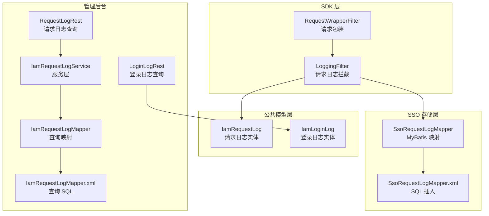
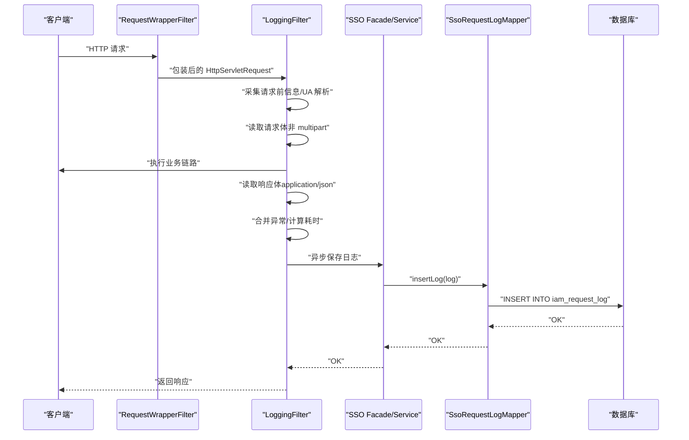
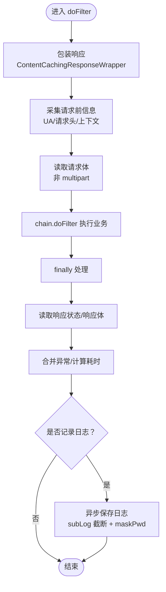
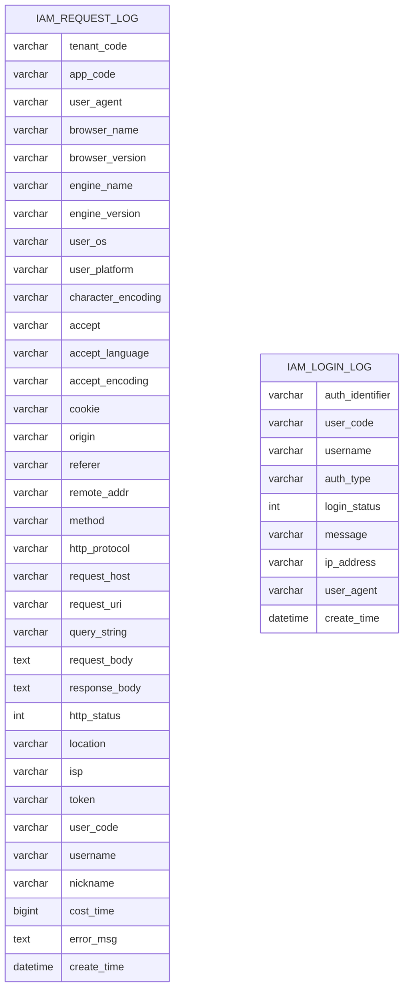
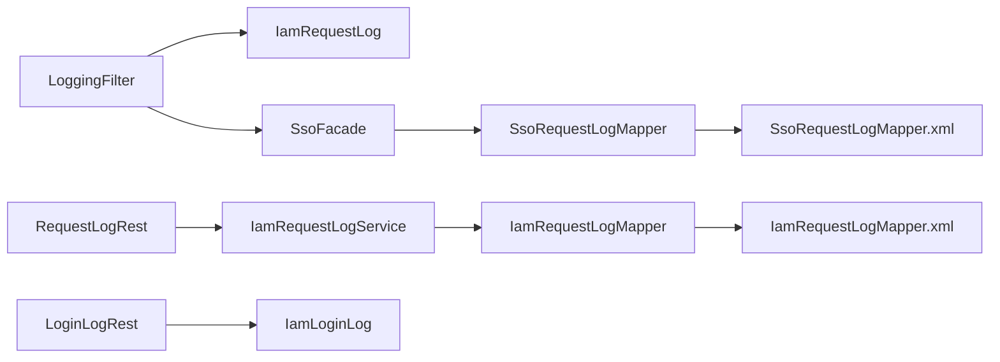

# 日志记录数据流

<cite>
**本文档引用的文件**
- [LoggingFilter.java](file://iam-sdk/src/main/java/com/wkclz/iam/sdk/filter/LoggingFilter.java)
- [RequestWrapperFilter.java](file://iam-sdk/src/main/java/com/wkclz/iam/sdk/filter/RequestWrapperFilter.java)
- [IamRequestLog.java](file://iam-common/src/main/java/com/wkclz/iam/common/entity/IamRequestLog.java)
- [IamLoginLog.java](file://iam-common/src/main/java/com/wkclz/iam/common/entity/IamLoginLog.java)
- [IamRequestLogMapper.java](file://iam-admin/src/main/java/com/wkclz/iam/admin/mapper/IamRequestLogMapper.java)
- [IamRequestLogMapper.xml](file://iam-admin/src/main/resources/mapper/IamRequestLogMapper.xml)
- [SsoRequestLogMapper.java](file://iam-sso/src/main/java/com/wkclz/iam/sso/mapper/SsoRequestLogMapper.java)
- [SsoRequestLogMapper.xml](file://iam-sso/src/main/resources/mapper/SsoRequestLogMapper.xml)
- [IamRequestLogService.java](file://iam-admin/src/main/java/com/wkclz/iam/admin/service/IamRequestLogService.java)
- [RequestLogRest.java](file://iam-admin/src/main/java/com/wkclz/iam/admin/rest/RequestLogRest.java)
- [LoginLogRest.java](file://iam-admin/src/main/java/com/wkclz/iam/admin/rest/LoginLogRest.java)
- [IamSsoServiceImpl.java](file://iam-sso/src/main/java/com/wkclz/iam/sso/service/IamSsoServiceImpl.java)
- [SKILL.md](file://.trae/skills/iam-sdk/SKILL.md)
</cite>

## 目录
1. [简介](#简介)
2. [项目结构](#项目结构)
3. [核心组件](#核心组件)
4. [架构总览](#架构总览)
5. [详细组件分析](#详细组件分析)
6. [依赖分析](#依赖分析)
7. [性能考虑](#性能考虑)
8. [故障排查指南](#故障排查指南)
9. [结论](#结论)
10. [附录](#附录)

## 简介
本文件系统性梳理 SH-IAM 系统的日志记录数据流，重点覆盖以下方面：
- 请求日志与登录日志的生成、拦截、异步落库与查询接口
- LoggingFilter 如何拦截请求并采集丰富维度的上下文信息
- 日志数据在数据库中的存储结构与索引策略
- 异步处理、批量写入与性能优化建议
- 日志查询接口的使用示例与最佳实践

## 项目结构
日志相关能力横跨 SDK、公共模型、SSO 存储与管理后台四个层面：
- SDK 层负责请求拦截与日志采集（LoggingFilter、RequestWrapperFilter）
- 公共层定义日志实体（IamRequestLog、IamLoginLog）
- SSO 层负责日志持久化（MyBatis 映射与插入）
- 管理后台提供日志查询接口（REST）

图表来源
- [LoggingFilter.java:58-125](file://iam-sdk/src/main/java/com/wkclz/iam/sdk/filter/LoggingFilter.java#L58-L125)
- [RequestWrapperFilter.java:18-21](file://iam-sdk/src/main/java/com/wkclz/iam/sdk/filter/RequestWrapperFilter.java#L18-L21)
- [IamRequestLog.java:19-316](file://iam-common/src/main/java/com/wkclz/iam/common/entity/IamRequestLog.java#L19-L316)
- [IamLoginLog.java:19-116](file://iam-common/src/main/java/com/wkclz/iam/common/entity/IamLoginLog.java#L19-L116)
- [SsoRequestLogMapper.java:11-18](file://iam-sso/src/main/java/com/wkclz/iam/sso/mapper/SsoRequestLogMapper.java#L11-L18)
- [SsoRequestLogMapper.xml:5-30](file://iam-sso/src/main/resources/mapper/SsoRequestLogMapper.xml#L5-L30)
- [RequestLogRest.java:26-45](file://iam-admin/src/main/java/com/wkclz/iam/admin/rest/RequestLogRest.java#L26-L45)
- [IamRequestLogMapper.java:16-21](file://iam-admin/src/main/java/com/wkclz/iam/admin/mapper/IamRequestLogMapper.java#L16-L21)
- [IamRequestLogMapper.xml:6-27](file://iam-admin/src/main/resources/mapper/IamRequestLogMapper.xml#L6-L27)
- [IamRequestLogService.java:35-70](file://iam-admin/src/main/java/com/wkclz/iam/admin/service/IamRequestLogService.java#L35-L70)

章节来源
- [LoggingFilter.java:58-125](file://iam-sdk/src/main/java/com/wkclz/iam/sdk/filter/LoggingFilter.java#L58-L125)
- [RequestWrapperFilter.java:18-21](file://iam-sdk/src/main/java/com/wkclz/iam/sdk/filter/RequestWrapperFilter.java#L18-L21)
- [IamRequestLog.java:19-316](file://iam-common/src/main/java/com/wkclz/iam/common/entity/IamRequestLog.java#L19-L316)
- [IamLoginLog.java:19-116](file://iam-common/src/main/java/com/wkclz/iam/common/entity/IamLoginLog.java#L19-L116)
- [SsoRequestLogMapper.java:11-18](file://iam-sso/src/main/java/com/wkclz/iam/sso/mapper/SsoRequestLogMapper.java#L11-L18)
- [SsoRequestLogMapper.xml:5-30](file://iam-sso/src/main/resources/mapper/SsoRequestLogMapper.xml#L5-L30)
- [RequestLogRest.java:26-45](file://iam-admin/src/main/java/com/wkclz/iam/admin/rest/RequestLogRest.java#L26-L45)
- [IamRequestLogMapper.java:16-21](file://iam-admin/src/main/java/com/wkclz/iam/admin/mapper/IamRequestLogMapper.java#L16-L21)
- [IamRequestLogMapper.xml:6-27](file://iam-admin/src/main/resources/mapper/IamRequestLogMapper.xml#L6-L27)
- [IamRequestLogService.java:35-70](file://iam-admin/src/main/java/com/wkclz/iam/admin/service/IamRequestLogService.java#L35-L70)

## 核心组件
- LoggingFilter：基于 Spring OncePerRequestFilter 的请求拦截器，负责采集请求前后上下文、UA 解析、请求体/响应体读取、异常合并、耗时统计与异步落库。
- RequestWrapperFilter：在最前位置对请求进行包装，确保可重复读取请求体，避免大体积上传导致内存压力。
- IamRequestLog/IamLoginLog：日志实体，包含丰富的维度字段（租户/应用、UA、浏览器/系统、网络、用户、性能、异常等）。
- SsoRequestLogMapper：SSO 层 MyBatis 映射，负责将日志实体写入 iam_request_log 表。
- 管理后台查询接口：提供分页查询与详情查询，限定时间范围防止超大查询。

章节来源
- [LoggingFilter.java:58-125](file://iam-sdk/src/main/java/com/wkclz/iam/sdk/filter/LoggingFilter.java#L58-L125)
- [RequestWrapperFilter.java:18-21](file://iam-sdk/src/main/java/com/wkclz/iam/sdk/filter/RequestWrapperFilter.java#L18-L21)
- [IamRequestLog.java:19-316](file://iam-common/src/main/java/com/wkclz/iam/common/entity/IamRequestLog.java#L19-L316)
- [IamLoginLog.java:19-116](file://iam-common/src/main/java/com/wkclz/iam/common/entity/IamLoginLog.java#L19-L116)
- [SsoRequestLogMapper.java:11-18](file://iam-sso/src/main/java/com/wkclz/iam/sso/mapper/SsoRequestLogMapper.java#L11-L18)
- [RequestLogRest.java:26-45](file://iam-admin/src/main/java/com/wkclz/iam/admin/rest/RequestLogRest.java#L26-L45)

## 架构总览
下图展示从请求进入 SDK，到日志实体生成、异步落库，再到管理后台查询的整体数据流。

图表来源
- [LoggingFilter.java:58-125](file://iam-sdk/src/main/java/com/wkclz/iam/sdk/filter/LoggingFilter.java#L58-L125)
- [SsoRequestLogMapper.java:11-18](file://iam-sso/src/main/java/com/wkclz/iam/sso/mapper/SsoRequestLogMapper.java#L11-L18)
- [SsoRequestLogMapper.xml:5-30](file://iam-sso/src/main/resources/mapper/SsoRequestLogMapper.xml#L5-L30)

## 详细组件分析

### LoggingFilter：请求日志拦截与异步落库
- 请求拦截与包装
  - 在 finally 中获取响应状态、响应体（仅 application/json），并调用 copyBodyToResponse 保证响应正常返回。
  - 从 SessionHelper 获取用户会话信息，填充用户维度。
- 上下文采集
  - 采集 UA 并解析浏览器/引擎/系统/平台等信息。
  - 提取请求头（Accept、Accept-Language、Accept-Encoding、Cookie、Origin、Referer）、远程地址、协议、字符集等。
  - 采集租户/应用/令牌/用户等上下文。
- 请求体/响应体处理
  - 非 multipart 时读取请求体；仅 application/json 时读取响应体。
  - 对请求体进行密码字段脱敏（maskPwd），并对所有字段按最大长度截断（subLog）。
- 过滤规则与缓存
  - 静态资源后缀匹配（可配置）与固定路径白名单（如 /public/status）决定是否记录。
  - 使用 HashMap 缓存 URI 是否记录，避免重复匹配。
- 异步落库
  - 通过 SsoFacade.saveLog 异步提交，内部使用线程池执行，异常记录但不影响主流程。

图表来源
- [LoggingFilter.java:58-125](file://iam-sdk/src/main/java/com/wkclz/iam/sdk/filter/LoggingFilter.java#L58-L125)
- [LoggingFilter.java:227-240](file://iam-sdk/src/main/java/com/wkclz/iam/sdk/filter/LoggingFilter.java#L227-L240)
- [LoggingFilter.java:242-295](file://iam-sdk/src/main/java/com/wkclz/iam/sdk/filter/LoggingFilter.java#L242-L295)

章节来源
- [LoggingFilter.java:58-125](file://iam-sdk/src/main/java/com/wkclz/iam/sdk/filter/LoggingFilter.java#L58-L125)
- [LoggingFilter.java:129-160](file://iam-sdk/src/main/java/com/wkclz/iam/sdk/filter/LoggingFilter.java#L129-L160)
- [LoggingFilter.java:179-189](file://iam-sdk/src/main/java/com/wkclz/iam/sdk/filter/LoggingFilter.java#L179-L189)
- [LoggingFilter.java:191-225](file://iam-sdk/src/main/java/com/wkclz/iam/sdk/filter/LoggingFilter.java#L191-L225)
- [LoggingFilter.java:227-240](file://iam-sdk/src/main/java/com/wkclz/iam/sdk/filter/LoggingFilter.java#L227-L240)
- [LoggingFilter.java:242-295](file://iam-sdk/src/main/java/com/wkclz/iam/sdk/filter/LoggingFilter.java#L242-L295)
- [SKILL.md:121-156](file://.trae/skills/iam-sdk/SKILL.md#L121-L156)

### RequestWrapperFilter：请求体可重复读取
- 在最前位置包装请求，支持多次读取请求体，避免后续读取不到或重复消费。
- 对 multipart/form-data 类型跳过缓存，降低内存占用。

章节来源
- [RequestWrapperFilter.java:18-21](file://iam-sdk/src/main/java/com/wkclz/iam/sdk/filter/RequestWrapperFilter.java#L18-L21)

### 日志实体与存储结构
- IamRequestLog
  - 字段覆盖租户/应用、UA、浏览器/引擎/系统/平台、网络信息、请求/响应体、用户、耗时、异常等。
  - 提供 copy/copyIfNotNull 辅助方法，便于更新与复制。
- IamLoginLog
  - 字段覆盖认证标识、用户编码/名、登录类型、状态、消息、IP、UA 等。
- 数据库存储
  - SsoRequestLogMapper.xml 实现向 iam_request_log 表插入日志记录，按实体字段动态拼接列。
  - IamRequestLogMapper.xml 提供请求日志的计数与分页查询，支持多条件过滤（租户/应用/用户/URI/方法/状态/时间区间等）。

图表来源
- [IamRequestLog.java:19-316](file://iam-common/src/main/java/com/wkclz/iam/common/entity/IamRequestLog.java#L19-L316)
- [IamLoginLog.java:19-116](file://iam-common/src/main/java/com/wkclz/iam/common/entity/IamLoginLog.java#L19-L116)
- [SsoRequestLogMapper.xml:5-30](file://iam-sso/src/main/resources/mapper/SsoRequestLogMapper.xml#L5-L30)
- [IamRequestLogMapper.xml:6-27](file://iam-admin/src/main/resources/mapper/IamRequestLogMapper.xml#L6-L27)

章节来源
- [IamRequestLog.java:19-316](file://iam-common/src/main/java/com/wkclz/iam/common/entity/IamRequestLog.java#L19-L316)
- [IamLoginLog.java:19-116](file://iam-common/src/main/java/com/wkclz/iam/common/entity/IamLoginLog.java#L19-L116)
- [SsoRequestLogMapper.xml:5-30](file://iam-sso/src/main/resources/mapper/SsoRequestLogMapper.xml#L5-L30)
- [IamRequestLogMapper.xml:6-27](file://iam-admin/src/main/resources/mapper/IamRequestLogMapper.xml#L6-L27)

### 异步处理与批量写入
- 异步落库
  - LoggingFilter 在 finally 中调用 saveResponseLog，内部通过线程池异步执行 ssoFacade.saveLog，异常捕获但不阻塞主流程。
- 批量写入
  - 当前实现为单条日志异步提交；若需批量写入，可在 SsoFacade 或 SsoRequestLogMapper 层扩展批量插入接口，结合队列/缓冲批处理以提升吞吐。
- 字段截断与脱敏
  - subLog 对 UA、Cookie、URI、请求体等字段设置上限长度，避免超长写入失败或占用过多空间。
  - maskPwd 对请求体中的密码字段进行脱敏，保护敏感信息。

章节来源
- [LoggingFilter.java:227-240](file://iam-sdk/src/main/java/com/wkclz/iam/sdk/filter/LoggingFilter.java#L227-L240)
- [LoggingFilter.java:242-295](file://iam-sdk/src/main/java/com/wkclz/iam/sdk/filter/LoggingFilter.java#L242-L295)

### 登录日志处理机制
- 登录日志实体 IamLoginLog 用于记录登录行为的关键信息（认证标识、用户、类型、状态、消息、IP、UA 等）。
- 登录日志通常由登录流程侧生成并持久化，与请求日志分离存储，便于审计与分析。

章节来源
- [IamLoginLog.java:19-116](file://iam-common/src/main/java/com/wkclz/iam/common/entity/IamLoginLog.java#L19-L116)

### 查询接口与使用示例
- 请求日志查询
  - 分页接口：GET /prefix/request-log/page，必填 timeFrom/timeTo，时间跨度不超过 30 天。
  - 详情接口：GET /prefix/request-log/info?id=xxx。
  - 支持按租户/应用/用户/URI/方法/状态/时间区间等条件过滤。
- 登录日志查询
  - 分页接口：GET /prefix/login-log/page，必填 timeFrom/timeTo，时间跨度不超过 30 天。
  - 详情接口：GET /prefix/login-log/info?id=xxx。

章节来源
- [RequestLogRest.java:26-45](file://iam-admin/src/main/java/com/wkclz/iam/admin/rest/RequestLogRest.java#L26-L45)
- [LoginLogRest.java:25-44](file://iam-admin/src/main/java/com/wkclz/iam/admin/rest/LoginLogRest.java#L25-L44)
- [IamRequestLogMapper.xml:6-27](file://iam-admin/src/main/resources/mapper/IamRequestLogMapper.xml#L6-L27)

## 依赖分析
- 组件耦合
  - LoggingFilter 依赖 SessionHelper、UA 解析、IP 辅助类、线程池工具与 SsoFacade。
  - SsoRequestLogMapper 依赖 IamRequestLog 实体，SQL 动态拼接列。
  - 管理后台通过 IamRequestLogService 与 IamRequestLogMapper.xml 提供查询能力。
- 外部依赖
  - MyBatis 映射与 XML SQL。
  - Redis（会话校验相关，间接影响登录日志的上下文完整性）。

图表来源
- [LoggingFilter.java:52-55](file://iam-sdk/src/main/java/com/wkclz/iam/sdk/filter/LoggingFilter.java#L52-L55)
- [SsoRequestLogMapper.java:11-18](file://iam-sso/src/main/java/com/wkclz/iam/sso/mapper/SsoRequestLogMapper.java#L11-L18)
- [SsoRequestLogMapper.xml:5-30](file://iam-sso/src/main/resources/mapper/SsoRequestLogMapper.xml#L5-L30)
- [RequestLogRest.java:26-45](file://iam-admin/src/main/java/com/wkclz/iam/admin/rest/RequestLogRest.java#L26-L45)
- [IamRequestLogMapper.java:16-21](file://iam-admin/src/main/java/com/wkclz/iam/admin/mapper/IamRequestLogMapper.java#L16-L21)
- [IamRequestLogMapper.xml:6-27](file://iam-admin/src/main/resources/mapper/IamRequestLogMapper.xml#L6-L27)
- [LoginLogRest.java:25-44](file://iam-admin/src/main/java/com/wkclz/iam/admin/rest/LoginLogRest.java#L25-L44)

章节来源
- [LoggingFilter.java:52-55](file://iam-sdk/src/main/java/com/wkclz/iam/sdk/filter/LoggingFilter.java#L52-L55)
- [SsoRequestLogMapper.java:11-18](file://iam-sso/src/main/java/com/wkclz/iam/sso/mapper/SsoRequestLogMapper.java#L11-L18)
- [IamRequestLogMapper.java:16-21](file://iam-admin/src/main/java/com/wkclz/iam/admin/mapper/IamRequestLogMapper.java#L16-L21)

## 性能考虑
- 请求体读取策略
  - 非 multipart 时才缓存请求体，multipart 跳过缓存，降低大文件上传场景的内存峰值。
- 响应体读取策略
  - 仅 application/json 时读取响应体，避免对非 JSON 响应造成额外开销。
- 字段截断与脱敏
  - 对 UA、Cookie、URI、请求体等字段设置上限长度，避免超长写入与存储膨胀。
  - 密码字段脱敏，兼顾安全与日志可用性。
- 异步落库
  - 通过线程池异步提交日志，避免阻塞主业务链路。
- 查询性能
  - 建议在 iam_request_log 上针对常用过滤字段（tenant_code、app_code、user_code、request_uri、method、http_status、create_time）建立复合索引，以提升分页查询效率。
  - 控制查询时间窗口（默认不超过 30 天），避免全表扫描。

## 故障排查指南
- 日志未入库
  - 检查 LoggingFilter 是否正确注入 SsoFacade；若为 null，则不会保存日志。
  - 确认 isLog 规则未将目标 URI 设为不记录（静态资源后缀、固定路径白名单）。
- 响应体缺失
  - 确保 finally 中调用了 copyBodyToResponse，否则响应体不会回写。
- 密码泄露风险
  - 确认 maskPwd 生效，请求体中密码字段已被脱敏。
- 查询异常或慢查询
  - 检查查询条件是否包含时间窗口限制（默认 ≤30 天）。
  - 核对数据库索引是否覆盖常用过滤字段。

章节来源
- [LoggingFilter.java:227-240](file://iam-sdk/src/main/java/com/wkclz/iam/sdk/filter/LoggingFilter.java#L227-L240)
- [LoggingFilter.java:191-225](file://iam-sdk/src/main/java/com/wkclz/iam/sdk/filter/LoggingFilter.java#L191-L225)
- [RequestLogRest.java:32-35](file://iam-admin/src/main/java/com/wkclz/iam/admin/rest/RequestLogRest.java#L32-L35)

## 结论
SH-IAM 的日志体系以 LoggingFilter 为核心，实现了对请求生命周期的全面观测与异步落库。通过 UA 解析、字段截断、密码脱敏与 URI 缓存等机制，在保证可观测性的同时兼顾了性能与安全。管理后台提供了便捷的查询接口，并建议在数据库层面完善索引以支撑大规模日志检索。

## 附录
- 会话校验相关（间接影响登录日志上下文）
  - IamSsoServiceImpl 提供基于 Redis 的 Token 校验与会话清理逻辑，确保登录日志的用户上下文一致性。

章节来源
- [IamSsoServiceImpl.java:22-46](file://iam-sso/src/main/java/com/wkclz/iam/sso/service/IamSsoServiceImpl.java#L22-L46)