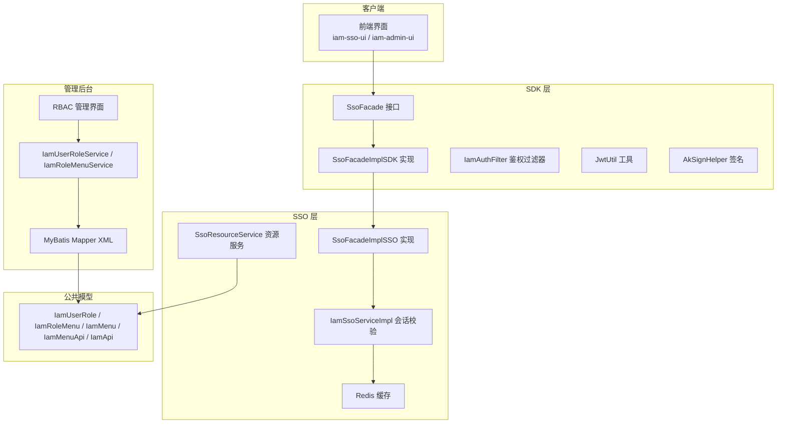
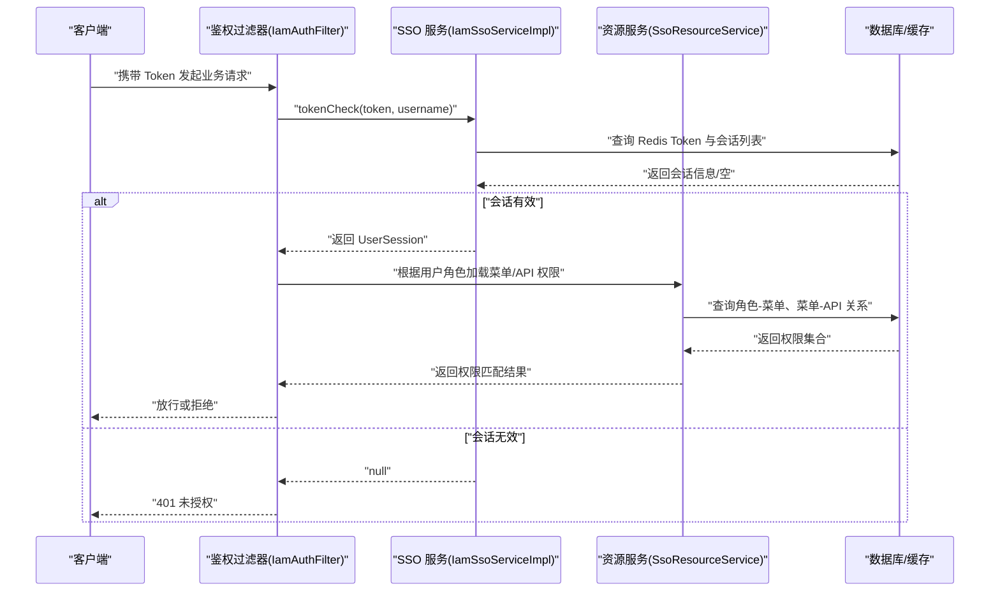
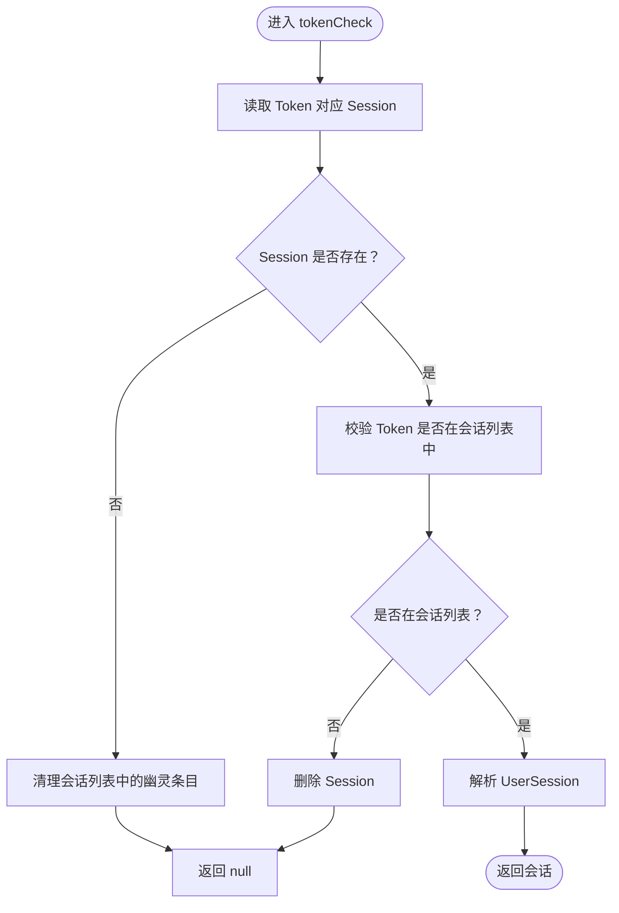
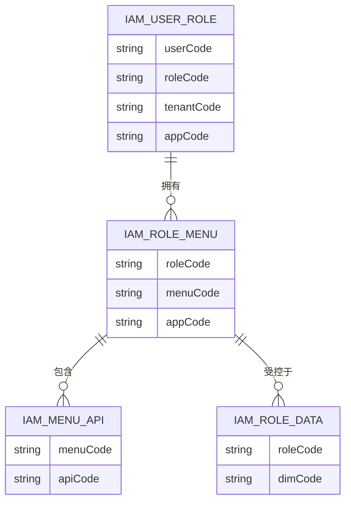
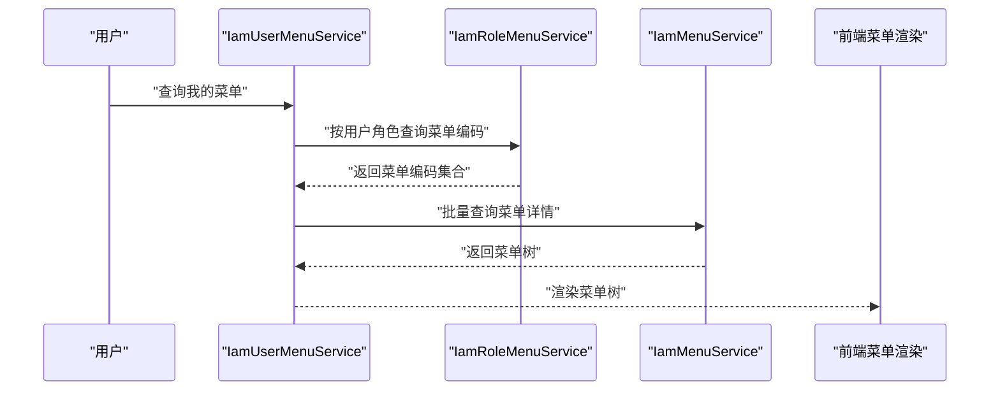
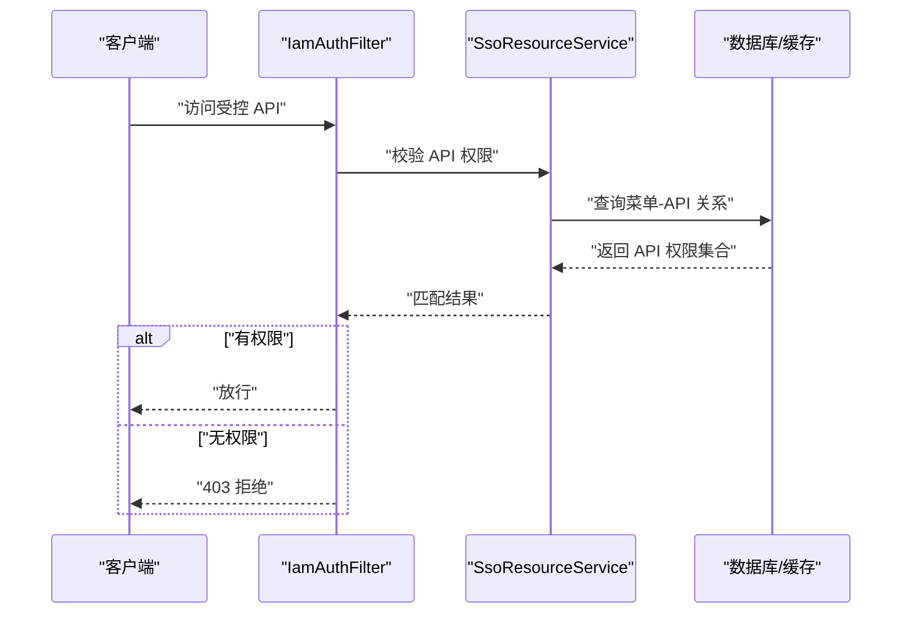
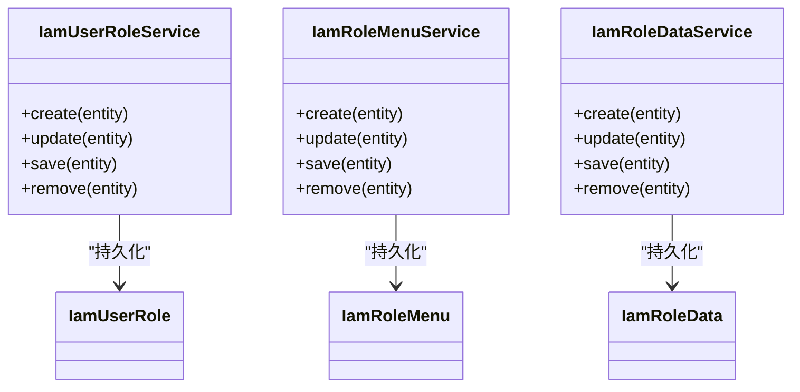
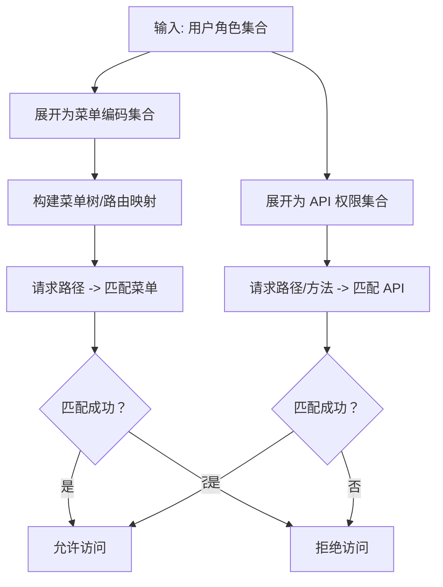
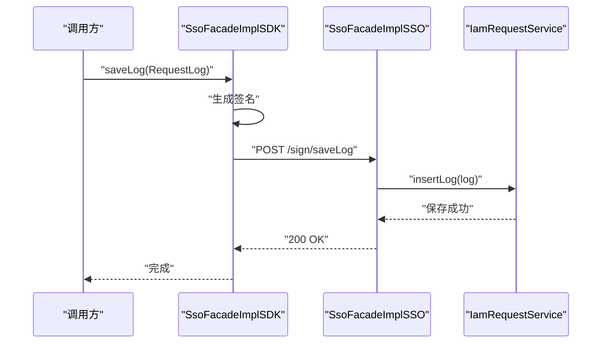
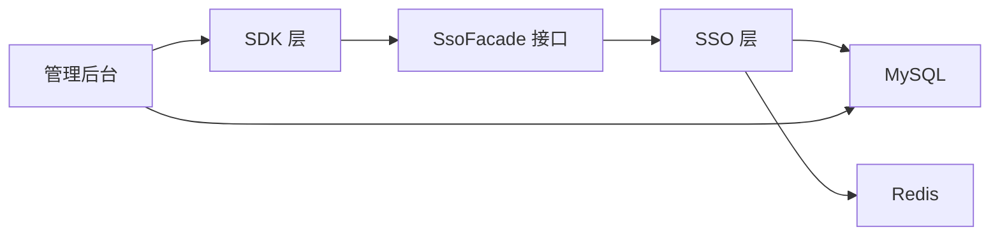

# 权限控制数据流

<cite>
**本文引用的文件**
- [SsoFacade.java](file://iam-sdk/src/main/java/com/wkclz/iam/sdk/facade/SsoFacade.java)
- [SsoFacadeImpl.java（SDK 实现）](file://iam-sdk/src/main/java/com/wkclz/iam/sdk/facade/impl/SsoFacadeImpl.java)
- [SsoFacadeImpl.java（SSO 实现）](file://iam-sso/src/main/java/com/wkclz/iam/sso/service/SsoFacadeImpl.java)
- [IamSsoServiceImpl.java](file://iam-sso/src/main/java/com/wkclz/iam/sso/service/IamSsoServiceImpl.java)
- [IamUserRoleService.java](file://iam-admin/src/main/java/com/wkclz/iam/admin/service/IamUserRoleService.java)
- [IamRoleMenuService.java](file://iam-admin/src/main/java/com/wkclz/iam/admin/service/IamRoleMenuService.java)
- [IamUserRole.java](file://iam-common/src/main/java/com/wkclz/iam/common/entity/IamUserRole.java)
- [IamRoleMenu.java](file://iam-common/src/main/java/com/wkclz/iam/common/entity/IamRoleMenu.java)
- [IamUserMenuService.java](file://iam-admin/src/main/java/com/wkclz/iam/admin/service/IamUserMenuService.java)
- [UserMenuRest.java](file://iam-admin/src/main/java/com/wkclz/iam/admin/rest/UserMenuRest.java)
- [IamMenuService.java](file://iam-admin/src/main/java/com/wkclz/iam/admin/service/IamMenuService.java)
- [IamMenuApiService.java](file://iam-admin/src/main/java/com/wkclz/iam/admin/service/IamMenuApiService.java)
- [IamMenu.java](file://iam-common/src/main/java/com/wkclz/iam/common/entity/IamMenu.java)
- [IamMenuApi.java](file://iam-common/src/main/java/com/wkclz/iam/common/entity/IamMenuApi.java)
- [IamApiService.java](file://iam-admin/src/main/java/com/wkclz/iam/admin/service/IamApiService.java)
- [IamApi.java](file://iam-common/src/main/java/com/wkclz/iam/common/entity/IamApi.java)
- [IamSsoConfig.java](file://iam-sso/src/main/java/com/wkclz/iam/sso/config/IamSsoConfig.java)
- [IamAdminConfig.java](file://iam-admin/src/main/java/com/wkclz/iam/admin/config/IamAdminConfig.java)
- [IamSdkConfig.java](file://iam-sdk/src/main/java/com/wkclz/iam/sdk/config/IamSdkConfig.java)
- [JwtUtil.java](file://iam-sdk/src/main/java/com/wkclz/iam/sdk/util/JwtUtil.java)
- [AkSignHelper.java](file://iam-sdk/src/main/java/com/wkclz/iam/sdk/helper/AkSignHelper.java)
- [IamAuthFilter.java](file://iam-sdk/src/main/java/com/wkclz/iam/sdk/filter/IamAuthFilter.java)
- [SsoResourceService.java](file://iam-sso/src/main/java/com/wkclz/iam/sso/service/SsoResourceService.java)
- [SsoResourceMapper.java](file://iam-sso/src/main/resources/mapper/SsoResourceMapper.xml)
- [SsoLoginMapper.java](file://iam-sso/src/main/resources/mapper/SsoLoginMapper.xml)
- [SsoLoginLogMapper.java](file://iam-sso/src/main/resources/mapper/SsoLoginLogMapper.xml)
- [SsoRequestLogMapper.java](file://iam-sso/src/main/resources/mapper/SsoRequestLogMapper.xml)
- [IamAccessKeyMapper.java](file://iam-admin/src/main/resources/mapper/IamAccessKeyMapper.xml)
- [IamAccessKeyApiMapper.java](file://iam-admin/src/main/resources/mapper/IamAccessKeyApiMapper.xml)
- [IamMenuMapper.java](file://iam-admin/src/main/resources/mapper/IamMenuMapper.xml)
- [IamMenuApiMapper.java](file://iam-admin/src/main/resources/mapper/IamMenuApiMapper.xml)
- [IamRoleMenuMapper.java](file://iam-admin/src/main/resources/mapper/IamRoleMenuMapper.xml)
- [IamUserRoleMapper.java](file://iam-admin/src/main/resources/mapper/IamUserRoleMapper.xml)
- [IamUserAuthMapper.java](file://iam-admin/src/main/resources/mapper/IamUserAuthMapper.xml)
- [IamUserAuthPasswordMapper.java](file://iam-admin/src/main/resources/mapper/IamUserAuthPasswordMapper.xml)
- [IamUserPasswordHisMapper.java](file://iam-admin/src/main/resources/mapper/IamUserPasswordHisMapper.xml)
- [IamUserMapper.java](file://iam-admin/src/main/resources/mapper/IamUserMapper.xml)
- [IamUserRoleMapper.java](file://iam-admin/src/main/resources/mapper/IamUserRoleMapper.xml)
- [IamRoleDataMapper.java](file://iam-admin/src/main/resources/mapper/IamRoleDataMapper.xml)
- [IamRoleDataService.java](file://iam-admin/src/main/java/com/wkclz/iam/admin/service/IamRoleDataService.java)
- [IamRoleDataDto.java](file://iam-common/src/main/java/com/wkclz/iam/common/dto/IamRoleDataDto.java)
- [IamRoleData.java](file://iam-common/src/main/java/com/wkclz/iam/common/entity/IamRoleData.java)
</cite>

## 目录
1. [引言](#引言)
2. [项目结构](#项目结构)
3. [核心组件](#核心组件)
4. [架构总览](#架构总览)
5. [详细组件分析](#详细组件分析)
6. [依赖分析](#依赖分析)
7. [性能考虑](#性能考虑)
8. [故障排查指南](#故障排查指南)
9. [结论](#结论)
10. [附录](#附录)

## 引言
本文件聚焦于 SH-IAM 系统在 RBAC 权限模型下的权限控制数据流，系统以“用户-角色-资源（菜单/API）”为核心关系，围绕 SSO 服务进行统一认证与授权校验。本文从数据流视角梳理以下关键路径：菜单权限验证、API 权限检查、角色权限分配；详述权限验证请求在 SSO 侧的处理流程（用户角色查询、权限匹配算法、缓存策略、权限继承关系）；解释权限数据的存储结构、查询优化与实时更新机制，并提供配置示例与常见问题解决方案。

## 项目结构
系统采用多模块分层设计：
- iam-sdk：对外 SDK，封装签名、HTTP 请求、鉴权过滤器、JWT 工具等
- iam-sso：SSO 认证与会话中心，提供登录、会话校验、资源服务、日志记录等
- iam-admin：RBAC 管理后台，提供用户、角色、菜单、API、数据维度等 CRUD 与关系绑定
- iam-common：公共 DTO/实体/工具，定义权限相关的核心数据模型
- iam-sso-ui、iam-admin-ui：前端界面

图表来源
- [SsoFacade.java:1-11](file://iam-sdk/src/main/java/com/wkclz/iam/sdk/facade/SsoFacade.java#L1-L11)
- [SsoFacadeImpl.java（SDK 实现）:1-63](file://iam-sdk/src/main/java/com/wkclz/iam/sdk/facade/impl/SsoFacadeImpl.java#L1-L63)
- [SsoFacadeImpl.java（SSO 实现）:1-20](file://iam-sso/src/main/java/com/wkclz/iam/sso/service/SsoFacadeImpl.java#L1-L20)
- [IamSsoServiceImpl.java:1-48](file://iam-sso/src/main/java/com/wkclz/iam/sso/service/IamSsoServiceImpl.java#L1-L48)
- [IamUserRoleService.java:1-81](file://iam-admin/src/main/java/com/wkclz/iam/admin/service/IamUserRoleService.java#L1-L81)
- [IamRoleMenuService.java:1-81](file://iam-admin/src/main/java/com/wkclz/iam/admin/service/IamRoleMenuService.java#L1-L81)
- [IamUserRole.java:1-84](file://iam-common/src/main/java/com/wkclz/iam/common/entity/IamUserRole.java#L1-L84)
- [IamRoleMenu.java:1-76](file://iam-common/src/main/java/com/wkclz/iam/common/entity/IamRoleMenu.java#L1-L76)

章节来源
- [IamSsoConfig.java](file://iam-sso/src/main/java/com/wkclz/iam/sso/config/IamSsoConfig.java)
- [IamAdminConfig.java](file://iam-admin/src/main/java/com/wkclz/iam/admin/config/IamAdminConfig.java)
- [IamSdkConfig.java](file://iam-sdk/src/main/java/com/wkclz/iam/sdk/config/IamSdkConfig.java)

## 核心组件
- SSO 会话校验：基于 Redis 存储 Token 与用户会话列表，支持 Token 过期清理与踢人下线
- 权限数据模型：用户-角色、角色-菜单、菜单-API、角色-数据维度等
- 资源服务：聚合菜单树、API 列表、权限匹配算法
- 鉴权过滤器：统一拦截请求，执行权限校验
- 日志与签名：请求日志落库、SDK 侧签名与安全传输

章节来源
- [IamSsoServiceImpl.java:22-46](file://iam-sso/src/main/java/com/wkclz/iam/sso/service/IamSsoServiceImpl.java#L22-L46)
- [IamUserRole.java:36-43](file://iam-common/src/main/java/com/wkclz/iam/common/entity/IamUserRole.java#L36-L43)
- [IamRoleMenu.java:27-37](file://iam-common/src/main/java/com/wkclz/iam/common/entity/IamRoleMenu.java#L27-L37)
- [IamMenu.java](file://iam-common/src/main/java/com/wkclz/iam/common/entity/IamMenu.java)
- [IamMenuApi.java](file://iam-common/src/main/java/com/wkclz/iam/common/entity/IamMenuApi.java)
- [IamApi.java](file://iam-common/src/main/java/com/wkclz/iam/common/entity/IamApi.java)
- [IamAuthFilter.java](file://iam-sdk/src/main/java/com/wkclz/iam/sdk/filter/IamAuthFilter.java)
- [SsoResourceService.java](file://iam-sso/src/main/java/com/wkclz/iam/sso/service/SsoResourceService.java)

## 架构总览
RBAC 数据流以“用户-角色-资源”为主线，结合 SSO 会话与缓存，形成完整的权限控制闭环。

图表来源
- [IamAuthFilter.java](file://iam-sdk/src/main/java/com/wkclz/iam/sdk/filter/IamAuthFilter.java)
- [IamSsoServiceImpl.java:22-46](file://iam-sso/src/main/java/com/wkclz/iam/sso/service/IamSsoServiceImpl.java#L22-L46)
- [SsoResourceService.java](file://iam-sso/src/main/java/com/wkclz/iam/sso/service/SsoResourceService.java)

## 详细组件分析

### 组件一：会话校验与缓存策略
- Redis 键设计
  - Token 主键：基于 JWT 生成 Token Redis Key，用于存放 UserSession
  - 会话列表：基于用户名的有序集合，存储 Token 的 MD5 值，用于踢人与会话追踪
- 校验流程
  - 若 Token 对应的 Session 不存在，清理会话列表中的幽灵条目
  - 校验 Token 是否仍在会话列表中，若不在则删除对应 Session 并返回空
- 缓存命中与失效
  - 通过会话列表实现踢人即时生效，避免缓存陈旧导致的越权

图表来源
- [IamSsoServiceImpl.java:22-46](file://iam-sso/src/main/java/com/wkclz/iam/sso/service/IamSsoServiceImpl.java#L22-L46)
- [JwtUtil.java](file://iam-sdk/src/main/java/com/wkclz/iam/sdk/util/JwtUtil.java)

章节来源
- [IamSsoServiceImpl.java:22-46](file://iam-sso/src/main/java/com/wkclz/iam/sso/service/IamSsoServiceImpl.java#L22-L46)

### 组件二：权限数据模型与关系
- 用户-角色：用户编码 + 角色编码，支持多角色叠加
- 角色-菜单：角色编码 + 菜单编码，支持菜单继承与组合
- 菜单-API：菜单与 API 的绑定关系，用于 API 权限校验
- 角色-数据维度：角色与数据维度的绑定，用于数据级权限控制

图表来源
- [IamUserRole.java:36-43](file://iam-common/src/main/java/com/wkclz/iam/common/entity/IamUserRole.java#L36-L43)
- [IamRoleMenu.java:27-37](file://iam-common/src/main/java/com/wkclz/iam/common/entity/IamRoleMenu.java#L27-L37)
- [IamMenuApi.java](file://iam-common/src/main/java/com/wkclz/iam/common/entity/IamMenuApi.java)
- [IamRoleData.java](file://iam-common/src/main/java/com/wkclz/iam/common/entity/IamRoleData.java)

章节来源
- [IamUserRole.java:1-84](file://iam-common/src/main/java/com/wkclz/iam/common/entity/IamUserRole.java#L1-L84)
- [IamRoleMenu.java:1-76](file://iam-common/src/main/java/com/wkclz/iam/common/entity/IamRoleMenu.java#L1-L76)
- [IamMenuApi.java](file://iam-common/src/main/java/com/wkclz/iam/common/entity/IamMenuApi.java)
- [IamRoleData.java](file://iam-common/src/main/java/com/wkclz/iam/common/entity/IamRoleData.java)

### 组件三：菜单权限验证流程
- 用户菜单查询
  - 通过用户编码查询其角色，再由角色查询关联菜单，最终生成前端路由菜单树
- 菜单权限匹配
  - 基于菜单编码与当前请求路径进行匹配，决定是否放行
- 实时更新
  - 角色-菜单关系变更后，需刷新用户会话中的菜单缓存或触发重新拉取

图表来源
- [IamUserMenuService.java](file://iam-admin/src/main/java/com/wkclz/iam/admin/service/IamUserMenuService.java)
- [IamRoleMenuService.java:1-81](file://iam-admin/src/main/java/com/wkclz/iam/admin/service/IamRoleMenuService.java#L1-L81)
- [IamMenuService.java](file://iam-admin/src/main/java/com/wkclz/iam/admin/service/IamMenuService.java)
- [UserMenuRest.java](file://iam-admin/src/main/java/com/wkclz/iam/admin/rest/UserMenuRest.java)

章节来源
- [IamUserMenuService.java](file://iam-admin/src/main/java/com/wkclz/iam/admin/service/IamUserMenuService.java)
- [IamRoleMenuService.java:1-81](file://iam-admin/src/main/java/com/wkclz/iam/admin/service/IamRoleMenuService.java#L1-L81)
- [IamMenuService.java](file://iam-admin/src/main/java/com/wkclz/iam/admin/service/IamMenuService.java)
- [UserMenuRest.java](file://iam-admin/src/main/java/com/wkclz/iam/admin/rest/UserMenuRest.java)

### 组件四：API 权限检查流程
- API 权限绑定
  - 通过菜单-API 关系确定 API 权限范围
- 请求拦截与校验
  - 鉴权过滤器根据请求路径与用户 API 权限进行匹配
- 实时更新
  - 修改菜单-API 绑定或角色-API 权限时，需同步刷新权限缓存

图表来源
- [IamAuthFilter.java](file://iam-sdk/src/main/java/com/wkclz/iam/sdk/filter/IamAuthFilter.java)
- [SsoResourceService.java](file://iam-sso/src/main/java/com/wkclz/iam/sso/service/SsoResourceService.java)
- [IamMenuApiService.java](file://iam-admin/src/main/java/com/wkclz/iam/admin/service/IamMenuApiService.java)
- [IamApiService.java](file://iam-admin/src/main/java/com/wkclz/iam/admin/service/IamApiService.java)

章节来源
- [IamAuthFilter.java](file://iam-sdk/src/main/java/com/wkclz/iam/sdk/filter/IamAuthFilter.java)
- [SsoResourceService.java](file://iam-sso/src/main/java/com/wkclz/iam/sso/service/SsoResourceService.java)
- [IamMenuApiService.java](file://iam-admin/src/main/java/com/wkclz/iam/admin/service/IamMenuApiService.java)
- [IamApiService.java](file://iam-admin/src/main/java/com/wkclz/iam/admin/service/IamApiService.java)

### 组件五：角色权限分配与数据维度控制
- 角色-用户分配
  - 通过用户-角色关系实现角色赋予与回收
- 角色-菜单绑定
  - 通过角色-菜单关系实现菜单授权
- 角色-数据维度
  - 通过角色-数据维度关系实现数据级权限控制

图表来源
- [IamUserRoleService.java:1-81](file://iam-admin/src/main/java/com/wkclz/iam/admin/service/IamUserRoleService.java#L1-L81)
- [IamRoleMenuService.java:1-81](file://iam-admin/src/main/java/com/wkclz/iam/admin/service/IamRoleMenuService.java#L1-L81)
- [IamRoleDataService.java](file://iam-admin/src/main/java/com/wkclz/iam/admin/service/IamRoleDataService.java)
- [IamUserRole.java:1-84](file://iam-common/src/main/java/com/wkclz/iam/common/entity/IamUserRole.java#L1-L84)
- [IamRoleMenu.java:1-76](file://iam-common/src/main/java/com/wkclz/iam/common/entity/IamRoleMenu.java#L1-L76)
- [IamRoleData.java](file://iam-common/src/main/java/com/wkclz/iam/common/entity/IamRoleData.java)

章节来源
- [IamUserRoleService.java:1-81](file://iam-admin/src/main/java/com/wkclz/iam/admin/service/IamUserRoleService.java#L1-L81)
- [IamRoleMenuService.java:1-81](file://iam-admin/src/main/java/com/wkclz/iam/admin/service/IamRoleMenuService.java#L1-L81)
- [IamRoleDataService.java](file://iam-admin/src/main/java/com/wkclz/iam/admin/service/IamRoleDataService.java)
- [IamUserRole.java:1-84](file://iam-common/src/main/java/com/wkclz/iam/common/entity/IamUserRole.java#L1-L84)
- [IamRoleMenu.java:1-76](file://iam-common/src/main/java/com/wkclz/iam/common/entity/IamRoleMenu.java#L1-L76)
- [IamRoleData.java](file://iam-common/src/main/java/com/wkclz/iam/common/entity/IamRoleData.java)

### 组件六：SSO 服务端权限匹配算法
- 菜单权限匹配
  - 将用户角色映射为菜单编码集合，与当前请求路径进行前缀匹配或精确匹配
- API 权限匹配
  - 将菜单-API 关系映射为 API 权限集合，与请求路径/方法进行匹配
- 权限继承
  - 多角色叠加时，权限集合取并集；父子菜单层级关系由菜单树结构体现

图表来源
- [SsoResourceService.java](file://iam-sso/src/main/java/com/wkclz/iam/sso/service/SsoResourceService.java)
- [IamMenuApi.java](file://iam-common/src/main/java/com/wkclz/iam/common/entity/IamMenuApi.java)
- [IamApi.java](file://iam-common/src/main/java/com/wkclz/iam/common/entity/IamApi.java)

章节来源
- [SsoResourceService.java](file://iam-sso/src/main/java/com/wkclz/iam/sso/service/SsoResourceService.java)

### 组件七：SDK 侧签名与请求转发
- SDK 侧签名
  - 使用应用标识与密钥生成签名，确保请求不可篡改
- 请求转发
  - SDK 将日志等请求转发至 SSO 服务端，服务端通过 SsoFacadeImpl 接收并入库

图表来源
- [SsoFacadeImpl.java（SDK 实现）:23-60](file://iam-sdk/src/main/java/com/wkclz/iam/sdk/facade/impl/SsoFacadeImpl.java#L23-L60)
- [SsoFacadeImpl.java（SSO 实现）:14-17](file://iam-sso/src/main/java/com/wkclz/iam/sso/service/SsoFacadeImpl.java#L14-L17)
- [AkSignHelper.java](file://iam-sdk/src/main/java/com/wkclz/iam/sdk/helper/AkSignHelper.java)
- [IamSdkConfig.java](file://iam-sdk/src/main/java/com/wkclz/iam/sdk/config/IamSdkConfig.java)

章节来源
- [SsoFacadeImpl.java（SDK 实现）:1-63](file://iam-sdk/src/main/java/com/wkclz/iam/sdk/facade/impl/SsoFacadeImpl.java#L1-L63)
- [SsoFacadeImpl.java（SSO 实现）:1-20](file://iam-sso/src/main/java/com/wkclz/iam/sso/service/SsoFacadeImpl.java#L1-L20)
- [AkSignHelper.java](file://iam-sdk/src/main/java/com/wkclz/iam/sdk/helper/AkSignHelper.java)
- [IamSdkConfig.java](file://iam-sdk/src/main/java/com/wkclz/iam/sdk/config/IamSdkConfig.java)

## 依赖分析
- 组件耦合
  - SDK 与 SSO 通过 Facade 接口解耦，SDK 仅负责签名与请求转发
  - SSO 与管理后台通过 MyBatis Mapper 解耦，权限数据由管理后台维护
- 外部依赖
  - Redis：会话与权限缓存
  - MySQL：权限数据持久化
  - 前端：菜单树与权限指令驱动

图表来源
- [SsoFacade.java:1-11](file://iam-sdk/src/main/java/com/wkclz/iam/sdk/facade/SsoFacade.java#L1-L11)
- [SsoFacadeImpl.java（SSO 实现）:1-20](file://iam-sso/src/main/java/com/wkclz/iam/sso/service/SsoFacadeImpl.java#L1-L20)
- [IamSsoServiceImpl.java:1-48](file://iam-sso/src/main/java/com/wkclz/iam/sso/service/IamSsoServiceImpl.java#L1-L48)

章节来源
- [SsoFacade.java:1-11](file://iam-sdk/src/main/java/com/wkclz/iam/sdk/facade/SsoFacade.java#L1-L11)
- [SsoFacadeImpl.java（SSO 实现）:1-20](file://iam-sso/src/main/java/com/wkclz/iam/sso/service/SsoFacadeImpl.java#L1-L20)
- [IamSsoServiceImpl.java:1-48](file://iam-sso/src/main/java/com/wkclz/iam/sso/service/IamSsoServiceImpl.java#L1-L48)

## 性能考虑
- 缓存策略
  - 会话与权限数据使用 Redis 缓存，降低数据库压力
  - 通过会话列表实现踢人即时生效，避免缓存陈旧
- 查询优化
  - 批量查询用户角色、角色菜单、菜单-API 关系，减少往返次数
  - 菜单树与 API 权限集合在会话中缓存，避免每次请求重复计算
- 实时更新
  - 权限变更后，优先清理相关缓存键，保证一致性

## 故障排查指南
- 401 未授权
  - 检查 Token 是否过期或被踢出；确认 Redis 中是否存在对应 Session 与会话列表
- 403 拒绝访问
  - 检查用户角色是否正确绑定；确认菜单-API 绑定是否完整
- 踢人无效
  - 确认会话列表中已移除该 Token 的 MD5 值；检查清理逻辑是否执行
- 签名失败
  - 检查 app-id 与 app-secret 是否正确；确认签名生成与请求头是否一致

章节来源
- [IamSsoServiceImpl.java:22-46](file://iam-sso/src/main/java/com/wkclz/iam/sso/service/IamSsoServiceImpl.java#L22-L46)
- [SsoFacadeImpl.java（SDK 实现）:27-60](file://iam-sdk/src/main/java/com/wkclz/iam/sdk/facade/impl/SsoFacadeImpl.java#L27-L60)

## 结论
SH-IAM 通过清晰的 RBAC 数据模型与 SSO 会话校验机制，实现了菜单与 API 的细粒度权限控制。借助 Redis 缓存与鉴权过滤器，系统在保证安全性的同时兼顾了性能与可扩展性。权限数据的存储与查询通过管理后台集中维护，配合实时更新策略，满足企业级权限治理需求。

## 附录
- 配置示例
  - SDK 配置：server-url、app-id、app-secret
  - SSO 配置：Redis 地址、超时时间、踢人策略
  - 管理后台：MyBatis Mapper XML 路径、数据库连接
- 常见问题
  - 权限不生效：检查角色-菜单与菜单-API 绑定是否正确
  - 登录后仍提示未授权：检查会话是否过期或被踢出
  - 接口签名报错：核对 app-id 与 app-secret，确认签名算法

章节来源
- [IamSdkConfig.java](file://iam-sdk/src/main/java/com/wkclz/iam/sdk/config/IamSdkConfig.java)
- [IamSsoConfig.java](file://iam-sso/src/main/java/com/wkclz/iam/sso/config/IamSsoConfig.java)
- [IamAdminConfig.java](file://iam-admin/src/main/java/com/wkclz/iam/admin/config/IamAdminConfig.java)