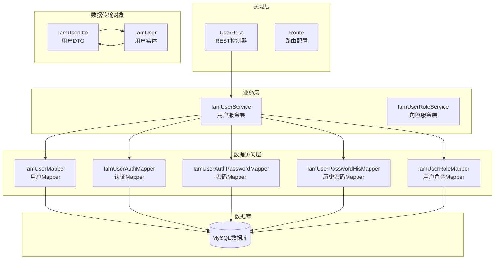
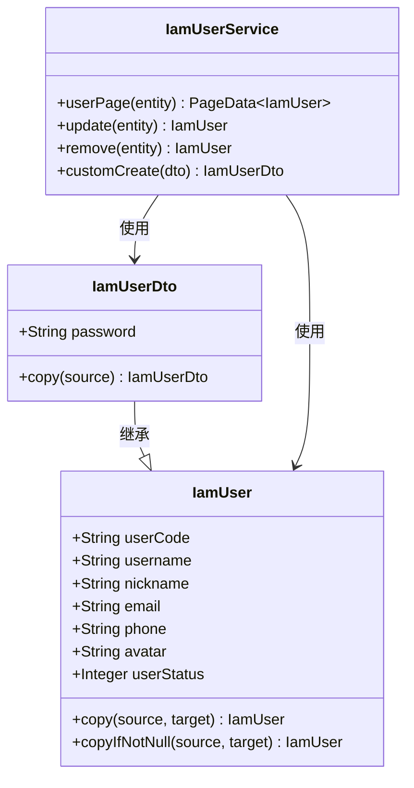
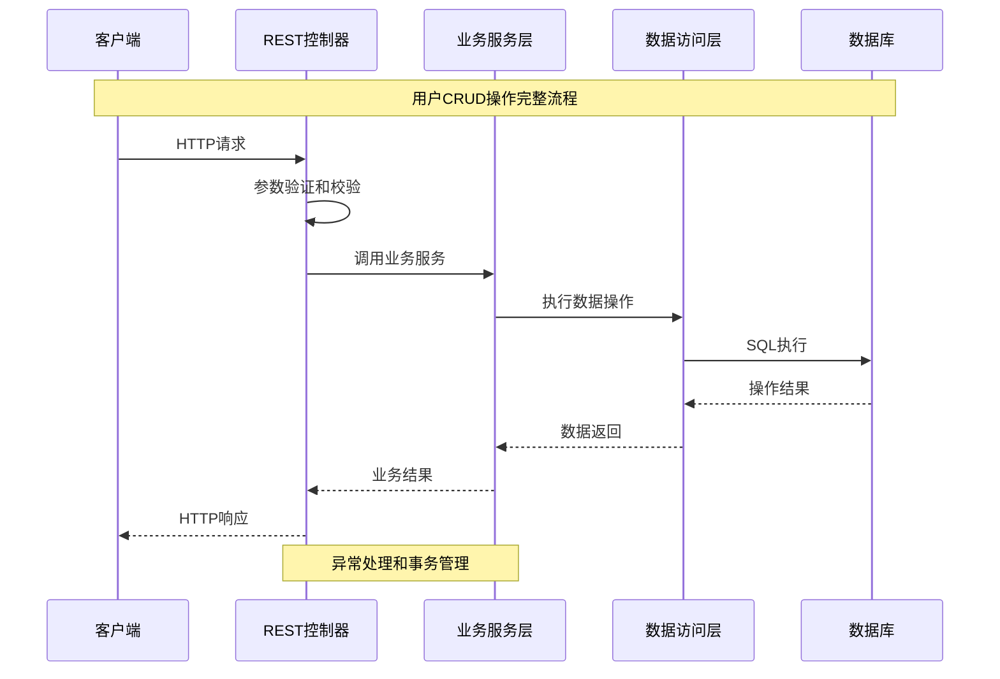
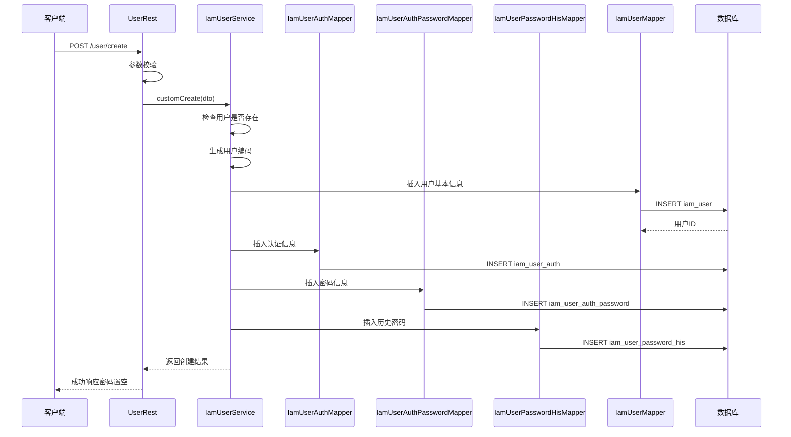
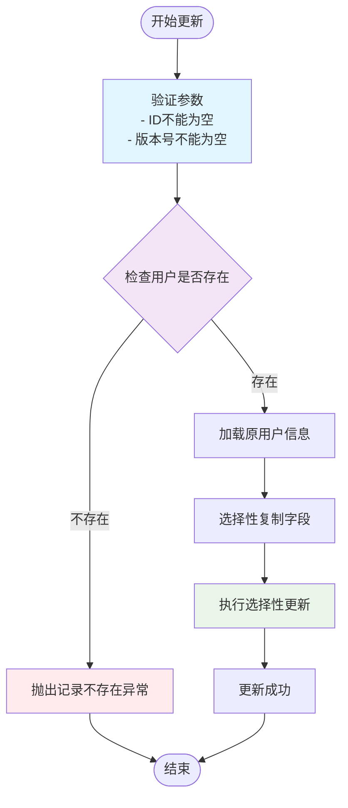
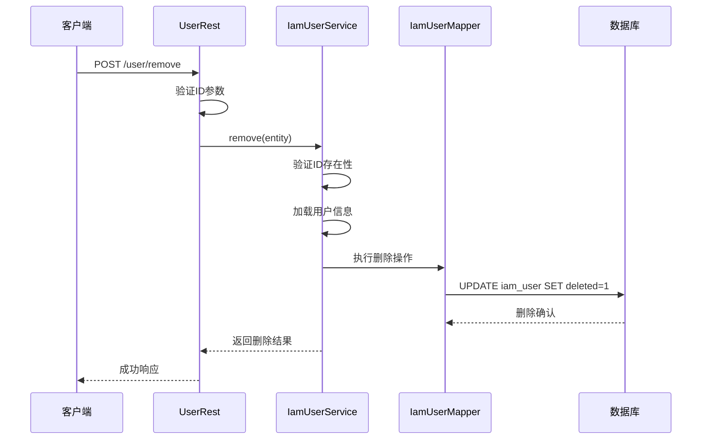
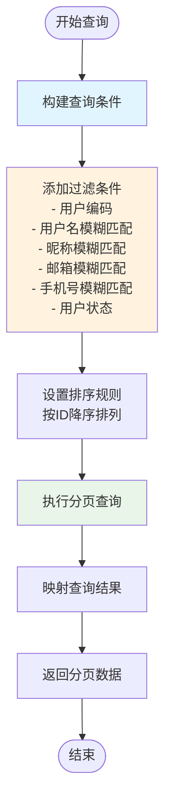
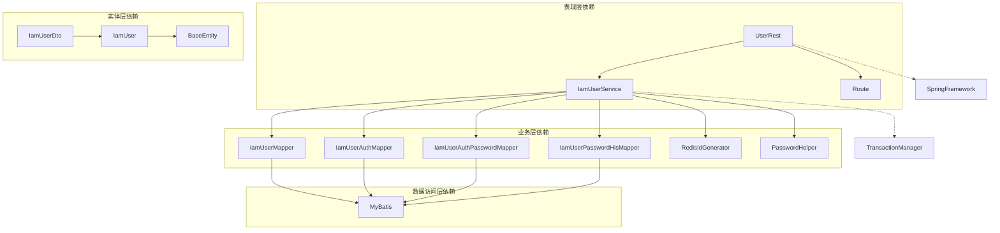
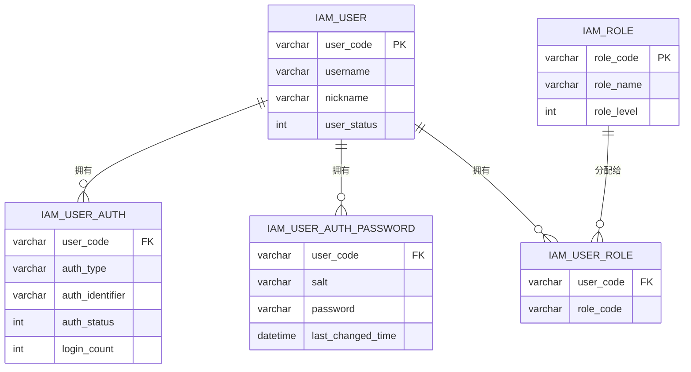

# 用户管理数据流

<cite>
**本文档引用的文件**
- [UserRest.java](file://iam-admin/src/main/java/com/wkclz/iam/admin/rest/UserRest.java)
- [IamUserService.java](file://iam-admin/src/main/java/com/wkclz/iam/admin/service/IamUserService.java)
- [IamUserMapper.java](file://iam-admin/src/main/java/com/wkclz/iam/admin/mapper/IamUserMapper.java)
- [IamUserMapper.xml](file://iam-admin/src/main/resources/mapper/IamUserMapper.xml)
- [IamUserDto.java](file://iam-common/src/main/java/com/wkclz/iam/common/dto/IamUserDto.java)
- [IamUser.java](file://iam-common/src/main/java/com/wkclz/iam/common/entity/IamUser.java)
- [IamUserAuthMapper.java](file://iam-admin/src/main/java/com/wkclz/iam/admin/mapper/IamUserAuthMapper.java)
- [IamUserAuthPasswordMapper.java](file://iam-admin/src/main/java/com/wkclz/iam/admin/mapper/IamUserAuthPasswordMapper.java)
- [IamUserPasswordHisMapper.java](file://iam-admin/src/main/java/com/wkclz/iam/admin/mapper/IamUserPasswordHisMapper.java)
- [IamUserRoleMapper.java](file://iam-admin/src/main/java/com/wkclz/iam/admin/mapper/IamUserRoleMapper.java)
- [IamUserRoleService.java](file://iam-admin/src/main/java/com/wkclz/iam/admin/service/IamUserRoleService.java)
- [Route.java](file://iam-admin/src/main/java/com/wkclz/iam/admin/Route.java)
</cite>

## 目录
1. [简介](#简介)
2. [项目结构](#项目结构)
3. [核心组件](#核心组件)
4. [架构概览](#架构概览)
5. [详细组件分析](#详细组件分析)
6. [依赖关系分析](#依赖关系分析)
7. [性能考虑](#性能考虑)
8. [故障排除指南](#故障排除指南)
9. [结论](#结论)

## 简介

本文件详细描述了SH-IAM系统中用户管理的完整数据流，涵盖从REST API请求到数据库持久化的全流程。该系统采用分层架构设计，包括表现层（REST接口）、业务层（Service服务）、数据访问层（Mapper）和数据库层。重点分析用户CRUD操作的数据流转过程，包括参数验证、业务规则检查、数据转换、异常处理等关键环节。

## 项目结构

SH-IAM系统采用模块化架构，用户管理功能主要分布在以下模块中：

**图表来源**
- [UserRest.java:14-16](file://iam-admin/src/main/java/com/wkclz/iam/admin/rest/UserRest.java#L14-L16)
- [IamUserService.java:38-38](file://iam-admin/src/main/java/com/wkclz/iam/admin/service/IamUserService.java#L38-L38)
- [IamUserMapper.java:15-16](file://iam-admin/src/main/java/com/wkclz/iam/admin/mapper/IamUserMapper.java#L15-L16)

**章节来源**
- [UserRest.java:1-66](file://iam-admin/src/main/java/com/wkclz/iam/admin/rest/UserRest.java#L1-L66)
- [IamUserService.java:1-125](file://iam-admin/src/main/java/com/wkclz/iam/admin/service/IamUserService.java#L1-L125)

## 核心组件

### 用户实体模型

系统使用分层的数据模型设计，通过实体类和DTO类实现数据传输的分离：

**图表来源**
- [IamUser.java:19-104](file://iam-common/src/main/java/com/wkclz/iam/common/entity/IamUser.java#L19-L104)
- [IamUserDto.java:15-32](file://iam-common/src/main/java/com/wkclz/iam/common/dto/IamUserDto.java#L15-L32)
- [IamUserService.java:38-121](file://iam-admin/src/main/java/com/wkclz/iam/admin/service/IamUserService.java#L38-L121)

### REST API接口层

UserRest控制器提供完整的用户管理REST接口，支持CRUD操作：

| HTTP方法 | 路径 | 功能描述 | 请求参数 | 返回值 |
|---------|------|----------|----------|--------|
| GET | `/user/page` | 用户分页查询 | IamUser实体参数 | PageData<IamUser> |
| GET | `/user/info` | 获取用户详情 | 包含id参数 | IamUser |
| POST | `/user/create` | 创建用户 | IamUserDto | IamUserDto |
| POST | `/user/update` | 更新用户 | IamUser | IamUser |
| POST | `/user/remove` | 删除用户 | IamUser | IamUser |

**章节来源**
- [UserRest.java:21-55](file://iam-admin/src/main/java/com/wkclz/iam/admin/rest/UserRest.java#L21-L55)
- [Route.java](file://iam-admin/src/main/java/com/wkclz/iam/admin/Route.java)

## 架构概览

用户管理系统的整体架构采用经典的三层架构模式，确保关注点分离和职责明确：

**图表来源**
- [UserRest.java:34-41](file://iam-admin/src/main/java/com/wkclz/iam/admin/rest/UserRest.java#L34-L41)
- [IamUserService.java:77-121](file://iam-admin/src/main/java/com/wkclz/iam/admin/service/IamUserService.java#L77-L121)

## 详细组件分析

### 用户创建流程（POST /user/create）

用户创建是系统中最复杂的业务流程，涉及多个表的协调操作：

**图表来源**
- [UserRest.java:34-41](file://iam-admin/src/main/java/com/wkclz/iam/admin/rest/UserRest.java#L34-L41)
- [IamUserService.java:77-121](file://iam-admin/src/main/java/com/wkclz/iam/admin/service/IamUserService.java#L77-L121)

#### 参数验证机制

系统在多个层次实施参数验证：

1. **REST层验证**：基本参数检查和非空验证
2. **业务层验证**：业务规则检查和重复性验证
3. **框架层验证**：Spring框架的断言和异常处理

验证规则包括：
- 用户名不能为空
- 昵称不能为空  
- 更新操作必须包含版本号
- 密码创建时必须提供密码

**章节来源**
- [UserRest.java:57-63](file://iam-admin/src/main/java/com/wkclz/iam/admin/rest/UserRest.java#L57-L63)
- [IamUserService.java:78-86](file://iam-admin/src/main/java/com/wkclz/iam/admin/service/IamUserService.java#L78-L86)

### 用户更新流程（POST /user/update）

用户更新操作采用选择性更新策略，只更新发生变化的字段：

**图表来源**
- [IamUserService.java:54-64](file://iam-admin/src/main/java/com/wkclz/iam/admin/service/IamUserService.java#L54-L64)

#### 字段选择性更新

系统实现了智能的字段选择性更新机制：

- 使用`copyIfNotNull`方法只复制非空字段
- 自动维护乐观锁版本号
- 保持其他未变更字段不变
- 支持部分字段更新场景

**章节来源**
- [IamUser.java:85-104](file://iam-common/src/main/java/com/wkclz/iam/common/entity/IamUser.java#L85-L104)

### 用户删除流程（POST /user/remove）

用户删除采用软删除策略，通过逻辑删除标记而非物理删除：

**图表来源**
- [UserRest.java:50-55](file://iam-admin/src/main/java/com/wkclz/iam/admin/rest/UserRest.java#L50-L55)
- [IamUserService.java:66-74](file://iam-admin/src/main/java/com/wkclz/iam/admin/service/IamUserService.java#L66-L74)

### 用户查询流程（GET /user/page）

用户查询支持多条件组合查询和分页功能：

**图表来源**
- [IamUserService.java:50-52](file://iam-admin/src/main/java/com/wkclz/iam/admin/service/IamUserService.java#L50-L52)
- [IamUserMapper.xml:6-34](file://iam-admin/src/main/resources/mapper/IamUserMapper.xml#L6-L34)

**章节来源**
- [IamUserMapper.xml:24-33](file://iam-admin/src/main/resources/mapper/IamUserMapper.xml#L24-L33)

## 依赖关系分析

### 组件依赖图

**图表来源**
- [UserRest.java:7-19](file://iam-admin/src/main/java/com/wkclz/iam/admin/rest/UserRest.java#L7-L19)
- [IamUserService.java:42-48](file://iam-admin/src/main/java/com/wkclz/iam/admin/service/IamUserService.java#L42-L48)

### 权限管理集成

用户管理与权限模块存在紧密的关联关系：

**图表来源**
- [IamUserAuthMapper.java](file://iam-admin/src/main/java/com/wkclz/iam/admin/mapper/IamUserAuthMapper.java)
- [IamUserAuthPasswordMapper.java](file://iam-admin/src/main/java/com/wkclz/iam/admin/mapper/IamUserAuthPasswordMapper.java)
- [IamUserRoleMapper.java](file://iam-admin/src/main/java/com/wkclz/iam/admin/mapper/IamUserRoleMapper.java)

**章节来源**
- [IamUserRoleService.java](file://iam-admin/src/main/java/com/wkclz/iam/admin/service/IamUserRoleService.java)
- [IamUserRoleMapper.java](file://iam-admin/src/main/java/com/wkclz/iam/admin/mapper/IamUserRoleMapper.java)

## 性能考虑

### 查询优化策略

1. **索引优化**：用户表的关键字段（user_code、username、email、phone）应建立适当的索引
2. **分页查询**：默认按ID降序排列，避免全表扫描
3. **条件过滤**：支持多条件组合查询，但需注意查询性能
4. **结果映射**：精确指定查询字段，避免SELECT *

### 缓存策略

1. **Redis缓存**：用户编码生成器使用Redis进行分布式ID生成
2. **会话缓存**：用户登录状态和权限信息可考虑缓存
3. **配置缓存**：系统配置和字典数据可缓存减少数据库访问

### 事务管理

- 用户创建操作使用事务保证数据一致性
- 涉及多个表的操作在同一个事务中完成
- 发生异常自动回滚，保证数据完整性

## 故障排除指南

### 常见异常类型

| 异常类型 | 触发条件 | 处理建议 |
|---------|----------|----------|
| 参数异常 | 必填参数为空 | 在前端进行基础校验，后端再次验证 |
| 记录不存在 | 查询或更新的目标不存在 | 检查ID是否正确，确认数据状态 |
| 业务异常 | 用户已存在等业务规则 | 提供清晰的错误提示信息 |
| 数据库异常 | 连接超时、死锁等 | 检查数据库连接池配置，优化SQL语句 |

### 调试建议

1. **日志记录**：启用详细的业务日志和SQL日志
2. **参数验证**：在每个层级都进行参数验证
3. **异常捕获**：统一异常处理和错误码定义
4. **性能监控**：监控慢查询和高并发场景

**章节来源**
- [IamUserService.java:58-70](file://iam-admin/src/main/java/com/wkclz/iam/admin/service/IamUserService.java#L58-L70)

## 结论

SH-IAM系统的用户管理模块展现了良好的分层架构设计和完整的数据流处理能力。通过REST API、Service服务、Mapper数据访问和数据库的协同工作，实现了用户CRUD操作的完整生命周期管理。

系统的主要优势包括：

1. **清晰的分层架构**：各层职责明确，便于维护和扩展
2. **完善的参数验证**：多层次的参数校验确保数据质量
3. **事务一致性保障**：关键业务操作使用事务保证数据完整性
4. **灵活的查询机制**：支持多条件组合查询和分页功能
5. **安全的密码管理**：采用盐值加密和历史密码记录机制

未来可以考虑的改进方向：

1. **缓存优化**：引入更多缓存策略提升查询性能
2. **异步处理**：对于耗时操作考虑异步处理机制
3. **监控完善**：增强系统监控和告警机制
4. **API版本化**：为API接口提供版本管理支持