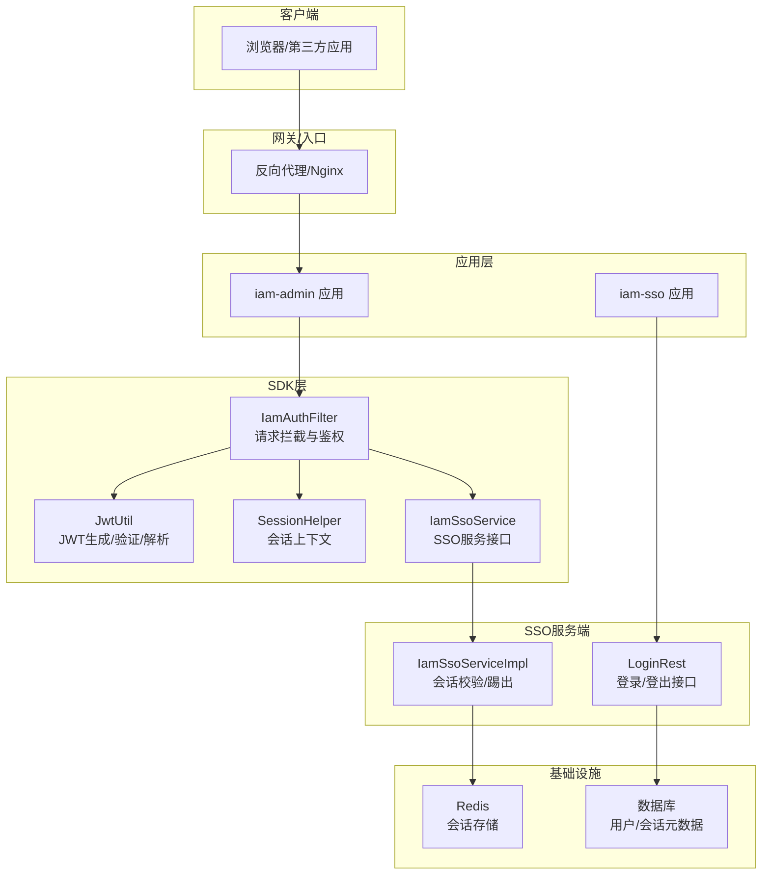
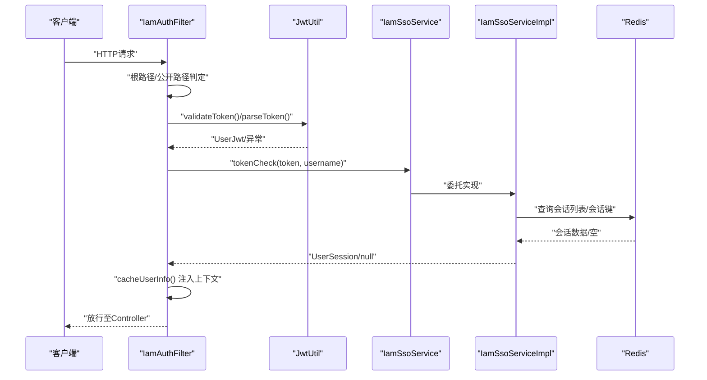
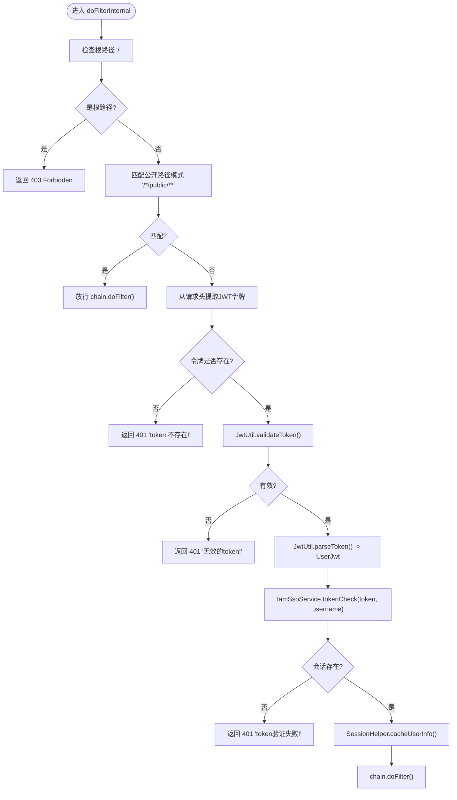
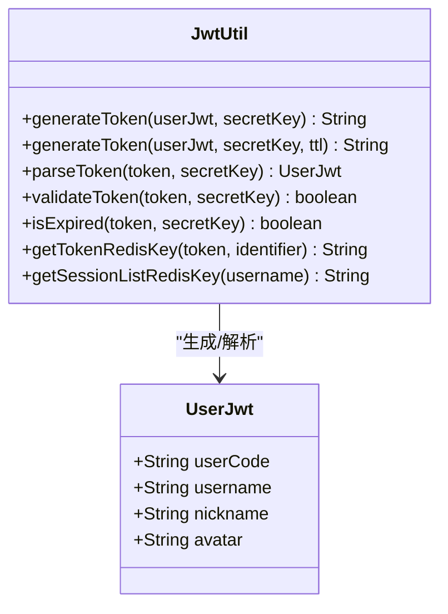
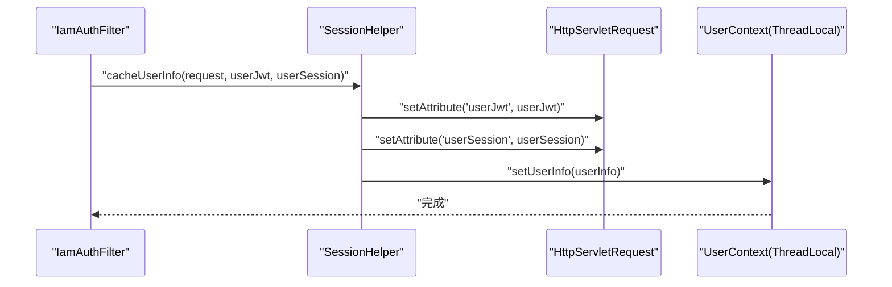
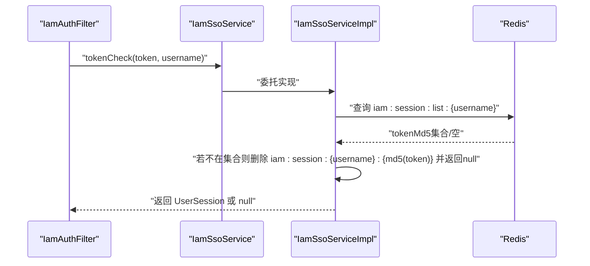
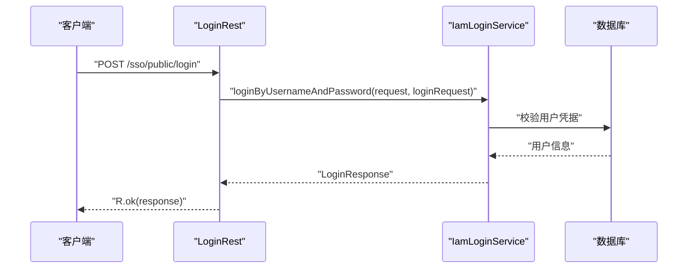
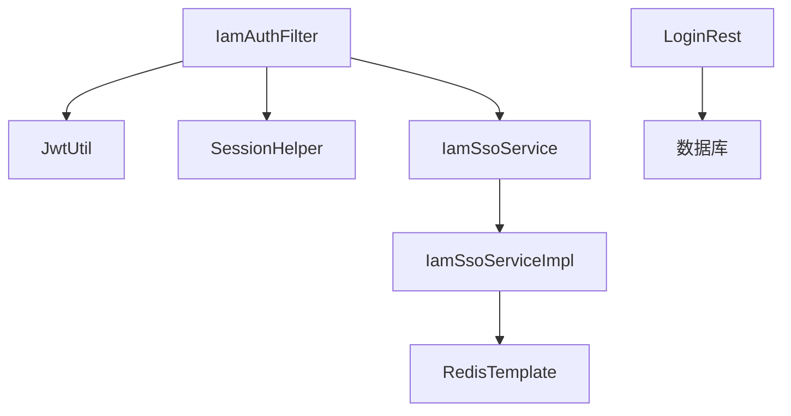

# 认证数据流

<cite>
**本文引用的文件**
- [IamAuthFilter.java](file://iam-sdk/src/main/java/com/wkclz/iam/sdk/filter/IamAuthFilter.java)
- [JwtUtil.java](file://iam-sdk/src/main/java/com/wkclz/iam/sdk/util/JwtUtil.java)
- [SessionHelper.java](file://iam-sdk/src/main/java/com/wkclz/iam/sdk/helper/SessionHelper.java)
- [IamSsoService.java](file://iam-sdk/src/main/java/com/wkclz/iam/sdk/service/IamSsoService.java)
- [IamSsoServiceImpl.java](file://iam-sso/src/main/java/com/wkclz/iam/sso/service/IamSsoServiceImpl.java)
- [UserJwt.java](file://iam-sdk/src/main/java/com/wkclz/iam/sdk/model/UserJwt.java)
- [UserSession.java](file://iam-sdk/src/main/java/com/wkclz/iam/sdk/model/UserSession.java)
- [LoginRest.java](file://iam-sso/src/main/java/com/wkclz/iam/sso/rest/LoginRest.java)
- [IamSdkAutoConfig.java](file://iam-sdk/src/main/java/com/wkclz/iam/sdk/IamSdkAutoConfig.java)
- [IamSsoConfig.java](file://iam-sso/src/main/java/com/wkclz/iam/sso/config/IamSsoConfig.java)
- [IamSsoApplication.java](file://iam-sso-starter/src/main/java/com/wkclz/iam/sso/starter/IamSsoApplication.java)
- [IamAdminApplication.java](file://iam-admin-starter/src/main/java/com/wkclz/iam/admin/starter/IamAdminApplication.java)
- [application.yml](file://iam-sso-starter/src/main/resources/config/application.yml)
- [application.yml](file://iam-admin-starter/src/main/resources/config/application.yml)
</cite>

## 目录
1. [简介](#简介)
2. [项目结构](#项目结构)
3. [核心组件](#核心组件)
4. [架构总览](#架构总览)
5. [详细组件分析](#详细组件分析)
6. [依赖关系分析](#依赖关系分析)
7. [性能考虑](#性能考虑)
8. [故障排除指南](#故障排除指南)
9. [结论](#结论)

## 简介
本文件面向SH-IAM系统的认证数据流，围绕IamAuthFilter过滤器展开，详细描述从请求进入系统到完成身份验证的完整数据流转过程。内容涵盖：
- IamAuthFilter如何拦截请求、从请求头提取JWT令牌、验证令牌有效性、解析用户信息
- 与Redis的会话缓存交互，以及将用户信息注入请求上下文的全过程
- JWT令牌的生成、验证和解析机制
- 与SSO服务的交互流程与关键接口契约
- 错误处理机制与常见问题排查

## 项目结构
SH-IAM采用多模块架构，认证相关的关键模块包括：
- iam-sdk：SDK层，包含认证过滤器、JWT工具、会话上下文、SSO服务接口等
- iam-sso：SSO服务端，提供登录、登出、会话校验、日志记录等能力
- iam-admin：管理端应用，负责系统管理与运维
- iam-sso-starter/iam-admin-starter：各模块启动器，包含基础配置

**图表来源**
- [IamAuthFilter.java:1-120](file://iam-sdk/src/main/java/com/wkclz/iam/sdk/filter/IamAuthFilter.java#L1-L120)
- [JwtUtil.java:1-219](file://iam-sdk/src/main/java/com/wkclz/iam/sdk/util/JwtUtil.java#L1-L219)
- [SessionHelper.java:1-120](file://iam-sdk/src/main/java/com/wkclz/iam/sdk/helper/SessionHelper.java#L1-L120)
- [IamSsoService.java:1-9](file://iam-sdk/src/main/java/com/wkclz/iam/sdk/service/IamSsoService.java#L1-L9)
- [IamSsoServiceImpl.java:1-80](file://iam-sso/src/main/java/com/wkclz/iam/sso/service/IamSsoServiceImpl.java#L1-L80)
- [LoginRest.java:1-37](file://iam-sso/src/main/java/com/wkclz/iam/sso/rest/LoginRest.java#L1-L37)

**章节来源**
- [IamSdkAutoConfig.java](file://iam-sdk/src/main/java/com/wkclz/iam/sdk/IamSdkAutoConfig.java)
- [IamSsoConfig.java](file://iam-sso/src/main/java/com/wkclz/iam/sso/config/IamSsoConfig.java)
- [IamSsoApplication.java](file://iam-sso-starter/src/main/java/com/wkclz/iam/sso/starter/IamSsoApplication.java)
- [IamAdminApplication.java](file://iam-admin-starter/src/main/java/com/wkclz/iam/admin/starter/IamAdminApplication.java)

## 核心组件
本节聚焦认证数据流中的关键组件及其职责：
- IamAuthFilter：请求拦截与鉴权的核心过滤器，负责根路径拒绝、公开路径放行、令牌提取与校验、会话查询与上下文注入
- JwtUtil：JWT生成、验证、解析与Redis会话Key生成的工具类
- SessionHelper：请求上下文与线程本地用户信息的缓存与读取
- IamSsoService/IamSsoServiceImpl：SSO服务接口与实现，负责Redis会话校验与踢出会话
- LoginRest：SSO登录/登出REST接口，触发会话建立与失效

**章节来源**
- [IamAuthFilter.java:1-120](file://iam-sdk/src/main/java/com/wkclz/iam/sdk/filter/IamAuthFilter.java#L1-L120)
- [JwtUtil.java:1-219](file://iam-sdk/src/main/java/com/wkclz/iam/sdk/util/JwtUtil.java#L1-L219)
- [SessionHelper.java:1-120](file://iam-sdk/src/main/java/com/wkclz/iam/sdk/helper/SessionHelper.java#L1-L120)
- [IamSsoService.java:1-9](file://iam-sdk/src/main/java/com/wkclz/iam/sdk/service/IamSsoService.java#L1-L9)
- [IamSsoServiceImpl.java:1-80](file://iam-sso/src/main/java/com/wkclz/iam/sso/service/IamSsoServiceImpl.java#L1-L80)
- [LoginRest.java:1-37](file://iam-sso/src/main/java/com/wkclz/iam/sso/rest/LoginRest.java#L1-L37)

## 架构总览
下图展示了认证数据流的总体架构与组件交互：

**图表来源**
- [IamAuthFilter.java:30-120](file://iam-sdk/src/main/java/com/wkclz/iam/sdk/filter/IamAuthFilter.java#L30-L120)
- [JwtUtil.java:72-105](file://iam-sdk/src/main/java/com/wkclz/iam/sdk/util/JwtUtil.java#L72-L105)
- [IamSsoService.java:7-8](file://iam-sdk/src/main/java/com/wkclz/iam/sdk/service/IamSsoService.java#L7-L8)
- [IamSsoServiceImpl.java:32-47](file://iam-sso/src/main/java/com/wkclz/iam/sso/service/IamSsoServiceImpl.java#L32-L47)

## 详细组件分析

### IamAuthFilter：请求拦截与鉴权
IamAuthFilter是认证数据流的入口，负责：
- 根路径“/”直接返回403
- 公开路径“/*/public/**”放行
- 从请求头提取JWT令牌（优先Authorization头，其次token头，去除“Bearer ”前缀）
- 调用JwtUtil验证令牌有效性并解析UserJwt
- 调用IamSsoService.tokenCheck进行Redis会话校验
- 通过SessionHelper.cacheUserInfo将用户信息注入请求上下文与线程本地变量
- 发生异常时统一返回401

**图表来源**
- [IamAuthFilter.java:30-120](file://iam-sdk/src/main/java/com/wkclz/iam/sdk/filter/IamAuthFilter.java#L30-L120)

**章节来源**
- [IamAuthFilter.java:1-120](file://iam-sdk/src/main/java/com/wkclz/iam/sdk/filter/IamAuthFilter.java#L1-L120)

### JWT工具：生成、验证与解析
JwtUtil提供以下关键能力：
- 生成访问令牌（默认4小时过期）与刷新令牌（默认7天过期）
- 验证令牌签名与有效期，支持带时钟偏差容忍
- 解析令牌获取UserJwt对象
- 生成Redis会话Key与会话列表Key，用于会话管理
- 统一封装JWT相关异常为中文描述

**图表来源**
- [JwtUtil.java:39-80](file://iam-sdk/src/main/java/com/wkclz/iam/sdk/util/JwtUtil.java#L39-L80)
- [UserJwt.java:1-21](file://iam-sdk/src/main/java/com/wkclz/iam/sdk/model/UserJwt.java#L1-L21)

**章节来源**
- [JwtUtil.java:1-219](file://iam-sdk/src/main/java/com/wkclz/iam/sdk/util/JwtUtil.java#L1-L219)
- [UserJwt.java:1-21](file://iam-sdk/src/main/java/com/wkclz/iam/sdk/model/UserJwt.java#L1-L21)

### 会话上下文：SessionHelper
SessionHelper负责：
- 从请求头提取令牌（支持Authorization与token头）
- 将UserJwt与UserSession缓存到请求属性，并设置线程本地用户信息
- 提供便捷方法从当前请求获取userCode、tenantCode、UserJwt、UserSession等

**图表来源**
- [SessionHelper.java:42-53](file://iam-sdk/src/main/java/com/wkclz/iam/sdk/helper/SessionHelper.java#L42-L53)

**章节来源**
- [SessionHelper.java:1-120](file://iam-sdk/src/main/java/com/wkclz/iam/sdk/helper/SessionHelper.java#L1-L120)

### SSO服务：会话校验与踢出
IamSsoService接口定义了tokenCheck方法，具体实现在IamSsoServiceImpl中：
- 通过Redis查询会话列表，确认令牌仍处于有效会话集合
- 若令牌已被踢出，则删除对应会话键并返回null
- 成功时解析并返回UserSession

**图表来源**
- [IamSsoService.java:7-8](file://iam-sdk/src/main/java/com/wkclz/iam/sdk/service/IamSsoService.java#L7-L8)
- [IamSsoServiceImpl.java:32-47](file://iam-sso/src/main/java/com/wkclz/iam/sso/service/IamSsoServiceImpl.java#L32-L47)

**章节来源**
- [IamSsoService.java:1-9](file://iam-sdk/src/main/java/com/wkclz/iam/sdk/service/IamSsoService.java#L1-L9)
- [IamSsoServiceImpl.java:1-80](file://iam-sso/src/main/java/com/wkclz/iam/sso/service/IamSsoServiceImpl.java#L1-L80)

### 登录与登出：SSO REST接口
登录与登出接口由LoginRest提供：
- 登录：接收用户名/密码，调用IamLoginService完成登录并返回LoginResponse
- 登出：调用IamLoginService执行登出操作

**图表来源**
- [LoginRest.java:22-28](file://iam-sso/src/main/java/com/wkclz/iam/sso/rest/LoginRest.java#L22-L28)

**章节来源**
- [LoginRest.java:1-37](file://iam-sso/src/main/java/com/wkclz/iam/sso/rest/LoginRest.java#L1-L37)

## 依赖关系分析
认证数据流涉及的主要依赖关系如下：
- IamAuthFilter依赖JwtUtil进行令牌验证与解析，依赖SessionHelper进行上下文注入，依赖IamSsoService进行会话校验
- IamSsoServiceImpl依赖RedisTemplate进行会话列表与会话键的读写
- SSO应用通过LoginRest对外提供登录/登出接口，底层依赖数据库进行用户校验

**图表来源**
- [IamAuthFilter.java:1-120](file://iam-sdk/src/main/java/com/wkclz/iam/sdk/filter/IamAuthFilter.java#L1-L120)
- [JwtUtil.java:1-219](file://iam-sdk/src/main/java/com/wkclz/iam/sdk/util/JwtUtil.java#L1-L219)
- [SessionHelper.java:1-120](file://iam-sdk/src/main/java/com/wkclz/iam/sdk/helper/SessionHelper.java#L1-L120)
- [IamSsoService.java:1-9](file://iam-sdk/src/main/java/com/wkclz/iam/sdk/service/IamSsoService.java#L1-L9)
- [IamSsoServiceImpl.java:1-80](file://iam-sso/src/main/java/com/wkclz/iam/sso/service/IamSsoServiceImpl.java#L1-L80)
- [LoginRest.java:1-37](file://iam-sso/src/main/java/com/wkclz/iam/sso/rest/LoginRest.java#L1-L37)

**章节来源**
- [IamAuthFilter.java:1-120](file://iam-sdk/src/main/java/com/wkclz/iam/sdk/filter/IamAuthFilter.java#L1-L120)
- [IamSsoServiceImpl.java:1-80](file://iam-sso/src/main/java/com/wkclz/iam/sso/service/IamSsoServiceImpl.java#L1-L80)

## 性能考虑
- 令牌验证与解析：JwtUtil使用HS256签名算法，建议在生产环境配置足够强度的密钥并启用HTTPS传输
- Redis会话校验：IamSsoServiceImpl对会话列表的查询为O(logN)级别，适合高并发场景；建议合理设置Redis连接池与超时参数
- 请求体缓存：RequestWrapperFilter将请求体急切缓存，便于后续多次读取，但需注意内存占用与大请求体的处理
- 上下文注入：SessionHelper将用户信息注入请求属性与线程本地变量，避免重复查询，提升业务层访问效率

[本节为通用性能建议，无需特定文件来源]

## 故障排除指南
常见问题与处理建议：
- 根路径访问被拒绝：确认请求路径不是“/”，或调整公开路径规则
- 令牌缺失：检查请求头是否包含Authorization或token字段，确认未遗漏“Bearer ”前缀
- 令牌无效：检查JWT签名密钥配置、时钟偏差容忍设置、令牌过期时间
- 会话不存在：确认用户未被踢出或登出，检查Redis中会话列表与会话键是否存在
- 上下文读取为空：确认IamAuthFilter已正确注入用户信息，业务层通过SessionHelper读取

**章节来源**
- [IamAuthFilter.java:30-120](file://iam-sdk/src/main/java/com/wkclz/iam/sdk/filter/IamAuthFilter.java#L30-L120)
- [SessionHelper.java:63-72](file://iam-sdk/src/main/java/com/wkclz/iam/sdk/helper/SessionHelper.java#L63-L72)

## 结论
SH-IAM的认证数据流以IamAuthFilter为核心，结合JWT工具与Redis会话校验，实现了“令牌有效性+会话有效性”的双重保障。通过清晰的过滤器链与明确的接口契约，系统在保证安全性的同时兼顾了可扩展性与易维护性。建议在生产环境中强化密钥管理、优化Redis配置，并完善日志与监控体系以支撑高并发场景。