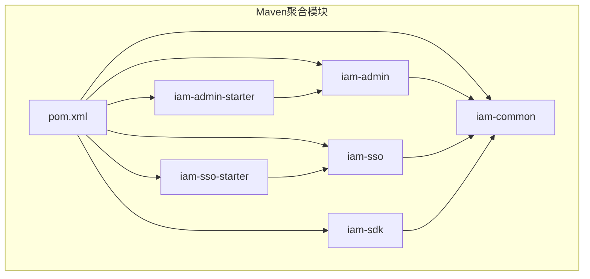
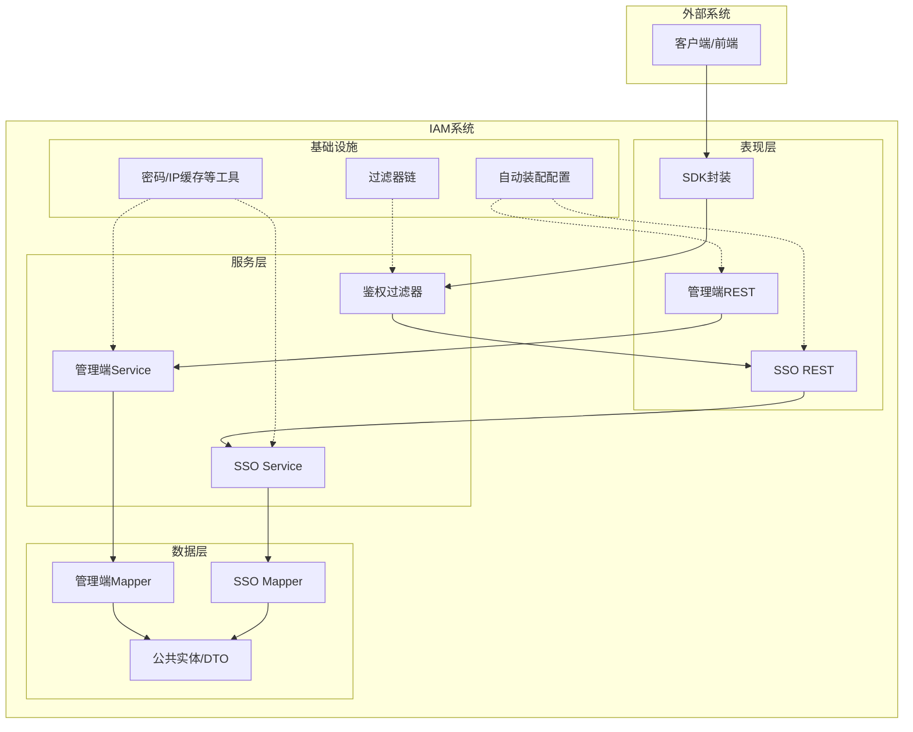
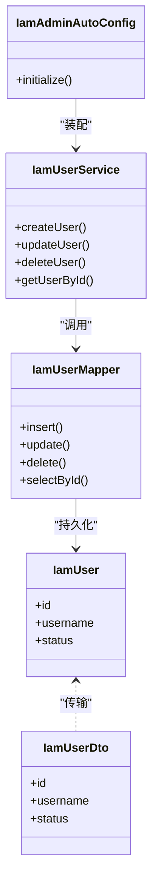
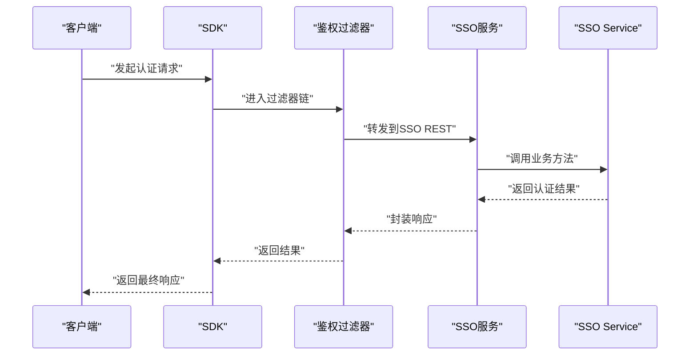
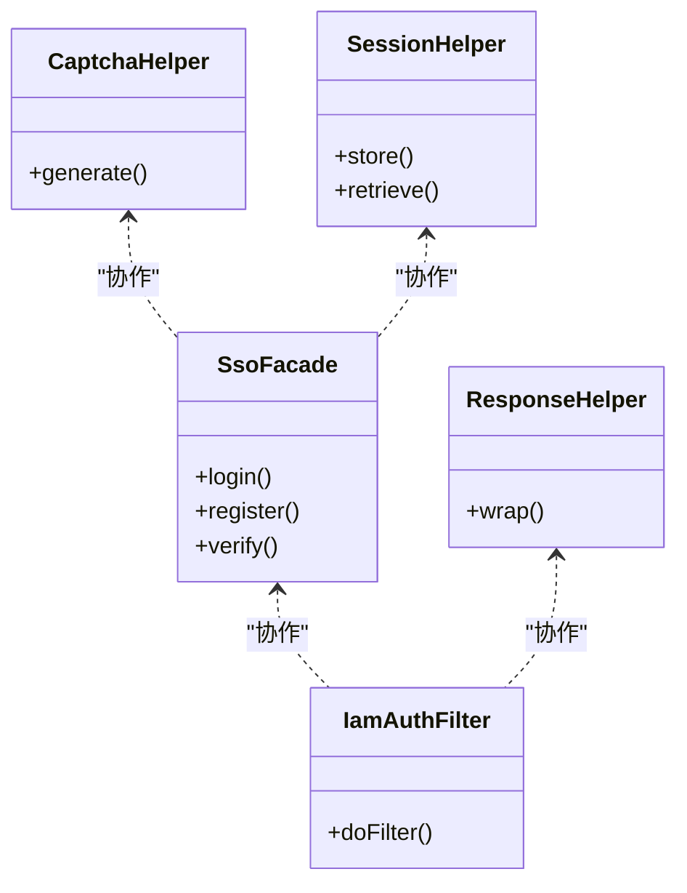
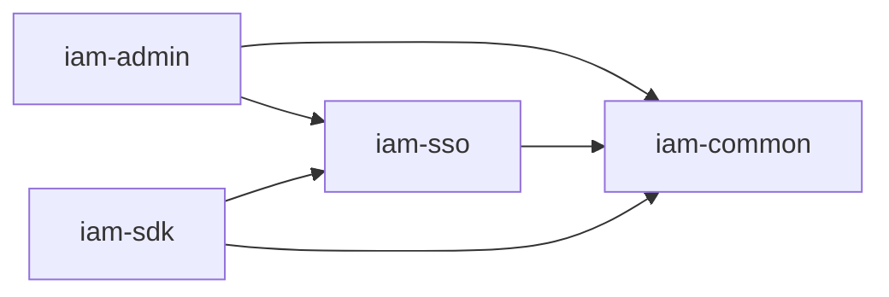

# 整体架构设计

<cite>
**本文档引用的文件**
- [pom.xml](file://pom.xml)
- [iam-admin/pom.xml](file://iam-admin/pom.xml)
- [iam-sso/pom.xml](file://iam-sso/pom.xml)
- [iam-sdk/pom.xml](file://iam-sdk/pom.xml)
- [iam-admin-starter/pom.xml](file://iam-admin-starter/pom.xml)
- [iam-sso-starter/pom.xml](file://iam-sso-starter/pom.xml)
- [iam-admin/src/main/java/com/wkclz/iam/admin/IamAdminAutoConfig.java](file://iam-admin/src/main/java/com/wkclz/iam/admin/IamAdminAutoConfig.java)
- [iam-sso/src/main/java/com/wkclz/iam/sso/IamSsoAutoConfig.java](file://iam-sso/src/main/java/com/wkclz/iam/sso/IamSsoAutoConfig.java)
- [iam-admin-starter/src/main/resources/config/application.yml](file://iam-admin-starter/src/main/resources/config/application.yml)
- [iam-sso-starter/src/main/resources/config/application.yml](file://iam-sso-starter/src/main/resources/config/application.yml)
- [iam-admin/src/main/java/com/wkclz/iam/admin/mapper/IamUserMapper.java](file://iam-admin/src/main/java/com/wkclz/iam/admin/mapper/IamUserMapper.java)
- [iam-admin/src/main/java/com/wkclz/iam/admin/service/IamUserService.java](file://iam-admin/src/main/java/com/wkclz/iam/admin/service/IamUserService.java)
- [iam-sso/src/main/java/com/wkclz/iam/sso/rest/LoginRest.java](file://iam-sso/src/main/java/com/wkclz/iam/sso/rest/LoginRest.java)
- [iam-sso/src/main/java/com/wkclz/iam/sso/service/IamSsoServiceImpl.java](file://iam-sso/src/main/java/com/wkclz/iam/sso/service/IamSsoServiceImpl.java)
- [iam-sdk/src/main/java/com/wkclz/iam/sdk/facade/SsoFacade.java](file://iam-sdk/src/main/java/com/wkclz/iam/sdk/facade/SsoFacade.java)
- [iam-sdk/src/main/java/com/wkclz/iam/sdk/filter/IamAuthFilter.java](file://iam-sdk/src/main/java/com/wkclz/iam/sdk/filter/IamAuthFilter.java)
- [iam-common/src/main/java/com/wkclz/iam/common/entity/IamUser.java](file://iam-common/src/main/java/com/wkclz/iam/common/entity/IamUser.java)
- [iam-common/src/main/java/com/wkclz/iam/common/dto/IamUserDto.java](file://iam-common/src/main/java/com/wkclz/iam/common/dto/IamUserDto.java)
- [iam-common/src/main/java/com/wkclz/iam/common/helper/PasswordHelper.java](file://iam-common/src/main/java/com/wkclz/iam/common/helper/PasswordHelper.java)
- [iam-common/src/main/java/com/wkclz/iam/common/helper/IpLocalCacheHelper.java](file://iam-common/src/main/java/com/wkclz/iam/common/helper/IpLocalCacheHelper.java)
- [docs/architecture/system-architecture.md](file://docs/architecture/system-architecture.md)
- [docs/architecture/database-design.md](file://docs/architecture/database-design.md)
</cite>

## 目录
1. [引言](#引言)
2. [项目结构](#项目结构)
3. [核心组件](#核心组件)
4. [架构总览](#架构总览)
5. [详细组件分析](#详细组件分析)
6. [依赖关系分析](#依赖关系分析)
7. [性能考虑](#性能考虑)
8. [故障排除指南](#故障排除指南)
9. [结论](#结论)

## 引言
本文件面向SH-IAM系统的整体架构设计，基于Maven多模块工程的实际代码实现，阐述系统的分层架构与微服务化设计理念，明确模块化组织方式、职责划分与依赖关系，定义系统边界与内外部接口，并给出架构决策的技术考量、性能影响与可扩展性设计建议。文档同时提供系统架构图与模块交互图，展示数据流向与控制流程。

## 项目结构
SH-IAM采用Maven多模块聚合结构，围绕“认证与权限”核心能力拆分为多个子模块：iam-admin（管理端）、iam-sso（SSO服务）、iam-sdk（客户端SDK）、iam-common（公共模型与工具）、以及对应的启动器模块。每个模块通过独立的自动装配配置类进行初始化，形成清晰的边界与职责分工。

图表来源
- [pom.xml](file://pom.xml)
- [iam-admin/pom.xml](file://iam-admin/pom.xml)
- [iam-sso/pom.xml](file://iam-sso/pom.xml)
- [iam-sdk/pom.xml](file://iam-sdk/pom.xml)
- [iam-admin-starter/pom.xml](file://iam-admin-starter/pom.xml)
- [iam-sso-starter/pom.xml](file://iam-sso-starter/pom.xml)

章节来源
- [pom.xml](file://pom.xml)
- [iam-admin/pom.xml](file://iam-admin/pom.xml)
- [iam-sso/pom.xml](file://iam-sso/pom.xml)
- [iam-sdk/pom.xml](file://iam-sdk/pom.xml)
- [iam-admin-starter/pom.xml](file://iam-admin-starter/pom.xml)
- [iam-sso-starter/pom.xml](file://iam-sso-starter/pom.xml)

## 核心组件
- 管理端模块（iam-admin）：提供系统管理REST接口，负责用户、角色、菜单、API、访问密钥等资源的CRUD与关联管理；通过MyBatis Mapper与Service层实现数据操作与业务编排。
- SSO服务模块（iam-sso）：提供登录、注册、验证码、用户信息等认证相关REST接口；内置会话与请求日志服务，支持定时任务与IP地址缓存。
- SDK模块（iam-sdk）：封装SSO调用、鉴权过滤器、响应包装、签名与会话辅助工具，作为第三方应用接入的统一入口。
- 公共模块（iam-common）：沉淀实体、DTO、密码与IP缓存等通用工具，避免重复实现并规范数据结构。
- 启动器模块：分别承载管理端与SSO服务的Spring Boot启动类及默认配置，便于独立部署与环境适配。

章节来源
- [iam-admin/src/main/java/com/wkclz/iam/admin/IamAdminAutoConfig.java](file://iam-admin/src/main/java/com/wkclz/iam/admin/IamAdminAutoConfig.java)
- [iam-sso/src/main/java/com/wkclz/iam/sso/IamSsoAutoConfig.java](file://iam-sso/src/main/java/com/wkclz/iam/sso/IamSsoAutoConfig.java)
- [iam-admin-starter/src/main/resources/config/application.yml](file://iam-admin-starter/src/main/resources/config/application.yml)
- [iam-sso-starter/src/main/resources/config/application.yml](file://iam-sso-starter/src/main/resources/config/application.yml)

## 架构总览
系统采用“分层架构 + 微服务化”的混合设计：
- 分层架构：表现层（REST接口）、领域服务层（Service）、数据访问层（Mapper/DAO）、基础设施层（配置、过滤器、工具类）。
- 微服务化：以iam-admin与iam-sso为核心服务，通过iam-sdk对外提供统一能力；公共逻辑下沉至iam-common，降低耦合度。
- 边界与接口：管理端与SSO服务边界清晰，内部通过DTO/Entity进行数据交换；对外通过SDK暴露认证与授权能力。

图表来源
- [iam-admin/src/main/java/com/wkclz/iam/admin/service/IamUserService.java](file://iam-admin/src/main/java/com/wkclz/iam/admin/service/IamUserService.java)
- [iam-sso/src/main/java/com/wkclz/iam/sso/service/IamSsoServiceImpl.java](file://iam-sso/src/main/java/com/wkclz/iam/sso/service/IamSsoServiceImpl.java)
- [iam-sdk/src/main/java/com/wkclz/iam/sdk/filter/IamAuthFilter.java](file://iam-sdk/src/main/java/com/wkclz/iam/sdk/filter/IamAuthFilter.java)
- [iam-admin/src/main/java/com/wkclz/iam/admin/mapper/IamUserMapper.java](file://iam-admin/src/main/java/com/wkclz/iam/admin/mapper/IamUserMapper.java)

## 详细组件分析

### 管理端模块（iam-admin）
- 职责：提供系统管理能力，包括用户、角色、菜单、API、访问密钥等资源的增删改查与关联绑定。
- 关键点：
  - 自动装配配置类用于加载模块初始化逻辑。
  - Mapper层负责数据库映射，Service层编排业务规则。
  - REST层提供HTTP接口，配合前端UI完成管理操作。
- 数据模型：用户、角色、菜单、API、访问密钥等实体与DTO在公共模块中定义，确保一致性。

图表来源
- [iam-admin/src/main/java/com/wkclz/iam/admin/IamAdminAutoConfig.java](file://iam-admin/src/main/java/com/wkclz/iam/admin/IamAdminAutoConfig.java)
- [iam-admin/src/main/java/com/wkclz/iam/admin/service/IamUserService.java](file://iam-admin/src/main/java/com/wkclz/iam/admin/service/IamUserService.java)
- [iam-admin/src/main/java/com/wkclz/iam/admin/mapper/IamUserMapper.java](file://iam-admin/src/main/java/com/wkclz/iam/admin/mapper/IamUserMapper.java)
- [iam-common/src/main/java/com/wkclz/iam/common/entity/IamUser.java](file://iam-common/src/main/java/com/wkclz/iam/common/entity/IamUser.java)
- [iam-common/src/main/java/com/wkclz/iam/common/dto/IamUserDto.java](file://iam-common/src/main/java/com/wkclz/iam/common/dto/IamUserDto.java)

章节来源
- [iam-admin/src/main/java/com/wkclz/iam/admin/IamAdminAutoConfig.java](file://iam-admin/src/main/java/com/wkclz/iam/admin/IamAdminAutoConfig.java)
- [iam-admin/src/main/java/com/wkclz/iam/admin/service/IamUserService.java](file://iam-admin/src/main/java/com/wkclz/iam/admin/service/IamUserService.java)
- [iam-admin/src/main/java/com/wkclz/iam/admin/mapper/IamUserMapper.java](file://iam-admin/src/main/java/com/wkclz/iam/admin/mapper/IamUserMapper.java)
- [iam-common/src/main/java/com/wkclz/iam/common/entity/IamUser.java](file://iam-common/src/main/java/com/wkclz/iam/common/entity/IamUser.java)
- [iam-common/src/main/java/com/wkclz/iam/common/dto/IamUserDto.java](file://iam-common/src/main/java/com/wkclz/iam/common/dto/IamUserDto.java)

### SSO服务模块（iam-sso）
- 职责：提供登录、注册、验证码、用户信息查询等认证能力；维护会话状态与请求日志；集成定时任务与IP地址缓存。
- 关键点：
  - REST层暴露认证接口。
  - Service层处理业务逻辑，如登录校验、会话管理、资源服务等。
  - 配置类负责模块初始化。
- 外部接口：通过SDK或直接HTTP调用，遵循统一的鉴权与响应格式。

图表来源
- [iam-sdk/src/main/java/com/wkclz/iam/sdk/filter/IamAuthFilter.java](file://iam-sdk/src/main/java/com/wkclz/iam/sdk/filter/IamAuthFilter.java)
- [iam-sso/src/main/java/com/wkclz/iam/sso/rest/LoginRest.java](file://iam-sso/src/main/java/com/wkclz/iam/sso/rest/LoginRest.java)
- [iam-sso/src/main/java/com/wkclz/iam/sso/service/IamSsoServiceImpl.java](file://iam-sso/src/main/java/com/wkclz/iam/sso/service/IamSsoServiceImpl.java)

章节来源
- [iam-sso/src/main/java/com/wkclz/iam/sso/IamSsoAutoConfig.java](file://iam-sso/src/main/java/com/wkclz/iam/sso/IamSsoAutoConfig.java)
- [iam-sso/src/main/java/com/wkclz/iam/sso/rest/LoginRest.java](file://iam-sso/src/main/java/com/wkclz/iam/sso/rest/LoginRest.java)
- [iam-sso/src/main/java/com/wkclz/iam/sso/service/IamSsoServiceImpl.java](file://iam-sso/src/main/java/com/wkclz/iam/sso/service/IamSsoServiceImpl.java)

### SDK模块（iam-sdk）
- 职责：封装SSO调用、鉴权过滤器、响应包装、签名与会话辅助工具，屏蔽底层细节，提供统一接入方式。
- 关键点：
  - Facade接口定义对外能力。
  - 过滤器链实现请求拦截与日志记录。
  - 工具类提供密码、验证码、JWT等辅助能力。

图表来源
- [iam-sdk/src/main/java/com/wkclz/iam/sdk/facade/SsoFacade.java](file://iam-sdk/src/main/java/com/wkclz/iam/sdk/facade/SsoFacade.java)
- [iam-sdk/src/main/java/com/wkclz/iam/sdk/filter/IamAuthFilter.java](file://iam-sdk/src/main/java/com/wkclz/iam/sdk/filter/IamAuthFilter.java)
- [iam-common/src/main/java/com/wkclz/iam/common/helper/PasswordHelper.java](file://iam-common/src/main/java/com/wkclz/iam/common/helper/PasswordHelper.java)
- [iam-common/src/main/java/com/wkclz/iam/common/helper/IpLocalCacheHelper.java](file://iam-common/src/main/java/com/wkclz/iam/common/helper/IpLocalCacheHelper.java)

章节来源
- [iam-sdk/src/main/java/com/wkclz/iam/sdk/facade/SsoFacade.java](file://iam-sdk/src/main/java/com/wkclz/iam/sdk/facade/SsoFacade.java)
- [iam-sdk/src/main/java/com/wkclz/iam/sdk/filter/IamAuthFilter.java](file://iam-sdk/src/main/java/com/wkclz/iam/sdk/filter/IamAuthFilter.java)
- [iam-common/src/main/java/com/wkclz/iam/common/helper/PasswordHelper.java](file://iam-common/src/main/java/com/wkclz/iam/common/helper/PasswordHelper.java)
- [iam-common/src/main/java/com/wkclz/iam/common/helper/IpLocalCacheHelper.java](file://iam-common/src/main/java/com/wkclz/iam/common/helper/IpLocalCacheHelper.java)

### 公共模块（iam-common）
- 职责：沉淀实体、DTO、密码与IP缓存等通用工具，避免重复实现并规范数据结构。
- 关键点：
  - 实体与DTO分离，保证传输与持久化解耦。
  - 工具类提供密码加密、IP地址缓存等基础能力，被其他模块复用。

章节来源
- [iam-common/src/main/java/com/wkclz/iam/common/entity/IamUser.java](file://iam-common/src/main/java/com/wkclz/iam/common/entity/IamUser.java)
- [iam-common/src/main/java/com/wkclz/iam/common/dto/IamUserDto.java](file://iam-common/src/main/java/com/wkclz/iam/common/dto/IamUserDto.java)
- [iam-common/src/main/java/com/wkclz/iam/common/helper/PasswordHelper.java](file://iam-common/src/main/java/com/wkclz/iam/common/helper/PasswordHelper.java)
- [iam-common/src/main/java/com/wkclz/iam/common/helper/IpLocalCacheHelper.java](file://iam-common/src/main/java/com/wkclz/iam/common/helper/IpLocalCacheHelper.java)

## 依赖关系分析
- 模块内聚与耦合：
  - iam-admin与iam-sso分别承担管理与认证两大域，内聚度高、耦合度低。
  - 共同依赖iam-common，确保数据模型与工具的一致性。
- 外部依赖：
  - Spring Boot自动装配机制通过各模块的自动配置类实现启动与初始化。
  - MyBatis Mapper/XML配置支撑数据访问层。
- 可能的循环依赖：
  - 当前结构未见明显循环依赖；若后续扩展，需避免admin与sso互相引用。

图表来源
- [pom.xml](file://pom.xml)
- [iam-admin/pom.xml](file://iam-admin/pom.xml)
- [iam-sso/pom.xml](file://iam-sso/pom.xml)
- [iam-sdk/pom.xml](file://iam-sdk/pom.xml)

章节来源
- [pom.xml](file://pom.xml)
- [iam-admin/pom.xml](file://iam-admin/pom.xml)
- [iam-sso/pom.xml](file://iam-sso/pom.xml)
- [iam-sdk/pom.xml](file://iam-sdk/pom.xml)

## 性能考虑
- 读写分离与索引优化：根据数据库设计文档，对高频查询字段建立索引，合理规划读写分离策略，降低热点表压力。
- 缓存策略：利用IP地址缓存与会话缓存减少重复计算与IO开销；结合LRU淘汰策略提升命中率。
- 并发与限流：在SDK过滤器与SSO服务层增加必要的并发控制与限流措施，防止突发流量击穿系统。
- 异步化：登录日志与请求日志可异步落库，降低主流程延迟。
- 部署弹性：通过启动器模块实现独立部署，结合容器编排实现水平扩展与弹性伸缩。

## 故障排除指南
- 认证失败排查：
  - 检查鉴权过滤器是否正确拦截与放行请求。
  - 核对SDK与SSO之间的签名与会话参数是否一致。
- 登录异常排查：
  - 查看SSO服务的日志与会话存储状态，确认登录流程关键节点。
  - 检查密码工具类的加解密流程与密钥配置。
- 数据不一致排查：
  - 对照公共实体与DTO的字段映射，确保传输层无遗漏。
  - 核对Mapper XML与实体字段对应关系，避免空值或类型不匹配。

章节来源
- [iam-sdk/src/main/java/com/wkclz/iam/sdk/filter/IamAuthFilter.java](file://iam-sdk/src/main/java/com/wkclz/iam/sdk/filter/IamAuthFilter.java)
- [iam-common/src/main/java/com/wkclz/iam/common/helper/PasswordHelper.java](file://iam-common/src/main/java/com/wkclz/iam/common/helper/PasswordHelper.java)
- [iam-common/src/main/java/com/wkclz/iam/common/helper/IpLocalCacheHelper.java](file://iam-common/src/main/java/com/wkclz/iam/common/helper/IpLocalCacheHelper.java)

## 结论
SH-IAM系统通过清晰的模块划分与分层架构，实现了管理端与SSO服务的解耦，借助SDK统一对外输出能力，公共模块沉淀通用资产，整体具备良好的可扩展性与可维护性。建议在后续演进中持续完善缓存与限流策略，强化监控与可观测性，并保持模块间契约稳定，以支撑更大规模的业务场景。