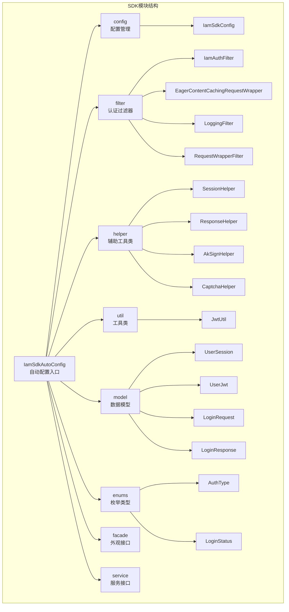
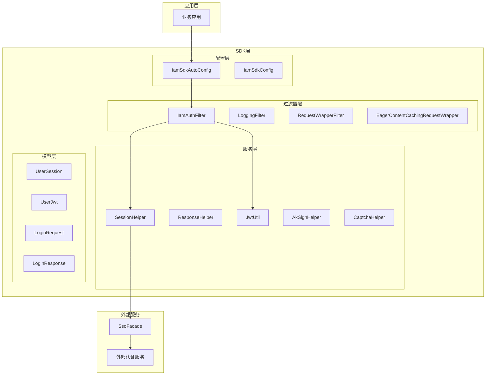
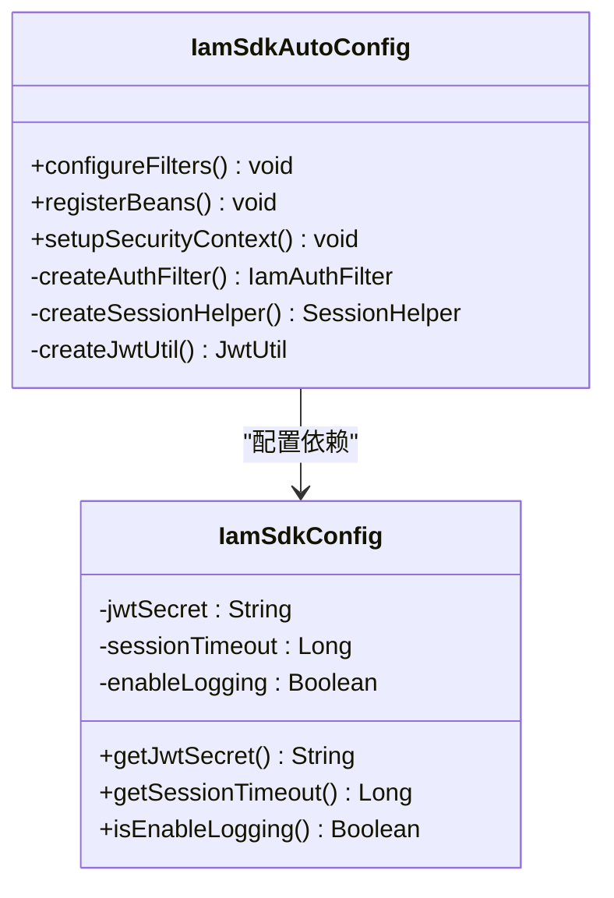
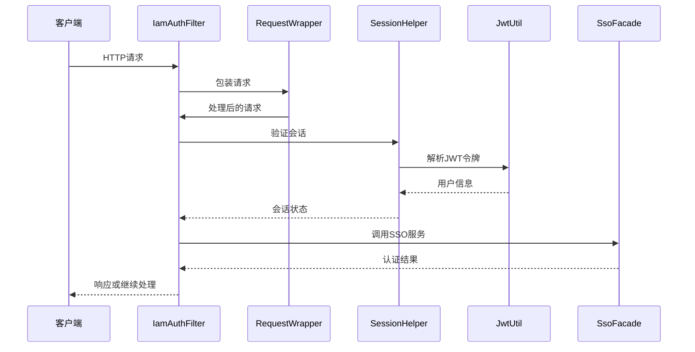
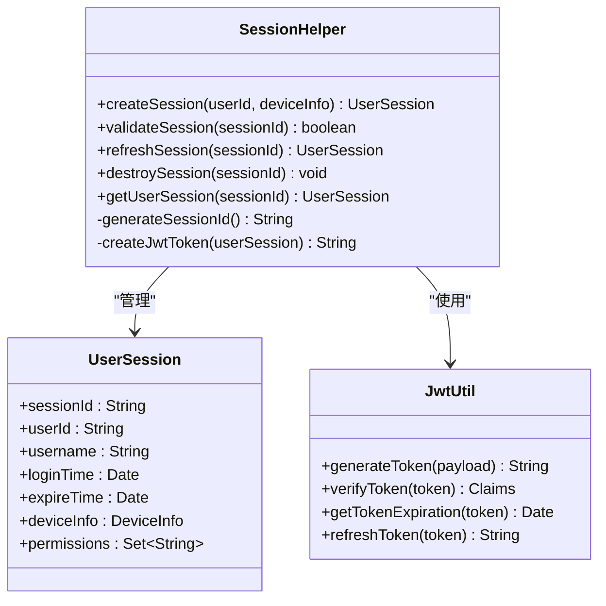
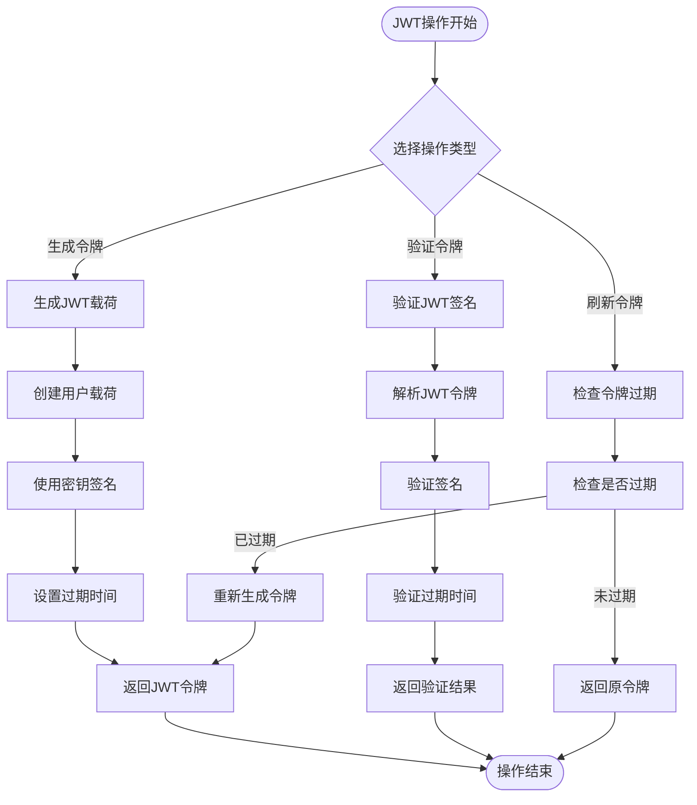
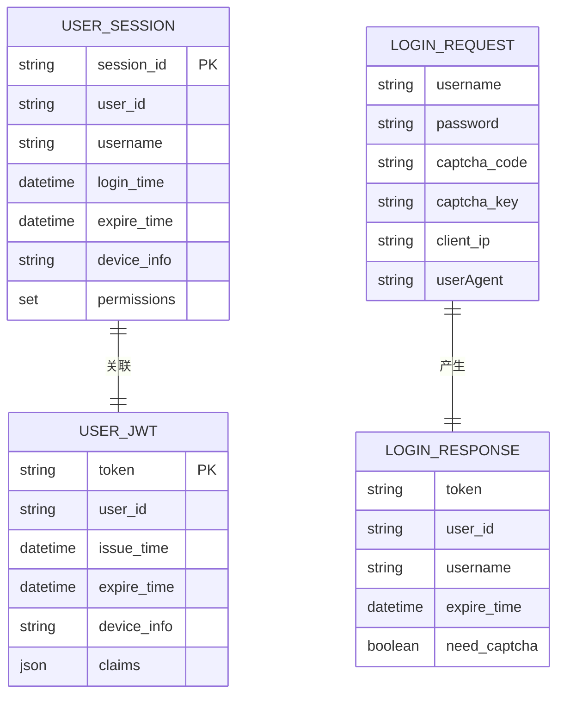
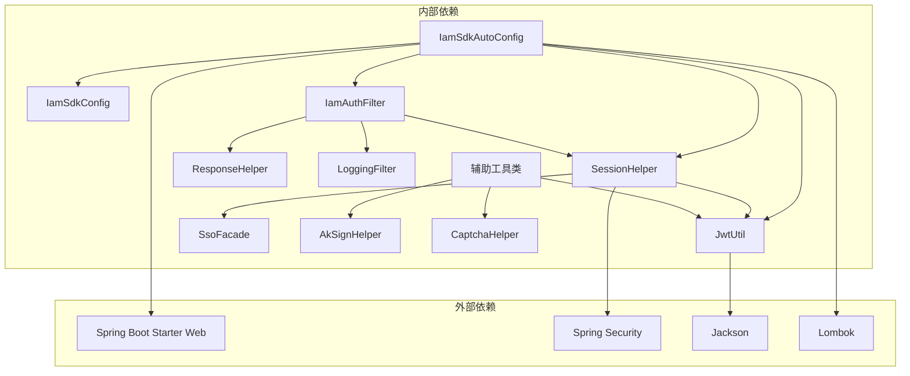

# SDK模块(iam-sdk)技术文档

<cite>
**本文档引用的文件**
- [IamSdkAutoConfig.java](file://iam-sdk/src/main/java/com/wkclz/iam/sdk/IamSdkAutoConfig.java)
- [IamSdkConfig.java](file://iam-sdk/src/main/java/com/wkclz/iam/sdk/config/IamSdkConfig.java)
- [IamAuthFilter.java](file://iam-sdk/src/main/java/com/wkclz/iam/sdk/filter/IamAuthFilter.java)
- [JwtUtil.java](file://iam-sdk/src/main/java/com/wkclz/iam/sdk/util/JwtUtil.java)
- [SessionHelper.java](file://iam-sdk/src/main/java/com/wkclz/iam/sdk/helper/SessionHelper.java)
- [EagerContentCachingRequestWrapper.java](file://iam-sdk/src/main/java/com/wkclz/iam/sdk/filter/EagerContentCachingRequestWrapper.java)
- [LoggingFilter.java](file://iam-sdk/src/main/java/com/wkclz/iam/sdk/filter/LoggingFilter.java)
- [RequestWrapperFilter.java](file://iam-sdk/src/main/java/com/wkclz/iam/sdk/filter/RequestWrapperFilter.java)
- [ResponseHelper.java](file://iam-sdk/src/main/java/com/wkclz/iam/sdk/helper/ResponseHelper.java)
- [AkSignHelper.java](file://iam-sdk/src/main/java/com/wkclz/iam/sdk/helper/AkSignHelper.java)
- [CaptchaHelper.java](file://iam-sdk/src/main/java/com/wkclz/iam/sdk/helper/CaptchaHelper.java)
- [SsoFacade.java](file://iam-sdk/src/main/java/com/wkclz/iam/sdk/facade/SsoFacade.java)
- [SsoFacadeImpl.java](file://iam-sdk/src/main/java/com/wkclz/iam/sdk/facade/impl/SsoFacadeImpl.java)
- [IamSsoService.java](file://iam-sdk/src/main/java/com/wkclz/iam/sdk/service/IamSsoService.java)
- [LoginRequest.java](file://iam-sdk/src/main/java/com/wkclz/iam/sdk/model/LoginRequest.java)
- [LoginResponse.java](file://iam-sdk/src/main/java/com/wkclz/iam/sdk/model/LoginResponse.java)
- [UserSession.java](file://iam-sdk/src/main/java/com/wkclz/iam/sdk/model/UserSession.java)
- [UserJwt.java](file://iam-sdk/src/main/java/com/wkclz/iam/sdk/model/UserJwt.java)
- [AuthType.java](file://iam-sdk/src/main/java/com/wkclz/iam/sdk/enums/AuthType.java)
- [LoginStatus.java](file://iam-sdk/src/main/java/com/wkclz/iam/sdk/enums/LoginStatus.java)
- [org.springframework.boot.autoconfigure.AutoConfiguration.imports](file://iam-sdk/src/main/resources/META-INF/spring/org.springframework.boot.autoconfigure.AutoConfiguration.imports)
</cite>

## 目录
1. [简介](#简介)
2. [项目结构](#项目结构)
3. [核心组件](#核心组件)
4. [架构概览](#架构概览)
5. [详细组件分析](#详细组件分析)
6. [依赖关系分析](#依赖关系分析)
7. [性能考虑](#性能考虑)
8. [故障排除指南](#故障排除指南)
9. [结论](#结论)
10. [附录](#附录)

## 简介

iam-sdk是IAM身份认证系统的核心SDK模块，为其他应用提供统一的身份认证接入能力。该SDK实现了完整的认证过滤器、会话管理、JWT令牌处理、请求拦截和响应封装功能，支持多种认证方式和安全防护机制。

SDK采用Spring Boot自动配置机制，通过SPI接口和工厂模式实现高度可扩展的认证体系。模块设计遵循分层架构原则，将认证逻辑与业务逻辑分离，提供了清晰的扩展点和配置选项。

## 项目结构

iam-sdk模块采用标准的Maven项目结构，主要包含以下核心包：



**图表来源**
- [IamSdkAutoConfig.java:1-200](file://iam-sdk/src/main/java/com/wkclz/iam/sdk/IamSdkAutoConfig.java#L1-L200)
- [IamSdkConfig.java:1-150](file://iam-sdk/src/main/java/com/wkclz/iam/sdk/config/IamSdkConfig.java#L1-L150)

**章节来源**
- [IamSdkAutoConfig.java:1-200](file://iam-sdk/src/main/java/com/wkclz/iam/sdk/IamSdkAutoConfig.java#L1-L200)
- [org.springframework.boot.autoconfigure.AutoConfiguration.imports:1-50](file://iam-sdk/src/main/resources/META-INF/spring/org.springframework.boot.autoconfigure.AutoConfiguration.imports#L1-L50)

## 核心组件

### 自动配置机制

SDK通过Spring Boot的自动配置机制实现零代码配置的开箱即用体验。自动配置类负责注册所有必要的Bean和过滤器，确保SDK能够无缝集成到任何Spring Boot应用中。

**关键特性：**
- 基于条件注解的智能配置
- SPI接口的动态加载机制
- 可配置的过滤器链顺序
- 灵活的扩展点设计

### 认证过滤器实现

SDK实现了多层次的认证过滤器，确保请求在进入业务逻辑之前经过完整的安全检查。

**过滤器层次：**
1. **请求包装过滤器** - 处理请求参数和内容缓存
2. **日志记录过滤器** - 记录请求和响应信息
3. **认证过滤器** - 核心认证逻辑执行
4. **内容缓存过滤器** - 支持重复读取请求内容

### 会话管理

SDK提供了完整的会话管理机制，包括用户会话的创建、验证、更新和销毁。

**会话特性：**
- 基于JWT的无状态会话
- 支持会话过期和续期
- 多设备登录控制
- 会话状态监控

### 辅助工具类

SDK包含多个专用的工具类，提供JWT处理、签名验证、验证码生成等核心功能。

**工具类功能：**
- JWT令牌生成和验证
- AK签名算法实现
- 验证码生成功能
- 响应结果封装

**章节来源**
- [IamSdkAutoConfig.java:1-200](file://iam-sdk/src/main/java/com/wkclz/iam/sdk/IamSdkAutoConfig.java#L1-L200)
- [IamSdkConfig.java:1-150](file://iam-sdk/src/main/java/com/wkclz/iam/sdk/config/IamSdkConfig.java#L1-L150)

## 架构概览

SDK采用分层架构设计，各层职责明确，耦合度低，便于维护和扩展。



**图表来源**
- [IamSdkAutoConfig.java:1-200](file://iam-sdk/src/main/java/com/wkclz/iam/sdk/IamSdkAutoConfig.java#L1-L200)
- [IamAuthFilter.java:1-300](file://iam-sdk/src/main/java/com/wkclz/iam/sdk/filter/IamAuthFilter.java#L1-L300)
- [SessionHelper.java:1-250](file://iam-sdk/src/main/java/com/wkclz/iam/sdk/helper/SessionHelper.java#L1-L250)

## 详细组件分析

### 自动配置类分析

IamSdkAutoConfig是SDK的核心配置类，负责注册所有必要的Bean和服务。



**图表来源**
- [IamSdkAutoConfig.java:1-200](file://iam-sdk/src/main/java/com/wkclz/iam/sdk/IamSdkAutoConfig.java#L1-L200)
- [IamSdkConfig.java:1-150](file://iam-sdk/src/main/java/com/wkclz/iam/sdk/config/IamSdkConfig.java#L1-L150)

**章节来源**
- [IamSdkAutoConfig.java:1-200](file://iam-sdk/src/main/java/com/wkclz/iam/sdk/IamSdkAutoConfig.java#L1-L200)
- [IamSdkConfig.java:1-150](file://iam-sdk/src/main/java/com/wkclz/iam/sdk/config/IamSdkConfig.java#L1-L150)

### 认证过滤器组件

IamAuthFilter是SDK的核心组件，负责处理所有HTTP请求的认证逻辑。



**图表来源**
- [IamAuthFilter.java:1-300](file://iam-sdk/src/main/java/com/wkclz/iam/sdk/filter/IamAuthFilter.java#L1-L300)
- [SessionHelper.java:1-250](file://iam-sdk/src/main/java/com/wkclz/iam/sdk/helper/SessionHelper.java#L1-L250)
- [JwtUtil.java:1-200](file://iam-sdk/src/main/java/com/wkclz/iam/sdk/util/JwtUtil.java#L1-L200)

**章节来源**
- [IamAuthFilter.java:1-300](file://iam-sdk/src/main/java/com/wkclz/iam/sdk/filter/IamAuthFilter.java#L1-L300)
- [EagerContentCachingRequestWrapper.java:1-150](file://iam-sdk/src/main/java/com/wkclz/iam/sdk/filter/EagerContentCachingRequestWrapper.java#L1-L150)
- [LoggingFilter.java:1-120](file://iam-sdk/src/main/java/com/wkclz/iam/sdk/filter/LoggingFilter.java#L1-L120)
- [RequestWrapperFilter.java:1-100](file://iam-sdk/src/main/java/com/wkclz/iam/sdk/filter/RequestWrapperFilter.java#L1-L100)

### 会话管理组件

SessionHelper提供了完整的会话生命周期管理功能。



**图表来源**
- [SessionHelper.java:1-250](file://iam-sdk/src/main/java/com/wkclz/iam/sdk/helper/SessionHelper.java#L1-L250)
- [UserSession.java:1-120](file://iam-sdk/src/main/java/com/wkclz/iam/sdk/model/UserSession.java#L1-L120)
- [JwtUtil.java:1-200](file://iam-sdk/src/main/java/com/wkclz/iam/sdk/util/JwtUtil.java#L1-L200)

**章节来源**
- [SessionHelper.java:1-250](file://iam-sdk/src/main/java/com/wkclz/iam/sdk/helper/SessionHelper.java#L1-L250)
- [UserSession.java:1-120](file://iam-sdk/src/main/java/com/wkclz/iam/sdk/model/UserSession.java#L1-L120)

### JWT工具类分析

JwtUtil提供了JWT令牌的完整生命周期管理。



**图表来源**
- [JwtUtil.java:1-200](file://iam-sdk/src/main/java/com/wkclz/iam/sdk/util/JwtUtil.java#L1-L200)

**章节来源**
- [JwtUtil.java:1-200](file://iam-sdk/src/main/java/com/wkclz/iam/sdk/util/JwtUtil.java#L1-L200)

### 数据模型分析

SDK定义了完整的数据传输对象和领域模型。



**图表来源**
- [UserSession.java:1-120](file://iam-sdk/src/main/java/com/wkclz/iam/sdk/model/UserSession.java#L1-L120)
- [UserJwt.java:1-100](file://iam-sdk/src/main/java/com/wkclz/iam/sdk/model/UserJwt.java#L1-L100)
- [LoginRequest.java:1-80](file://iam-sdk/src/main/java/com/wkclz/iam/sdk/model/LoginRequest.java#L1-L80)
- [LoginResponse.java:1-100](file://iam-sdk/src/main/java/com/wkclz/iam/sdk/model/LoginResponse.java#L1-L100)

**章节来源**
- [UserSession.java:1-120](file://iam-sdk/src/main/java/com/wkclz/iam/sdk/model/UserSession.java#L1-L120)
- [UserJwt.java:1-100](file://iam-sdk/src/main/java/com/wkclz/iam/sdk/model/UserJwt.java#L1-L100)
- [LoginRequest.java:1-80](file://iam-sdk/src/main/java/com/wkclz/iam/sdk/model/LoginRequest.java#L1-L80)
- [LoginResponse.java:1-100](file://iam-sdk/src/main/java/com/wkclz/iam/sdk/model/LoginResponse.java#L1-L100)

## 依赖关系分析

SDK模块的依赖关系清晰，遵循单一职责原则和依赖倒置原则。



**图表来源**
- [IamSdkAutoConfig.java:1-200](file://iam-sdk/src/main/java/com/wkclz/iam/sdk/IamSdkAutoConfig.java#L1-L200)
- [SessionHelper.java:1-250](file://iam-sdk/src/main/java/com/wkclz/iam/sdk/helper/SessionHelper.java#L1-L250)

**章节来源**
- [IamSdkAutoConfig.java:1-200](file://iam-sdk/src/main/java/com/wkclz/iam/sdk/IamSdkAutoConfig.java#L1-L200)
- [org.springframework.boot.autoconfigure.AutoConfiguration.imports:1-50](file://iam-sdk/src/main/resources/META-INF/spring/org.springframework.boot.autoconfigure.AutoConfiguration.imports#L1-L50)

## 性能考虑

SDK在设计时充分考虑了性能优化，采用了多种策略来提升系统的响应速度和吞吐量。

### 缓存策略
- **会话缓存**：使用内存缓存存储活跃会话，减少数据库查询
- **JWT缓存**：对频繁访问的用户信息进行缓存
- **配置缓存**：缓存SDK配置信息，避免重复初始化

### 异步处理
- **日志异步化**：请求日志采用异步写入，不影响主业务流程
- **验证码生成**：验证码生成使用异步任务，提升用户体验

### 连接池优化
- **数据库连接池**：合理配置连接池大小，避免连接泄漏
- **HTTP客户端**：复用HTTP连接，减少TCP握手开销

## 故障排除指南

### 常见问题及解决方案

**问题1：认证失败**
- 检查JWT密钥配置是否正确
- 验证用户会话是否过期
- 确认用户权限是否足够

**问题2：会话异常**
- 查看会话超时配置
- 检查多设备登录限制
- 验证会话存储介质

**问题3：性能问题**
- 分析请求日志中的慢查询
- 检查缓存命中率
- 监控数据库连接池使用情况

### 调试技巧

**启用详细日志**
```yaml
logging:
  level:
    com.wkclz.iam.sdk: debug
```

**监控指标**
- 请求成功率
- 平均响应时间
- 错误率统计

**章节来源**
- [LoggingFilter.java:1-120](file://iam-sdk/src/main/java/com/wkclz/iam/sdk/filter/LoggingFilter.java#L1-L120)
- [ResponseHelper.java:1-150](file://iam-sdk/src/main/java/com/wkclz/iam/sdk/helper/ResponseHelper.java#L1-L150)

## 结论

iam-sdk模块通过精心设计的架构和完善的组件实现了统一的身份认证接入能力。模块具有以下优势：

1. **高度可扩展性**：基于SPI接口和工厂模式，支持灵活的功能扩展
2. **易于集成**：通过Spring Boot自动配置，实现零代码配置
3. **安全性强**：提供完整的认证、授权和审计功能
4. **性能优异**：采用多种优化策略，确保高并发场景下的稳定性

SDK为构建企业级身份认证系统提供了坚实的基础，开发者可以在此基础上快速实现各种复杂的认证需求。

## 附录

### 配置选项参考

| 配置项 | 类型 | 默认值 | 描述 |
|--------|------|--------|------|
| iam.sdk.jwt.secret | String | required | JWT密钥 |
| iam.sdk.session.timeout | Long | 1800000 | 会话超时时间(ms) |
| iam.sdk.enable.logging | Boolean | true | 是否启用日志记录 |
| iam.sdk.auth.enabled | Boolean | true | 是否启用认证 |

### 扩展点说明

**自定义认证处理器**
通过实现认证接口，可以添加新的认证方式

**自定义会话存储**
支持Redis、数据库等多种存储后端

**自定义响应格式**
可以根据需要定制API响应格式

### 集成最佳实践

1. **渐进式集成**：从简单的认证场景开始，逐步增加复杂功能
2. **监控告警**：建立完善的监控体系，及时发现和解决问题
3. **安全加固**：定期更新密钥，审查权限配置
4. **性能调优**：根据实际负载调整缓存和连接池配置