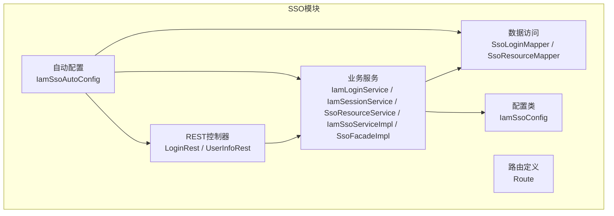
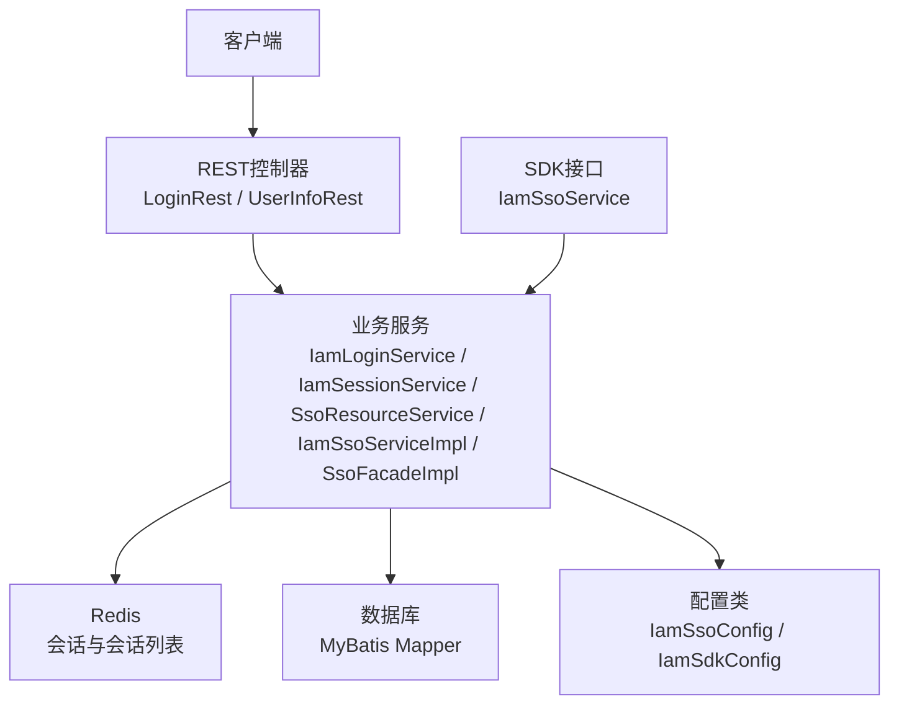
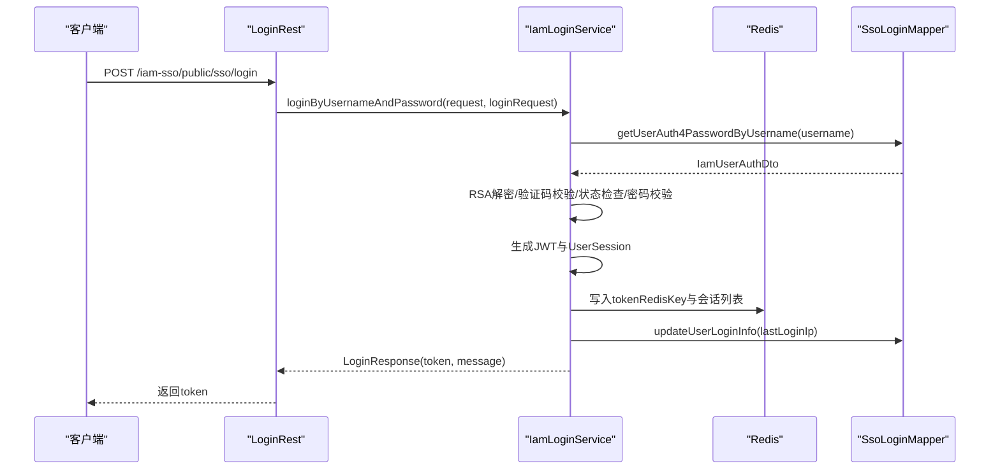
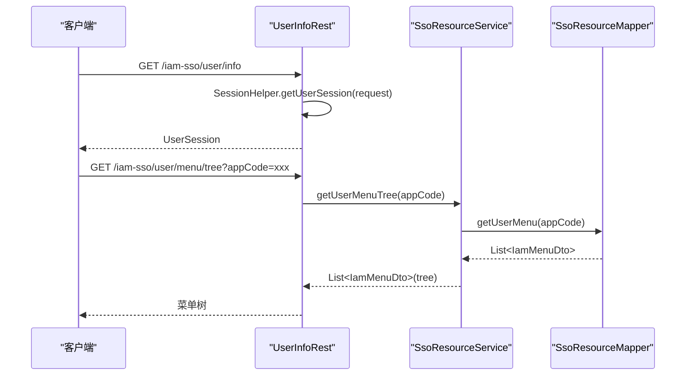
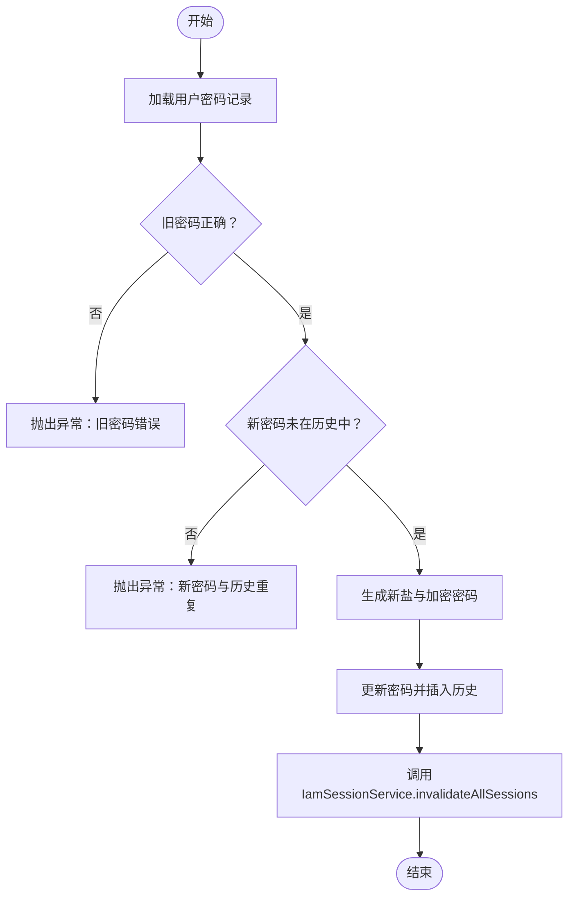
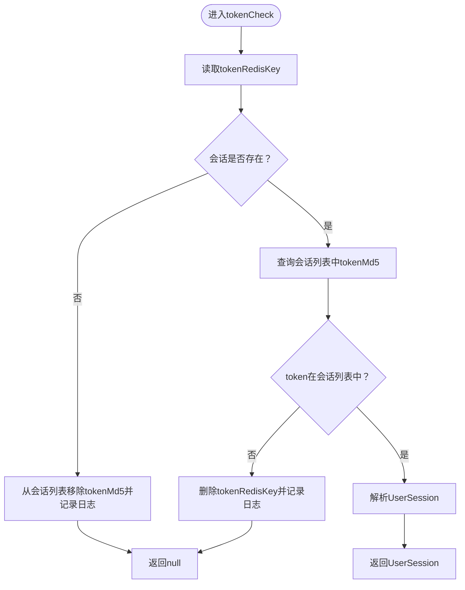
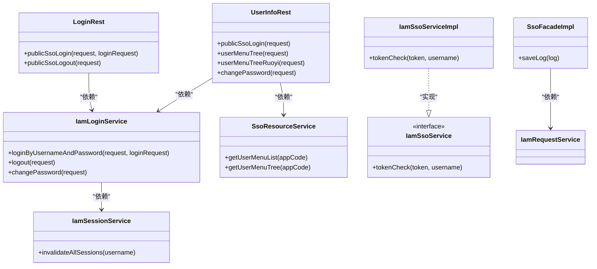

# SSO服务模块(iam-sso)技术文档

<cite>
**本文档引用的文件**
- [IamSsoAutoConfig.java](file://iam-sso/src/main/java/com/wkclz/iam/sso/IamSsoAutoConfig.java)
- [IamSsoServiceImpl.java](file://iam-sso/src/main/java/com/wkclz/iam/sso/service/IamSsoServiceImpl.java)
- [SsoFacadeImpl.java](file://iam-sso/src/main/java/com/wkclz/iam/sso/service/SsoFacadeImpl.java)
- [LoginRest.java](file://iam-sso/src/main/java/com/wkclz/iam/sso/rest/LoginRest.java)
- [UserInfoRest.java](file://iam-sso/src/main/java/com/wkclz/iam/sso/rest/UserInfoRest.java)
- [IamLoginService.java](file://iam-sso/src/main/java/com/wkclz/iam/sso/service/IamLoginService.java)
- [IamSessionService.java](file://iam-sso/src/main/java/com/wkclz/iam/sso/service/IamSessionService.java)
- [SsoResourceService.java](file://iam-sso/src/main/java/com/wkclz/iam/sso/service/SsoResourceService.java)
- [Route.java](file://iam-sso/src/main/java/com/wkclz/iam/sso/Route.java)
- [IamSsoConfig.java](file://iam-sso/src/main/java/com/wkclz/iam/sso/config/IamSsoConfig.java)
- [IamSdkConfig.java](file://iam-sdk/src/main/java/com/wkclz/iam/sdk/config/IamSdkConfig.java)
- [IamSsoService.java](file://iam-sdk/src/main/java/com/wkclz/iam/sdk/service/IamSsoService.java)
- [SsoLoginMapper.java](file://iam-sso/src/main/java/com/wkclz/iam/sso/mapper/SsoLoginMapper.java)
- [SsoResourceMapper.java](file://iam-sso/src/main/java/com/wkclz/iam/sso/mapper/SsoResourceMapper.java)
- [db-base.ddl.sql](file://iam-sso/src/main/resources/db-script/db-base.ddl.sql)
</cite>

## 目录
1. [简介](#简介)
2. [项目结构](#项目结构)
3. [核心组件](#核心组件)
4. [架构总览](#架构总览)
5. [详细组件分析](#详细组件分析)
6. [依赖关系分析](#依赖关系分析)
7. [性能考虑](#性能考虑)
8. [故障排除指南](#故障排除指南)
9. [结论](#结论)

## 简介
本文件为SSO服务模块(iam-sso)的详细技术文档，全面阐述单点登录服务的核心架构与实现机制。内容涵盖服务实现类、REST API接口、数据访问层、业务逻辑处理、登录流程、会话管理、权限验证以及资源服务的实现机制。同时提供SSO协议实现细节、安全策略与性能优化方案，并给出完整的API调用示例与错误处理指南。

## 项目结构
SSO模块采用分层架构设计，包含自动配置、REST控制器、服务层、数据访问层与配置类等层次，通过Spring Boot自动装配与MyBatis Mapper实现模块化与可扩展性。

**图表来源**
- [IamSsoAutoConfig.java:1-14](file://iam-sso/src/main/java/com/wkclz/iam/sso/IamSsoAutoConfig.java#L1-L14)
- [Route.java:1-64](file://iam-sso/src/main/java/com/wkclz/iam/sso/Route.java#L1-L64)
- [LoginRest.java:1-38](file://iam-sso/src/main/java/com/wkclz/iam/sso/rest/LoginRest.java#L1-L38)
- [UserInfoRest.java:1-140](file://iam-sso/src/main/java/com/wkclz/iam/sso/rest/UserInfoRest.java#L1-L140)
- [IamLoginService.java:1-345](file://iam-sso/src/main/java/com/wkclz/iam/sso/service/IamLoginService.java#L1-L345)
- [IamSessionService.java:1-34](file://iam-sso/src/main/java/com/wkclz/iam/sso/service/IamSessionService.java#L1-L34)
- [SsoResourceService.java:1-50](file://iam-sso/src/main/java/com/wkclz/iam/sso/service/SsoResourceService.java#L1-L50)
- [IamSsoServiceImpl.java:1-48](file://iam-sso/src/main/java/com/wkclz/iam/sso/service/IamSsoServiceImpl.java#L1-L48)
- [SsoFacadeImpl.java:1-20](file://iam-sso/src/main/java/com/wkclz/iam/sso/service/SsoFacadeImpl.java#L1-L20)
- [SsoLoginMapper.java:1-36](file://iam-sso/src/main/java/com/wkclz/iam/sso/mapper/SsoLoginMapper.java#L1-L36)
- [SsoResourceMapper.java:1-16](file://iam-sso/src/main/java/com/wkclz/iam/sso/mapper/SsoResourceMapper.java#L1-L16)
- [IamSsoConfig.java:1-29](file://iam-sso/src/main/java/com/wkclz/iam/sso/config/IamSsoConfig.java#L1-L29)

**章节来源**
- [IamSsoAutoConfig.java:1-14](file://iam-sso/src/main/java/com/wkclz/iam/sso/IamSsoAutoConfig.java#L1-L14)
- [Route.java:1-64](file://iam-sso/src/main/java/com/wkclz/iam/sso/Route.java#L1-L64)

## 核心组件
- 自动配置：启用组件扫描与Mapper扫描，统一装配模块基础能力。
- REST控制器：提供公开的登录、登出、用户信息、菜单树等接口。
- 业务服务：实现登录认证、会话管理、资源查询、密码修改与会话失效等核心逻辑。
- 数据访问层：基于MyBatis Mapper封装用户认证、登录日志、菜单资源等数据操作。
- 配置类：集中管理SSO相关参数（如密码过期天数、RSA密钥对、并发会话限制）。

**章节来源**
- [IamSsoAutoConfig.java:1-14](file://iam-sso/src/main/java/com/wkclz/iam/sso/IamSsoAutoConfig.java#L1-L14)
- [IamSsoServiceImpl.java:1-48](file://iam-sso/src/main/java/com/wkclz/iam/sso/service/IamSsoServiceImpl.java#L1-L48)
- [SsoFacadeImpl.java:1-20](file://iam-sso/src/main/java/com/wkclz/iam/sso/service/SsoFacadeImpl.java#L1-L20)
- [LoginRest.java:1-38](file://iam-sso/src/main/java/com/wkclz/iam/sso/rest/LoginRest.java#L1-L38)
- [UserInfoRest.java:1-140](file://iam-sso/src/main/java/com/wkclz/iam/sso/rest/UserInfoRest.java#L1-L140)
- [IamLoginService.java:1-345](file://iam-sso/src/main/java/com/wkclz/iam/sso/service/IamLoginService.java#L1-L345)
- [IamSessionService.java:1-34](file://iam-sso/src/main/java/com/wkclz/iam/sso/service/IamSessionService.java#L1-L34)
- [SsoResourceService.java:1-50](file://iam-sso/src/main/java/com/wkclz/iam/sso/service/SsoResourceService.java#L1-L50)
- [SsoLoginMapper.java:1-36](file://iam-sso/src/main/java/com/wkclz/iam/sso/mapper/SsoLoginMapper.java#L1-L36)
- [SsoResourceMapper.java:1-16](file://iam-sso/src/main/java/com/wkclz/iam/sso/mapper/SsoResourceMapper.java#L1-L16)
- [IamSsoConfig.java:1-29](file://iam-sso/src/main/java/com/wkclz/iam/sso/config/IamSsoConfig.java#L1-L29)

## 架构总览
SSO模块采用“控制器-服务-数据访问-配置”的分层架构，结合Redis进行会话状态存储与并发会话控制，使用JWT作为令牌载体，支持RSA加密传输与密码历史校验。

**图表来源**
- [LoginRest.java:1-38](file://iam-sso/src/main/java/com/wkclz/iam/sso/rest/LoginRest.java#L1-L38)
- [UserInfoRest.java:1-140](file://iam-sso/src/main/java/com/wkclz/iam/sso/rest/UserInfoRest.java#L1-L140)
- [IamLoginService.java:1-345](file://iam-sso/src/main/java/com/wkclz/iam/sso/service/IamLoginService.java#L1-L345)
- [IamSessionService.java:1-34](file://iam-sso/src/main/java/com/wkclz/iam/sso/service/IamSessionService.java#L1-L34)
- [SsoResourceService.java:1-50](file://iam-sso/src/main/java/com/wkclz/iam/sso/service/SsoResourceService.java#L1-L50)
- [IamSsoServiceImpl.java:1-48](file://iam-sso/src/main/java/com/wkclz/iam/sso/service/IamSsoServiceImpl.java#L1-L48)
- [IamSsoConfig.java:1-29](file://iam-sso/src/main/java/com/wkclz/iam/sso/config/IamSsoConfig.java#L1-L29)
- [IamSdkConfig.java:1-62](file://iam-sdk/src/main/java/com/wkclz/iam/sdk/config/IamSdkConfig.java#L1-L62)
- [IamSsoService.java:1-10](file://iam-sdk/src/main/java/com/wkclz/iam/sdk/service/IamSsoService.java#L1-L10)

## 详细组件分析

### 登录与会话管理
- 登录流程：接收用户名与密码，支持RSA解密；进行验证码校验；查询用户认证信息；校验账户状态与密码；生成JWT并写入Redis；维护用户会话列表；记录登录日志。
- 会话管理：基于Redis的ZSet维护用户会话列表，按时间戳排序；支持并发会话上限控制，超出则踢出最早会话；提供会话失效与全部会话失效功能。
- 令牌校验：通过SDK接口IamSsoService实现tokenCheck，从Redis读取用户会话并校验是否在会话列表中，若不在则清理会话列表中的幽灵条目。

**图表来源**
- [LoginRest.java:22-28](file://iam-sso/src/main/java/com/wkclz/iam/sso/rest/LoginRest.java#L22-L28)
- [IamLoginService.java:74-235](file://iam-sso/src/main/java/com/wkclz/iam/sso/service/IamLoginService.java#L74-L235)
- [SsoLoginMapper.java:17-20](file://iam-sso/src/main/java/com/wkclz/iam/sso/mapper/SsoLoginMapper.java#L17-L20)

**章节来源**
- [LoginRest.java:1-38](file://iam-sso/src/main/java/com/wkclz/iam/sso/rest/LoginRest.java#L1-L38)
- [IamLoginService.java:1-345](file://iam-sso/src/main/java/com/wkclz/iam/sso/service/IamLoginService.java#L1-L345)
- [IamSsoServiceImpl.java:1-48](file://iam-sso/src/main/java/com/wkclz/iam/sso/service/IamSsoServiceImpl.java#L1-L48)
- [SsoLoginMapper.java:1-36](file://iam-sso/src/main/java/com/wkclz/iam/sso/mapper/SsoLoginMapper.java#L1-L36)

### 用户信息与菜单资源
- 用户信息：通过SessionHelper从请求中提取UserSession返回给前端。
- 菜单树：根据appCode查询用户菜单，构建树形结构；支持转换为Vue Router格式，包含按钮权限映射。
- 资源服务：封装菜单查询与树形构建逻辑，便于复用。

**图表来源**
- [UserInfoRest.java:35-49](file://iam-sso/src/main/java/com/wkclz/iam/sso/rest/UserInfoRest.java#L35-L49)
- [SsoResourceService.java:18-25](file://iam-sso/src/main/java/com/wkclz/iam/sso/service/SsoResourceService.java#L18-L25)
- [SsoResourceMapper.java:12](file://iam-sso/src/main/java/com/wkclz/iam/sso/mapper/SsoResourceMapper.java#L12)

**章节来源**
- [UserInfoRest.java:1-140](file://iam-sso/src/main/java/com/wkclz/iam/sso/rest/UserInfoRest.java#L1-L140)
- [SsoResourceService.java:1-50](file://iam-sso/src/main/java/com/wkclz/iam/sso/service/SsoResourceService.java#L1-L50)
- [SsoResourceMapper.java:1-16](file://iam-sso/src/main/java/com/wkclz/iam/sso/mapper/SsoResourceMapper.java#L1-L16)

### 密码修改与会话失效
- 密码修改：支持RSA解密旧/新密码；校验旧密码与历史密码；更新密码并写入历史；强制使该用户所有会话失效。
- 会话失效：遍历用户会话列表，逐个删除对应会话键值，最后清空会话列表。

**图表来源**
- [IamLoginService.java:259-313](file://iam-sso/src/main/java/com/wkclz/iam/sso/service/IamLoginService.java#L259-L313)
- [IamSessionService.java:20-31](file://iam-sso/src/main/java/com/wkclz/iam/sso/service/IamSessionService.java#L20-L31)

**章节来源**
- [IamLoginService.java:1-345](file://iam-sso/src/main/java/com/wkclz/iam/sso/service/IamLoginService.java#L1-L345)
- [IamSessionService.java:1-34](file://iam-sso/src/main/java/com/wkclz/iam/sso/service/IamSessionService.java#L1-L34)

### 令牌校验与会话清理
- 令牌校验：从Redis读取token对应的UserSession；若不存在则清理会话列表中的对应条目。
- 会话列表校验：确认token仍存在于用户会话列表中；若不存在则删除对应会话键值。

**图表来源**
- [IamSsoServiceImpl.java:22-46](file://iam-sso/src/main/java/com/wkclz/iam/sso/service/IamSsoServiceImpl.java#L22-L46)

**章节来源**
- [IamSsoServiceImpl.java:1-48](file://iam-sso/src/main/java/com/wkclz/iam/sso/service/IamSsoServiceImpl.java#L1-L48)

### API接口定义
- 登录接口：POST /iam-sso/public/sso/login，接收用户名与密码，返回JWT与登录状态。
- 登出接口：GET /iam-sso/public/sso/logout，清除当前会话。
- 用户信息：GET /iam-sso/user/info，返回当前用户会话信息。
- 菜单树：GET /iam-sso/user/menu/tree?appCode=xxx，返回用户菜单树；GET /iam-sso/user/menu/tree/ruoyi，返回Vue Router格式菜单树。
- 修改密码：POST /iam-sso/user/change-password，接收旧密码与新密码。

**章节来源**
- [Route.java:1-64](file://iam-sso/src/main/java/com/wkclz/iam/sso/Route.java#L1-L64)
- [LoginRest.java:1-38](file://iam-sso/src/main/java/com/wkclz/iam/sso/rest/LoginRest.java#L1-L38)
- [UserInfoRest.java:1-140](file://iam-sso/src/main/java/com/wkclz/iam/sso/rest/UserInfoRest.java#L1-L140)

## 依赖关系分析
- 组件耦合：REST控制器依赖业务服务；业务服务依赖Mapper与配置；服务层内部通过Redis与数据库交互；SDK接口提供跨模块的令牌校验能力。
- 外部依赖：Redis用于会话存储与会话列表管理；MyBatis用于数据库访问；Spring Boot自动装配与组件扫描。
- 接口契约：IamSsoService定义了tokenCheck接口，IamSsoServiceImpl实现该接口；SsoFacadeImpl实现日志保存门面。

**图表来源**
- [LoginRest.java:1-38](file://iam-sso/src/main/java/com/wkclz/iam/sso/rest/LoginRest.java#L1-L38)
- [UserInfoRest.java:1-140](file://iam-sso/src/main/java/com/wkclz/iam/sso/rest/UserInfoRest.java#L1-L140)
- [IamLoginService.java:1-345](file://iam-sso/src/main/java/com/wkclz/iam/sso/service/IamLoginService.java#L1-L345)
- [IamSessionService.java:1-34](file://iam-sso/src/main/java/com/wkclz/iam/sso/service/IamSessionService.java#L1-L34)
- [SsoResourceService.java:1-50](file://iam-sso/src/main/java/com/wkclz/iam/sso/service/SsoResourceService.java#L1-L50)
- [IamSsoServiceImpl.java:1-48](file://iam-sso/src/main/java/com/wkclz/iam/sso/service/IamSsoServiceImpl.java#L1-L48)
- [SsoFacadeImpl.java:1-20](file://iam-sso/src/main/java/com/wkclz/iam/sso/service/SsoFacadeImpl.java#L1-L20)
- [IamSsoService.java:1-10](file://iam-sdk/src/main/java/com/wkclz/iam/sdk/service/IamSsoService.java#L1-L10)

**章节来源**
- [IamSsoService.java:1-10](file://iam-sdk/src/main/java/com/wkclz/iam/sdk/service/IamSsoService.java#L1-L10)
- [SsoFacadeImpl.java:1-20](file://iam-sso/src/main/java/com/wkclz/iam/sso/service/SsoFacadeImpl.java#L1-L20)

## 性能考虑
- Redis会话存储：使用字符串键与有序集合维护会话列表，支持快速查找与范围删除；建议合理设置会话TTL与并发会话上限，避免内存膨胀。
- 并发会话控制：当会话数量超过阈值时，按时间戳顺序批量踢出最早会话，保障系统稳定性。
- 密码历史校验：在修改密码时检查历史密码，减少弱密码循环使用风险。
- 日志持久化：登录日志与请求日志异步落库，降低写入阻塞影响。
- 安全策略：RSA解密仅在存在私钥时启用；验证码机制防止暴力破解；JWT密钥需在生产环境覆盖默认值。

[本节为通用性能指导，无需特定文件来源]

## 故障排除指南
- 登录失败状态码：
  - 需要验证码：检查验证码ID与Redis中的验证码是否匹配且未过期。
  - 验证码超时/错误：确认验证码Redis键是否存在与有效期。
  - 用户不存在/凭证无效：核对用户名与密码是否正确，检查用户状态与密码过期策略。
  - 账户锁定/禁用：检查用户状态字段与认证状态。
- 会话异常：
  - 令牌不存在：tokenCheck返回null，检查Redis中token键是否存在。
  - 令牌被踢出：会话列表中无该token，清理对应会话键并记录日志。
- 密码修改失败：
  - 旧密码错误：确认RSA解密后旧密码正确。
  - 新密码与历史重复：调整新密码策略，避免重复使用历史密码。
- API调用问题：
  - 缺少appCode：菜单树查询需在请求头中携带appCode。
  - 参数为空：登录接口要求用户名与密码非空。

**章节来源**
- [IamLoginService.java:90-176](file://iam-sso/src/main/java/com/wkclz/iam/sso/service/IamLoginService.java#L90-L176)
- [IamSsoServiceImpl.java:22-46](file://iam-sso/src/main/java/com/wkclz/iam/sso/service/IamSsoServiceImpl.java#L22-L46)
- [UserInfoRest.java:42-48](file://iam-sso/src/main/java/com/wkclz/iam/sso/rest/UserInfoRest.java#L42-L48)

## 结论
SSO服务模块通过清晰的分层架构与完善的会话管理机制，实现了安全、可扩展的单点登录能力。结合Redis与JWT，模块具备良好的性能与可运维性；配合验证码与并发会话控制，有效提升了安全性。建议在生产环境中完善密钥管理、监控与日志审计，持续优化用户体验与系统稳定性。