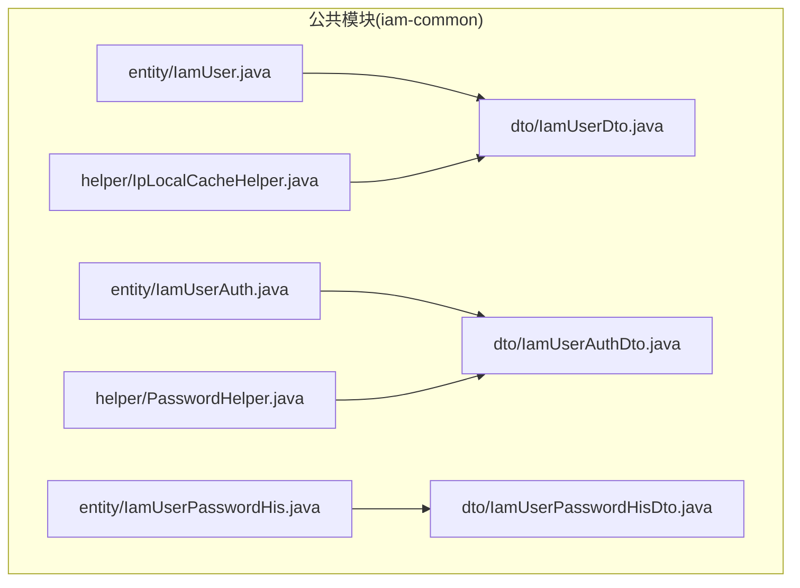
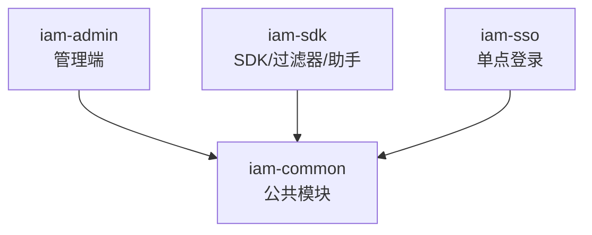
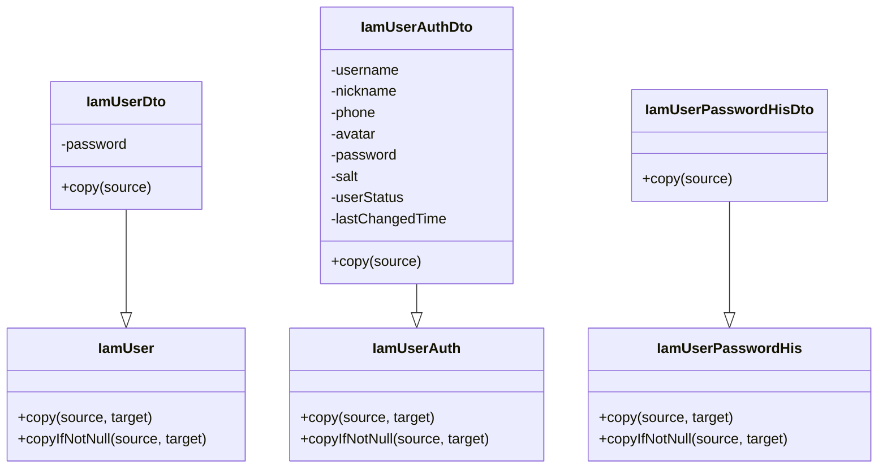
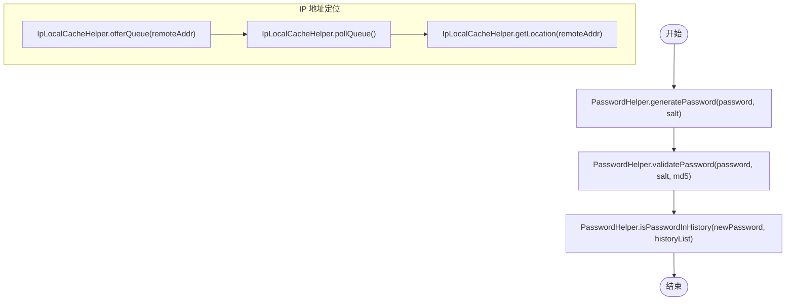
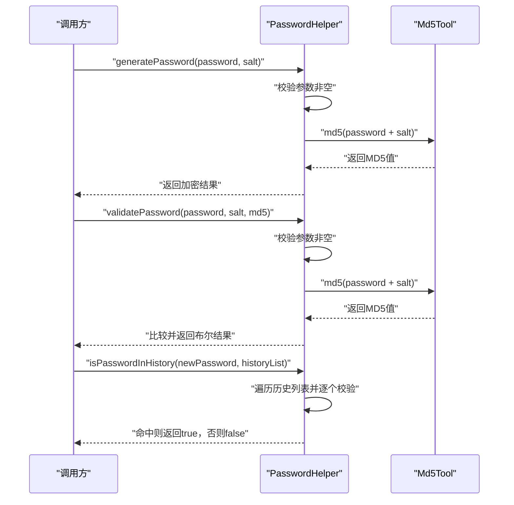
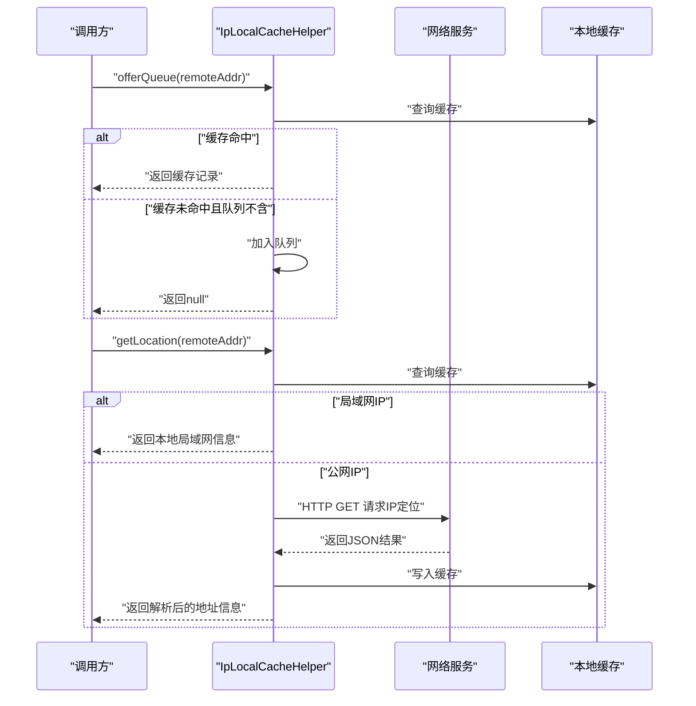
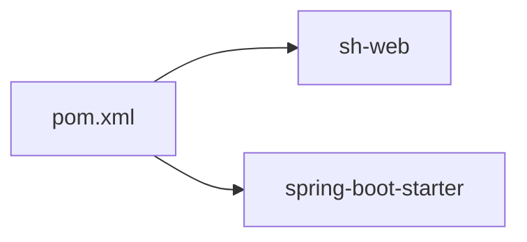

# 公共模块(iam-common)

<cite>
**本文档引用的文件**
- [pom.xml](file://iam-common/pom.xml)
- [IamUser.java](file://iam-common/src/main/java/com/wkclz/iam/common/entity/IamUser.java)
- [IamUserDto.java](file://iam-common/src/main/java/com/wkclz/iam/common/dto/IamUserDto.java)
- [IamUserAuth.java](file://iam-common/src/main/java/com/wkclz/iam/common/entity/IamUserAuth.java)
- [IamUserAuthDto.java](file://iam-common/src/main/java/com/wkclz/iam/common/dto/IamUserAuthDto.java)
- [IamUserPasswordHis.java](file://iam-common/src/main/java/com/wkclz/iam/common/entity/IamUserPasswordHis.java)
- [IamUserPasswordHisDto.java](file://iam-common/src/main/java/com/wkclz/iam/common/dto/IamUserPasswordHisDto.java)
- [PasswordHelper.java](file://iam-common/src/main/java/com/wkclz/iam/common/helper/PasswordHelper.java)
- [IpLocalCacheHelper.java](file://iam-common/src/main/java/com/wkclz/iam/common/helper/IpLocalCacheHelper.java)
</cite>

## 目录
1. [简介](#简介)
2. [项目结构](#项目结构)
3. [核心组件](#核心组件)
4. [架构总览](#架构总览)
5. [详细组件分析](#详细组件分析)
6. [依赖分析](#依赖分析)
7. [性能考虑](#性能考虑)
8. [故障排除指南](#故障排除指南)
9. [结论](#结论)
10. [附录](#附录)

## 简介
iam-common 是整个 IAM 系统的公共基础模块，提供跨模块共享的实体类（Entity）、数据传输对象（DTO）、工具类库以及通用能力。其设计理念是：
- 统一的数据模型与传输模型分离：实体类用于持久化层，DTO 用于接口层，避免直接暴露数据库字段。
- 工具类聚焦安全与基础设施：如密码处理、IP 地址定位等，确保各业务模块复用一致的安全与通用逻辑。
- 可扩展与可维护：通过继承 BaseEntity 的实体类统一版本号、排序、审计字段；通过静态 copy 方法实现实体与 DTO 的映射。

本模块不包含 Spring Boot 自动装配配置，便于以依赖形式被其他模块按需引入。

## 项目结构
iam-common 模块采用按职责分包的方式组织代码：
- entity：持久化实体类，承载数据库表结构与通用字段
- dto：数据传输对象，扩展实体类的对外传输字段与业务字段
- helper：工具类库，封装密码处理、IP 地址缓存等通用能力

**图表来源**
- [IamUser.java:1-108](file://iam-common/src/main/java/com/wkclz/iam/common/entity/IamUser.java#L1-L108)
- [IamUserDto.java:1-34](file://iam-common/src/main/java/com/wkclz/iam/common/dto/IamUserDto.java#L1-L34)
- [IamUserAuth.java:1-116](file://iam-common/src/main/java/com/wkclz/iam/common/entity/IamUserAuth.java#L1-L116)
- [IamUserAuthDto.java:1-44](file://iam-common/src/main/java/com/wkclz/iam/common/dto/IamUserAuthDto.java#L1-L44)
- [IamUserPasswordHis.java:1-76](file://iam-common/src/main/java/com/wkclz/iam/common/entity/IamUserPasswordHis.java#L1-L76)
- [IamUserPasswordHisDto.java:1-32](file://iam-common/src/main/java/com/wkclz/iam/common/dto/IamUserPasswordHisDto.java#L1-L32)
- [PasswordHelper.java:1-50](file://iam-common/src/main/java/com/wkclz/iam/common/helper/PasswordHelper.java#L1-L50)
- [IpLocalCacheHelper.java:1-113](file://iam-common/src/main/java/com/wkclz/iam/common/helper/IpLocalCacheHelper.java#L1-L113)

**章节来源**
- [pom.xml:1-26](file://iam-common/pom.xml#L1-L26)

## 核心组件
- 实体类（Entity）：统一继承 BaseEntity，具备 id、排序、版本号、创建/更新信息等通用字段，并提供 copy/copyIfNotNull 静态方法，便于与 DTO 进行映射。
- DTO 类（DTO）：继承对应实体类，扩展对外传输所需的业务字段（如用户登录返回的用户名、头像等），并提供 copy 静态方法完成实体到 DTO 的映射。
- 工具类（Helper）：提供密码处理（MD5 加盐）、IP 地址定位与本地缓存等能力，降低重复实现成本。

**章节来源**
- [IamUser.java:17-104](file://iam-common/src/main/java/com/wkclz/iam/common/entity/IamUser.java#L17-L104)
- [IamUserDto.java:13-32](file://iam-common/src/main/java/com/wkclz/iam/common/dto/IamUserDto.java#L13-L32)
- [IamUserAuth.java:17-112](file://iam-common/src/main/java/com/wkclz/iam/common/entity/IamUserAuth.java#L17-L112)
- [IamUserAuthDto.java:15-41](file://iam-common/src/main/java/com/wkclz/iam/common/dto/IamUserAuthDto.java#L15-L41)
- [IamUserPasswordHis.java:17-72](file://iam-common/src/main/java/com/wkclz/iam/common/entity/IamUserPasswordHis.java#L17-L72)
- [IamUserPasswordHisDto.java:13-29](file://iam-common/src/main/java/com/wkclz/iam/common/dto/IamUserPasswordHisDto.java#L13-L29)
- [PasswordHelper.java:10-48](file://iam-common/src/main/java/com/wkclz/iam/common/helper/PasswordHelper.java#L10-L48)
- [IpLocalCacheHelper.java:20-110](file://iam-common/src/main/java/com/wkclz/iam/common/helper/IpLocalCacheHelper.java#L20-L110)

## 架构总览
iam-common 在系统中的定位是“共享基础设施”，其他模块（如 iam-admin、iam-sdk、iam-sso）通过依赖本模块获得统一的实体、DTO 和工具类。下图展示了模块间的关系：

**图表来源**
- [pom.xml:16-25](file://iam-common/pom.xml#L16-L25)

## 详细组件分析

### 实体与 DTO 映射关系
- IamUser → IamUserDto：IamUserDto 继承 IamUser 并新增 password 字段，提供 copy 静态方法完成实体到 DTO 的复制。
- IamUserAuth → IamUserAuthDto：IamUserAuthDto 继承 IamUserAuth 并新增用户名、昵称、手机号、头像、盐值、用户状态等字段，提供 copy 静态方法。
- IamUserPasswordHis → IamUserPasswordHisDto：IamUserPasswordHisDto 继承 IamUserPasswordHis，提供 copy 静态方法。

**图表来源**
- [IamUser.java:64-104](file://iam-common/src/main/java/com/wkclz/iam/common/entity/IamUser.java#L64-L104)
- [IamUserDto.java:27-31](file://iam-common/src/main/java/com/wkclz/iam/common/dto/IamUserDto.java#L27-L31)
- [IamUserAuth.java:70-112](file://iam-common/src/main/java/com/wkclz/iam/common/entity/IamUserAuth.java#L70-L112)
- [IamUserAuthDto.java:37-41](file://iam-common/src/main/java/com/wkclz/iam/common/dto/IamUserAuthDto.java#L37-L41)
- [IamUserPasswordHis.java:40-72](file://iam-common/src/main/java/com/wkclz/iam/common/entity/IamUserPasswordHis.java#L40-L72)
- [IamUserPasswordHisDto.java:25-29](file://iam-common/src/main/java/com/wkclz/iam/common/dto/IamUserPasswordHisDto.java#L25-L29)

**章节来源**
- [IamUser.java:64-104](file://iam-common/src/main/java/com/wkclz/iam/common/entity/IamUser.java#L64-L104)
- [IamUserDto.java:27-31](file://iam-common/src/main/java/com/wkclz/iam/common/dto/IamUserDto.java#L27-L31)
- [IamUserAuth.java:70-112](file://iam-common/src/main/java/com/wkclz/iam/common/entity/IamUserAuth.java#L70-L112)
- [IamUserAuthDto.java:37-41](file://iam-common/src/main/java/com/wkclz/iam/common/dto/IamUserAuthDto.java#L37-L41)
- [IamUserPasswordHis.java:40-72](file://iam-common/src/main/java/com/wkclz/iam/common/entity/IamUserPasswordHis.java#L40-L72)
- [IamUserPasswordHisDto.java:25-29](file://iam-common/src/main/java/com/wkclz/iam/common/dto/IamUserPasswordHisDto.java#L25-L29)

### 工具类功能与使用场景
- PasswordHelper：提供密码加盐 MD5 生成、密码校验、历史密码校验等功能，用于用户认证与密码安全策略。
- IpLocalCacheHelper：提供 IP 地址定位、本地缓存、队列去重等能力，用于请求日志与登录日志的地理位置记录。

**图表来源**
- [PasswordHelper.java:13-46](file://iam-common/src/main/java/com/wkclz/iam/common/helper/PasswordHelper.java#L13-L46)
- [IpLocalCacheHelper.java:29-110](file://iam-common/src/main/java/com/wkclz/iam/common/helper/IpLocalCacheHelper.java#L29-L110)

**章节来源**
- [PasswordHelper.java:10-48](file://iam-common/src/main/java/com/wkclz/iam/common/helper/PasswordHelper.java#L10-L48)
- [IpLocalCacheHelper.java:20-112](file://iam-common/src/main/java/com/wkclz/iam/common/helper/IpLocalCacheHelper.java#L20-L112)

### 密码处理流程（序列图）

**图表来源**
- [PasswordHelper.java:13-46](file://iam-common/src/main/java/com/wkclz/iam/common/helper/PasswordHelper.java#L13-L46)

**章节来源**
- [PasswordHelper.java:10-48](file://iam-common/src/main/java/com/wkclz/iam/common/helper/PasswordHelper.java#L10-L48)

### IP 地址定位流程（序列图）

**图表来源**
- [IpLocalCacheHelper.java:29-110](file://iam-common/src/main/java/com/wkclz/iam/common/helper/IpLocalCacheHelper.java#L29-L110)

**章节来源**
- [IpLocalCacheHelper.java:20-112](file://iam-common/src/main/java/com/wkclz/iam/common/helper/IpLocalCacheHelper.java#L20-L112)

## 依赖分析
- 外部依赖
  - sh-web：提供注解、基础基类等通用能力
  - spring-boot-starter：提供 Spring Boot 基础能力
- 模块内依赖
  - 实体类之间无循环依赖，DTO 仅依赖对应的实体类
  - 工具类之间无循环依赖，彼此独立

**图表来源**
- [pom.xml:16-25](file://iam-common/pom.xml#L16-L25)

**章节来源**
- [pom.xml:1-26](file://iam-common/pom.xml#L1-L26)

## 性能考虑
- 实体复制优化：实体类提供 copy 与 copyIfNotNull 两个静态方法，建议在 DTO 转换时优先使用 copyIfNotNull，减少不必要的字段赋值。
- 缓存策略：IpLocalCacheHelper 使用本地缓存与队列去重，避免重复网络请求；建议在高并发场景下配合外部缓存（如 Redis）进一步提升性能。
- 密码处理：PasswordHelper 使用 MD5 加盐，建议在上层业务中结合盐值轮换与历史密码校验策略，兼顾安全性与性能。

[本节为通用指导，无需列出具体文件来源]

## 故障排除指南
- 参数校验异常：PasswordHelper 对空参数进行严格校验，若抛出异常，请检查传入的 password、salt、md5 是否为空。
- IP 定位失败：IpLocalCacheHelper 在网络请求失败或返回状态异常时会回退为“未知”地址，建议检查网络连通性与第三方接口可用性。
- DTO 映射缺失：若发现 DTO 中缺少某些字段，请确认是否已在对应实体类中定义并使用 copy/copyIfNotNull 方法进行映射。

**章节来源**
- [PasswordHelper.java:13-34](file://iam-common/src/main/java/com/wkclz/iam/common/helper/PasswordHelper.java#L13-L34)
- [IpLocalCacheHelper.java:64-108](file://iam-common/src/main/java/com/wkclz/iam/common/helper/IpLocalCacheHelper.java#L64-L108)

## 结论
iam-common 通过清晰的实体-DTO 分层、统一的工具类库与稳定的依赖关系，为整个 IAM 系统提供了可靠的公共基础。遵循 copy/copyIfNotNull 的映射约定与工具类的使用规范，可在保证一致性的同时提升开发效率与系统稳定性。

[本节为总结性内容，无需列出具体文件来源]

## 附录

### 在其他模块中引用与使用示例
- 引入依赖：在目标模块的 pom.xml 中添加对 iam-common 的依赖。
- 实体-DTO 映射：使用对应实体类的 copy 或 copyIfNotNull 方法，以及 DTO 的 copy 静态方法完成映射。
- 工具类使用：
  - 密码处理：调用 PasswordHelper.generatePassword、validatePassword、isPasswordInHistory。
  - IP 定位：调用 IpLocalCacheHelper.offerQueue、pollQueue、getLocation。

[本节为使用指导，无需列出具体文件来源]