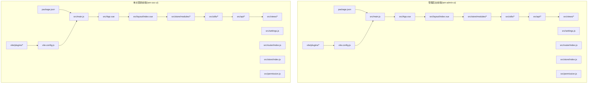
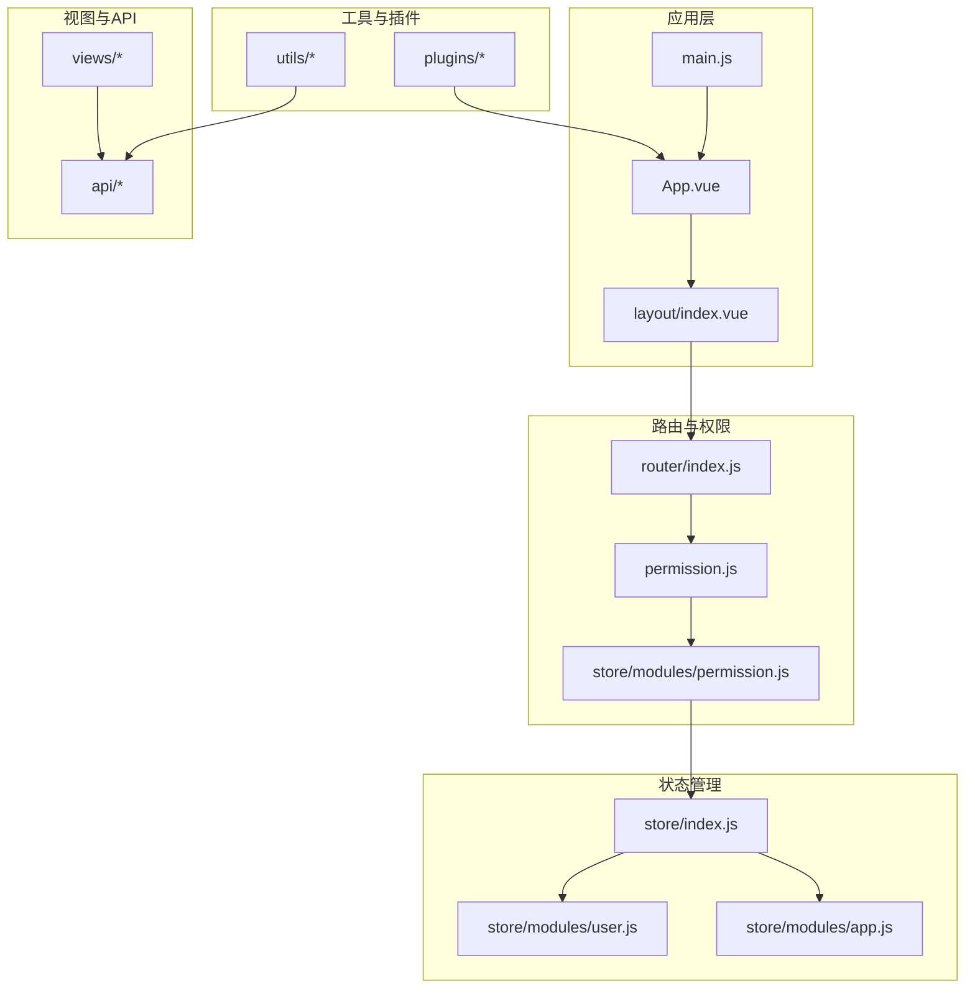
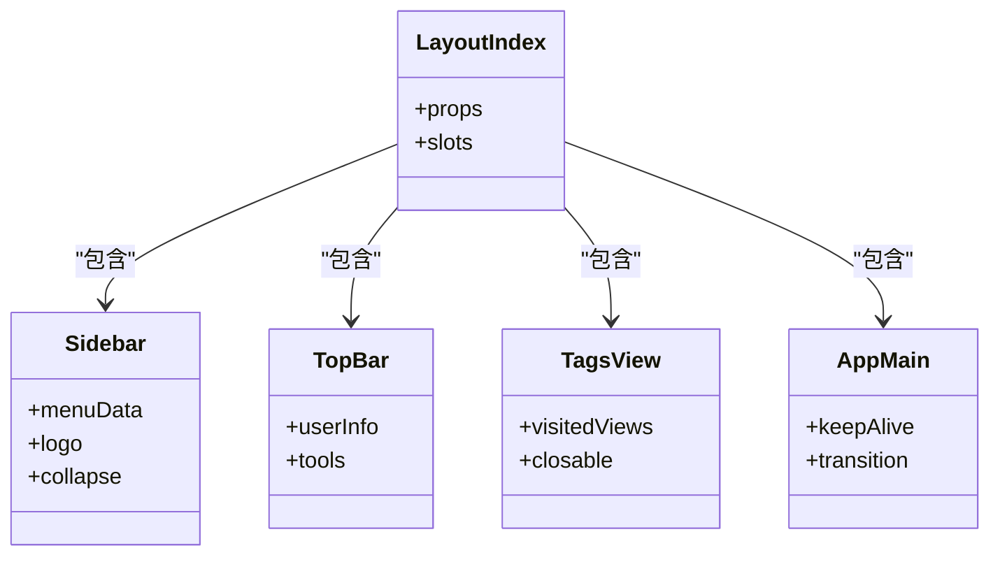
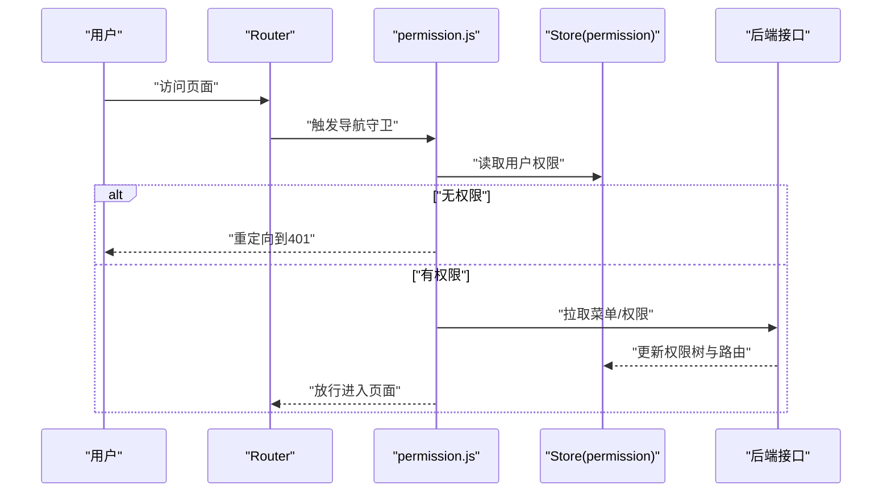
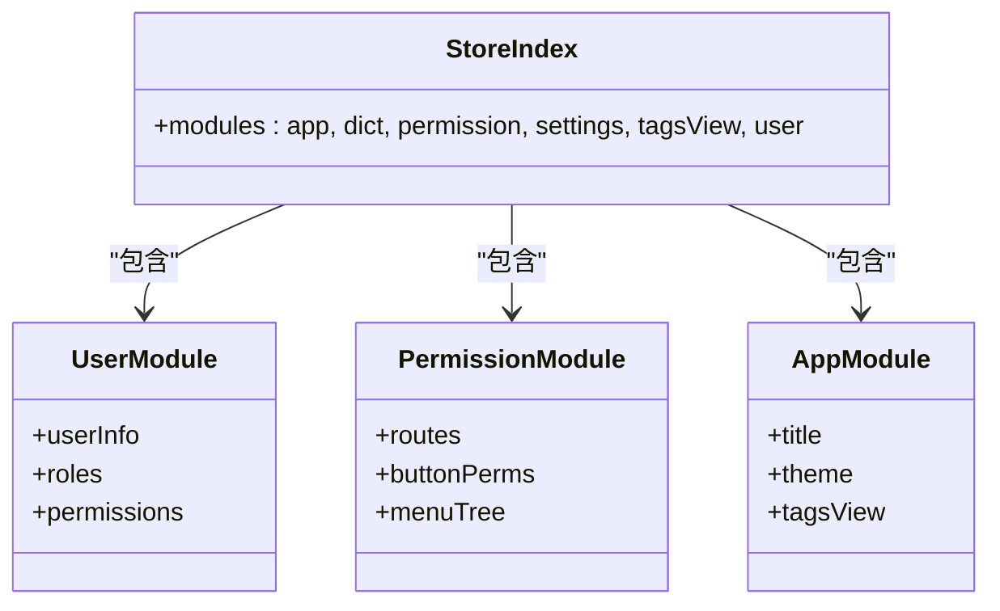
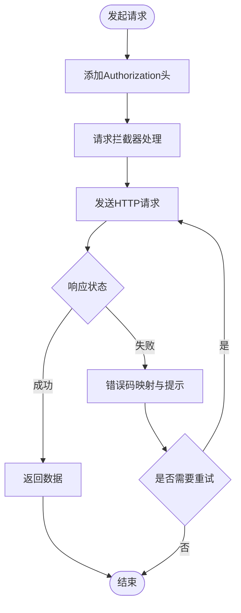
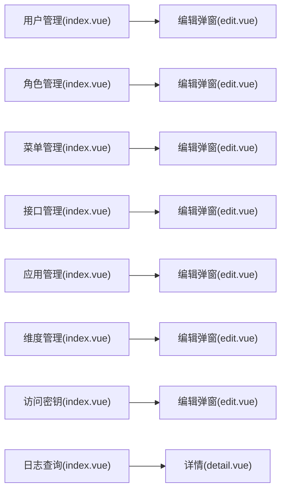
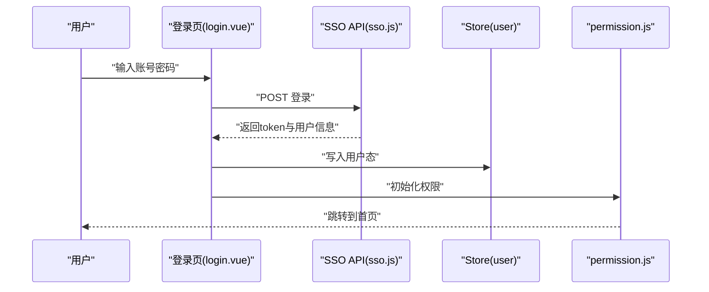
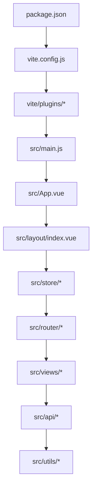

# 前端UI模块

<cite>
**本文档引用的文件**
- [iam-admin-ui/package.json](file://iam-admin-ui/package.json)
- [iam-admin-ui/vite.config.js](file://iam-admin-ui/vite.config.js)
- [iam-admin-ui/src/main.js](file://iam-admin-ui/src/main.js)
- [iam-admin-ui/src/App.vue](file://iam-admin-ui/src/App.vue)
- [iam-admin-ui/src/settings.js](file://iam-admin-ui/src/settings.js)
- [iam-admin-ui/src/router/index.js](file://iam-admin-ui/src/router/index.js)
- [iam-admin-ui/src/store/index.js](file://iam-admin-ui/src/store/index.js)
- [iam-admin-ui/src/permission.js](file://iam-admin-ui/src/permission.js)
- [iam-admin-ui/src/layout/index.vue](file://iam-admin-ui/src/layout/index.vue)
- [iam-admin-ui/src/layout/components/Sidebar/index.vue](file://iam-admin-ui/src/layout/components/Sidebar/index.vue)
- [iam-admin-ui/src/layout/components/TopBar/index.vue](file://iam-admin-ui/src/layout/components/TopBar/index.vue)
- [iam-admin-ui/src/layout/components/TagsView/index.vue](file://iam-admin-ui/src/layout/components/TagsView/index.vue)
- [iam-admin-ui/src/layout/components/AppMain.vue](file://iam-admin-ui/src/layout/components/AppMain.vue)
- [iam-admin-ui/src/store/modules/user.js](file://iam-admin-ui/src/store/modules/user.js)
- [iam-admin-ui/src/store/modules/permission.js](file://iam-admin-ui/src/store/modules/permission.js)
- [iam-admin-ui/src/store/modules/app.js](file://iam-admin-ui/src/store/modules/app.js)
- [iam-admin-ui/src/utils/request.js](file://iam-admin-ui/src/utils/request.js)
- [iam-admin-ui/src/utils/auth.js](file://iam-admin-ui/src/utils/auth.js)
- [iam-admin-ui/src/utils/dict.js](file://iam-admin-ui/src/utils/dict.js)
- [iam-admin-ui/src/utils/permission.js](file://iam-admin-ui/src/utils/permission.js)
- [iam-admin-ui/src/plugins/auth.js](file://iam-admin-ui/src/plugins/auth.js)
- [iam-admin-ui/src/plugins/cache.js](file://iam-admin-ui/src/plugins/cache.js)
- [iam-admin-ui/src/plugins/modal.js](file://iam-admin-ui/src/plugins/modal.js)
- [iam-admin-ui/src/views/system/user/index.vue](file://iam-admin-ui/src/views/system/user/index.vue)
- [iam-admin-ui/src/views/system/user/components/edit.vue](file://iam-admin-ui/src/views/system/user/components/edit.vue)
- [iam-admin-ui/src/views/system/role/index.vue](file://iam-admin-ui/src/views/system/role/index.vue)
- [iam-admin-ui/src/views/system/menu/index.vue](file://iam-admin-ui/src/views/system/menu/index.vue)
- [iam-admin-ui/src/views/system/api/index.vue](file://iam-admin-ui/src/views/system/api/index.vue)
- [iam-admin-ui/src/views/system/app/index.vue](file://iam-admin-ui/src/views/system/app/index.vue)
- [iam-admin-ui/src/views/system/dimension/index.vue](file://iam-admin-ui/src/views/system/dimension/index.vue)
- [iam-admin-ui/src/views/system/ak/index.vue](file://iam-admin-ui/src/views/system/ak/index.vue)
- [iam-admin-ui/src/views/log/login/index.vue](file://iam-admin-ui/src/views/log/login/index.vue)
- [iam-admin-ui/src/views/log/request/index.vue](file://iam-admin-ui/src/views/log/request/index.vue)
- [iam-admin-ui/src/api/user/user.js](file://iam-admin-ui/src/api/user/user.js)
- [iam-admin-ui/src/api/user/role.js](file://iam-admin-ui/src/api/user/role.js)
- [iam-admin-ui/src/api/system/menu.js](file://iam-admin-ui/src/api/system/menu.js)
- [iam-admin-ui/src/api/system/api.js](file://iam-admin-ui/src/api/system/api.js)
- [iam-admin-ui/src/api/system/app.js](file://iam-admin-ui/src/api/system/app.js)
- [iam-admin-ui/src/api/system/dim.js](file://iam-admin-ui/src/api/system/dim.js)
- [iam-admin-ui/src/api/system/ak.js](file://iam-admin-ui/src/api/system/ak.js)
- [iam-admin-ui/src/api/log/loginlog.js](file://iam-admin-ui/src/api/log/loginlog.js)
- [iam-admin-ui/src/api/log/requestlog.js](file://iam-admin-ui/src/api/log/requestlog.js)
- [iam-admin-ui/src/assets/styles/index.scss](file://iam-admin-ui/src/assets/styles/index.scss)
- [iam-admin-ui/src/assets/styles/custom.scss](file://iam-admin-ui/src/assets/styles/custom.scss)
- [iam-admin-ui/src/assets/styles/element-ui.scss](file://iam-admin-ui/src/assets/styles/element-ui.scss)
- [iam-admin-ui/src/assets/styles/variables.module.scss](file://iam-admin-ui/src/assets/styles/variables.module.scss)
- [iam-admin-ui/vite/plugins/auto-import.js](file://iam-admin-ui/vite/plugins/auto-import.js)
- [iam-admin-ui/vite/plugins/svg-icon.js](file://iam-admin-ui/vite/plugins/svg-icon.js)
- [iam-admin-ui/Dockerfile](file://iam-admin-ui/Dockerfile)
- [iam-admin-ui/deploy-uat.yaml](file://iam-admin-ui/deploy-uat.yaml)
- [iam-sso-ui/package.json](file://iam-sso-ui/package.json)
- [iam-sso-ui/vite.config.js](file://iam-sso-ui/vite.config.js)
- [iam-sso-ui/src/main.js](file://iam-sso-ui/src/main.js)
- [iam-sso-ui/src/App.vue](file://iam-sso-ui/src/App.vue)
- [iam-sso-ui/src/settings.js](file://iam-sso-ui/src/settings.js)
- [iam-sso-ui/src/router/index.js](file://iam-sso-ui/src/router/index.js)
- [iam-sso-ui/src/store/index.js](file://iam-sso-ui/src/store/index.js)
- [iam-sso-ui/src/permission.js](file://iam-sso-ui/src/permission.js)
- [iam-sso-ui/src/layout/index.vue](file://iam-sso-ui/src/layout/index.vue)
- [iam-sso-ui/src/layout/components/Sidebar/index.vue](file://iam-sso-ui/src/layout/components/Sidebar/index.vue)
- [iam-sso-ui/src/layout/components/TopBar/index.vue](file://iam-sso-ui/src/layout/components/TopBar/index.vue)
- [iam-sso-ui/src/layout/components/TagsView/index.vue](file://iam-sso-ui/src/layout/components/TagsView/index.vue)
- [iam-sso-ui/src/layout/components/AppMain.vue](file://iam-sso-ui/src/layout/components/AppMain.vue)
- [iam-sso-ui/src/store/modules/user.js](file://iam-sso-ui/src/store/modules/user.js)
- [iam-sso-ui/src/store/modules/permission.js](file://iam-sso-ui/src/store/modules/permission.js)
- [iam-sso-ui/src/store/modules/app.js](file://iam-sso-ui/src/store/modules/app.js)
- [iam-sso-ui/src/utils/request.js](file://iam-sso-ui/src/utils/request.js)
- [iam-sso-ui/src/utils/auth.js](file://iam-sso-ui/src/utils/auth.js)
- [iam-sso-ui/src/utils/dict.js](file://iam-sso-ui/src/utils/dict.js)
- [iam-sso-ui/src/utils/permission.js](file://iam-sso-ui/src/utils/permission.js)
- [iam-sso-ui/src/plugins/auth.js](file://iam-sso-ui/src/plugins/auth.js)
- [iam-sso-ui/src/plugins/cache.js](file://iam-sso-ui/src/plugins/cache.js)
- [iam-sso-ui/src/plugins/modal.js](file://iam-sso-ui/src/plugins/modal.js)
- [iam-sso-ui/src/views/login.vue](file://iam-sso-ui/src/views/login.vue)
- [iam-sso-ui/src/views/register.vue](file://iam-sso-ui/src/views/register.vue)
- [iam-sso-ui/src/views/dashboard/index.vue](file://iam-sso-ui/src/views/dashboard/index.vue)
- [iam-sso-ui/src/views/portal/index.vue](file://iam-sso-ui/src/views/portal/index.vue)
- [iam-sso-ui/src/api/sso.js](file://iam-sso-ui/src/api/sso.js)
- [iam-sso-ui/src/api/user.js](file://iam-sso-ui/src/api/user.js)
- [iam-sso-ui/src/assets/styles/index.scss](file://iam-sso-ui/src/assets/styles/index.scss)
- [iam-sso-ui/src/assets/styles/custom.scss](file://iam-sso-ui/src/assets/styles/custom.scss)
- [iam-sso-ui/src/assets/styles/element-ui.scss](file://iam-sso-ui/src/assets/styles/element-ui.scss)
- [iam-sso-ui/src/assets/styles/variables.module.scss](file://iam-sso-ui/src/assets/styles/variables.module.scss)
- [iam-sso-ui/vite/plugins/auto-import.js](file://iam-sso-ui/vite/plugins/auto-import.js)
- [iam-sso-ui/vite/plugins/svg-icon.js](file://iam-sso-ui/vite/plugins/svg-icon.js)
- [iam-sso-ui/Dockerfile](file://iam-sso-ui/Dockerfile)
- [iam-sso-ui/deploy-uat.yaml](file://iam-sso-ui/deploy-uat.yaml)
</cite>

## 目录
1. [简介](#简介)
2. [项目结构](#项目结构)
3. [核心组件](#核心组件)
4. [架构总览](#架构总览)
5. [详细组件分析](#详细组件分析)
6. [依赖关系分析](#依赖关系分析)
7. [性能考虑](#性能考虑)
8. [故障排查指南](#故障排查指南)
9. [结论](#结论)
10. [附录](#附录)

## 简介
本文件为 IAM 系统前端 UI 模块的详细技术文档，覆盖两个前端应用：管理后台前端（iam-admin-ui）与单点登录前端（iam-sso-ui）。内容包括系统架构、项目结构、组件与布局、状态管理、路由配置、构建与部署策略、样式与组件开发规范、性能优化与最佳实践等。文档旨在帮助开发者快速理解并高效维护该前端体系。

## 项目结构
前端采用 Vite + Vue 3 + Element Plus 技术栈，分别在两个独立目录下运行：
- 管理后台前端：iam-admin-ui
- 单点登录前端：iam-sso-ui

两套前端共享相似的目录组织方式：src 下包含 api、assets、components、directive、layout、plugins、router、store、utils、views 等模块化结构；通过 Vite 插件扩展自动导入、SVG 图标、压缩等能力；Dockerfile 和 deploy-uat.yaml 支持容器化与 UAT 部署。

图表来源
- [iam-admin-ui/package.json](file://iam-admin-ui/package.json)
- [iam-admin-ui/vite.config.js](file://iam-admin-ui/vite.config.js)
- [iam-admin-ui/src/main.js](file://iam-admin-ui/src/main.js)
- [iam-admin-ui/src/App.vue](file://iam-admin-ui/src/App.vue)
- [iam-admin-ui/src/layout/index.vue](file://iam-admin-ui/src/layout/index.vue)
- [iam-admin-ui/src/store/index.js](file://iam-admin-ui/src/store/index.js)
- [iam-admin-ui/src/utils/request.js](file://iam-admin-ui/src/utils/request.js)
- [iam-admin-ui/src/api/user/user.js](file://iam-admin-ui/src/api/user/user.js)
- [iam-admin-ui/src/views/system/user/index.vue](file://iam-admin-ui/src/views/system/user/index.vue)
- [iam-sso-ui/package.json](file://iam-sso-ui/package.json)
- [iam-sso-ui/vite.config.js](file://iam-sso-ui/vite.config.js)
- [iam-sso-ui/src/main.js](file://iam-sso-ui/src/main.js)
- [iam-sso-ui/src/App.vue](file://iam-sso-ui/src/App.vue)
- [iam-sso-ui/src/layout/index.vue](file://iam-sso-ui/src/layout/index.vue)
- [iam-sso-ui/src/store/index.js](file://iam-sso-ui/src/store/index.js)
- [iam-sso-ui/src/utils/request.js](file://iam-sso-ui/src/utils/request.js)
- [iam-sso-ui/src/api/sso.js](file://iam-sso-ui/src/api/sso.js)
- [iam-sso-ui/src/views/login.vue](file://iam-sso-ui/src/views/login.vue)

章节来源
- [iam-admin-ui/package.json](file://iam-admin-ui/package.json)
- [iam-admin-ui/vite.config.js](file://iam-admin-ui/vite.config.js)
- [iam-sso-ui/package.json](file://iam-sso-ui/package.json)
- [iam-sso-ui/vite.config.js](file://iam-sso-ui/vite.config.js)

## 核心组件
- 应用入口与设置
  - 应用入口：各前端均以 main.js 初始化 Vue 应用、挂载根组件 App.vue，并加载全局设置 settings.js。
  - 全局设置：settings.js 统一管理主题、标题、权限、标签页等全局行为。
- 布局系统
  - layout/index.vue 提供统一布局骨架，包含侧边栏 Sidebar、顶部导航 TopBar、标签页 TagsView、主内容区 AppMain。
  - 侧边栏支持菜单渲染、Logo、链接跳转等；顶部导航包含用户信息、全屏、尺寸切换等控件。
- 路由与权限
  - router/index.js 定义路由表；permission.js 实现访问守卫，结合 store/modules/permission.js 动态注入路由与权限控制。
- 状态管理
  - store/index.js 创建 Vuex Store，modules 下包含 app、dict、permission、settings、tagsView、user 等模块，分别负责应用状态、字典、权限、界面设置、标签页、用户会话等。
- 工具与插件
  - utils/* 提供请求封装、认证、权限判断、加密、滚动、校验等通用能力。
  - plugins/* 提供权限指令、缓存、模态框、下载等插件能力。
- API 层
  - api/* 将后端接口按业务域分层（如 system、user、log），便于调用与维护。
- 视图与组件
  - views/* 包含页面级视图，如系统管理、日志查询、仪表盘等。
  - components/* 提供可复用的业务组件，如分页、编辑器、图标选择、上传等。

章节来源
- [iam-admin-ui/src/main.js](file://iam-admin-ui/src/main.js)
- [iam-admin-ui/src/App.vue](file://iam-admin-ui/src/App.vue)
- [iam-admin-ui/src/settings.js](file://iam-admin-ui/src/settings.js)
- [iam-admin-ui/src/layout/index.vue](file://iam-admin-ui/src/layout/index.vue)
- [iam-admin-ui/src/layout/components/Sidebar/index.vue](file://iam-admin-ui/src/layout/components/Sidebar/index.vue)
- [iam-admin-ui/src/layout/components/TopBar/index.vue](file://iam-admin-ui/src/layout/components/TopBar/index.vue)
- [iam-admin-ui/src/layout/components/TagsView/index.vue](file://iam-admin-ui/src/layout/components/TagsView/index.vue)
- [iam-admin-ui/src/layout/components/AppMain.vue](file://iam-admin-ui/src/layout/components/AppMain.vue)
- [iam-admin-ui/src/router/index.js](file://iam-admin-ui/src/router/index.js)
- [iam-admin-ui/src/permission.js](file://iam-admin-ui/src/permission.js)
- [iam-admin-ui/src/store/index.js](file://iam-admin-ui/src/store/index.js)
- [iam-admin-ui/src/store/modules/user.js](file://iam-admin-ui/src/store/modules/user.js)
- [iam-admin-ui/src/store/modules/permission.js](file://iam-admin-ui/src/store/modules/permission.js)
- [iam-admin-ui/src/store/modules/app.js](file://iam-admin-ui/src/store/modules/app.js)
- [iam-admin-ui/src/utils/request.js](file://iam-admin-ui/src/utils/request.js)
- [iam-admin-ui/src/utils/auth.js](file://iam-admin-ui/src/utils/auth.js)
- [iam-admin-ui/src/utils/permission.js](file://iam-admin-ui/src/utils/permission.js)
- [iam-admin-ui/src/plugins/auth.js](file://iam-admin-ui/src/plugins/auth.js)
- [iam-admin-ui/src/plugins/cache.js](file://iam-admin-ui/src/plugins/cache.js)
- [iam-admin-ui/src/plugins/modal.js](file://iam-admin-ui/src/plugins/modal.js)
- [iam-admin-ui/src/api/user/user.js](file://iam-admin-ui/src/api/user/user.js)
- [iam-admin-ui/src/api/system/menu.js](file://iam-admin-ui/src/api/system/menu.js)
- [iam-admin-ui/src/views/system/user/index.vue](file://iam-admin-ui/src/views/system/user/index.vue)

## 架构总览
前端采用“布局 + 路由 + 状态 + 插件 + 工具 + API”的分层架构，围绕用户会话与权限控制展开，通过动态路由与权限模块实现菜单与页面的细粒度控制。

图表来源
- [iam-admin-ui/src/main.js](file://iam-admin-ui/src/main.js)
- [iam-admin-ui/src/App.vue](file://iam-admin-ui/src/App.vue)
- [iam-admin-ui/src/layout/index.vue](file://iam-admin-ui/src/layout/index.vue)
- [iam-admin-ui/src/router/index.js](file://iam-admin-ui/src/router/index.js)
- [iam-admin-ui/src/permission.js](file://iam-admin-ui/src/permission.js)
- [iam-admin-ui/src/store/index.js](file://iam-admin-ui/src/store/index.js)
- [iam-admin-ui/src/store/modules/permission.js](file://iam-admin-ui/src/store/modules/permission.js)
- [iam-admin-ui/src/store/modules/user.js](file://iam-admin-ui/src/store/modules/user.js)
- [iam-admin-ui/src/store/modules/app.js](file://iam-admin-ui/src/store/modules/app.js)
- [iam-admin-ui/src/utils/request.js](file://iam-admin-ui/src/utils/request.js)
- [iam-admin-ui/src/plugins/auth.js](file://iam-admin-ui/src/plugins/auth.js)
- [iam-admin-ui/src/api/user/user.js](file://iam-admin-ui/src/api/user/user.js)
- [iam-admin-ui/src/views/system/user/index.vue](file://iam-admin-ui/src/views/system/user/index.vue)

## 详细组件分析

### 布局系统（Layout）
- 侧边栏（Sidebar）：根据菜单数据渲染，支持多级菜单、Logo、外链跳转、折叠切换。
- 顶部导航（TopBar）：集成用户信息、全屏、尺寸选择、设置等常用操作。
- 标签页（TagsView）：记录访问历史，支持关闭、刷新、关闭其他、关闭全部。
- 主内容区（AppMain）：承载路由视图，配合过渡动画与 keep-alive。

图表来源
- [iam-admin-ui/src/layout/index.vue](file://iam-admin-ui/src/layout/index.vue)
- [iam-admin-ui/src/layout/components/Sidebar/index.vue](file://iam-admin-ui/src/layout/components/Sidebar/index.vue)
- [iam-admin-ui/src/layout/components/TopBar/index.vue](file://iam-admin-ui/src/layout/components/TopBar/index.vue)
- [iam-admin-ui/src/layout/components/TagsView/index.vue](file://iam-admin-ui/src/layout/components/TagsView/index.vue)
- [iam-admin-ui/src/layout/components/AppMain.vue](file://iam-admin-ui/src/layout/components/AppMain.vue)

章节来源
- [iam-admin-ui/src/layout/index.vue](file://iam-admin-ui/src/layout/index.vue)
- [iam-admin-ui/src/layout/components/Sidebar/index.vue](file://iam-admin-ui/src/layout/components/Sidebar/index.vue)
- [iam-admin-ui/src/layout/components/TopBar/index.vue](file://iam-admin-ui/src/layout/components/TopBar/index.vue)
- [iam-admin-ui/src/layout/components/TagsView/index.vue](file://iam-admin-ui/src/layout/components/TagsView/index.vue)
- [iam-admin-ui/src/layout/components/AppMain.vue](file://iam-admin-ui/src/layout/components/AppMain.vue)

### 权限与路由（Permission & Router）
- 路由定义：router/index.js 组织页面路由，结合 meta 字段声明权限标识与显示属性。
- 访问守卫：permission.js 在导航前进行登录态与权限校验，未授权重定向至 401 页面。
- 动态权限：store/modules/permission.js 根据用户角色动态生成可访问菜单与路由，避免前端硬编码。

图表来源
- [iam-admin-ui/src/router/index.js](file://iam-admin-ui/src/router/index.js)
- [iam-admin-ui/src/permission.js](file://iam-admin-ui/src/permission.js)
- [iam-admin-ui/src/store/modules/permission.js](file://iam-admin-ui/src/store/modules/permission.js)

章节来源
- [iam-admin-ui/src/router/index.js](file://iam-admin-ui/src/router/index.js)
- [iam-admin-ui/src/permission.js](file://iam-admin-ui/src/permission.js)
- [iam-admin-ui/src/store/modules/permission.js](file://iam-admin-ui/src/store/modules/permission.js)

### 状态管理（Vuex Modules）
- user.js：存储用户信息、登录态、头像、角色等。
- permission.js：存储菜单树、按钮权限、动态路由集合。
- app.js：应用级配置（语言、主题、布局模式、多标签页开关等）。
- settings.js：全局设置项（标题、面包屑、标签页默认行为等）。
- tagsView.js：当前打开的标签页列表与操作。

图表来源
- [iam-admin-ui/src/store/index.js](file://iam-admin-ui/src/store/index.js)
- [iam-admin-ui/src/store/modules/user.js](file://iam-admin-ui/src/store/modules/user.js)
- [iam-admin-ui/src/store/modules/permission.js](file://iam-admin-ui/src/store/modules/permission.js)
- [iam-admin-ui/src/store/modules/app.js](file://iam-admin-ui/src/store/modules/app.js)

章节来源
- [iam-admin-ui/src/store/index.js](file://iam-admin-ui/src/store/index.js)
- [iam-admin-ui/src/store/modules/user.js](file://iam-admin-ui/src/store/modules/user.js)
- [iam-admin-ui/src/store/modules/permission.js](file://iam-admin-ui/src/store/modules/permission.js)
- [iam-admin-ui/src/store/modules/app.js](file://iam-admin-ui/src/store/modules/app.js)

### 请求与认证（Utils）
- request.js：基于 axios 的请求封装，内置拦截器处理 token 注入、错误码映射、重复请求去重等。
- auth.js：登录态与本地存储管理（token、用户信息、过期时间）。
- permission.js：基于 store 中的权限集合判断按钮级权限。
- errorCode.js：统一错误码映射与提示。
- validate.js：常用校验规则（手机号、邮箱、身份证等）。

图表来源
- [iam-admin-ui/src/utils/request.js](file://iam-admin-ui/src/utils/request.js)
- [iam-admin-ui/src/utils/auth.js](file://iam-admin-ui/src/utils/auth.js)
- [iam-admin-ui/src/utils/permission.js](file://iam-admin-ui/src/utils/permission.js)
- [iam-admin-ui/src/utils/errorCode.js](file://iam-admin-ui/src/utils/errorCode.js)

章节来源
- [iam-admin-ui/src/utils/request.js](file://iam-admin-ui/src/utils/request.js)
- [iam-admin-ui/src/utils/auth.js](file://iam-admin-ui/src/utils/auth.js)
- [iam-admin-ui/src/utils/permission.js](file://iam-admin-ui/src/utils/permission.js)
- [iam-admin-ui/src/utils/errorCode.js](file://iam-admin-ui/src/utils/errorCode.js)

### 系统管理页面（管理后台）
- 用户管理：用户列表、新增/编辑、重置密码、角色分配。
- 角色管理：角色列表、菜单授权、数据维度授权。
- 菜单管理：菜单树展示与编辑。
- 接口管理：接口白名单与绑定。
- 应用管理：应用信息与密钥管理。
- 数据维度：数据范围维度配置。
- 访问密钥：AK/AK-API 绑定与管理。
- 日志查询：登录日志、请求日志详情。

图表来源
- [iam-admin-ui/src/views/system/user/index.vue](file://iam-admin-ui/src/views/system/user/index.vue)
- [iam-admin-ui/src/views/system/user/components/edit.vue](file://iam-admin-ui/src/views/system/user/components/edit.vue)
- [iam-admin-ui/src/views/system/role/index.vue](file://iam-admin-ui/src/views/system/role/index.vue)
- [iam-admin-ui/src/views/system/menu/index.vue](file://iam-admin-ui/src/views/system/menu/index.vue)
- [iam-admin-ui/src/views/system/api/index.vue](file://iam-admin-ui/src/views/system/api/index.vue)
- [iam-admin-ui/src/views/system/app/index.vue](file://iam-admin-ui/src/views/system/app/index.vue)
- [iam-admin-ui/src/views/system/dimension/index.vue](file://iam-admin-ui/src/views/system/dimension/index.vue)
- [iam-admin-ui/src/views/system/ak/index.vue](file://iam-admin-ui/src/views/system/ak/index.vue)
- [iam-admin-ui/src/views/log/login/index.vue](file://iam-admin-ui/src/views/log/login/index.vue)
- [iam-admin-ui/src/views/log/request/index.vue](file://iam-admin-ui/src/views/log/request/index.vue)

章节来源
- [iam-admin-ui/src/views/system/user/index.vue](file://iam-admin-ui/src/views/system/user/index.vue)
- [iam-admin-ui/src/views/system/user/components/edit.vue](file://iam-admin-ui/src/views/system/user/components/edit.vue)
- [iam-admin-ui/src/views/system/role/index.vue](file://iam-admin-ui/src/views/system/role/index.vue)
- [iam-admin-ui/src/views/system/menu/index.vue](file://iam-admin-ui/src/views/system/menu/index.vue)
- [iam-admin-ui/src/views/system/api/index.vue](file://iam-admin-ui/src/views/system/api/index.vue)
- [iam-admin-ui/src/views/system/app/index.vue](file://iam-admin-ui/src/views/system/app/index.vue)
- [iam-admin-ui/src/views/system/dimension/index.vue](file://iam-admin-ui/src/views/system/dimension/index.vue)
- [iam-admin-ui/src/views/system/ak/index.vue](file://iam-admin-ui/src/views/system/ak/index.vue)
- [iam-admin-ui/src/views/log/login/index.vue](file://iam-admin-ui/src/views/log/login/index.vue)
- [iam-admin-ui/src/views/log/request/index.vue](file://iam-admin-ui/src/views/log/request/index.vue)

### 单点登录页面（SSO 前端）
- 登录页：用户名/密码登录，集成验证码与记住我。
- 注册页：用户注册流程。
- 仪表盘：概览统计与快捷入口。
- 门户页：公告、统计、待办事项等聚合视图。
- 个人中心：资料修改、头像上传、密码修改、操作日志、登录记录等。

图表来源
- [iam-sso-ui/src/views/login.vue](file://iam-sso-ui/src/views/login.vue)
- [iam-sso-ui/src/api/sso.js](file://iam-sso-ui/src/api/sso.js)
- [iam-sso-ui/src/store/modules/user.js](file://iam-sso-ui/src/store/modules/user.js)
- [iam-sso-ui/src/permission.js](file://iam-sso-ui/src/permission.js)

章节来源
- [iam-sso-ui/src/views/login.vue](file://iam-sso-ui/src/views/login.vue)
- [iam-sso-ui/src/views/register.vue](file://iam-sso-ui/src/views/register.vue)
- [iam-sso-ui/src/views/dashboard/index.vue](file://iam-sso-ui/src/views/dashboard/index.vue)
- [iam-sso-ui/src/views/portal/index.vue](file://iam-sso-ui/src/views/portal/index.vue)
- [iam-sso-ui/src/api/sso.js](file://iam-sso-ui/src/api/sso.js)

## 依赖关系分析
- 依赖管理：package.json 统一声明依赖与脚本命令（dev/build/preview）。
- 构建配置：vite.config.js 配置别名、插件、代理、构建输出等。
- 插件生态：auto-import 自动导入常用 API/组件；svg-icon 统一引入 SVG；compression 生产压缩。
- 样式体系：SCSS 变量、混入、主题样式与 Element Plus 样式覆盖。
- 运行时：main.js 初始化应用，App.vue 作为根组件，layout 提供统一布局。

图表来源
- [iam-admin-ui/package.json](file://iam-admin-ui/package.json)
- [iam-admin-ui/vite.config.js](file://iam-admin-ui/vite.config.js)
- [iam-admin-ui/vite/plugins/auto-import.js](file://iam-admin-ui/vite/plugins/auto-import.js)
- [iam-admin-ui/vite/plugins/svg-icon.js](file://iam-admin-ui/vite/plugins/svg-icon.js)
- [iam-admin-ui/src/main.js](file://iam-admin-ui/src/main.js)
- [iam-admin-ui/src/App.vue](file://iam-admin-ui/src/App.vue)
- [iam-admin-ui/src/layout/index.vue](file://iam-admin-ui/src/layout/index.vue)
- [iam-admin-ui/src/store/index.js](file://iam-admin-ui/src/store/index.js)
- [iam-admin-ui/src/router/index.js](file://iam-admin-ui/src/router/index.js)
- [iam-admin-ui/src/views/system/user/index.vue](file://iam-admin-ui/src/views/system/user/index.vue)
- [iam-admin-ui/src/api/user/user.js](file://iam-admin-ui/src/api/user/user.js)
- [iam-admin-ui/src/utils/request.js](file://iam-admin-ui/src/utils/request.js)

章节来源
- [iam-admin-ui/package.json](file://iam-admin-ui/package.json)
- [iam-admin-ui/vite.config.js](file://iam-admin-ui/vite.config.js)
- [iam-sso-ui/package.json](file://iam-sso-ui/package.json)
- [iam-sso-ui/vite.config.js](file://iam-sso-ui/vite.config.js)

## 性能考虑
- 代码分割与懒加载：路由按需加载页面组件，减少首屏体积。
- 组件懒加载：常用组件通过动态 import 实现按需加载。
- 缓存策略：plugins/cache.js 提供本地缓存与会话缓存，utils/scroll-to.js 优化滚动体验。
- 样式按需：Element Plus 按需引入，避免全局样式污染。
- 构建优化：vite.plugins/compression.js 生产环境启用 gzip 压缩；auto-import 减少重复导入。
- 图标管理：svg-icon 统一引入，避免内联 SVG 导致的体积膨胀。
- 大列表优化：表格组件结合虚拟滚动与分页，降低 DOM 压力。
- 网络优化：request.js 合并重复请求、统一错误处理与超时控制。

## 故障排查指南
- 登录失败或 401
  - 检查 token 是否正确注入与过期；确认后端 JWT 签发与校验逻辑。
  - 查看 permission.js 守卫逻辑与路由 meta 权限标识。
- 权限不足
  - 核对 store/modules/permission.js 中的按钮权限与菜单树生成。
  - 使用 utils/permission.js 判断当前用户是否具备某按钮权限。
- 接口异常
  - 检查 utils/errorCode.js 错误码映射与提示文案。
  - 确认 utils/request.js 拦截器中是否正确处理了 401/403/500 等状态。
- 样式冲突
  - 检查 assets/styles/* 是否覆盖了 Element Plus 默认样式。
  - 确认 SCSS 变量与模块化样式的作用域。
- 构建问题
  - 检查 vite.config.js 别名与插件配置；确认 package.json 中依赖版本兼容性。
- 部署问题
  - Dockerfile 与 deploy-uat.yaml 是否正确复制构建产物与 Nginx 配置。

章节来源
- [iam-admin-ui/src/permission.js](file://iam-admin-ui/src/permission.js)
- [iam-admin-ui/src/store/modules/permission.js](file://iam-admin-ui/src/store/modules/permission.js)
- [iam-admin-ui/src/utils/permission.js](file://iam-admin-ui/src/utils/permission.js)
- [iam-admin-ui/src/utils/errorCode.js](file://iam-admin-ui/src/utils/errorCode.js)
- [iam-admin-ui/src/utils/request.js](file://iam-admin-ui/src/utils/request.js)
- [iam-admin-ui/src/assets/styles/index.scss](file://iam-admin-ui/src/assets/styles/index.scss)
- [iam-admin-ui/vite.config.js](file://iam-admin-ui/vite.config.js)
- [iam-admin-ui/Dockerfile](file://iam-admin-ui/Dockerfile)
- [iam-admin-ui/deploy-uat.yaml](file://iam-admin-ui/deploy-uat.yaml)

## 结论
本前端 UI 模块通过清晰的分层架构与模块化组织，实现了管理后台与单点登录两大场景的统一开发体验。借助动态路由与权限体系、完善的工具与插件生态、以及可扩展的构建与部署方案，能够满足企业级身份认证与权限管理的复杂需求。建议在后续迭代中持续完善组件库与自动化测试，进一步提升可维护性与稳定性。

## 附录
- 开发环境设置
  - 安装依赖：npm install
  - 启动开发服务器：npm run dev
  - 预览构建：npm run preview
  - 生产构建：npm run build
- 生产部署策略
  - Dockerfile：构建镜像，暴露静态资源。
  - deploy-uat.yaml：Kubernetes/UAT 部署清单。
  - Nginx 配置：静态资源缓存、gzip 压缩、跨域与安全头。
- 最佳实践
  - 组件开发：遵循单一职责，使用 Composition API；组件命名与目录结构保持一致。
  - 样式管理：优先使用 SCSS 变量与混入；避免全局污染；主题切换通过变量驱动。
  - 状态管理：严格区分用户态与应用态；权限状态集中管理，避免分散写入。
  - 调试技巧：利用浏览器 DevTools 的 Network/Components/Timeline；结合日志与错误边界定位问题。
  - 性能优化：开启懒加载与按需引入；合理使用 keep-alive；减少不必要的响应式数据。