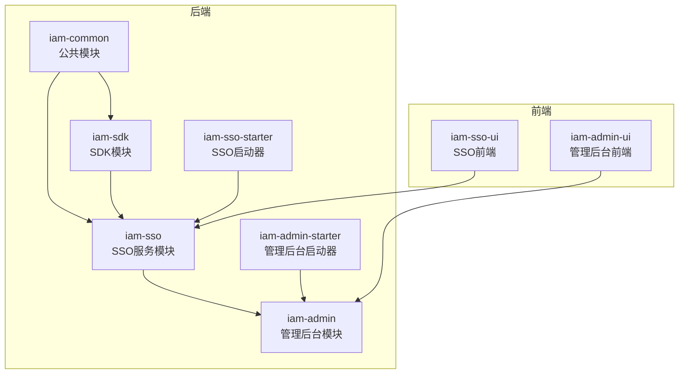
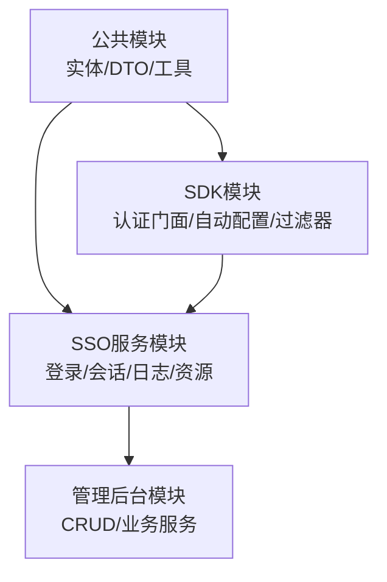
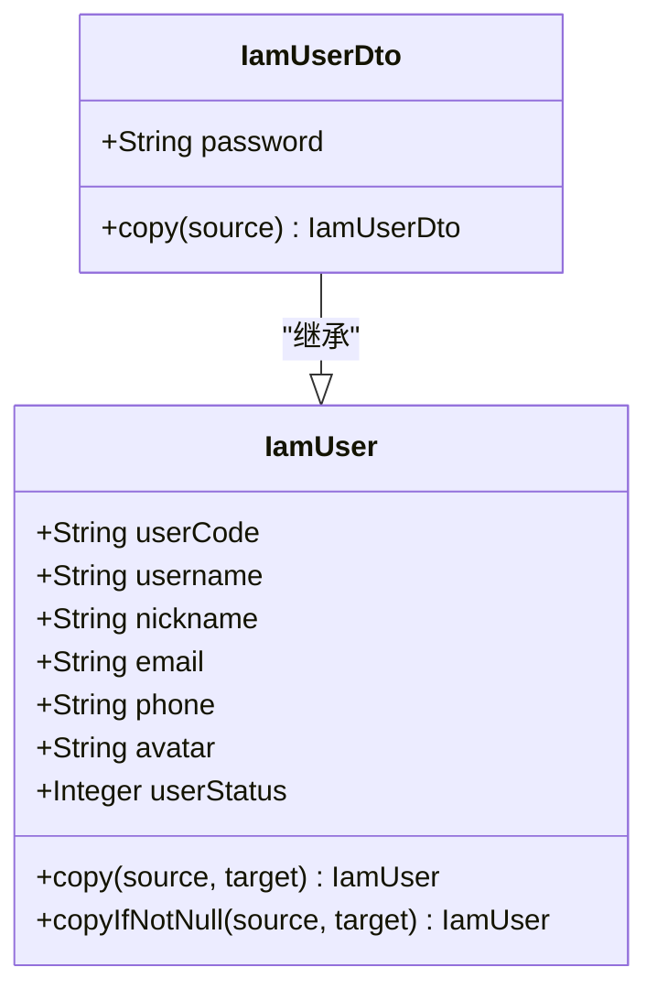
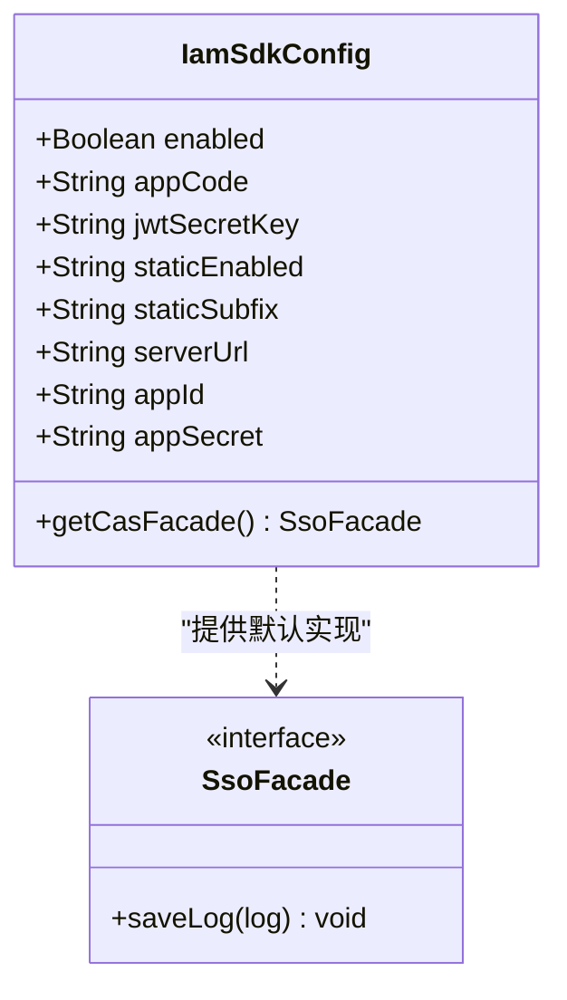
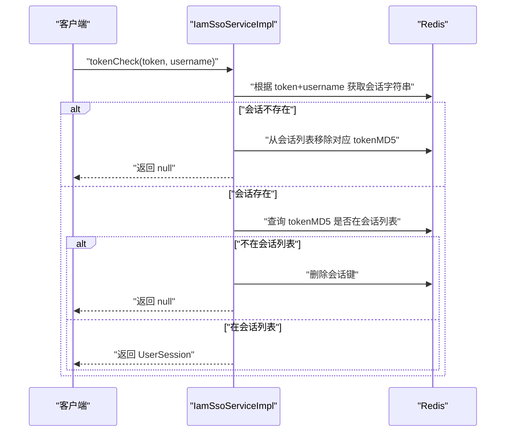
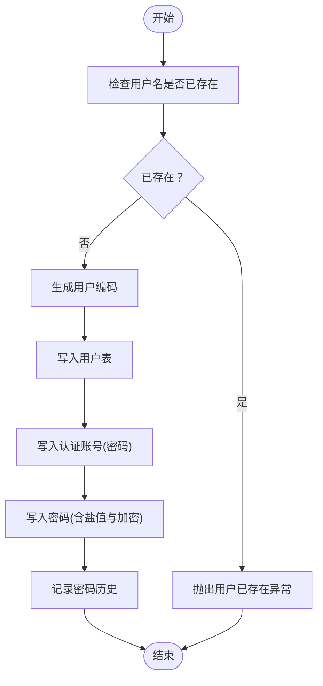
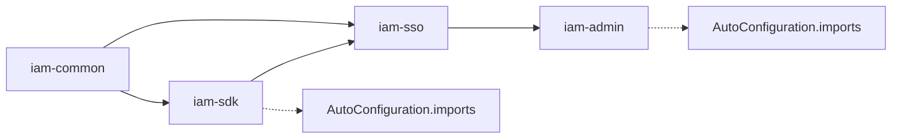

# 模块划分与职责

<cite>
**本文引用的文件**
- [pom.xml](file://iam-common/pom.xml)
- [pom.xml](file://iam-sdk/pom.xml)
- [pom.xml](file://iam-sso/pom.xml)
- [pom.xml](file://iam-admin/pom.xml)
- [pom.xml](file://iam-admin-starter/pom.xml)
- [pom.xml](file://iam-sso-starter/pom.xml)
- [IamUserDto.java](file://iam-common/src/main/java/com/wkclz/iam/common/dto/IamUserDto.java)
- [IamUser.java](file://iam-common/src/main/java/com/wkclz/iam/common/entity/IamUser.java)
- [SsoFacade.java](file://iam-sdk/src/main/java/com/wkclz/iam/sdk/facade/SsoFacade.java)
- [IamSdkConfig.java](file://iam-sdk/src/main/java/com/wkclz/iam/sdk/config/IamSdkConfig.java)
- [IamSsoConfig.java](file://iam-sso/src/main/java/com/wkclz/iam/sso/config/IamSsoConfig.java)
- [IamAdminConfig.java](file://iam-admin/src/main/java/com/wkclz/iam/admin/config/IamAdminConfig.java)
- [IamSsoServiceImpl.java](file://iam-sso/src/main/java/com/wkclz/iam/sso/service/IamSsoServiceImpl.java)
- [IamUserService.java](file://iam-admin/src/main/java/com/wkclz/iam/admin/service/IamUserService.java)
- [IamAdminApplication.java](file://iam-admin-starter/src/main/java/com/wkclz/iam/admin/starter/IamAdminApplication.java)
- [IamSsoApplication.java](file://iam-sso-starter/src/main/java/com/wkclz/iam/sso/starter/IamSsoApplication.java)
- [org.springframework.boot.autoconfigure.AutoConfiguration.imports](file://iam-admin/src/main/resources/META-INF/spring/org.springframework.boot.autoconfigure.AutoConfiguration.imports)
- [org.springframework.boot.autoconfigure.AutoConfiguration.imports](file://iam-sdk/src/main/resources/META-INF/spring/org.springframework.boot.autoconfigure.AutoConfiguration.imports)
</cite>

## 目录
1. [引言](#引言)
2. [项目结构](#项目结构)
3. [核心组件](#核心组件)
4. [架构总览](#架构总览)
5. [详细组件分析](#详细组件分析)
6. [依赖分析](#依赖分析)
7. [性能考虑](#性能考虑)
8. [故障排查指南](#故障排查指南)
9. [结论](#结论)
10. [附录](#附录)

## 引言
本文件面向 SH-IAM 系统的模块划分与职责边界，系统采用多模块分层架构，围绕公共能力（iam-common）、认证与会话（iam-sdk）、单点登录与个人中心（iam-sso）、管理后台（iam-admin）以及前后端 UI（iam-admin-ui、iam-sso-ui）进行组织。目标是明确各模块功能定位、技术栈选择、职责边界、模块间依赖关系、接口契约与数据传递机制，并总结模块化设计带来的可维护性与扩展性优势。

## 项目结构
系统采用 Maven 多模块结构，父工程统一版本与依赖管理。核心模块包括：
- 公共模块（iam-common）：提供通用实体、DTO、工具类等基础能力
- SDK 模块（iam-sdk）：提供认证门面、过滤器、会话与日志辅助能力
- SSO 服务模块（iam-sso）：提供登录、会话校验、资源与日志服务
- 管理后台模块（iam-admin）：提供用户、角色、菜单、访问密钥等管理 REST 接口与服务
- 启动器模块（iam-sso-starter、iam-admin-starter）：提供 Spring Boot 启动入口
- 前后端 UI 模块（iam-sso-ui、iam-admin-ui）：Vue 前端界面

图表来源
- [pom.xml:1-26](file://iam-common/pom.xml#L1-L26)
- [pom.xml:1-45](file://iam-sdk/pom.xml#L1-L45)
- [pom.xml:1-54](file://iam-sso/pom.xml#L1-L54)
- [pom.xml:1-42](file://iam-admin/pom.xml#L1-L42)
- [pom.xml:1-48](file://iam-sso-starter/pom.xml#L1-L48)
- [pom.xml:1-49](file://iam-admin-starter/pom.xml#L1-L49)

章节来源
- [pom.xml:1-26](file://iam-common/pom.xml#L1-L26)
- [pom.xml:1-45](file://iam-sdk/pom.xml#L1-L45)
- [pom.xml:1-54](file://iam-sso/pom.xml#L1-L54)
- [pom.xml:1-42](file://iam-admin/pom.xml#L1-L42)
- [pom.xml:1-48](file://iam-sso-starter/pom.xml#L1-L48)
- [pom.xml:1-49](file://iam-admin-starter/pom.xml#L1-L49)

## 核心组件
- 公共模块（iam-common）
  - 职责：提供通用实体（如 IamUser）、DTO（如 IamUserDto）、工具类（如 PasswordHelper、IpLocalCacheHelper），作为上层模块共享的基础能力
  - 技术栈：基于 sh-web、Spring Boot Starter 提供基础能力
  - 关键文件路径：[IamUser.java:1-108](file://iam-common/src/main/java/com/wkclz/iam/common/entity/IamUser.java#L1-L108)、[IamUserDto.java:1-34](file://iam-common/src/main/java/com/wkclz/iam/common/dto/IamUserDto.java#L1-L34)

- SDK 模块（iam-sdk）
  - 职责：提供认证门面接口（SsoFacade）、自动配置（IamSdkConfig）、过滤器链（IamAuthFilter、LoggingFilter 等）、JWT 工具（JwtUtil）、会话与验证码辅助（SessionHelper、CaptchaHelper）、响应封装（ResponseHelper）
  - 技术栈：Spring Boot AutoConfigure、Fastjson2、JWT（jjwt）
  - 关键文件路径：[SsoFacade.java:1-11](file://iam-sdk/src/main/java/com/wkclz/iam/sdk/facade/SsoFacade.java#L1-L11)、[IamSdkConfig.java:1-62](file://iam-sdk/src/main/java/com/wkclz/iam/sdk/config/IamSdkConfig.java#L1-L62)

- SSO 服务模块（iam-sso）
  - 职责：提供登录、注册、用户信息、验证码等 REST 接口；实现会话校验（tokenCheck）、请求日志、登录日志、资源服务；集成 Redis 进行会话存储与并发会话控制
  - 技术栈：MyBatis、Redis、Guava、sh-web、sh-mybatis、sh-redis、micro-dict
  - 关键文件路径：[IamSsoConfig.java:1-29](file://iam-sso/src/main/java/com/wkclz/iam/sso/config/IamSsoConfig.java#L1-L29)、[IamSsoServiceImpl.java:1-48](file://iam-sso/src/main/java/com/wkclz/iam/sso/service/IamSsoServiceImpl.java#L1-L48)

- 管理后台模块（iam-admin）
  - 职责：提供用户、角色、菜单、访问密钥、应用、数据维度等 CRUD 与业务服务；封装分页查询、密码历史与安全策略；通过 MyBatis Mapper 与 Redis 协作
  - 技术栈：sh-mybatis、sh-redis、BaseService、PageQuery
  - 关键文件路径：[IamAdminConfig.java:1-18](file://iam-admin/src/main/java/com/wkclz/iam/admin/config/IamAdminConfig.java#L1-L18)、[IamUserService.java:1-125](file://iam-admin/src/main/java/com/wkclz/iam/admin/service/IamUserService.java#L1-L125)

- 启动器模块（iam-sso-starter、iam-admin-starter）
  - 职责：提供 Spring Boot 应用入口，打包运行 SSO 或管理后台服务
  - 关键文件路径：[IamSsoApplication.java:1-16](file://iam-sso-starter/src/main/java/com/wkclz/iam/sso/starter/IamSsoApplication.java#L1-L16)、[IamAdminApplication.java:1-16](file://iam-admin-starter/src/main/java/com/wkclz/iam/admin/starter/IamAdminApplication.java#L1-L16)

章节来源
- [IamUser.java:1-108](file://iam-common/src/main/java/com/wkclz/iam/common/entity/IamUser.java#L1-L108)
- [IamUserDto.java:1-34](file://iam-common/src/main/java/com/wkclz/iam/common/dto/IamUserDto.java#L1-L34)
- [SsoFacade.java:1-11](file://iam-sdk/src/main/java/com/wkclz/iam/sdk/facade/SsoFacade.java#L1-L11)
- [IamSdkConfig.java:1-62](file://iam-sdk/src/main/java/com/wkclz/iam/sdk/config/IamSdkConfig.java#L1-L62)
- [IamSsoConfig.java:1-29](file://iam-sso/src/main/java/com/wkclz/iam/sso/config/IamSsoConfig.java#L1-L29)
- [IamSsoServiceImpl.java:1-48](file://iam-sso/src/main/java/com/wkclz/iam/sso/service/IamSsoServiceImpl.java#L1-L48)
- [IamAdminConfig.java:1-18](file://iam-admin/src/main/java/com/wkclz/iam/admin/config/IamAdminConfig.java#L1-L18)
- [IamUserService.java:1-125](file://iam-admin/src/main/java/com/wkclz/iam/admin/service/IamUserService.java#L1-L125)
- [IamSsoApplication.java:1-16](file://iam-sso-starter/src/main/java/com/wkclz/iam/sso/starter/IamSsoApplication.java#L1-L16)
- [IamAdminApplication.java:1-16](file://iam-admin-starter/src/main/java/com/wkclz/iam/admin/starter/IamAdminApplication.java#L1-L16)

## 架构总览
系统采用“公共能力 → SDK → SSO → 管理后台”的分层依赖，前端 UI 通过 REST 接口与后端交互。SSO 与管理后台均依赖公共模块提供的实体与 DTO，SDK 为 SSO 提供认证门面与自动配置能力。

图表来源
- [pom.xml:1-26](file://iam-common/pom.xml#L1-L26)
- [pom.xml:1-45](file://iam-sdk/pom.xml#L1-L45)
- [pom.xml:1-54](file://iam-sso/pom.xml#L1-L54)
- [pom.xml:1-42](file://iam-admin/pom.xml#L1-L42)

## 详细组件分析

### 公共模块（iam-common）
- 功能定位：提供跨模块共享的实体与 DTO，确保数据模型一致性
- 数据模型要点
  - IamUser：用户核心字段（用户编码、用户名、昵称、邮箱、手机、头像、状态等），提供 copy/copyIfNotNull 辅助方法
  - IamUserDto：继承 IamUser 并扩展密码字段，提供 copy 工厂方法
- 复杂度与性能
  - 实体拷贝方法时间复杂度 O(k)，k 为字段数量，开销极低
  - 建议在跨模块传输时优先使用 DTO，避免直接暴露持久化实体
- 错误处理与边界
  - DTO 与 Entity 分离，降低耦合，便于演进

图表来源
- [IamUser.java:1-108](file://iam-common/src/main/java/com/wkclz/iam/common/entity/IamUser.java#L1-L108)
- [IamUserDto.java:1-34](file://iam-common/src/main/java/com/wkclz/iam/common/dto/IamUserDto.java#L1-L34)

章节来源
- [IamUser.java:1-108](file://iam-common/src/main/java/com/wkclz/iam/common/entity/IamUser.java#L1-L108)
- [IamUserDto.java:1-34](file://iam-common/src/main/java/com/wkclz/iam/common/dto/IamUserDto.java#L1-L34)

### SDK 模块（iam-sdk）
- 功能定位：提供认证门面接口与自动配置，屏蔽具体实现细节，支持外部应用集成
- 关键接口与配置
  - SsoFacade：定义保存请求日志的契约
  - IamSdkConfig：读取开关、JWT 密钥、静态资源白名单、服务端地址、应用标识等配置项，并在缺失时提供默认实现
- 技术选型
  - 使用 Spring Boot AutoConfigure 实现条件化装配
  - JWT 依赖 jjwt，序列化使用 Fastjson2
- 适用场景
  - 作为独立 SDK 被其他微服务或前端应用集成，统一认证与日志策略

图表来源
- [SsoFacade.java:1-11](file://iam-sdk/src/main/java/com/wkclz/iam/sdk/facade/SsoFacade.java#L1-L11)
- [IamSdkConfig.java:1-62](file://iam-sdk/src/main/java/com/wkclz/iam/sdk/config/IamSdkConfig.java#L1-L62)

章节来源
- [SsoFacade.java:1-11](file://iam-sdk/src/main/java/com/wkclz/iam/sdk/facade/SsoFacade.java#L1-L11)
- [IamSdkConfig.java:1-62](file://iam-sdk/src/main/java/com/wkclz/iam/sdk/config/IamSdkConfig.java#L1-L62)

### SSO 服务模块（iam-sso）
- 功能定位：提供登录、注册、用户信息、验证码等服务；实现会话校验与并发会话控制；持久化请求与登录日志
- 会话校验流程（tokenCheck）
  - 从 Redis 读取 token 对应的用户会话
  - 若不存在则清理用户会话列表中的幽灵条目
  - 校验 token 是否仍在用户会话列表中，否则删除会话并返回空
  - 成功解析并返回 UserSession

图表来源
- [IamSsoServiceImpl.java:1-48](file://iam-sso/src/main/java/com/wkclz/iam/sso/service/IamSsoServiceImpl.java#L1-L48)

- 配置要点
  - IamSsoConfig：密码过期天数、RSA 公私钥、最大并发会话数等

章节来源
- [IamSsoServiceImpl.java:1-48](file://iam-sso/src/main/java/com/wkclz/iam/sso/service/IamSsoServiceImpl.java#L1-L48)
- [IamSsoConfig.java:1-29](file://iam-sso/src/main/java/com/wkclz/iam/sso/config/IamSsoConfig.java#L1-L29)

### 管理后台模块（iam-admin）
- 功能定位：提供用户、角色、菜单、访问密钥、应用、数据维度等管理能力；封装分页查询与安全策略（密码历史、盐值、加密）
- 关键流程（用户创建）
  - 校验用户名唯一性
  - 生成用户编码（RedisIdGenerator）
  - 写入用户表
  - 写入认证账号（AuthType.PASSWORD）
  - 写入用户密码（含盐值与加密）
  - 记录密码历史

图表来源
- [IamUserService.java:1-125](file://iam-admin/src/main/java/com/wkclz/iam/admin/service/IamUserService.java#L1-L125)

- 配置要点
  - IamAdminConfig：API 自动扫描开关与插入策略

章节来源
- [IamUserService.java:1-125](file://iam-admin/src/main/java/com/wkclz/iam/admin/service/IamUserService.java#L1-L125)
- [IamAdminConfig.java:1-18](file://iam-admin/src/main/java/com/wkclz/iam/admin/config/IamAdminConfig.java#L1-L18)

### 启动器模块（iam-sso-starter、iam-admin-starter）
- 功能定位：提供 Spring Boot 应用入口，打包运行对应服务；跳过 install/deploy 插件以便仅启动
- 关键文件
  - IamSsoApplication、IamAdminApplication

章节来源
- [IamSsoApplication.java:1-16](file://iam-sso-starter/src/main/java/com/wkclz/iam/sso/starter/IamSsoApplication.java#L1-L16)
- [IamAdminApplication.java:1-16](file://iam-admin-starter/src/main/java/com/wkclz/iam/admin/starter/IamAdminApplication.java#L1-L16)

## 依赖分析
- 模块依赖关系
  - iam-sso 依赖 iam-common 与 iam-sdk
  - iam-admin 依赖 iam-sso
  - 启动器模块分别依赖对应服务模块
- 自动配置导入
  - iam-admin 与 iam-sdk 在 META-INF 下声明自动配置导入，实现条件化装配

图表来源
- [pom.xml:1-54](file://iam-sso/pom.xml#L1-L54)
- [pom.xml:1-42](file://iam-admin/pom.xml#L1-L42)
- [org.springframework.boot.autoconfigure.AutoConfiguration.imports:1-2](file://iam-admin/src/main/resources/META-INF/spring/org.springframework.boot.autoconfigure.AutoConfiguration.imports#L1-L2)
- [org.springframework.boot.autoconfigure.AutoConfiguration.imports:1-2](file://iam-sdk/src/main/resources/META-INF/spring/org.springframework.boot.autoconfigure.AutoConfiguration.imports#L1-L2)

章节来源
- [pom.xml:1-54](file://iam-sso/pom.xml#L1-L54)
- [pom.xml:1-42](file://iam-admin/pom.xml#L1-L42)
- [org.springframework.boot.autoconfigure.AutoConfiguration.imports:1-2](file://iam-admin/src/main/resources/META-INF/spring/org.springframework.boot.autoconfigure.AutoConfiguration.imports#L1-L2)
- [org.springframework.boot.autoconfigure.AutoConfiguration.imports:1-2](file://iam-sdk/src/main/resources/META-INF/spring/org.springframework.boot.autoconfigure.AutoConfiguration.imports#L1-L2)

## 性能考虑
- 会话存储与并发控制
  - 使用 Redis 存储会话与会话列表，基于 ZSet 记录 tokenMD5 与时间戳，支持踢人与过期清理
  - 建议合理设置最大并发会话数，避免内存膨胀
- 密码安全与历史
  - 管理后台对密码进行加盐与加密存储，并记录历史密码，防止重复使用
- 日志与审计
  - SDK 与 SSO 提供请求与登录日志持久化能力，建议结合异步队列或批量写入优化吞吐

## 故障排查指南
- 会话失效与踢人
  - 现象：token 校验失败或提示被踢出
  - 排查：确认 Redis 中是否存在对应 token 键；检查用户会话列表中是否还包含该 tokenMD5；必要时清理幽灵条目
  - 参考路径：[IamSsoServiceImpl.java:22-46](file://iam-sso/src/main/java/com/wkclz/iam/sso/service/IamSsoServiceImpl.java#L22-L46)
- 用户创建失败
  - 现象：用户名重复导致创建失败
  - 排查：确认用户名唯一性校验逻辑；检查认证账号与密码写入是否成功；核对密码历史记录
  - 参考路径：[IamUserService.java:77-121](file://iam-admin/src/main/java/com/wkclz/iam/admin/service/IamUserService.java#L77-L121)
- SDK 配置问题
  - 现象：JWT 密钥未生效或默认密钥导致风险
  - 排查：检查配置项 jwtSecretKey 是否正确覆盖；确认静态资源白名单与服务端地址配置
  - 参考路径：[IamSdkConfig.java:18-47](file://iam-sdk/src/main/java/com/wkclz/iam/sdk/config/IamSdkConfig.java#L18-L47)

章节来源
- [IamSsoServiceImpl.java:1-48](file://iam-sso/src/main/java/com/wkclz/iam/sso/service/IamSsoServiceImpl.java#L1-L48)
- [IamUserService.java:1-125](file://iam-admin/src/main/java/com/wkclz/iam/admin/service/IamUserService.java#L1-L125)
- [IamSdkConfig.java:1-62](file://iam-sdk/src/main/java/com/wkclz/iam/sdk/config/IamSdkConfig.java#L1-L62)

## 结论
通过公共模块（iam-common）、SDK 模块（iam-sdk）、SSO 服务模块（iam-sso）、管理后台模块（iam-admin）的清晰分层与职责划分，SH-IAM 实现了高内聚、低耦合的模块化架构。公共模块沉淀通用数据模型，SDK 提供统一认证门面与自动配置，SSO 负责登录与会话治理，管理后台聚焦业务 CRUD 与安全策略。模块间通过 Maven 依赖与自动配置导入实现松耦合集成，具备良好的可维护性与扩展性。

## 附录
- 模块化设计优势
  - 可复用性：公共模块与 SDK 为多个服务提供一致的能力基座
  - 可测试性：模块边界清晰，便于单元测试与集成测试
  - 可扩展性：新增业务可在管理后台或 SSO 层扩展，不影响其他模块
- 维护性与演进建议
  - 保持公共实体与 DTO 的稳定演进，避免破坏性变更
  - 通过配置中心集中管理敏感配置（如 JWT 密钥、RSA 密钥）
  - 对日志与缓存策略进行容量评估与压测，保障高并发稳定性