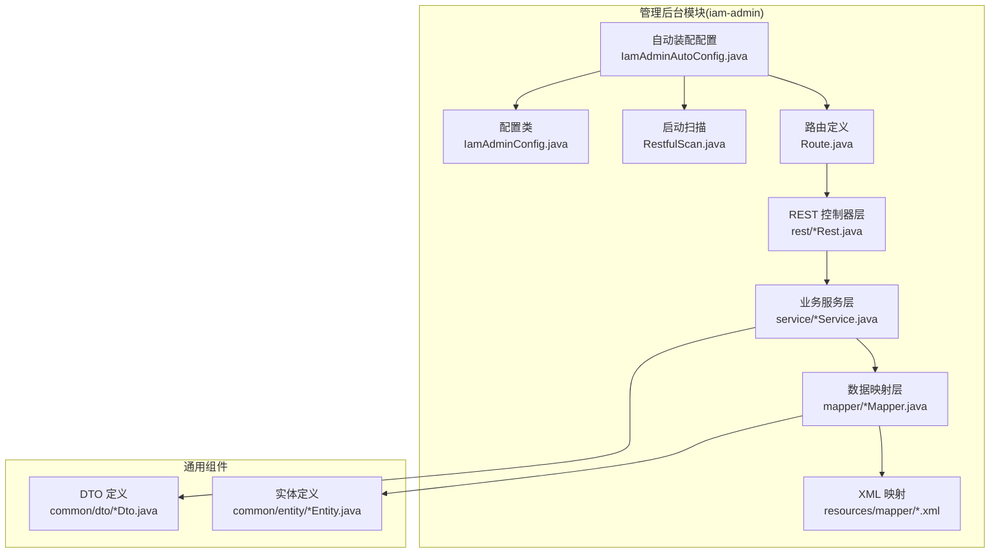
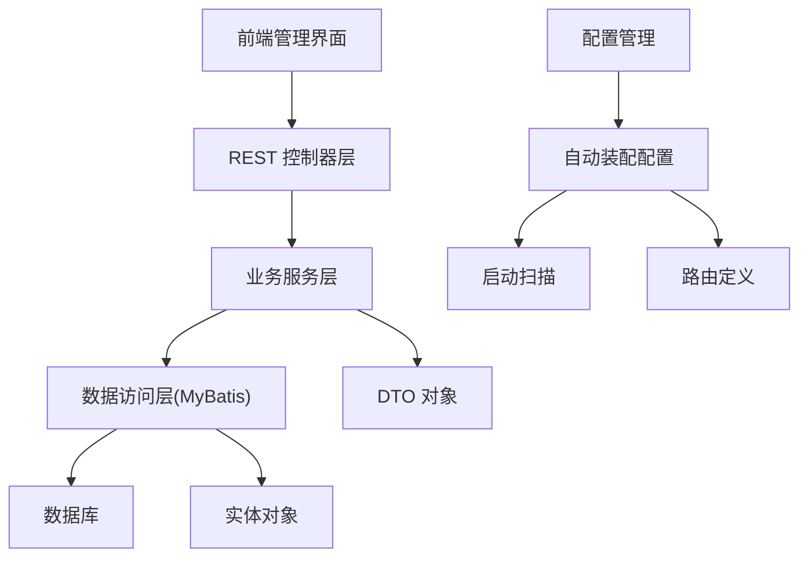
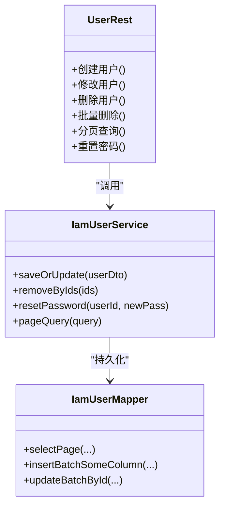
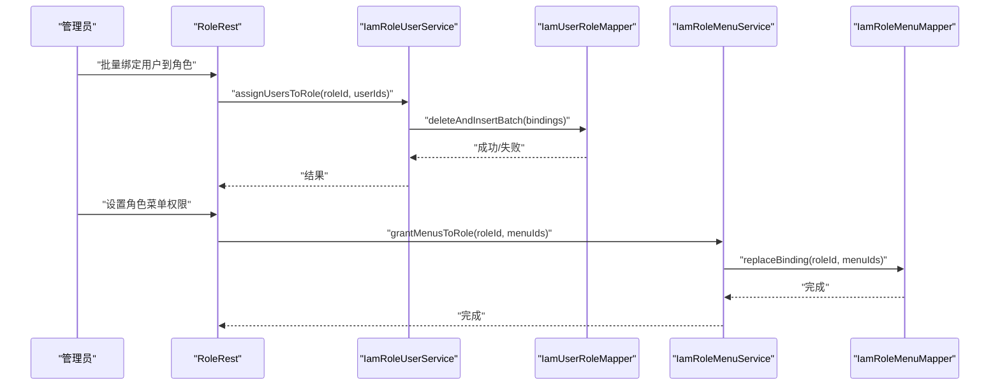
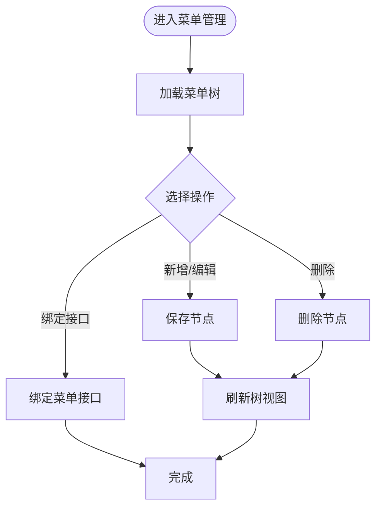
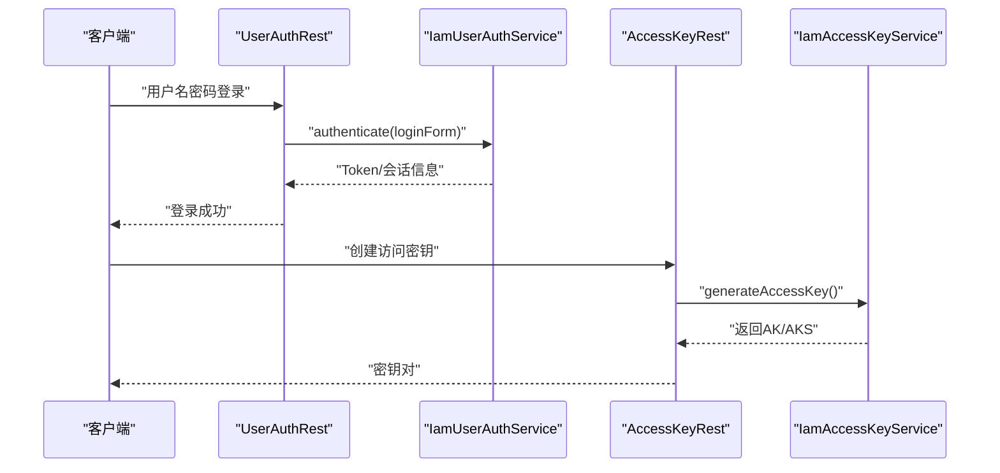
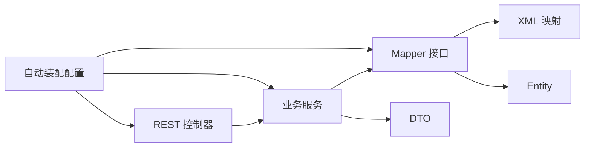

# 管理后台模块(iam-admin)

<cite>
**本文档引用的文件**
- [IamAdminAutoConfig.java](file://iam-admin/src/main/java/com/wkclz/iam/admin/IamAdminAutoConfig.java)
- [IamAdminConfig.java](file://iam-admin/src/main/java/com/wkclz/iam/admin/config/IamAdminConfig.java)
- [RestfulScan.java](file://iam-admin/src/main/java/com/wkclz/iam/admin/init/RestfulScan.java)
- [Route.java](file://iam-admin/src/main/java/com/wkclz/iam/admin/Route.java)
- [pom.xml](file://iam-admin/pom.xml)
- [IamUserRest.java](file://iam-admin/src/main/java/com/wkclz/iam/admin/rest/UserRest.java)
- [IamRoleRest.java](file://iam-admin/src/main/java/com/wkclz/iam/admin/rest/RoleRest.java)
- [IamMenuRest.java](file://iam-admin/src/main/java/com/wkclz/iam/admin/rest/MenuRest.java)
- [IamApiRest.java](file://iam-admin/src/main/java/com/wkclz/iam/admin/rest/ApiRest.java)
- [IamAccessKeyRest.java](file://iam-admin/src/main/java/com/wkclz/iam/admin/rest/AccessKeyRest.java)
- [IamDataDimensionRest.java](file://iam-admin/src/main/java/com/wkclz/iam/admin/rest/DataDimensionRest.java)
- [IamLoginLogRest.java](file://iam-admin/src/main/java/com/wkclz/iam/admin/rest/LoginLogRest.java)
- [IamRequestLogRest.java](file://iam-admin/src/main/java/com/wkclz/iam/admin/rest/RequestLogRest.java)
- [IamUserAuthRest.java](file://iam-admin/src/main/java/com/wkclz/iam/admin/rest/UserAuthRest.java)
- [IamUserRoleRest.java](file://iam-admin/src/main/java/com/wkclz/iam/admin/rest/UserRoleRest.java)
- [IamRoleUserRest.java](file://iam-admin/src/main/java/com/wkclz/iam/admin/rest/RoleUserRest.java)
- [IamRoleMenuRest.java](file://iam-admin/src/main/java/com/wkclz/iam/admin/rest/RoleMenuRest.java)
- [IamMenuApiRest.java](file://iam-admin/src/main/java/com/wkclz/iam/admin/rest/MenuApiRest.java)
- [IamAccessKeyApiRest.java](file://iam-admin/src/main/java/com/wkclz/iam/admin/rest/AccessKeyApiRest.java)
- [IamAppRest.java](file://iam-admin/src/main/java/com/wkclz/iam/admin/rest/AppRest.java)
- [IamUserService.java](file://iam-admin/src/main/java/com/wkclz/iam/admin/service/IamUserService.java)
- [IamRoleService.java](file://iam-admin/src/main/java/com/wkclz/iam/admin/service/IamRoleService.java)
- [IamMenuService.java](file://iam-admin/src/main/java/com/wkclz/iam/admin/service/IamMenuService.java)
- [IamApiService.java](file://iam-admin/src/main/java/com/wkclz/iam/admin/service/IamApiService.java)
- [IamAccessKeyService.java](file://iam-admin/src/main/java/com/wkclz/iam/admin/service/IamAccessKeyService.java)
- [IamDataDimensionService.java](file://iam-admin/src/main/java/com/wkclz/iam/admin/service/IamDataDimensionService.java)
- [IamLoginLogService.java](file://iam-admin/src/main/java/com/wkclz/iam/admin/service/IamLoginLogService.java)
- [IamRequestLogService.java](file://iam-admin/src/main/java/com/wkclz/iam/admin/service/IamRequestLogService.java)
- [IamUserAuthService.java](file://iam-admin/src/main/java/com/wkclz/iam/admin/service/IamUserAuthService.java)
- [IamUserRoleService.java](file://iam-admin/src/main/java/com/wkclz/iam/admin/service/IamUserRoleService.java)
- [IamRoleUserService.java](file://iam-admin/src/main/java/com/wkclz/iam/admin/service/IamRoleUserService.java)
- [IamRoleMenuService.java](file://iam-admin/src/main/java/com/wkclz/iam/admin/service/IamRoleMenuService.java)
- [IamMenuApiService.java](file://iam-admin/src/main/java/com/wkclz/iam/admin/service/IamMenuApiService.java)
- [IamAccessKeyApiService.java](file://iam-admin/src/main/java/com/wkclz/iam/admin/service/IamAccessKeyApiService.java)
- [IamAppService.java](file://iam-admin/src/main/java/com/wkclz/iam/admin/service/IamAppService.java)
- [IamUserMapper.java](file://iam-admin/src/main/java/com/wkclz/iam/admin/mapper/IamUserMapper.java)
- [IamRoleMapper.java](file://iam-admin/src/main/java/com/wkclz/iam/admin/mapper/IamRoleMapper.java)
- [IamMenuMapper.java](file://iam-admin/src/main/java/com/wkclz/iam/admin/mapper/IamMenuMapper.java)
- [IamApiMapper.java](file://iam-admin/src/main/java/com/wkclz/iam/admin/mapper/IamApiMapper.java)
- [IamAccessKeyMapper.java](file://iam-admin/src/main/java/com/wkclz/iam/admin/mapper/IamAccessKeyMapper.java)
- [IamDataDimensionMapper.java](file://iam-admin/src/main/java/com/wkclz/iam/admin/mapper/IamDataDimensionMapper.java)
- [IamLoginLogMapper.java](file://iam-admin/src/main/java/com/wkclz/iam/admin/mapper/IamLoginLogMapper.java)
- [IamRequestLogMapper.java](file://iam-admin/src/main/java/com/wkclz/iam/admin/mapper/IamRequestLogMapper.java)
- [IamUserAuthMapper.java](file://iam-admin/src/main/java/com/wkclz/iam/admin/mapper/IamUserAuthMapper.java)
- [IamUserRoleMapper.java](file://iam-admin/src/main/java/com/wkclz/iam/admin/mapper/IamUserRoleMapper.java)
- [IamRoleMenuMapper.java](file://iam-admin/src/main/java/com/wkclz/iam/admin/mapper/IamRoleMenuMapper.java)
- [IamMenuApiMapper.java](file://iam-admin/src/main/java/com/wkclz/iam/admin/mapper/IamMenuApiMapper.java)
- [IamAccessKeyApiMapper.java](file://iam-admin/src/main/java/com/wkclz/iam/admin/mapper/IamAccessKeyApiMapper.java)
- [IamAppMapper.java](file://iam-admin/src/main/java/com/wkclz/iam/admin/mapper/IamAppMapper.java)
- [IamUserPasswordHisMapper.java](file://iam-admin/src/main/java/com/wkclz/iam/admin/mapper/IamUserPasswordHisMapper.java)
- [IamUserAuthPasswordMapper.java](file://iam-admin/src/main/java/com/wkclz/iam/admin/mapper/IamUserAuthPasswordMapper.java)
- [IamRoleDataMapper.java](file://iam-admin/src/main/java/com/wkclz/iam/admin/mapper/IamRoleDataMapper.java)
- [IamTenantMapper.java](file://iam-admin/src/main/java/com/wkclz/iam/admin/mapper/IamTenantMapper.java)
- [IamUserDto.java](file://iam-common/src/main/java/com/wkclz/iam/common/dto/IamUserDto.java)
- [IamRoleDto.java](file://iam-common/src/main/java/com/wkclz/iam/common/dto/IamRoleDto.java)
- [IamMenuDto.java](file://iam-common/src/main/java/com/wkclz/iam/common/dto/IamMenuDto.java)
- [IamApiDto.java](file://iam-common/src/main/java/com/wkclz/iam/common/dto/IamApiDto.java)
- [IamAccessKeyDto.java](file://iam-common/src/main/java/com/wkclz/iam/common/dto/IamAccessKeyDto.java)
- [IamDataDimensionDto.java](file://iam-common/src/main/java/com/wkclz/iam/common/dto/IamDataDimensionDto.java)
- [IamLoginLogDto.java](file://iam-common/src/main/java/com/wkclz/iam/common/dto/IamLoginLogDto.java)
- [IamRequestLogDto.java](file://iam-common/src/main/java/com/wkclz/iam/common/dto/IamRequestLogDto.java)
- [IamUserAuthDto.java](file://iam-common/src/main/java/com/wkclz/iam/common/dto/IamUserAuthDto.java)
- [IamUserRoleDto.java](file://iam-common/src/main/java/com/wkclz/iam/common/dto/IamUserRoleDto.java)
- [IamRoleMenuDto.java](file://iam-common/src/main/java/com/wkclz/iam/common/dto/IamRoleMenuDto.java)
- [IamMenuApiDto.java](file://iam-common/src/main/java/com/wkclz/iam/common/dto/IamMenuApiDto.java)
- [IamAccessKeyApiDto.java](file://iam-common/src/main/java/com/wkclz/iam/common/dto/IamAccessKeyApiDto.java)
- [IamAppDto.java](file://iam-common/src/main/java/com/wkclz/iam/common/dto/IamAppDto.java)
- [IamUserEntity.java](file://iam-common/src/main/java/com/wkclz/iam/common/entity/IamUserEntity.java)
- [IamRoleEntity.java](file://iam-common/src/main/java/com/wkclz/iam/common/entity/IamRoleEntity.java)
- [IamMenuEntity.java](file://iam-common/src/main/java/com/wkclz/iam/common/entity/IamMenuEntity.java)
- [IamApiEntity.java](file://iam-common/src/main/java/com/wkclz/iam/common/entity/IamApiEntity.java)
- [IamAccessKeyEntity.java](file://iam-common/src/main/java/com/wkclz/iam/common/entity/IamAccessKeyEntity.java)
- [IamDataDimensionEntity.java](file://iam-common/src/main/java/com/wkclz/iam/common/entity/IamDataDimensionEntity.java)
- [IamLoginLogEntity.java](file://iam-common/src/main/java/com/wkclz/iam/common/entity/IamLoginLogEntity.java)
- [IamRequestLogEntity.java](file://iam-common/src/main/java/com/wkclz/iam/common/entity/IamRequestLogEntity.java)
- [IamUserAuthEntity.java](file://iam-common/src/main/java/com/wkclz/iam/common/entity/IamUserAuthEntity.java)
- [IamUserRoleEntity.java](file://iam-common/src/main/java/com/wkclz/iam/common/entity/IamUserRoleEntity.java)
- [IamRoleMenuEntity.java](file://iam-common/src/main/java/com/wkclz/iam/common/entity/IamRoleMenuEntity.java)
- [IamMenuApiEntity.java](file://iam-common/src/main/java/com/wkclz/iam/common/entity/IamMenuApiEntity.java)
- [IamAccessKeyApiEntity.java](file://iam-common/src/main/java/com/wkclz/iam/common/entity/IamAccessKeyApiEntity.java)
- [IamAppEntity.java](file://iam-common/src/main/java/com/wkclz/iam/common/entity/IamAppEntity.java)
</cite>

## 目录
1. [简介](#简介)
2. [项目结构](#项目结构)
3. [核心组件](#核心组件)
4. [架构总览](#架构总览)
5. [详细组件分析](#详细组件分析)
6. [依赖关系分析](#依赖关系分析)
7. [性能考虑](#性能考虑)
8. [故障排查指南](#故障排查指南)
9. [结论](#结论)
10. [附录](#附录)

## 简介
本文件为管理后台模块(iam-admin)的详细技术文档，面向后端开发者与运维人员，系统性阐述模块的架构设计、REST 控制器、业务服务层、数据访问层以及配置管理。重点覆盖用户管理、角色管理、菜单管理、权限控制等核心功能，并说明 CRUD 实现模式、数据验证机制、批量操作支持及扩展方法。文档同时提供使用指南与最佳实践，帮助快速上手与稳定演进。

## 项目结构
iam-admin 模块采用标准 Spring Boot 工程结构，按职责分层组织：自动装配配置、初始化扫描、REST 控制器、业务服务、数据映射与 XML Mapper、通用 DTO/Entity 与公共依赖。模块通过 Maven 聚合构建，与 SDK、SSO、公共组件协同工作。

图表来源
- [IamAdminAutoConfig.java](file://iam-admin/src/main/java/com/wkclz/iam/admin/IamAdminAutoConfig.java)
- [IamAdminConfig.java](file://iam-admin/src/main/java/com/wkclz/iam/admin/config/IamAdminConfig.java)
- [RestfulScan.java](file://iam-admin/src/main/java/com/wkclz/iam/admin/init/RestfulScan.java)
- [Route.java](file://iam-admin/src/main/java/com/wkclz/iam/admin/Route.java)
- [IamUserRest.java](file://iam-admin/src/main/java/com/wkclz/iam/admin/rest/UserRest.java)
- [IamUserService.java](file://iam-admin/src/main/java/com/wkclz/iam/admin/service/IamUserService.java)
- [IamUserMapper.java](file://iam-admin/src/main/java/com/wkclz/iam/admin/mapper/IamUserMapper.java)
- [IamUserDto.java](file://iam-common/src/main/java/com/wkclz/iam/common/dto/IamUserDto.java)
- [IamUserEntity.java](file://iam-common/src/main/java/com/wkclz/iam/common/entity/IamUserEntity.java)

章节来源
- [pom.xml](file://iam-admin/pom.xml)

## 核心组件
- 自动装配配置：负责注册扫描、路由与条件化组件，确保模块在 Spring Boot 启动时正确加载。
- 初始化扫描：扫描 REST 控制器包，建立统一的路由与请求入口。
- REST 控制器：面向前端的 API 入口，封装请求参数、调用服务层并返回结果。
- 业务服务层：实现领域逻辑、事务控制、数据校验与批量处理。
- 数据访问层：MyBatis Mapper 接口与 XML 映射，提供数据持久化能力。
- 配置管理：集中管理模块开关、扫描路径、默认值等。

章节来源
- [IamAdminAutoConfig.java](file://iam-admin/src/main/java/com/wkclz/iam/admin/IamAdminAutoConfig.java)
- [IamAdminConfig.java](file://iam-admin/src/main/java/com/wkclz/iam/admin/config/IamAdminConfig.java)
- [RestfulScan.java](file://iam-admin/src/main/java/com/wkclz/iam/admin/init/RestfulScan.java)
- [Route.java](file://iam-admin/src/main/java/com/wkclz/iam/admin/Route.java)

## 架构总览
管理后台采用“控制器-服务-数据访问”三层架构，结合 MyBatis Plus 与 XML Mapper，形成清晰的职责边界。REST 层负责协议与参数处理，服务层承载业务规则，数据层专注数据存取。模块通过自动装配与扫描机制实现零样板代码的快速接入。

图表来源
- [IamAdminAutoConfig.java](file://iam-admin/src/main/java/com/wkclz/iam/admin/IamAdminAutoConfig.java)
- [IamAdminConfig.java](file://iam-admin/src/main/java/com/wkclz/iam/admin/config/IamAdminConfig.java)
- [RestfulScan.java](file://iam-admin/src/main/java/com/wkclz/iam/admin/init/RestfulScan.java)
- [Route.java](file://iam-admin/src/main/java/com/wkclz/iam/admin/Route.java)

## 详细组件分析

### 用户管理(User Management)
- 功能范围：用户增删改查、重置密码、启用禁用、批量导入导出、用户-角色关联维护。
- 控制器：UserRest 提供标准 CRUD 与批量操作接口。
- 服务层：IamUserService 封装用户业务逻辑，包含密码历史、登录状态、安全策略等。
- 数据访问：IamUserMapper 及相关关联 Mapper（UserRole、UserAuth、UserPasswordHis）支撑复杂查询与更新。
- DTO/Entity：IamUserDto/IamUserEntity 作为跨层传输与存储载体。

图表来源
- [IamUserRest.java](file://iam-admin/src/main/java/com/wkclz/iam/admin/rest/UserRest.java)
- [IamUserService.java](file://iam-admin/src/main/java/com/wkclz/iam/admin/service/IamUserService.java)
- [IamUserMapper.java](file://iam-admin/src/main/java/com/wkclz/iam/admin/mapper/IamUserMapper.java)

章节来源
- [IamUserRest.java](file://iam-admin/src/main/java/com/wkclz/iam/admin/rest/UserRest.java)
- [IamUserService.java](file://iam-admin/src/main/java/com/wkclz/iam/admin/service/IamUserService.java)
- [IamUserMapper.java](file://iam-admin/src/main/java/com/wkclz/iam/admin/mapper/IamUserMapper.java)
- [IamUserDto.java](file://iam-common/src/main/java/com/wkclz/iam/common/dto/IamUserDto.java)
- [IamUserEntity.java](file://iam-common/src/main/java/com/wkclz/iam/common/entity/IamUserEntity.java)

### 角色管理(Role Management)
- 功能范围：角色 CRUD、角色-用户批量绑定、角色-菜单授权、数据维度授权。
- 控制器：RoleRest、RoleUserRest、RoleMenuRest、RoleDataRest 分别对应角色、用户绑定、菜单授权、数据授权。
- 服务层：IamRoleService、IamRoleUserService、IamRoleMenuService、IamRoleDataService 组成角色域完整能力。
- 数据访问：IamRoleMapper、IamUserRoleMapper、IamRoleMenuMapper、IamRoleDataMapper 支撑多表关联。

图表来源
- [IamRoleRest.java](file://iam-admin/src/main/java/com/wkclz/iam/admin/rest/RoleRest.java)
- [IamRoleUserRest.java](file://iam-admin/src/main/java/com/wkclz/iam/admin/rest/RoleUserRest.java)
- [IamRoleMenuRest.java](file://iam-admin/src/main/java/com/wkclz/iam/admin/rest/RoleMenuRest.java)
- [IamRoleUserService.java](file://iam-admin/src/main/java/com/wkclz/iam/admin/service/IamRoleUserService.java)
- [IamRoleMenuService.java](file://iam-admin/src/main/java/com/wkclz/iam/admin/service/IamRoleMenuService.java)
- [IamUserRoleMapper.java](file://iam-admin/src/main/java/com/wkclz/iam/admin/mapper/IamUserRoleMapper.java)
- [IamRoleMenuMapper.java](file://iam-admin/src/main/java/com/wkclz/iam/admin/mapper/IamRoleMenuMapper.java)

章节来源
- [IamRoleRest.java](file://iam-admin/src/main/java/com/wkclz/iam/admin/rest/RoleRest.java)
- [IamRoleUserRest.java](file://iam-admin/src/main/java/com/wkclz/iam/admin/rest/RoleUserRest.java)
- [IamRoleMenuRest.java](file://iam-admin/src/main/java/com/wkclz/iam/admin/rest/RoleMenuRest.java)
- [IamRoleUserService.java](file://iam-admin/src/main/java/com/wkclz/iam/admin/service/IamRoleUserService.java)
- [IamRoleMenuService.java](file://iam-admin/src/main/java/com/wkclz/iam/admin/service/IamRoleMenuService.java)
- [IamUserRoleMapper.java](file://iam-admin/src/main/java/com/wkclz/iam/admin/mapper/IamUserRoleMapper.java)
- [IamRoleMenuMapper.java](file://iam-admin/src/main/java/com/wkclz/iam/admin/mapper/IamRoleMenuMapper.java)

### 菜单管理(Menu Management)
- 功能范围：菜单树形结构 CRUD、菜单-接口绑定、动态路由生成。
- 控制器：MenuRest、MenuApiRest 提供菜单与接口绑定管理。
- 服务层：IamMenuService、IamMenuApiService 处理树形数据与绑定关系。
- 数据访问：IamMenuMapper、IamMenuApiMapper 支持父子节点、排序、层级查询。

图表来源
- [IamMenuRest.java](file://iam-admin/src/main/java/com/wkclz/iam/admin/rest/MenuRest.java)
- [IamMenuApiRest.java](file://iam-admin/src/main/java/com/wkclz/iam/admin/rest/MenuApiRest.java)
- [IamMenuService.java](file://iam-admin/src/main/java/com/wkclz/iam/admin/service/IamMenuService.java)
- [IamMenuApiService.java](file://iam-admin/src/main/java/com/wkclz/iam/admin/service/IamMenuApiService.java)
- [IamMenuMapper.java](file://iam-admin/src/main/java/com/wkclz/iam/admin/mapper/IamMenuMapper.java)
- [IamMenuApiMapper.java](file://iam-admin/src/main/java/com/wkclz/iam/admin/mapper/IamMenuApiMapper.java)

章节来源
- [IamMenuRest.java](file://iam-admin/src/main/java/com/wkclz/iam/admin/rest/MenuRest.java)
- [IamMenuApiRest.java](file://iam-admin/src/main/java/com/wkclz/iam/admin/rest/MenuApiRest.java)
- [IamMenuService.java](file://iam-admin/src/main/java/com/wkclz/iam/admin/service/IamMenuService.java)
- [IamMenuApiService.java](file://iam-admin/src/main/java/com/wkclz/iam/admin/service/IamMenuApiService.java)
- [IamMenuMapper.java](file://iam-admin/src/main/java/com/wkclz/iam/admin/mapper/IamMenuMapper.java)
- [IamMenuApiMapper.java](file://iam-admin/src/main/java/com/wkclz/iam/admin/mapper/IamMenuApiMapper.java)

### 权限控制(Permission Control)
- 用户认证与会话：UserAuthRest、IamUserAuthService 提供登录、登出、会话校验。
- 接口权限：ApiRest、MenuApiRest 管理接口资源与菜单绑定，配合鉴权过滤器生效。
- 访问密钥：AccessKeyRest、AccessKeyApiRest 管理 AK/AK-API 绑定，支持签名与白名单控制。
- 日志审计：LoginLogRest、RequestLogRest 提供登录与请求日志查询，便于审计与排障。

图表来源
- [IamUserAuthRest.java](file://iam-admin/src/main/java/com/wkclz/iam/admin/rest/UserAuthRest.java)
- [IamUserAuthService.java](file://iam-admin/src/main/java/com/wkclz/iam/admin/service/IamUserAuthService.java)
- [IamAccessKeyRest.java](file://iam-admin/src/main/java/com/wkclz/iam/admin/rest/AccessKeyRest.java)
- [IamAccessKeyService.java](file://iam-admin/src/main/java/com/wkclz/iam/admin/service/IamAccessKeyService.java)

章节来源
- [IamUserAuthRest.java](file://iam-admin/src/main/java/com/wkclz/iam/admin/rest/UserAuthRest.java)
- [IamUserAuthService.java](file://iam-admin/src/main/java/com/wkclz/iam/admin/service/IamUserAuthService.java)
- [IamAccessKeyRest.java](file://iam-admin/src/main/java/com/wkclz/iam/admin/rest/AccessKeyRest.java)
- [IamAccessKeyService.java](file://iam-admin/src/main/java/com/wkclz/iam/admin/service/IamAccessKeyService.java)

### 其他管理模块
- API 管理：ApiRest、IamApiService、IamApiMapper 管理接口资源。
- 应用管理：AppRest、IamAppService、IamAppMapper 管理应用信息。
- 数据维度：DataDimensionRest、IamDataDimensionService、IamDataDimensionMapper 管理数据权限维度。
- 登录日志与请求日志：LoginLogRest、RequestLogRest 对应服务与 Mapper 提供查询能力。

章节来源
- [IamApiRest.java](file://iam-admin/src/main/java/com/wkclz/iam/admin/rest/ApiRest.java)
- [IamAppRest.java](file://iam-admin/src/main/java/com/wkclz/iam/admin/rest/AppRest.java)
- [IamDataDimensionRest.java](file://iam-admin/src/main/java/com/wkclz/iam/admin/rest/DataDimensionRest.java)
- [IamLoginLogRest.java](file://iam-admin/src/main/java/com/wkclz/iam/admin/rest/LoginLogRest.java)
- [IamRequestLogRest.java](file://iam-admin/src/main/java/com/wkclz/iam/admin/rest/RequestLogRest.java)

## 依赖关系分析
- 模块内聚：各功能域以 REST-Service-Mapper 分层解耦，Mapper 仅负责数据存取，服务层聚合业务。
- 外部依赖：依赖 iam-common 的 DTO/Entity，MyBatis 与 MySQL 连接池；通过自动装配与扫描机制注入。
- 扩展点：新增功能只需按命名规范添加 REST、Service、Mapper 与 XML，即可被扫描注册。

图表来源
- [IamAdminAutoConfig.java](file://iam-admin/src/main/java/com/wkclz/iam/admin/IamAdminAutoConfig.java)
- [IamUserRest.java](file://iam-admin/src/main/java/com/wkclz/iam/admin/rest/UserRest.java)
- [IamUserService.java](file://iam-admin/src/main/java/com/wkclz/iam/admin/service/IamUserService.java)
- [IamUserMapper.java](file://iam-admin/src/main/java/com/wkclz/iam/admin/mapper/IamUserMapper.java)
- [IamUserDto.java](file://iam-common/src/main/java/com/wkclz/iam/common/dto/IamUserDto.java)
- [IamUserEntity.java](file://iam-common/src/main/java/com/wkclz/iam/common/entity/IamUserEntity.java)

## 性能考虑
- 分页查询：优先使用分页参数，避免一次性加载大结果集。
- 批量操作：批量插入/更新使用 MyBatis 批处理能力，减少往返次数。
- 缓存策略：对高频只读数据（如字典、菜单树）可引入缓存，降低数据库压力。
- SQL 优化：合理使用索引字段（如用户名、角色 ID、菜单路径），避免全表扫描。
- 并发控制：敏感操作（重置密码、批量删除）需加锁或幂等设计，防止重复执行。

## 故障排查指南
- 启动问题：检查自动装配配置与扫描路径是否正确，确认 Spring Boot 自动装配导入文件存在。
- 接口异常：核对 REST 参数校验、服务层异常捕获与统一响应包装。
- 数据不一致：检查批量操作事务边界，确认 Mapper XML 中的批量语句执行顺序。
- 权限问题：确认菜单-接口绑定、角色-菜单授权链路是否完整，接口访问密钥是否有效。

章节来源
- [IamAdminAutoConfig.java](file://iam-admin/src/main/java/com/wkclz/iam/admin/IamAdminAutoConfig.java)
- [IamAdminConfig.java](file://iam-admin/src/main/java/com/wkclz/iam/admin/config/IamAdminConfig.java)

## 结论
iam-admin 模块通过清晰的分层架构与完善的 CRUD/批量能力，提供了完整的后台管理解决方案。依托自动装配与扫描机制，新功能可快速接入；结合 DTO/Entity 的强类型约束与服务层的业务编排，既保证了扩展性也确保了稳定性。建议在生产环境强化日志与监控，完善缓存与索引策略，持续提升性能与可观测性。

## 附录
- 使用指南
  - 新增功能：创建 REST、Service、Mapper 与 XML 文件，遵循现有命名规范。
  - 参数校验：在 DTO 中定义校验注解，服务层进行二次校验与异常处理。
  - 批量操作：使用批量插入/更新接口，注意事务与回滚策略。
- 开发扩展
  - 新增枚举/字典：在 iam-common 中扩展 DTO/Entity，并在 UI 层同步展示。
  - 自定义权限：通过菜单-接口绑定与角色授权链路实现细粒度控制。
  - 审计日志：利用登录日志与请求日志 REST 接口，完善审计闭环。