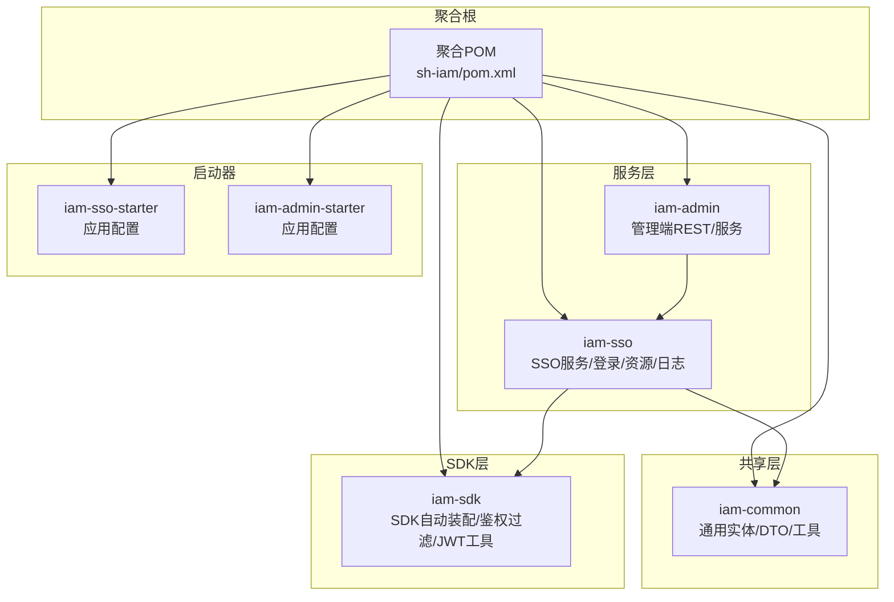
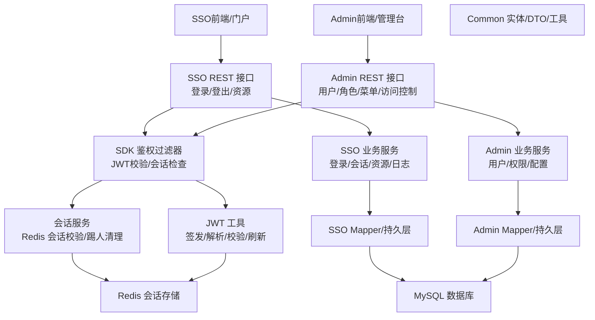
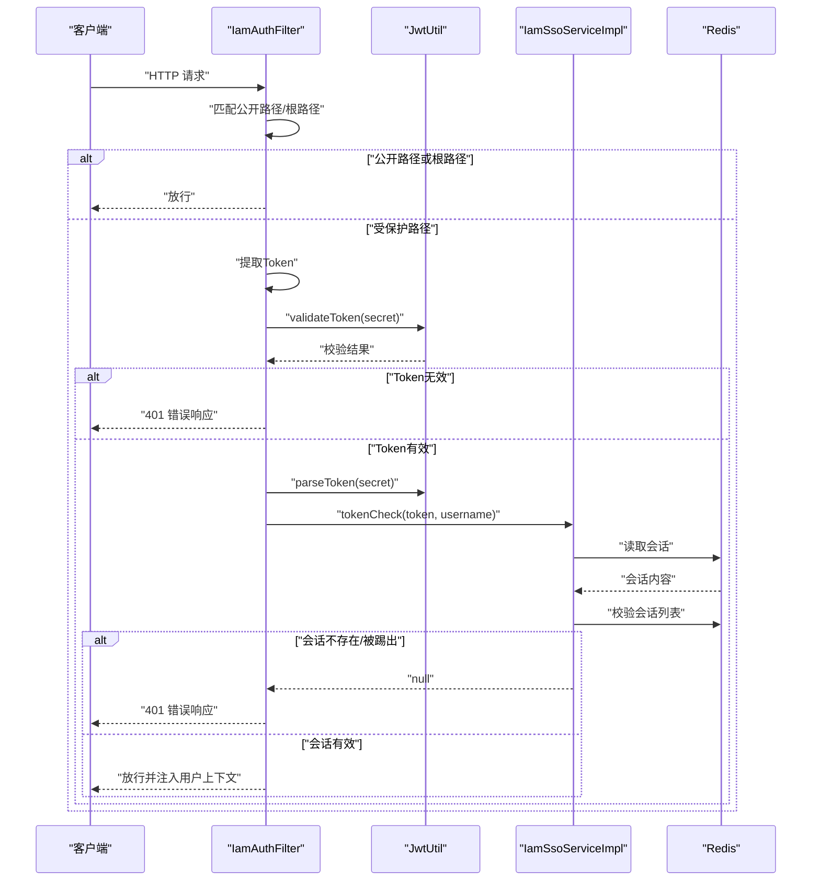
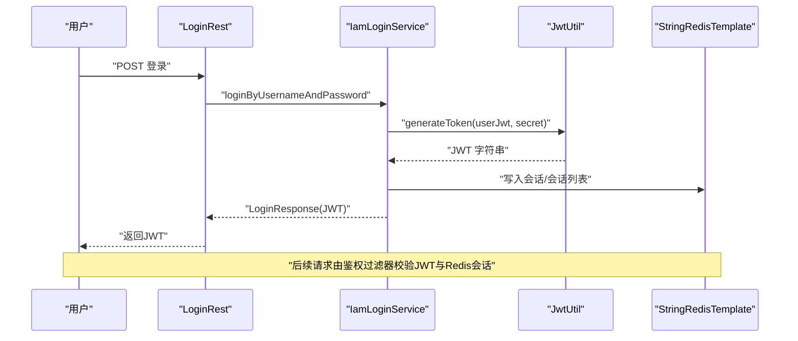
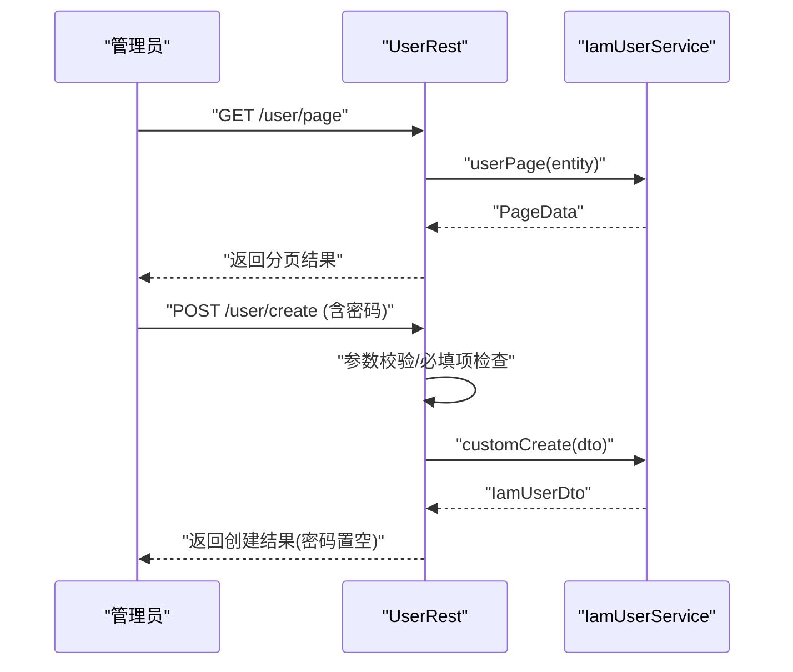
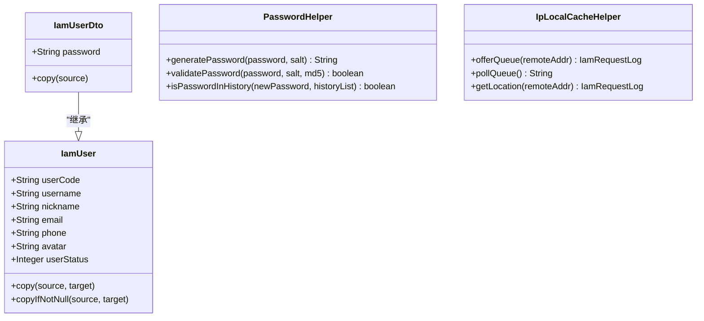
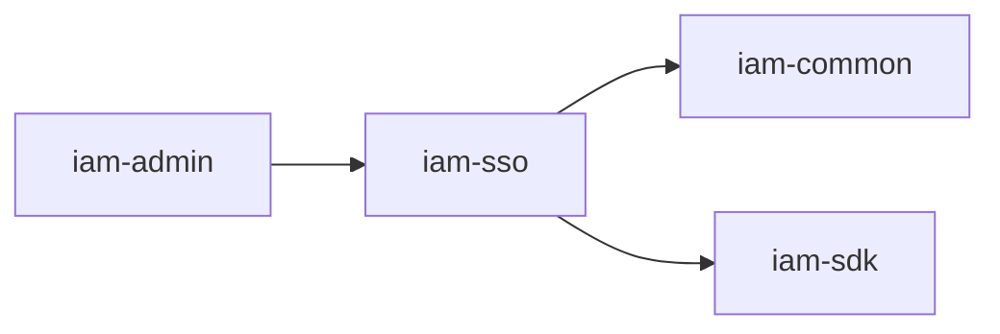

# 系统架构

<cite>
**本文引用的文件**
- [pom.xml](file://pom.xml)
- [iam-sso\pom.xml](file://iam-sso\pom.xml)
- [iam-admin\pom.xml](file://iam-admin\pom.xml)
- [iam-sdk\pom.xml](file://iam-sdk\pom.xml)
- [iam-sso-starter\src\main\resources\config\application.yml](file://iam-sso-starter\src\main\resources\config\application.yml)
- [iam-admin-starter\src\main\resources\config\application.yml](file://iam-admin-starter\src\main\resources\config\application.yml)
- [iam-sso\src\main\java\com\wkclz\iam\sso\IamSsoAutoConfig.java](file://iam-sso\src\main\java\com\wkclz\iam\sso\IamSsoAutoConfig.java)
- [iam-admin\src\main\java\com\wkclz\iam\admin\IamAdminAutoConfig.java](file://iam-admin\src\main\java\com\wkclz\iam\admin\IamAdminAutoConfig.java)
- [iam-sdk\src\main\java\com\wkclz\iam\sdk\IamSdkAutoConfig.java](file://iam-sdk\src\main\java\com\wkclz\iam\sdk\IamSdkAutoConfig.java)
- [iam-sso\src\main\java\com\wkclz\iam\sso\service\IamSsoServiceImpl.java](file://iam-sso\src\main\java\com\wkclz\iam\sso\service\IamSsoServiceImpl.java)
- [iam-sdk\src\main\java\com\wkclz\iam\sdk\filter\IamAuthFilter.java](file://iam-sdk\src\main\java\com\wkclz\iam\sdk\filter\IamAuthFilter.java)
- [iam-sdk\src\main\java\com\wkclz\iam\sdk\util\JwtUtil.java](file://iam-sdk\src\main\java\com\wkclz\iam\sdk\util\JwtUtil.java)
- [iam-sso\src\main\java\com\wkclz\iam\sso\rest\LoginRest.java](file://iam-sso\src\main\java\com\wkclz\iam\sso\rest\LoginRest.java)
- [iam-admin\src\main\java\com\wkclz\iam\admin\rest\UserRest.java](file://iam-admin\src\main\java\com\wkclz\iam\admin\rest\UserRest.java)
- [iam-common\src\main\java\com\wkclz\iam\common\entity\IamUser.java](file://iam-common\src\main\java\com\wkclz\iam\common\entity\IamUser.java)
- [iam-common\src\main\java\com\wkclz\iam\common\dto\IamUserDto.java](file://iam-common\src\main\java\com\wkclz\iam\common\dto\IamUserDto.java)
- [iam-common\src\main\java\com\wkclz\iam\common\helper\PasswordHelper.java](file://iam-common\src\main\java\com\wkclz\iam\common\helper\PasswordHelper.java)
- [iam-common\src\main\java\com\wkclz\iam\common\helper\IpLocalCacheHelper.java](file://iam-common\src\main\java\com\wkclz\iam\common\helper\IpLocalCacheHelper.java)
</cite>

## 目录
1. [引言](#引言)
2. [项目结构](#项目结构)
3. [核心组件](#核心组件)
4. [架构总览](#架构总览)
5. [详细组件分析](#详细组件分析)
6. [依赖分析](#依赖分析)
7. [性能考量](#性能考量)
8. [故障排查指南](#故障排查指南)
9. [结论](#结论)
10. [附录](#附录)

## 引言
本架构文档面向 SH-IAM 系统，目标是提供高层设计、架构模式与系统边界说明；详述模块间交互关系、数据流向与集成方式；解释技术决策、权衡与约束；并给出基础设施需求、可扩展性与部署拓扑建议。同时覆盖安全性、监控与灾备等横切关注点，记录技术栈、第三方依赖及版本兼容性。

## 项目结构
SH-IAM 采用多模块聚合工程组织，核心模块包括：
- iam-common：通用实体、DTO、工具与公共能力
- iam-sdk：SDK 自动装配、鉴权过滤器、JWT 工具、会话辅助等
- iam-sso：单点登录与个人中心相关服务、资源与日志
- iam-admin：后台管理接口与业务服务
- iam-sso-starter、iam-admin-starter：各自启动器与基础配置

图表来源
- [pom.xml:1-37](file://pom.xml#L1-L37)
- [iam-sso\pom.xml:1-54](file://iam-sso\pom.xml#L1-L54)
- [iam-admin\pom.xml:1-42](file://iam-admin\pom.xml#L1-L42)
- [iam-sdk\pom.xml:1-45](file://iam-sdk\pom.xml#L1-L45)

章节来源
- [pom.xml:1-37](file://pom.xml#L1-L37)

## 核心组件
- 自动装配与扫描
  - SSO 自动装配：组件扫描与 Mapper 扫描路径在 SSO 模块内完成，确保服务与持久层组件被纳入容器。
  - 管理端自动装配：同理，管理端模块具备独立的组件与 Mapper 扫描。
  - SDK 自动装配：基于属性开关控制启用，便于按需加载。
- 安全与认证
  - 鉴权过滤器：统一拦截请求，校验公开路径、提取与验证 JWT，并通过会话服务检查 Redis 中的会话有效性。
  - JWT 工具：封装签发、解析、校验、刷新与声明读取等能力，统一会话有效期与密钥处理。
  - 会话服务：基于 Redis 的 Token 与会话列表校验，支持会话失效与踢人清理。
- 业务与数据
  - 用户实体与 DTO：标准字段与拷贝方法，便于跨层传递与转换。
  - 密码工具：MD5 加盐密码生成与校验，历史密码校验。
  - IP 地址缓存：本地队列与缓存结合，异步解析 IP 归属地，提升日志与风控效率。

章节来源
- [iam-sso\src\main\java\com\wkclz\iam\sso\IamSsoAutoConfig.java:1-14](file://iam-sso\src\main\java\com\wkclz\iam\sso\IamSsoAutoConfig.java#L1-L14)
- [iam-admin\src\main\java\com\wkclz\iam\admin\IamAdminAutoConfig.java:1-14](file://iam-admin\src\main\java\com\wkclz\iam\admin\IamAdminAutoConfig.java#L1-L14)
- [iam-sdk\src\main\java\com\wkclz\iam\sdk\IamSdkAutoConfig.java:1-14](file://iam-sdk\src\main\java\com\wkclz\iam\sdk\IamSdkAutoConfig.java#L1-L14)
- [iam-sdk\src\main\java\com\wkclz\iam\sdk\filter\IamAuthFilter.java:1-73](file://iam-sdk\src\main\java\com\wkclz\iam\sdk\filter\IamAuthFilter.java#L1-L73)
- [iam-sdk\src\main\java\com\wkclz\iam\sdk\util\JwtUtil.java:1-238](file://iam-sdk\src\main\java\com\wkclz\iam\sdk\util\JwtUtil.java#L1-L238)
- [iam-sso\src\main\java\com\wkclz\iam\sso\service\IamSsoServiceImpl.java:1-48](file://iam-sso\src\main\java\com\wkclz\iam\sso\service\IamSsoServiceImpl.java#L1-L48)
- [iam-common\src\main\java\com\wkclz\iam\common\entity\IamUser.java:1-108](file://iam-common\src\main\java\com\wkclz\iam\common\entity\IamUser.java#L1-L108)
- [iam-common\src\main\java\com\wkclz\iam\common\dto\IamUserDto.java:1-34](file://iam-common\src\main\java\com\wkclz\iam\common\dto\IamUserDto.java#L1-L34)
- [iam-common\src\main\java\com\wkclz\iam\common\helper\PasswordHelper.java:1-50](file://iam-common\src\main\java\com\wkclz\iam\common\helper\PasswordHelper.java#L1-L50)
- [iam-common\src\main\java\com\wkclz\iam\common\helper\IpLocalCacheHelper.java:1-113](file://iam-common\src\main\java\com\wkclz\iam\common\helper\IpLocalCacheHelper.java#L1-L113)

## 架构总览
SH-IAM 采用分层与模块化架构：
- 表现层：SSO 与 Admin 提供 REST 接口
- 服务层：SSO 实现登录、会话、资源与日志；Admin 提供管理 CRUD
- 共享层：Common 提供实体、DTO、工具
- 基础设施：Spring Boot 自动装配、MyBatis、Redis、Web 框架

图表来源
- [iam-sdk\src\main\java\com\wkclz\iam\sdk\filter\IamAuthFilter.java:1-73](file://iam-sdk\src\main\java\com\wkclz\iam\sdk\filter\IamAuthFilter.java#L1-L73)
- [iam-sdk\src\main\java\com\wkclz\iam\sdk\util\JwtUtil.java:1-238](file://iam-sdk\src\main\java\com\wkclz\iam\sdk\util\JwtUtil.java#L1-L238)
- [iam-sso\src\main\java\com\wkclz\iam\sso\service\IamSsoServiceImpl.java:1-48](file://iam-sso\src\main\java\com\wkclz\iam\sso\service\IamSsoServiceImpl.java#L1-L48)
- [iam-sso\src\main\java\com\wkclz\iam\sso\rest\LoginRest.java:1-38](file://iam-sso\src\main\java\com\wkclz\iam\sso\rest\LoginRest.java#L1-L38)
- [iam-admin\src\main\java\com\wkclz\iam\admin\rest\UserRest.java:1-66](file://iam-admin\src\main\java\com\wkclz\iam\admin\rest\UserRest.java#L1-L66)

## 详细组件分析

### 组件A：鉴权过滤链路
鉴权流程贯穿请求生命周期，从过滤器到会话服务再到 Redis 校验，形成闭环的安全控制。

图表来源
- [iam-sdk\src\main\java\com\wkclz\iam\sdk\filter\IamAuthFilter.java:30-71](file://iam-sdk\src\main\java\com\wkclz\iam\sdk\filter\IamAuthFilter.java#L30-L71)
- [iam-sdk\src\main\java\com\wkclz\iam\sdk\util\JwtUtil.java:114-121](file://iam-sdk\src\main\java\com\wkclz\iam\sdk\util\JwtUtil.java#L114-L121)
- [iam-sdk\src\main\java\com\wkclz\iam\sdk\util\JwtUtil.java:72-80](file://iam-sdk\src\main\java\com\wkclz\iam\sdk\util\JwtUtil.java#L72-L80)
- [iam-sso\src\main\java\com\wkclz\iam\sso\service\IamSsoServiceImpl.java:22-46](file://iam-sso\src\main\java\com\wkclz\iam\sso\service\IamSsoServiceImpl.java#L22-L46)

章节来源
- [iam-sdk\src\main\java\com\wkclz\iam\sdk\filter\IamAuthFilter.java:1-73](file://iam-sdk\src\main\java\com\wkclz\iam\sdk\filter\IamAuthFilter.java#L1-L73)
- [iam-sdk\src\main\java\com\wkclz\iam\sdk\util\JwtUtil.java:1-238](file://iam-sdk\src\main\java\com\wkclz\iam\sdk\util\JwtUtil.java#L1-L238)
- [iam-sso\src\main\java\com\wkclz\iam\sso\service\IamSsoServiceImpl.java:1-48](file://iam-sso\src\main\java\com\wkclz\iam\sso\service\IamSsoServiceImpl.java#L1-L48)

### 组件B：登录与会话校验
登录接口负责身份验证并签发 JWT；会话服务负责校验 Token 与会话列表一致性，并在异常情况下清理“幽灵条目”。

图表来源
- [iam-sso\src\main\java\com\wkclz\iam\sso\rest\LoginRest.java:22-28](file://iam-sso\src\main\java\com\wkclz\iam\sso\rest\LoginRest.java#L22-L28)
- [iam-sdk\src\main\java\com\wkclz\iam\sdk\util\JwtUtil.java:39-64](file://iam-sdk\src\main\java\com\wkclz\iam\sdk\util\JwtUtil.java#L39-L64)

章节来源
- [iam-sso\src\main\java\com\wkclz\iam\sso\rest\LoginRest.java:1-38](file://iam-sso\src\main\java\com\wkclz\iam\sso\rest\LoginRest.java#L1-L38)
- [iam-sdk\src\main\java\com\wkclz\iam\sdk\util\JwtUtil.java:1-238](file://iam-sdk\src\main\java\com\wkclz\iam\sdk\util\JwtUtil.java#L1-L238)

### 组件C：用户管理接口
管理端提供用户分页查询、详情、新增、更新与删除等操作，参数校验与版本号控制保证并发安全。

图表来源
- [iam-admin\src\main\java\com\wkclz\iam\admin\rest\UserRest.java:21-41](file://iam-admin\src\main\java\com\wkclz\iam\admin\rest\UserRest.java#L21-L41)

章节来源
- [iam-admin\src\main\java\com\wkclz\iam\admin\rest\UserRest.java:1-66](file://iam-admin\src\main\java\com\wkclz\iam\admin\rest\UserRest.java#L1-L66)

### 组件D：数据模型与工具
用户实体与 DTO 提供标准字段与拷贝方法；密码工具提供加盐 MD5 生成与校验；IP 缓存工具提供本地队列与缓存，异步解析 IP 归属地。

图表来源
- [iam-common\src\main\java\com\wkclz\iam\common\entity\IamUser.java:17-104](file://iam-common\src\main\java\com\wkclz\iam\common\entity\IamUser.java#L17-L104)
- [iam-common\src\main\java\com\wkclz\iam\common\dto\IamUserDto.java:13-32](file://iam-common\src\main\java\com\wkclz\iam\common\dto\IamUserDto.java#L13-L32)
- [iam-common\src\main\java\com\wkclz\iam\common\helper\PasswordHelper.java:10-46](file://iam-common\src\main\java\com\wkclz\iam\common\helper\PasswordHelper.java#L10-L46)
- [iam-common\src\main\java\com\wkclz\iam\common\helper\IpLocalCacheHelper.java:20-110](file://iam-common\src\main\java\com\wkclz\iam\common\helper\IpLocalCacheHelper.java#L20-L110)

章节来源
- [iam-common\src\main\java\com\wkclz\iam\common\entity\IamUser.java:1-108](file://iam-common\src\main\java\com\wkclz\iam\common\entity\IamUser.java#L1-L108)
- [iam-common\src\main\java\com\wkclz\iam\common\dto\IamUserDto.java:1-34](file://iam-common\src\main\java\com\wkclz\iam\common\dto\IamUserDto.java#L1-L34)
- [iam-common\src\main\java\com\wkclz\iam\common\helper\PasswordHelper.java:1-50](file://iam-common\src\main\java\com\wkclz\iam\common\helper\PasswordHelper.java#L1-L50)
- [iam-common\src\main\java\com\wkclz\iam\common\helper\IpLocalCacheHelper.java:1-113](file://iam-common\src\main\java\com\wkclz\iam\common\helper\IpLocalCacheHelper.java#L1-L113)

## 依赖分析
模块间依赖关系如下：
- iam-admin 依赖 iam-sso
- iam-sso 依赖 iam-common 与 iam-sdk
- 各模块均引入框架与工具依赖（如 sh-mybatis、sh-redis、sh-web、guava、fastjson2、jjwt）

图表来源
- [iam-admin\pom.xml:16-23](file://iam-admin\pom.xml#L16-L23)
- [iam-sso\pom.xml:16-28](file://iam-sso\pom.xml#L16-L28)

章节来源
- [iam-admin\pom.xml:1-42](file://iam-admin\pom.xml#L1-L42)
- [iam-sso\pom.xml:1-54](file://iam-sso\pom.xml#L1-L54)
- [iam-sdk\pom.xml:1-45](file://iam-sdk\pom.xml#L1-L45)

## 性能考量
- 会话与缓存
  - Redis 存储会话与会话列表，支持快速校验与踢人清理，降低数据库压力。
  - JWT 无状态特性减少服务端会话存储开销，但需注意密钥管理与过期策略。
- IO 与网络
  - IP 地址解析采用本地队列与缓存，避免重复网络请求，提升日志落库与风控效率。
- 并发与一致性
  - 用户更新采用版本号控制，防止并发覆盖。
- 可观测性
  - 独立管理端口暴露健康检查与指标，便于运维监控与弹性伸缩。

## 故障排查指南
- 鉴权失败
  - 检查请求头是否包含合法 JWT；确认密钥一致；查看会话是否仍存在于 Redis 会话列表。
- 会话过期或被踢
  - 观察会话列表清理逻辑；确认 Token 是否被移除；必要时刷新 Token。
- 登录异常
  - 核对用户名/密码参数；检查登录服务实现；确认数据库连接与 Mapper 映射。
- IP 解析异常
  - 检查网络连通性与外部接口可用性；确认本地缓存命中情况。

章节来源
- [iam-sdk\src\main\java\com\wkclz\iam\sdk\filter\IamAuthFilter.java:30-71](file://iam-sdk\src\main\java\com\wkclz\iam\sdk\filter\IamAuthFilter.java#L30-L71)
- [iam-sso\src\main\java\com\wkclz\iam\sso\service\IamSsoServiceImpl.java:22-46](file://iam-sso\src\main\java\com\wkclz\iam\sso\service\IamSsoServiceImpl.java#L22-L46)
- [iam-common\src\main\java\com\wkclz\iam\common\helper\IpLocalCacheHelper.java:64-110](file://iam-common\src\main\java\com\wkclz\iam\common\helper\IpLocalCacheHelper.java#L64-L110)

## 结论
SH-IAM 以清晰的模块划分与自动装配机制构建，围绕 JWT 与 Redis 实现高可用的单点登录与鉴权体系；通过公共实体与工具提升复用性；结合管理端 REST 接口满足后台治理需求。整体架构具备良好的扩展性与可观测性，适合在微服务或单体演进场景下持续发展。

## 附录

### 技术栈与版本兼容性
- Java 版本：模块编译目标为 25
- Spring 生态：Spring Boot 自动装配、Web、MyBatis、Redis
- 安全：JWT（jjwt-api/jackson/impl）
- 序列化：Fastjson2
- 工具：Guava、Hutool、Apache Commons Lang3
- 数据库：MySQL（驱动在启动器配置中指定）
- 监控：Actuator 独立端口暴露健康与指标

章节来源
- [pom.xml:32-35](file://pom.xml#L32-L35)
- [iam-sso\pom.xml:30-51](file://iam-sso\pom.xml#L30-L51)
- [iam-sdk\pom.xml:15-42](file://iam-sdk\pom.xml#L15-L42)
- [iam-sso-starter\src\main\resources\config\application.yml:9-12](file://iam-sso-starter\src\main\resources\config\application.yml#L9-L12)
- [iam-admin-starter\src\main\resources\config\application.yml:9-12](file://iam-admin-starter\src\main\resources\config\application.yml#L9-L12)

### 基础设施与部署拓扑
- 基础设施
  - MySQL：持久化用户、菜单、访问日志等
  - Redis：会话存储与会话列表
  - Nginx/反向代理：静态资源与路由转发（前端工程包含示例配置）
- 部署拓扑
  - SSO 服务与 Admin 服务可独立部署，通过网关或反向代理对外提供服务
  - 建议使用容器化部署，结合健康检查与滚动升级策略
  - 建议分离数据库与缓存实例，确保高可用与灾备

章节来源
- [iam-sso-starter\src\main\resources\config\application.yml:1-52](file://iam-sso-starter\src\main\resources\config\application.yml#L1-L52)
- [iam-admin-starter\src\main\resources\config\application.yml:1-52](file://iam-admin-starter\src\main\resources\config\application.yml#L1-L52)