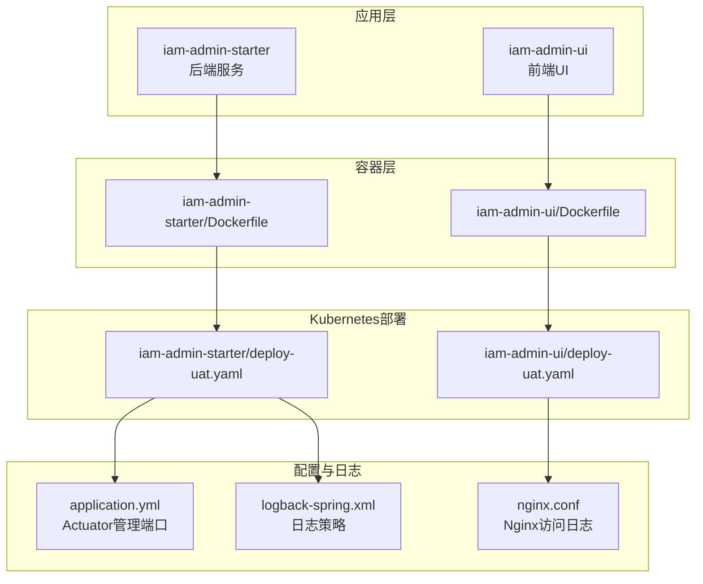
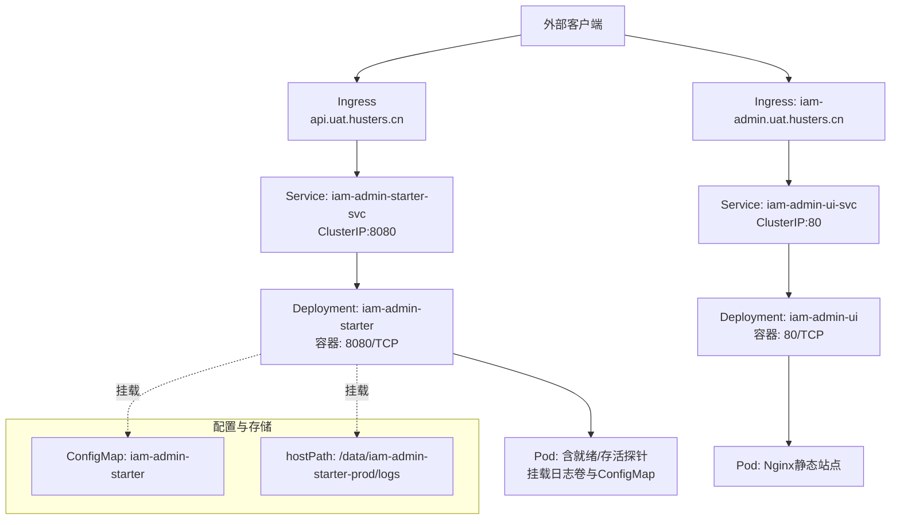
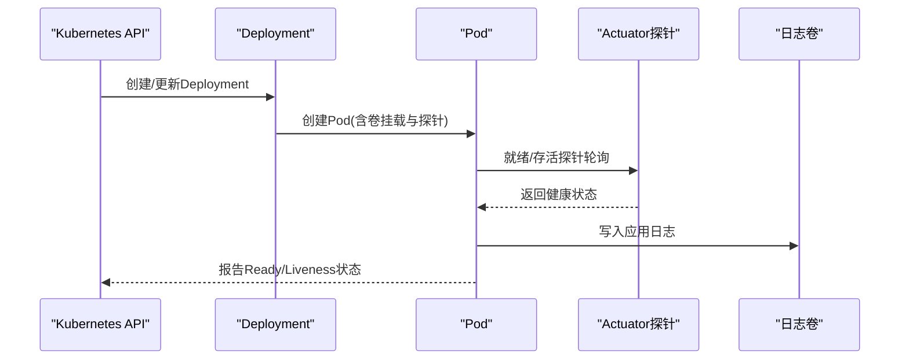
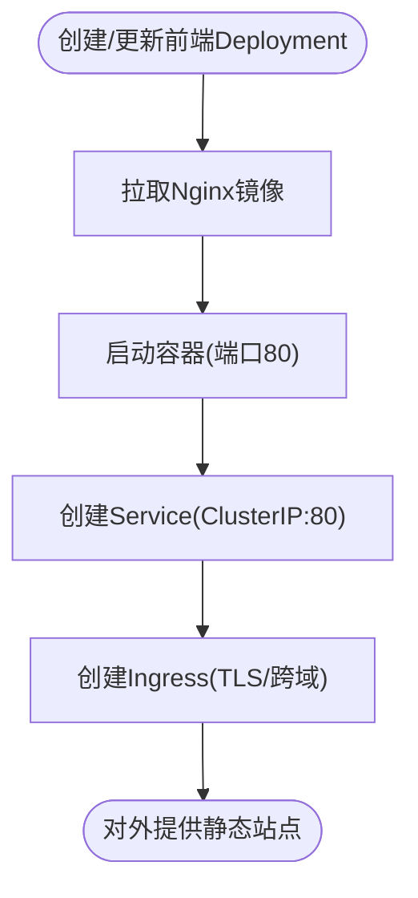
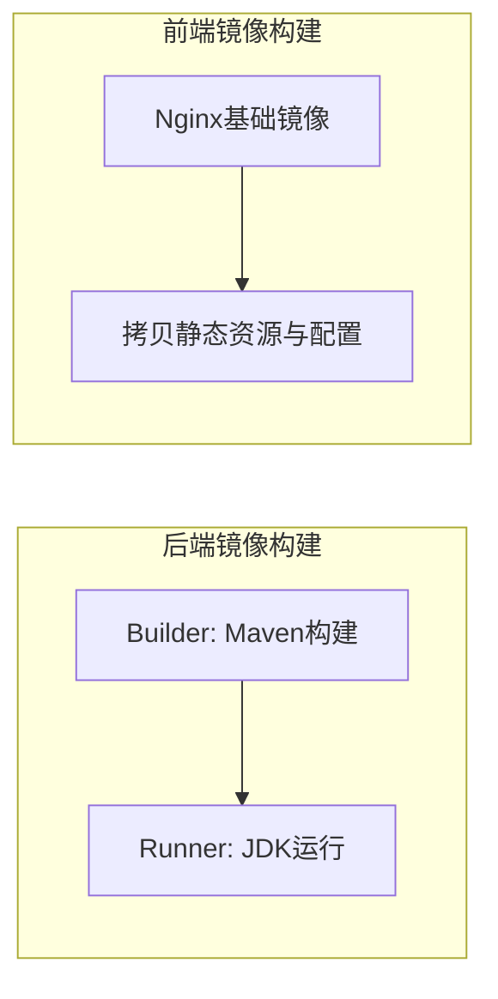
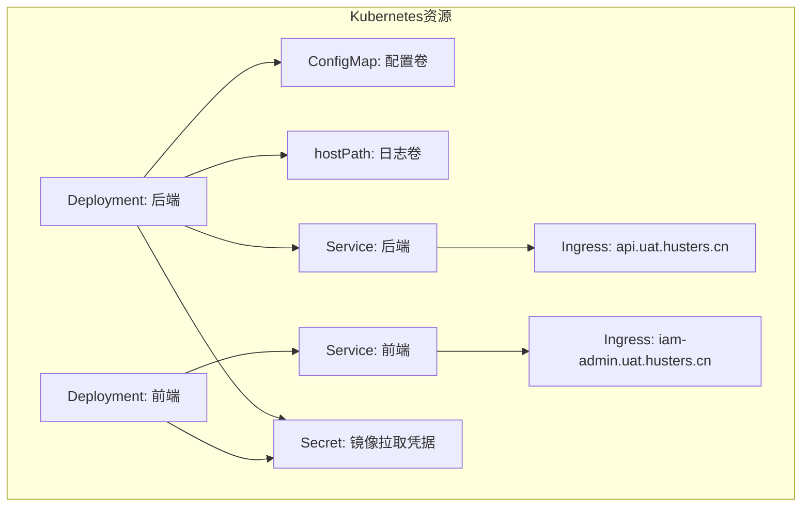

# Kubernetes集群部署

<cite>
**本文档引用的文件**
- [iam-admin-starter/deploy-uat.yaml](file://iam-admin-starter/deploy-uat.yaml)
- [iam-admin-ui/deploy-uat.yaml](file://iam-admin-ui/deploy-uat.yaml)
- [iam-admin-starter/Dockerfile](file://iam-admin-starter/Dockerfile)
- [iam-admin-ui/Dockerfile](file://iam-admin-ui/Dockerfile)
- [iam-admin-starter/src/main/resources/config/application.yml](file://iam-admin-starter/src/main/resources/config/application.yml)
- [iam-admin-starter/src/main/resources/logback-spring.xml](file://iam-admin-starter/src/main/resources/logback-spring.xml)
- [iam-admin-ui/nginx.conf](file://iam-admin-ui/nginx.conf)
- [iam-sso-starter/src/main/resources/config/application.yml](file://iam-sso-starter/src/main/resources/config/application.yml)
</cite>

## 目录
1. [简介](#简介)
2. [项目结构](#项目结构)
3. [核心组件](#核心组件)
4. [架构总览](#架构总览)
5. [详细组件分析](#详细组件分析)
6. [依赖关系分析](#依赖关系分析)
7. [性能考虑](#性能考虑)
8. [故障排查指南](#故障排查指南)
9. [结论](#结论)
10. [附录](#附录)

## 简介
本文件面向在Kubernetes集群中部署SH-IAM系统的工程实践，基于仓库内现有的UAT部署样例与容器化配置，系统性阐述Deployment、Service、Ingress等K8s资源配置要点；解释ConfigMap、Secret与持久化卷的使用；给出Helm Chart部署思路与Values.yaml配置管理建议；并提供滚动更新、蓝绿部署与金丝雀发布的实施策略；最后覆盖Pod调度、资源配额与节点亲和性配置，以及集群监控、日志收集与故障恢复机制。

## 项目结构
SH-IAM由多个子模块组成，本次部署关注与Kubernetes集成最直接的相关文件：
- 应用侧：iam-admin-starter（后端服务）、iam-admin-ui（前端静态站点）
- 容器化：各自包含Dockerfile，定义镜像构建与运行方式
- 部署样例：各自提供deploy-uat.yaml，展示Deployment、Service、Ingress的典型配置
- 配置与日志：application.yml定义Spring Boot与Actuator管理端口；日志通过logback-spring.xml与Nginx配置落地

**图表来源**
- [iam-admin-starter/Dockerfile:1-28](file://iam-admin-starter/Dockerfile#L1-L28)
- [iam-admin-ui/Dockerfile:1-15](file://iam-admin-ui/Dockerfile#L1-L15)
- [iam-admin-starter/deploy-uat.yaml:1-129](file://iam-admin-starter/deploy-uat.yaml#L1-L129)
- [iam-admin-ui/deploy-uat.yaml:1-77](file://iam-admin-ui/deploy-uat.yaml#L1-L77)
- [iam-admin-starter/src/main/resources/config/application.yml:28-52](file://iam-admin-starter/src/main/resources/config/application.yml#L28-L52)
- [iam-admin-starter/src/main/resources/logback-spring.xml:56-73](file://iam-admin-starter/src/main/resources/logback-spring.xml#L56-L73)
- [iam-admin-ui/nginx.conf:1-36](file://iam-admin-ui/nginx.conf#L1-L36)

**章节来源**
- [iam-admin-starter/deploy-uat.yaml:1-129](file://iam-admin-starter/deploy-uat.yaml#L1-L129)
- [iam-admin-ui/deploy-uat.yaml:1-77](file://iam-admin-ui/deploy-uat.yaml#L1-L77)
- [iam-admin-starter/Dockerfile:1-28](file://iam-admin-starter/Dockerfile#L1-L28)
- [iam-admin-ui/Dockerfile:1-15](file://iam-admin-ui/Dockerfile#L1-L15)
- [iam-admin-starter/src/main/resources/config/application.yml:28-52](file://iam-admin-starter/src/main/resources/config/application.yml#L28-L52)
- [iam-admin-starter/src/main/resources/logback-spring.xml:56-73](file://iam-admin-starter/src/main/resources/logback-spring.xml#L56-L73)
- [iam-admin-ui/nginx.conf:1-36](file://iam-admin-ui/nginx.conf#L1-L36)

## 核心组件
- 后端服务（iam-admin-starter）
  - 使用Deployment控制器，支持Recreate或RollingUpdate发布策略
  - 通过imagePullSecrets拉取私有镜像
  - 挂载hostPath日志卷与ConfigMap配置卷
  - 配置就绪/存活探针，管理端口独立于业务端口
- 前端UI（iam-admin-ui）
  - 使用Nginx镜像，暴露80端口
  - 部署策略为Recreate（资源受限场景）
- Service与Ingress
  - 后端Service为ClusterIP，前端Service为ClusterIP
  - Ingress通过注解启用路径重写、跨域与TLS

**章节来源**
- [iam-admin-starter/deploy-uat.yaml:3-78](file://iam-admin-starter/deploy-uat.yaml#L3-L78)
- [iam-admin-ui/deploy-uat.yaml:2-35](file://iam-admin-ui/deploy-uat.yaml#L2-L35)
- [iam-admin-starter/src/main/resources/config/application.yml:28-52](file://iam-admin-starter/src/main/resources/config/application.yml#L28-L52)

## 架构总览
下图展示了IAM后端与前端在Kubernetes中的部署关系与流量走向：

**图表来源**
- [iam-admin-starter/deploy-uat.yaml:3-129](file://iam-admin-starter/deploy-uat.yaml#L3-L129)
- [iam-admin-ui/deploy-uat.yaml:2-77](file://iam-admin-ui/deploy-uat.yaml#L2-L77)

## 详细组件分析

### 后端服务（iam-admin-starter）部署
- Deployment
  - 选择器与标签匹配，支持发布策略切换（Recreate/RollingUpdate）
  - 使用imagePullSecrets拉取镜像
  - 挂载hostPath日志卷与ConfigMap
- 探针与健康检查
  - 就绪探针与存活探针均指向独立管理端口，避免与业务端口冲突
  - 探针失败阈值与周期已配置，便于快速发现与隔离问题实例
- 环境变量与JVM选项
  - 通过环境变量注入JVM_OPTIONS，支持GC与内存参数定制
  - Spring Profile与额外配置位置通过JVM参数注入

**图表来源**
- [iam-admin-starter/deploy-uat.yaml:11-78](file://iam-admin-starter/deploy-uat.yaml#L11-L78)
- [iam-admin-starter/src/main/resources/config/application.yml:28-52](file://iam-admin-starter/src/main/resources/config/application.yml#L28-L52)

**章节来源**
- [iam-admin-starter/deploy-uat.yaml:3-78](file://iam-admin-starter/deploy-uat.yaml#L3-L78)
- [iam-admin-starter/src/main/resources/config/application.yml:28-52](file://iam-admin-starter/src/main/resources/config/application.yml#L28-L52)

### 前端UI（iam-admin-ui）部署
- Deployment
  - 单副本，容器端口80
  - 使用Nginx镜像，部署策略为Recreate
- Service与Ingress
  - Service为ClusterIP:80
  - Ingress启用TLS与基础跨域配置

**图表来源**
- [iam-admin-ui/deploy-uat.yaml:2-77](file://iam-admin-ui/deploy-uat.yaml#L2-L77)

**章节来源**
- [iam-admin-ui/deploy-uat.yaml:2-77](file://iam-admin-ui/deploy-uat.yaml#L2-L77)

### 容器化与镜像构建
- 后端镜像
  - 多阶段构建：Maven构建产物，再复制至精简JDK镜像运行
  - CMD通过环境变量注入JVM_OPTIONS
- 前端镜像
  - 基于Nginx，设置时区，拷贝静态资源与自定义nginx.conf

**图表来源**
- [iam-admin-starter/Dockerfile:1-28](file://iam-admin-starter/Dockerfile#L1-L28)
- [iam-admin-ui/Dockerfile:1-15](file://iam-admin-ui/Dockerfile#L1-L15)

**章节来源**
- [iam-admin-starter/Dockerfile:1-28](file://iam-admin-starter/Dockerfile#L1-L28)
- [iam-admin-ui/Dockerfile:1-15](file://iam-admin-ui/Dockerfile#L1-L15)

### 配置管理与持久化
- ConfigMap
  - 在后端Deployment中以卷形式挂载，用于注入配置文件（如application-uat.properties）
- Secret
  - 通过imagePullSecrets实现私有仓库访问凭证管理
- PersistentVolume（建议）
  - 当前使用hostPath挂载日志目录；生产建议使用PV/PVC与StorageClass，确保高可用与数据持久

**章节来源**
- [iam-admin-starter/deploy-uat.yaml:27-40](file://iam-admin-starter/deploy-uat.yaml#L27-L40)
- [iam-admin-starter/src/main/resources/config/application.yml](file://iam-admin-starter/src/main/resources/config/application.yml#L46)

### 监控、日志与故障恢复
- 监控与健康检查
  - Actuator管理端口独立于业务端口，便于K8s探针访问
  - 就绪/存活探针配置了合理的延迟、周期与失败阈值
- 日志
  - 后端日志落盘至挂载卷，按日期与大小滚动
  - 前端Nginx访问日志格式化，便于集中采集
- 故障恢复
  - Deployment副本数与探针失败阈值共同保障Pod健康度
  - 建议配合HPA与PodDisruptionBudget提升弹性与可用性

**章节来源**
- [iam-admin-starter/src/main/resources/config/application.yml:28-52](file://iam-admin-starter/src/main/resources/config/application.yml#L28-L52)
- [iam-admin-starter/src/main/resources/logback-spring.xml:56-73](file://iam-admin-starter/src/main/resources/logback-spring.xml#L56-L73)
- [iam-admin-ui/nginx.conf:1-36](file://iam-admin-ui/nginx.conf#L1-L36)

## 依赖关系分析
- 组件耦合
  - 后端服务依赖数据库连接配置（通过配置文件与环境变量注入）
  - 前端通过Ingress路由到后端Service
- 外部依赖
  - Ingress控制器（Nginx）与证书管理（cert-manager）
  - 私有镜像仓库凭据（Secret）

**图表来源**
- [iam-admin-starter/deploy-uat.yaml:3-129](file://iam-admin-starter/deploy-uat.yaml#L3-L129)
- [iam-admin-ui/deploy-uat.yaml:2-77](file://iam-admin-ui/deploy-uat.yaml#L2-L77)

**章节来源**
- [iam-admin-starter/deploy-uat.yaml:3-129](file://iam-admin-starter/deploy-uat.yaml#L3-L129)
- [iam-admin-ui/deploy-uat.yaml:2-77](file://iam-admin-ui/deploy-uat.yaml#L2-L77)

## 性能考虑
- JVM与GC
  - 通过JVM_OPTIONS注入GC与内存参数，建议结合业务QPS与延迟目标进行调优
- 探针与稳定性
  - 就绪/存活探针周期与阈值需与应用启动时间匹配，避免误判
- 前端性能
  - Nginx工作进程、连接数与事件模型已做优化，建议结合实际并发调整

**章节来源**
- [iam-admin-starter/deploy-uat.yaml:44-46](file://iam-admin-starter/deploy-uat.yaml#L44-L46)
- [iam-admin-ui/nginx.conf:1-36](file://iam-admin-ui/nginx.conf#L1-L36)

## 故障排查指南
- 健康检查失败
  - 检查管理端口与探针路径是否可达
  - 查看Pod重启次数与事件，定位探针超时或异常
- 日志定位
  - 后端日志位于挂载卷，按日期滚动
  - 前端访问日志格式化，便于检索错误与慢请求
- 配置生效
  - 确认ConfigMap卷挂载路径与Spring额外配置路径一致
- Ingress与TLS
  - 校验域名解析、证书Secret与Ingress注解配置

**章节来源**
- [iam-admin-starter/src/main/resources/config/application.yml:28-52](file://iam-admin-starter/src/main/resources/config/application.yml#L28-L52)
- [iam-admin-starter/src/main/resources/logback-spring.xml:56-73](file://iam-admin-starter/src/main/resources/logback-spring.xml#L56-L73)
- [iam-admin-ui/nginx.conf:1-36](file://iam-admin-ui/nginx.conf#L1-L36)

## 结论
本文基于现有UAT部署样例与容器化配置，给出了在Kubernetes中部署SH-IAM的完整实践路径。通过合理配置Deployment、Service与Ingress，结合ConfigMap、Secret与持久化卷，可实现稳定的服务交付。同时，建议在生产环境中引入Helm Chart进行统一管理，并完善滚动更新、蓝绿与金丝雀发布策略，以及更完善的监控与日志体系。

## 附录

### Helm Chart部署方案与Values.yaml配置管理
- Chart结构建议
  - 将现有deploy-uat.yaml拆分为独立模板：deployment.yaml、service.yaml、ingress.yaml、configmap.yaml、secret.yaml
  - 使用values.yaml集中管理镜像版本、副本数、探针参数、JVM选项、Ingress主机名与证书等
- Values.yaml关键项示例
  - image.repository/image.tag：镜像仓库与版本
  - replicaCount：副本数
  - imagePullSecrets：私有仓库凭据名称
  - env.JVM_OPTIONS：JVM参数
  - probes：就绪/存活探针配置
  - ingress.hosts：域名与TLS Secret
  - persistence：日志卷类型与大小（建议从hostPath迁移到PVC）
- 发布策略
  - 滚动更新：通过maxSurge与maxUnavailable控制变更速率
  - 蓝绿：通过不同标签与Service切换实现零停机
  - 金丝雀：通过Ingress权重或多Deployment并行，逐步放量

### Pod调度、资源配额与节点亲和性
- 节点亲和性与污点容忍
  - 将后端与前端分别调度到不同节点池，隔离风险
- 资源请求与限制
  - 为后端设置CPU/内存请求与限制，避免资源抢占
- PodDisruptionBudget
  - 设置最小可用副本，保障发布期间的SLA

### 集群监控、日志收集与故障恢复
- 监控
  - 开启Prometheus指标导出，结合K8s原生指标与应用Actuator端点
- 日志
  - 前端Nginx与后端应用日志统一采集，建议使用DaemonSet或Sidecar
- 故障恢复
  - 配置HPA自动扩缩容，结合PDB与探针实现自愈