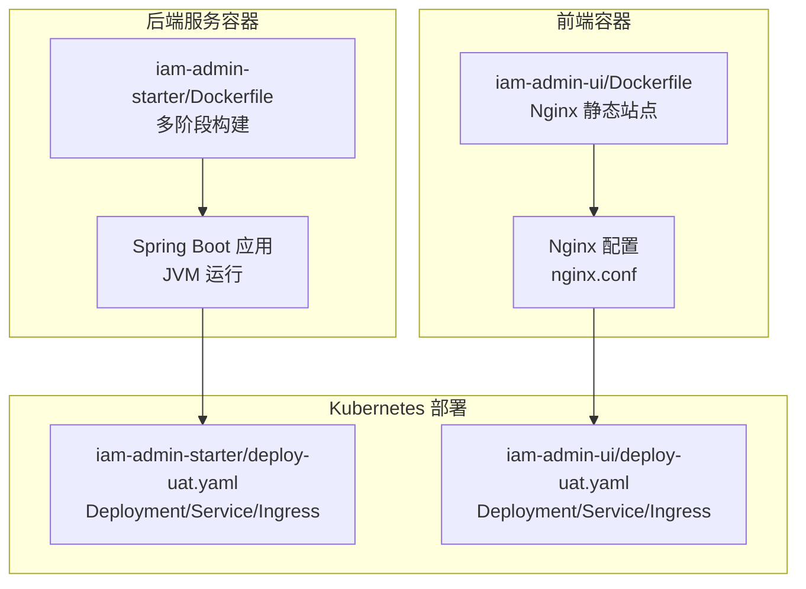
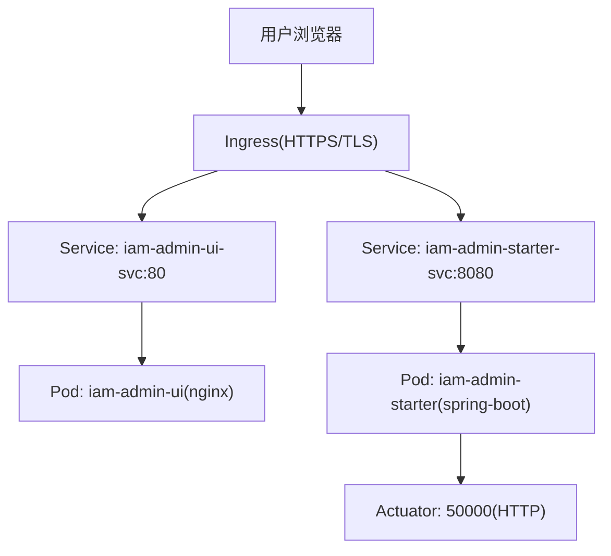
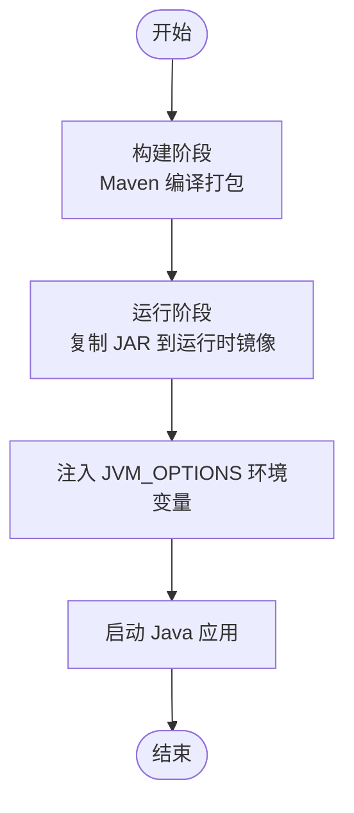
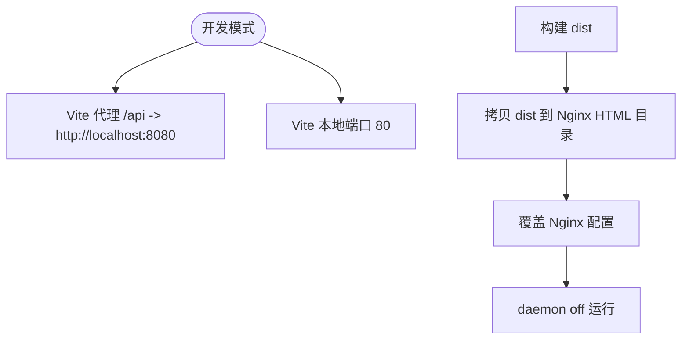
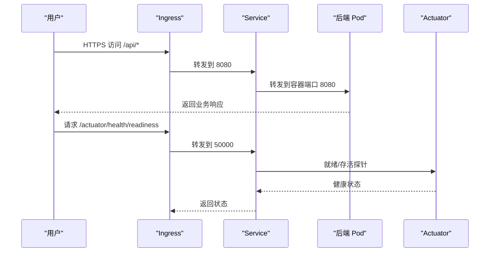
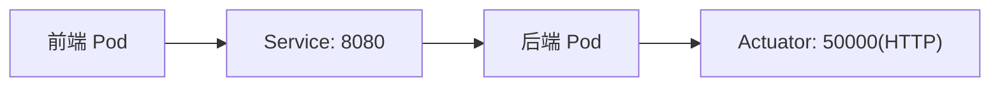
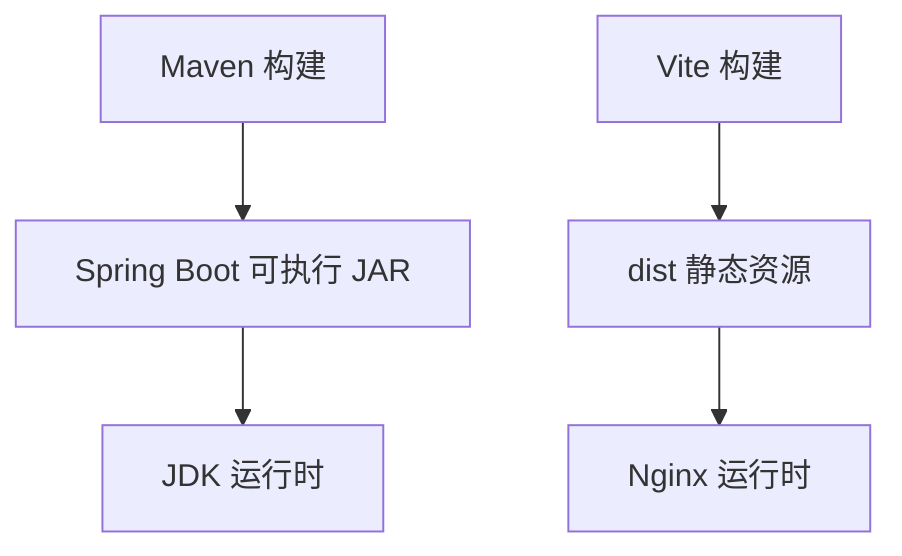

# 容器化部署

<cite>
**本文引用的文件**
- [iam-admin-starter/Dockerfile](file://iam-admin-starter/Dockerfile)
- [iam-admin-starter/deploy-uat.yaml](file://iam-admin-starter/deploy-uat.yaml)
- [iam-admin-starter/src/main/resources/config/application.yml](file://iam-admin-starter/src/main/resources/config/application.yml)
- [iam-admin-ui/Dockerfile](file://iam-admin-ui/Dockerfile)
- [iam-admin-ui/deploy-uat.yaml](file://iam-admin-ui/deploy-uat.yaml)
- [iam-admin-ui/vite.config.js](file://iam-admin-ui/vite.config.js)
</cite>

## 目录
1. [简介](#简介)
2. [项目结构](#项目结构)
3. [核心组件](#核心组件)
4. [架构总览](#架构总览)
5. [详细组件分析](#详细组件分析)
6. [依赖关系分析](#依赖关系分析)
7. [性能与资源建议](#性能与资源建议)
8. [故障排查指南](#故障排查指南)
9. [结论](#结论)
10. [附录](#附录)

## 简介
本文件面向 SH-IAM 系统的容器化部署，围绕后端 Spring Boot 应用与前端 Nginx 镜像的构建与运行进行系统性说明。内容涵盖：
- Dockerfile 多阶段构建策略、镜像优化与安全配置
- 容器运行时配置、环境变量管理与卷挂载策略
- 容器网络配置、端口映射与容器间通信
- 健康检查、重启策略与资源限制建议
- 镜像推送、版本管理与 CI/CD 流水线集成思路

## 项目结构
本次文档聚焦于两个容器化模块：
- 后端服务容器：基于 Maven 构建产物，使用 Eclipse Temurin JDK 运行
- 前端静态站点容器：基于 Nginx Alpine，提供静态资源与反向代理

图表来源
- [iam-admin-starter/Dockerfile:1-28](file://iam-admin-starter/Dockerfile#L1-L28)
- [iam-admin-ui/Dockerfile:1-15](file://iam-admin-ui/Dockerfile#L1-L15)
- [iam-admin-starter/deploy-uat.yaml:1-129](file://iam-admin-starter/deploy-uat.yaml#L1-L129)
- [iam-admin-ui/deploy-uat.yaml:1-77](file://iam-admin-ui/deploy-uat.yaml#L1-L77)

章节来源
- [iam-admin-starter/Dockerfile:1-28](file://iam-admin-starter/Dockerfile#L1-L28)
- [iam-admin-ui/Dockerfile:1-15](file://iam-admin-ui/Dockerfile#L1-L15)
- [iam-admin-starter/deploy-uat.yaml:1-129](file://iam-admin-starter/deploy-uat.yaml#L1-L129)
- [iam-admin-ui/deploy-uat.yaml:1-77](file://iam-admin-ui/deploy-uat.yaml#L1-L77)

## 核心组件
- 后端容器镜像
  - 多阶段构建：第一阶段使用 Maven 编译打包；第二阶段仅保留运行时 JRE，减小镜像体积
  - 运行命令通过环境变量注入 JVM 参数，便于不同环境差异化配置
- 前端容器镜像
  - 使用 Nginx Alpine，设置时区与静态资源目录映射
  - 通过 nginx.conf 提供反向代理与静态站点服务
- Kubernetes 部署清单
  - 后端：暴露业务端口与独立管理端口，配置就绪/存活探针，挂载日志卷与配置 ConfigMap
  - 前端：暴露 80 端口，通过 Ingress 提供域名访问

章节来源
- [iam-admin-starter/Dockerfile:1-28](file://iam-admin-starter/Dockerfile#L1-L28)
- [iam-admin-ui/Dockerfile:1-15](file://iam-admin-ui/Dockerfile#L1-L15)
- [iam-admin-starter/deploy-uat.yaml:44-77](file://iam-admin-starter/deploy-uat.yaml#L44-L77)
- [iam-admin-ui/deploy-uat.yaml:32-34](file://iam-admin-ui/deploy-uat.yaml#L32-L34)

## 架构总览
后端与前端通过 Kubernetes Service 与 Ingress 解耦，后端暴露独立管理端口用于健康检查。

图表来源
- [iam-admin-ui/deploy-uat.yaml:37-49](file://iam-admin-ui/deploy-uat.yaml#L37-L49)
- [iam-admin-ui/deploy-uat.yaml:52-77](file://iam-admin-ui/deploy-uat.yaml#L52-L77)
- [iam-admin-starter/deploy-uat.yaml:80-92](file://iam-admin-starter/deploy-uat.yaml#L80-L92)
- [iam-admin-starter/deploy-uat.yaml:93-129](file://iam-admin-starter/deploy-uat.yaml#L93-L129)
- [iam-admin-starter/src/main/resources/config/application.yml:28-52](file://iam-admin-starter/src/main/resources/config/application.yml#L28-L52)

## 详细组件分析

### 后端容器镜像构建与运行
- 多阶段构建策略
  - 构建阶段：使用 Maven 镜像编译打包，跳过测试以加速构建
  - 运行阶段：使用精简的 JDK 镜像，仅拷贝生成的可执行 JAR
- 运行时参数
  - 通过环境变量注入 JVM 选项，支持内存、垃圾回收与对象头压缩等调优
  - 启动命令采用通用的 JAR 启动方式，便于统一运维
- 安全与优化
  - 使用 Alpine 基础镜像降低攻击面与体积
  - 未设置特权模式或宿主命名空间共享，遵循最小权限原则

图表来源
- [iam-admin-starter/Dockerfile:1-28](file://iam-admin-starter/Dockerfile#L1-L28)

章节来源
- [iam-admin-starter/Dockerfile:1-28](file://iam-admin-starter/Dockerfile#L1-L28)

### 前端容器镜像构建与运行
- 基础镜像与时区
  - 使用 Nginx Alpine，设置 Asia/Shanghai 时区，确保日志时间正确
- 静态资源与配置
  - 将构建产物 dist 拷贝至 Nginx 默认站点目录
  - 通过 nginx.conf 覆盖默认配置，启用 daemon 模式
- 开发与生产差异
  - 本地开发服务器端口与代理指向后端业务端口，便于联调

图表来源
- [iam-admin-ui/Dockerfile:1-15](file://iam-admin-ui/Dockerfile#L1-L15)
- [iam-admin-ui/vite.config.js:41-53](file://iam-admin-ui/vite.config.js#L41-L53)

章节来源
- [iam-admin-ui/Dockerfile:1-15](file://iam-admin-ui/Dockerfile#L1-L15)
- [iam-admin-ui/vite.config.js:41-53](file://iam-admin-ui/vite.config.js#L41-L53)

### Kubernetes 部署与网络配置
- 后端部署
  - 环境变量：JVM_OPTIONS 注入内存与 GC 参数，同时加载额外配置位置
  - 探针：独立管理端口 50000 上配置就绪/存活探针，避免与业务端口冲突
  - 卷挂载：挂载宿主机日志目录与 ConfigMap，实现日志持久化与配置热更新
  - Ingress：TLS 与 CORS 配置，路径重写，支持跨域
- 前端部署
  - 端口：暴露 80 端口，通过 Ingress 提供域名访问
  - TLS：使用证书管理器签发证书

图表来源
- [iam-admin-starter/deploy-uat.yaml:47-70](file://iam-admin-starter/deploy-uat.yaml#L47-L70)
- [iam-admin-starter/src/main/resources/config/application.yml:28-52](file://iam-admin-starter/src/main/resources/config/application.yml#L28-L52)
- [iam-admin-ui/deploy-uat.yaml:62-77](file://iam-admin-ui/deploy-uat.yaml#L62-L77)

章节来源
- [iam-admin-starter/deploy-uat.yaml:44-77](file://iam-admin-starter/deploy-uat.yaml#L44-L77)
- [iam-admin-starter/src/main/resources/config/application.yml:28-52](file://iam-admin-starter/src/main/resources/config/application.yml#L28-L52)
- [iam-admin-ui/deploy-uat.yaml:52-77](file://iam-admin-ui/deploy-uat.yaml#L52-L77)

### 容器间通信与数据流
- 前端到后端：前端容器通过 Service 名称与端口访问后端服务
- 后端到数据库：由应用内部连接字符串与驱动配置决定，不在本文档范围内
- 健康检查：Ingress 通过独立管理端口访问 Actuator 探针，不干扰业务流量

图表来源
- [iam-admin-ui/deploy-uat.yaml:37-49](file://iam-admin-ui/deploy-uat.yaml#L37-L49)
- [iam-admin-starter/deploy-uat.yaml:80-92](file://iam-admin-starter/deploy-uat.yaml#L80-L92)
- [iam-admin-starter/src/main/resources/config/application.yml:28-52](file://iam-admin-starter/src/main/resources/config/application.yml#L28-L52)

## 依赖关系分析
- 构建依赖
  - 后端：Maven 清单与仓库配置（settings.xml）参与构建
  - 前端：Vite 构建工具链与插件生态
- 运行依赖
  - 后端：JDK 运行时、MySQL 驱动与数据库连接配置
  - 前端：Nginx 与静态资源

图表来源
- [iam-admin-starter/Dockerfile:1-28](file://iam-admin-starter/Dockerfile#L1-L28)
- [iam-admin-ui/Dockerfile:1-15](file://iam-admin-ui/Dockerfile#L1-L15)

章节来源
- [iam-admin-starter/Dockerfile:1-28](file://iam-admin-starter/Dockerfile#L1-L28)
- [iam-admin-ui/Dockerfile:1-15](file://iam-admin-ui/Dockerfile#L1-L15)

## 性能与资源建议
- JVM 参数
  - 当前通过环境变量注入内存上限与 GC 策略，建议结合压测结果调整堆大小与并发策略
- 探针频率
  - 就绪探针周期较短，存活探针周期较长，建议根据实例规模与延迟特征微调
- 镜像体积
  - 已采用多阶段构建与 Alpine 基础镜像，进一步可通过只包含必要层与清理缓存优化
- 端口分离
  - 管理端口与业务端口分离，有利于独立监控与故障定位

章节来源
- [iam-admin-starter/deploy-uat.yaml:46-70](file://iam-admin-starter/deploy-uat.yaml#L46-L70)
- [iam-admin-starter/Dockerfile:26-27](file://iam-admin-starter/Dockerfile#L26-L27)

## 故障排查指南
- 健康检查失败
  - 检查管理端口是否正确暴露与探针路径是否匹配
  - 查看 Actuator 输出与日志卷挂载是否正常
- 端口冲突或不可达
  - 确认 Service 与 Pod 端口映射一致，Ingress 路径规则与后端服务名匹配
- 前端无法访问后端接口
  - 检查 Vite 代理配置与后端服务域名解析
- 配置未生效
  - 确认 ConfigMap 挂载路径与应用加载顺序（额外配置位置）

章节来源
- [iam-admin-starter/src/main/resources/config/application.yml:28-52](file://iam-admin-starter/src/main/resources/config/application.yml#L28-L52)
- [iam-admin-starter/deploy-uat.yaml:72-77](file://iam-admin-starter/deploy-uat.yaml#L72-L77)
- [iam-admin-ui/vite.config.js:41-53](file://iam-admin-ui/vite.config.js#L41-L53)

## 结论
本文档基于现有 Dockerfile 与 Kubernetes 清单，系统梳理了 SH-IAM 的容器化部署要点：多阶段构建、运行时参数注入、独立管理端口、卷与配置挂载、探针与 Ingress 配置。建议在生产环境中补充资源限制、健康检查阈值调优与镜像签名/扫描等安全措施，并将镜像推送与版本管理纳入 CI/CD 流水线。

## 附录

### 环境变量与配置项
- JVM_OPTIONS
  - 作用：注入 JVM 内存、GC 与对象头压缩等参数
  - 来源：部署清单中的环境变量定义
- spring.config.additional-location
  - 作用：加载额外配置文件，便于多环境切换
  - 来源：部署清单中的 JVM 参数
- actuator.server.port
  - 作用：独立管理端口，避免与业务端口冲突
  - 来源：应用配置文件

章节来源
- [iam-admin-starter/deploy-uat.yaml:44-46](file://iam-admin-starter/deploy-uat.yaml#L44-L46)
- [iam-admin-starter/src/main/resources/config/application.yml:28-52](file://iam-admin-starter/src/main/resources/config/application.yml#L28-L52)