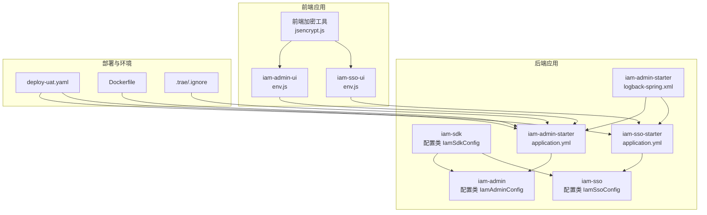
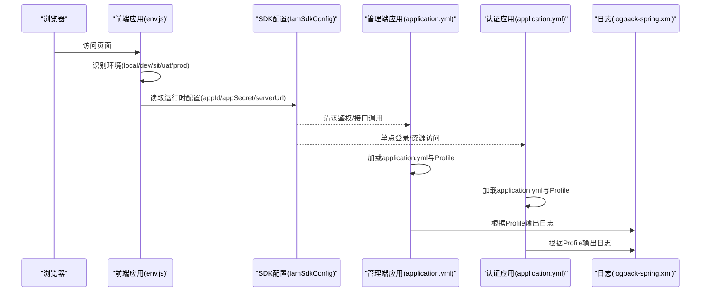
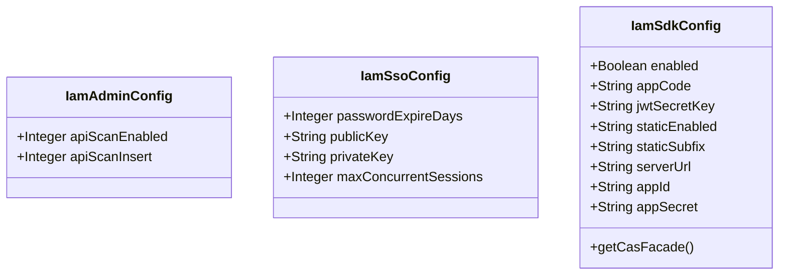
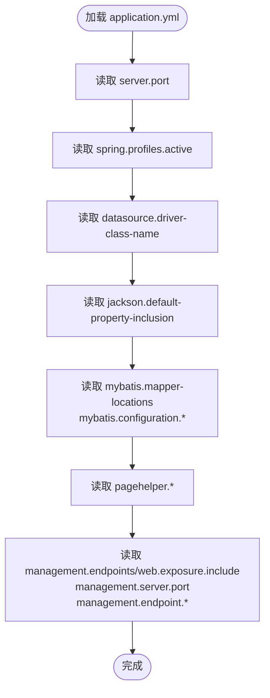
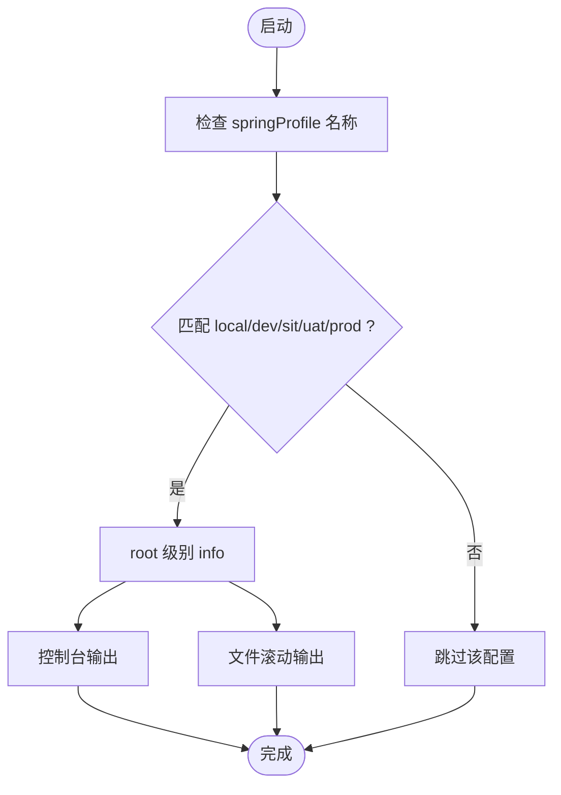
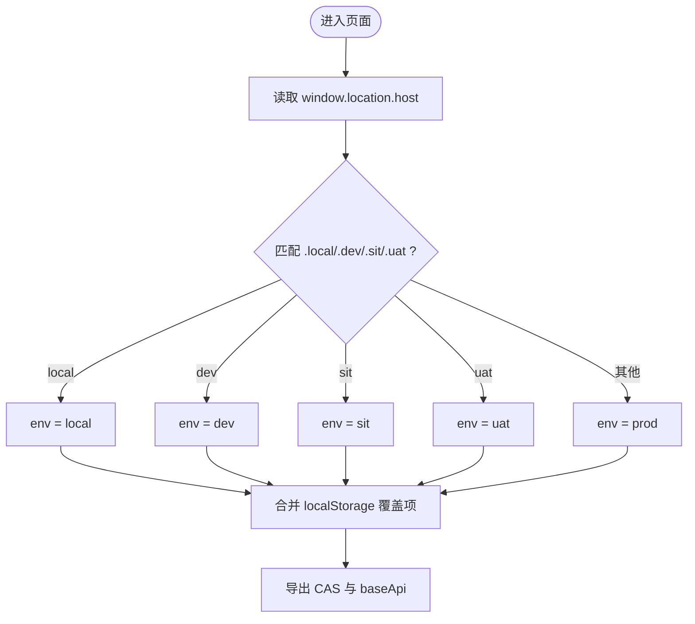
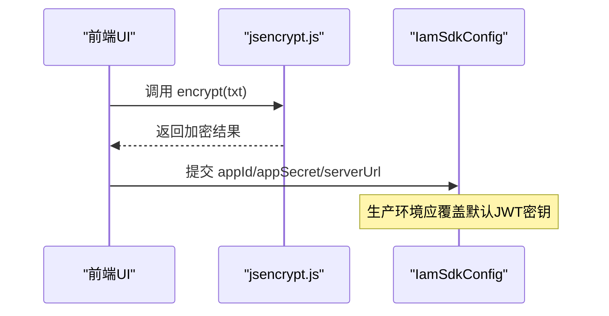
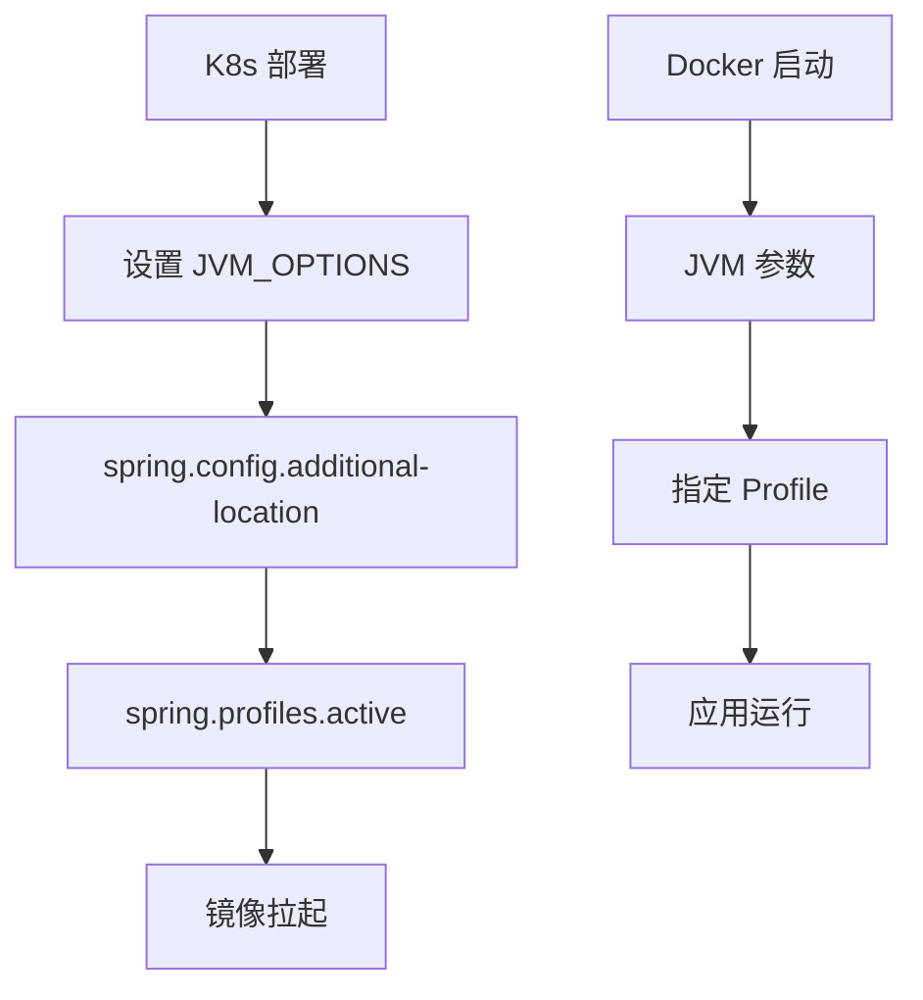
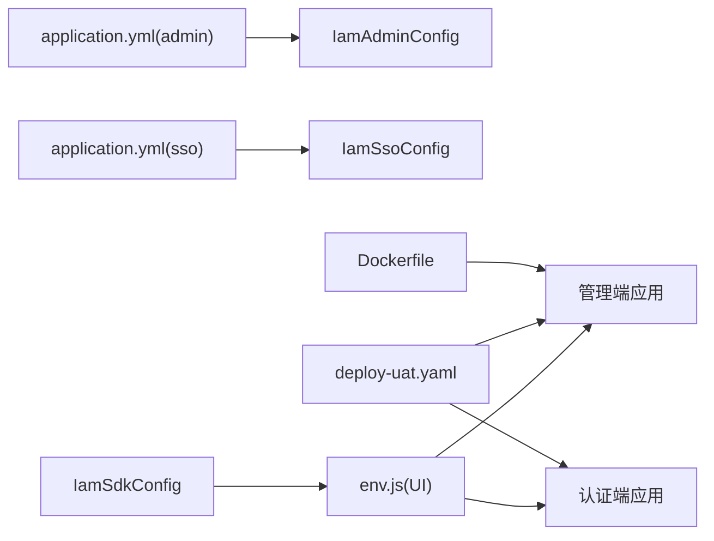

# 环境配置管理

<cite>
**本文档引用的文件**
- [application.yml](file://iam-admin-starter/src/main/resources/config/application.yml)
- [application.yml](file://iam-sso-starter/src/main/resources/config/application.yml)
- [IamAdminConfig.java](file://iam-admin/src/main/java/com/wkclz/iam/admin/config/IamAdminConfig.java)
- [IamSsoConfig.java](file://iam-sso/src/main/java/com/wkclz/iam/sso/config/IamSsoConfig.java)
- [IamSdkConfig.java](file://iam-sdk/src/main/java/com/wkclz/iam/sdk/config/IamSdkConfig.java)
- [logback-spring.xml](file://iam-admin-starter/src/main/resources/logback-spring.xml)
- [env.js](file://iam-admin-ui/env.js)
- [env.js](file://iam-sso-ui/env.js)
- [jsencrypt.js](file://iam-admin-ui/src/utils/jsencrypt.js)
- [jsencrypt.js](file://iam-sso-ui/src/utils/jsencrypt.js)
- [deploy-uat.yaml](file://iam-admin-starter/deploy-uat.yaml)
- [Dockerfile](file://iam-admin-starter/Dockerfile)
- [.ignore](file://.trae/.ignore)
</cite>

## 目录
1. [引言](#引言)
2. [项目结构](#项目结构)
3. [核心组件](#核心组件)
4. [架构总览](#架构总览)
5. [详细组件分析](#详细组件分析)
6. [依赖关系分析](#依赖关系分析)
7. [性能考虑](#性能考虑)
8. [故障排除指南](#故障排除指南)
9. [结论](#结论)
10. [附录](#附录)

## 引言
本文件面向SH-IAM系统的环境配置管理，围绕多环境配置策略（开发、测试、预发布、生产）进行系统性梳理，涵盖配置文件组织结构、配置优先级与覆盖规则、环境变量管理、敏感信息处理、配置热更新机制、配置模板与验证、配置审计、配置中心集成与动态刷新、配置版本管理、配置迁移与回滚策略以及最佳实践。文档以仓库中实际存在的配置文件与代码为依据，避免臆造信息。

## 项目结构
SH-IAM采用多模块架构，包含管理端、认证与单点登录端及其对应的UI、SDK等模块。配置管理涉及后端应用配置、前端运行时配置、容器与Kubernetes部署配置以及日志配置等层面。

**图表来源**
- [application.yml:1-52](file://iam-admin-starter/src/main/resources/config/application.yml#L1-L52)
- [application.yml:1-52](file://iam-sso-starter/src/main/resources/config/application.yml#L1-L52)
- [IamAdminConfig.java:1-18](file://iam-admin/src/main/java/com/wkclz/iam/admin/config/IamAdminConfig.java#L1-L18)
- [IamSsoConfig.java:1-29](file://iam-sso/src/main/java/com/wkclz/iam/sso/config/IamSsoConfig.java#L1-L29)
- [IamSdkConfig.java:1-62](file://iam-sdk/src/main/java/com/wkclz/iam/sdk/config/IamSdkConfig.java#L1-L62)
- [logback-spring.xml:56-73](file://iam-admin-starter/src/main/resources/logback-spring.xml#L56-L73)
- [env.js:1-39](file://iam-admin-ui/env.js#L1-L39)
- [env.js:1-39](file://iam-sso-ui/env.js#L1-L39)
- [jsencrypt.js:1-25](file://iam-admin-ui/src/utils/jsencrypt.js#L1-L25)
- [jsencrypt.js:1-25](file://iam-sso-ui/src/utils/jsencrypt.js#L1-L25)
- [deploy-uat.yaml:1-46](file://iam-admin-starter/deploy-uat.yaml#L1-L46)
- [Dockerfile:25-25](file://iam-admin-starter/Dockerfile#L25-L25)
- [.ignore:1-1](file://.trae/.ignore#L1-L1)

**章节来源**
- [application.yml:1-52](file://iam-admin-starter/src/main/resources/config/application.yml#L1-L52)
- [application.yml:1-52](file://iam-sso-starter/src/main/resources/config/application.yml#L1-L52)
- [logback-spring.xml:56-73](file://iam-admin-starter/src/main/resources/logback-spring.xml#L56-L73)
- [deploy-uat.yaml:1-46](file://iam-admin-starter/deploy-uat.yaml#L1-L46)
- [Dockerfile:25-25](file://iam-admin-starter/Dockerfile#L25-L25)
- [.ignore:1-1](file://.trae/.ignore#L1-L1)

## 核心组件
- 后端配置类：通过注解读取配置键，实现配置注入与默认值设置。
  - IamAdminConfig：管理API扫描相关配置键。
  - IamSsoConfig：管理密码过期天数、RSA密钥、最大并发会话等配置键。
  - IamSdkConfig：管理SDK开关、JWT密钥、静态资源过滤、服务端地址与应用凭证等配置键。
- 应用配置文件：定义端口、数据源驱动、Jackson序列化策略、MyBatis映射路径、分页插件、管理端点暴露与独立端口等。
- 日志配置：基于Spring Profile控制不同环境的日志级别与输出目标。
- 前端环境配置：通过env.js按URL特征识别环境并加载对应CAS与API基础路径。
- 加密工具：前端RSA加解密工具，用于敏感信息传输安全。
- 部署配置：Kubernetes YAML与Dockerfile中通过JVM参数与环境变量指定配置位置与激活Profile。

**章节来源**
- [IamAdminConfig.java:1-18](file://iam-admin/src/main/java/com/wkclz/iam/admin/config/IamAdminConfig.java#L1-L18)
- [IamSsoConfig.java:1-29](file://iam-sso/src/main/java/com/wkclz/iam/sso/config/IamSsoConfig.java#L1-L29)
- [IamSdkConfig.java:1-62](file://iam-sdk/src/main/java/com/wkclz/iam/sdk/config/IamSdkConfig.java#L1-L62)
- [application.yml:1-52](file://iam-admin-starter/src/main/resources/config/application.yml#L1-L52)
- [application.yml:1-52](file://iam-sso-starter/src/main/resources/config/application.yml#L1-L52)
- [logback-spring.xml:56-73](file://iam-admin-starter/src/main/resources/logback-spring.xml#L56-L73)
- [env.js:1-39](file://iam-admin-ui/env.js#L1-L39)
- [env.js:1-39](file://iam-sso-ui/env.js#L1-L39)
- [jsencrypt.js:1-25](file://iam-admin-ui/src/utils/jsencrypt.js#L1-L25)
- [jsencrypt.js:1-25](file://iam-sso-ui/src/utils/jsencrypt.js#L1-L25)
- [deploy-uat.yaml:1-46](file://iam-admin-starter/deploy-uat.yaml#L1-L46)
- [Dockerfile:25-25](file://iam-admin-starter/Dockerfile#L25-L25)

## 架构总览
下图展示从环境识别到配置加载、从配置注入到运行时使用的整体流程。

**图表来源**
- [env.js:1-39](file://iam-admin-ui/env.js#L1-L39)
- [env.js:1-39](file://iam-sso-ui/env.js#L1-L39)
- [IamSdkConfig.java:1-62](file://iam-sdk/src/main/java/com/wkclz/iam/sdk/config/IamSdkConfig.java#L1-L62)
- [application.yml:1-52](file://iam-admin-starter/src/main/resources/config/application.yml#L1-L52)
- [application.yml:1-52](file://iam-sso-starter/src/main/resources/config/application.yml#L1-L52)
- [logback-spring.xml:56-73](file://iam-admin-starter/src/main/resources/logback-spring.xml#L56-L73)

## 详细组件分析

### 后端配置类分析
- IamAdminConfig：通过@Value注入配置键，包含API扫描开关与插入标记，默认值为0，便于在不同环境按需开启。
- IamSsoConfig：包含密码过期天数、RSA公私钥、最大并发会话等，支持按环境调整安全策略。
- IamSdkConfig：包含SDK开关、JWT密钥、静态资源过滤正则、服务端地址与应用凭证；提供默认JWT密钥，建议在生产环境覆盖。

**图表来源**
- [IamAdminConfig.java:1-18](file://iam-admin/src/main/java/com/wkclz/iam/admin/config/IamAdminConfig.java#L1-L18)
- [IamSsoConfig.java:1-29](file://iam-sso/src/main/java/com/wkclz/iam/sso/config/IamSsoConfig.java#L1-L29)
- [IamSdkConfig.java:1-62](file://iam-sdk/src/main/java/com/wkclz/iam/sdk/config/IamSdkConfig.java#L1-L62)

**章节来源**
- [IamAdminConfig.java:1-18](file://iam-admin/src/main/java/com/wkclz/iam/admin/config/IamAdminConfig.java#L1-L18)
- [IamSsoConfig.java:1-29](file://iam-sso/src/main/java/com/wkclz/iam/sso/config/IamSsoConfig.java#L1-L29)
- [IamSdkConfig.java:1-62](file://iam-sdk/src/main/java/com/wkclz/iam/sdk/config/IamSdkConfig.java#L1-L62)

### 应用配置文件分析
- 端口与Profile：admin与sso starter均定义了server.port与spring.profiles.active，默认为local。
- 数据源与序列化：定义MySQL驱动、Jackson非空字段序列化策略。
- MyBatis与分页：mapper路径、驼峰映射、PageHelper方言与参数。
- 管理端点：暴露所有端点，独立端口50000，开启健康探测与重启能力。

**图表来源**
- [application.yml:1-52](file://iam-admin-starter/src/main/resources/config/application.yml#L1-L52)
- [application.yml:1-52](file://iam-sso-starter/src/main/resources/config/application.yml#L1-L52)

**章节来源**
- [application.yml:1-52](file://iam-admin-starter/src/main/resources/config/application.yml#L1-L52)
- [application.yml:1-52](file://iam-sso-starter/src/main/resources/config/application.yml#L1-L52)

### 日志配置分析
- Spring Profile控制：在local、dev、sit、uat、prod环境下统一输出到控制台与滚动文件。
- 文件滚动策略：按日期与大小滚动，保留历史天数与单文件大小限制。

**图表来源**
- [logback-spring.xml:56-73](file://iam-admin-starter/src/main/resources/logback-spring.xml#L56-L73)

**章节来源**
- [logback-spring.xml:56-73](file://iam-admin-starter/src/main/resources/logback-spring.xml#L56-L73)

### 前端环境配置分析
- 环境识别：通过window.location.host判断local、dev、sit、uat、prod。
- 配置映射：不同环境映射不同的CAS地址与API基础路径。
- 本地覆盖：支持localStorage覆盖CAS与API基础路径，便于联调与测试。

**图表来源**
- [env.js:1-39](file://iam-admin-ui/env.js#L1-L39)
- [env.js:1-39](file://iam-sso-ui/env.js#L1-L39)

**章节来源**
- [env.js:1-39](file://iam-admin-ui/env.js#L1-L39)
- [env.js:1-39](file://iam-sso-ui/env.js#L1-L39)

### 敏感信息与加密
- 前端RSA加解密：提供公钥加密与私钥解密工具，用于传输敏感信息。
- SDK默认JWT密钥：存在默认密钥，建议在生产环境覆盖，避免安全风险。

**图表来源**
- [jsencrypt.js:1-25](file://iam-admin-ui/src/utils/jsencrypt.js#L1-L25)
- [jsencrypt.js:1-25](file://iam-sso-ui/src/utils/jsencrypt.js#L1-L25)
- [IamSdkConfig.java:25-30](file://iam-sdk/src/main/java/com/wkclz/iam/sdk/config/IamSdkConfig.java#L25-L30)

**章节来源**
- [jsencrypt.js:1-25](file://iam-admin-ui/src/utils/jsencrypt.js#L1-L25)
- [jsencrypt.js:1-25](file://iam-sso-ui/src/utils/jsencrypt.js#L1-L25)
- [IamSdkConfig.java:25-30](file://iam-sdk/src/main/java/com/wkclz/iam/sdk/config/IamSdkConfig.java#L25-L30)

### 部署与环境变量
- Kubernetes YAML：通过JVM选项指定额外配置位置与激活Profile，实现环境隔离。
- Dockerfile：示例中通过JVM参数指定Profile，便于容器内切换环境。
- 忽略模式：Trae忽略application-*.yml，避免误提交环境特有YAML文件。

**图表来源**
- [deploy-uat.yaml:1-46](file://iam-admin-starter/deploy-uat.yaml#L1-L46)
- [Dockerfile:25-25](file://iam-admin-starter/Dockerfile#L25-L25)
- [.ignore:1-1](file://.trae/.ignore#L1-L1)

**章节来源**
- [deploy-uat.yaml:1-46](file://iam-admin-starter/deploy-uat.yaml#L1-L46)
- [Dockerfile:25-25](file://iam-admin-starter/Dockerfile#L25-L25)
- [.ignore:1-1](file://.trae/.ignore#L1-L1)

## 依赖关系分析
- 配置注入依赖：各配置类通过@Value绑定配置键，形成对application.yml与外部配置源的依赖。
- 运行时依赖：前端env.js决定SDK配置与API调用路径，间接影响后端服务调用行为。
- 部署依赖：K8s与Docker通过JVM参数与环境变量实现配置覆盖与环境切换。

**图表来源**
- [application.yml:1-52](file://iam-admin-starter/src/main/resources/config/application.yml#L1-L52)
- [application.yml:1-52](file://iam-sso-starter/src/main/resources/config/application.yml#L1-L52)
- [IamAdminConfig.java:1-18](file://iam-admin/src/main/java/com/wkclz/iam/admin/config/IamAdminConfig.java#L1-L18)
- [IamSsoConfig.java:1-29](file://iam-sso/src/main/java/com/wkclz/iam/sso/config/IamSsoConfig.java#L1-L29)
- [IamSdkConfig.java:1-62](file://iam-sdk/src/main/java/com/wkclz/iam/sdk/config/IamSdkConfig.java#L1-L62)
- [env.js:1-39](file://iam-admin-ui/env.js#L1-L39)
- [env.js:1-39](file://iam-sso-ui/env.js#L1-L39)
- [deploy-uat.yaml:1-46](file://iam-admin-starter/deploy-uat.yaml#L1-L46)
- [Dockerfile:25-25](file://iam-admin-starter/Dockerfile#L25-L25)

**章节来源**
- [application.yml:1-52](file://iam-admin-starter/src/main/resources/config/application.yml#L1-L52)
- [application.yml:1-52](file://iam-sso-starter/src/main/resources/config/application.yml#L1-L52)
- [IamAdminConfig.java:1-18](file://iam-admin/src/main/java/com/wkclz/iam/admin/config/IamAdminConfig.java#L1-L18)
- [IamSsoConfig.java:1-29](file://iam-sso/src/main/java/com/wkclz/iam/sso/config/IamSsoConfig.java#L1-L29)
- [IamSdkConfig.java:1-62](file://iam-sdk/src/main/java/com/wkclz/iam/sdk/config/IamSdkConfig.java#L1-L62)
- [env.js:1-39](file://iam-admin-ui/env.js#L1-L39)
- [env.js:1-39](file://iam-sso-ui/env.js#L1-L39)
- [deploy-uat.yaml:1-46](file://iam-admin-starter/deploy-uat.yaml#L1-L46)
- [Dockerfile:25-25](file://iam-admin-starter/Dockerfile#L25-L25)

## 性能考虑
- 独立管理端口：管理端点独立端口暴露，避免与业务端口争用，降低监控开销。
- 日志滚动：按大小与时间滚动，减少单文件过大带来的IO压力。
- Profile化日志：仅在必要环境启用详细日志，平衡可观测性与性能。

[本节为通用建议，无需特定文件引用]

## 故障排除指南
- Profile未生效：确认JVM参数或环境变量是否正确传递spring.profiles.active。
- 配置未覆盖：检查additional-location是否指向有效配置文件，且键名一致。
- 前端环境识别错误：检查URL是否包含.dev/.sit/.uat等特征，或localStorage覆盖项是否生效。
- 日志无输出：确认springProfile名称是否匹配local/dev/sit/uat/prod之一。
- SDK默认密钥风险：生产环境必须覆盖jwtSecretKey，避免被逆向推断。

**章节来源**
- [deploy-uat.yaml:44-46](file://iam-admin-starter/deploy-uat.yaml#L44-L46)
- [env.js:11-20](file://iam-admin-ui/env.js#L11-L20)
- [logback-spring.xml:66-71](file://iam-admin-starter/src/main/resources/logback-spring.xml#L66-L71)
- [IamSdkConfig.java:25-30](file://iam-sdk/src/main/java/com/wkclz/iam/sdk/config/IamSdkConfig.java#L25-L30)

## 结论
SH-IAM的配置管理以Spring Profile为核心，结合前端环境识别、容器与K8s部署参数，实现了多环境的清晰分离与可控覆盖。建议在生产环境强化敏感配置的外部化与加密、完善配置变更的审计与回滚机制，并持续优化配置模板与校验流程，确保配置治理的可追溯与高可靠。

[本节为总结，无需特定文件引用]

## 附录

### 多环境配置策略与优先级
- 环境标识：后端通过spring.profiles.active，前端通过URL特征与localStorage覆盖。
- 优先级建议（从高到低）：
  1) 容器/K8s环境变量/JVM参数
  2) 额外配置文件（spring.config.additional-location）
  3) 应用内置application.yml
  4) 配置类@Value默认值
- 覆盖规则：后加载的配置覆盖先前配置；Profile激活后，对应Profile片段生效。

**章节来源**
- [application.yml:7-8](file://iam-admin-starter/src/main/resources/config/application.yml#L7-L8)
- [application.yml:7-8](file://iam-sso-starter/src/main/resources/config/application.yml#L7-L8)
- [deploy-uat.yaml:44-46](file://iam-admin-starter/deploy-uat.yaml#L44-L46)
- [Dockerfile:25-25](file://iam-admin-starter/Dockerfile#L25-L25)

### 配置模板与验证
- 模板建议：为每个环境维护独立的application-{profile}.yml或properties文件，集中存放数据库、缓存、第三方服务等环境差异项。
- 键命名规范：采用层级化命名（如iam.sdk.xxx），提升可读性与可维护性。
- 验证机制：在启动阶段对关键配置进行存在性与格式校验，失败时阻断启动。

[本节为通用建议，无需特定文件引用]

### 配置中心与动态刷新
- 集成思路：引入Spring Cloud Config或Nacos，将敏感配置与业务配置分离，支持远程拉取与灰度发布。
- 动态刷新：结合@RefreshScope或事件监听，在不重启情况下更新配置。

[本节为通用建议，无需特定文件引用]

### 配置版本管理与迁移回滚
- 版本管理：以Git分支/标签管理配置版本，每次变更记录变更原因与责任人。
- 迁移策略：先在低环境验证，再灰度到高环境；失败立即回滚至上一稳定版本。
- 回滚步骤：恢复上一个已知稳定的配置版本，回滚相关依赖与数据结构变更。

[本节为通用建议，无需特定文件引用]

### 最佳实践清单
- 生产环境禁用默认JWT密钥，使用密文或密钥管理服务。
- 将数据库密码、第三方密钥等敏感信息置于密文存储或环境变量。
- 严格区分日志级别，避免在生产开启过详细日志。
- 所有配置变更走变更流程，保留审计轨迹。
- 在K8s中使用ConfigMap/Secret管理配置与密钥，避免硬编码。

[本节为通用建议，无需特定文件引用]