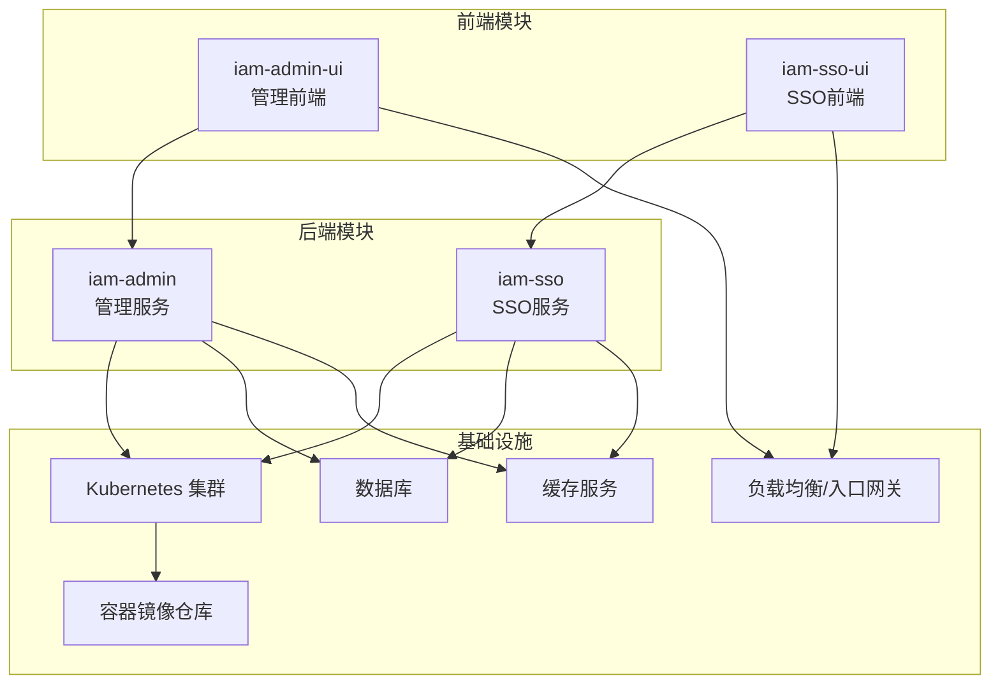
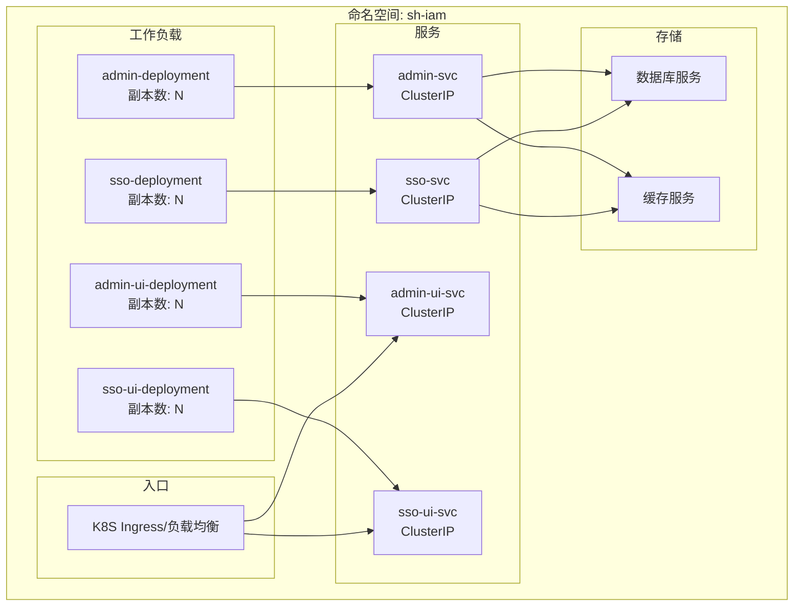
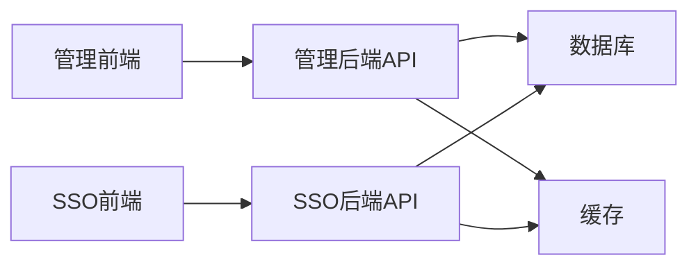

# 部署架构

<cite>
**本文引用的文件**
- [iam-admin-starter/Dockerfile](file://iam-admin-starter/Dockerfile)
- [iam-admin-starter/deploy-uat.yaml](file://iam-admin-starter/deploy-uat.yaml)
- [iam-admin-starter/src/main/resources/config/application.yml](file://iam-admin-starter/src/main/resources/config/application.yml)
- [iam-admin-starter/src/main/java/com/wkclz/iam/admin/starter/IamAdminApplication.java](file://iam-admin-starter/src/main/java/com/wkclz/iam/admin/starter/IamAdminApplication.java)
- [iam-admin-ui/Dockerfile](file://iam-admin-ui/Dockerfile)
- [iam-admin-ui/deploy-uat.yaml](file://iam-admin-ui/deploy-uat.yaml)
- [iam-admin-ui/nginx.conf](file://iam-admin-ui/nginx.conf)
- [iam-sso-starter/Dockerfile](file://iam-sso-starter/Dockerfile)
- [iam-sso-starter/deploy-uat.yaml](file://iam-sso-starter/deploy-uat.yaml)
- [iam-sso-starter/src/main/resources/config/application.yml](file://iam-sso-starter/src/main/resources/config/application.yml)
- [iam-sso-starter/src/main/java/com/wkclz/iam/sso/starter/IamSsoApplication.java](file://iam-sso-starter/src/main/java/com/wkclz/iam/sso/starter/IamSsoApplication.java)
- [iam-sso-ui/Dockerfile](file://iam-sso-ui/Dockerfile)
- [iam-sso-ui/deploy-uat.yaml](file://iam-sso-ui/deploy-uat.yaml)
- [iam-sso-ui/nginx.conf](file://iam-sso-ui/nginx.conf)
- [pom.xml](file://pom.xml)
</cite>

## 目录
1. [简介](#简介)
2. [项目结构](#项目结构)
3. [核心组件](#核心组件)
4. [架构总览](#架构总览)
5. [详细组件分析](#详细组件分析)
6. [依赖关系分析](#依赖关系分析)
7. [性能考虑](#性能考虑)
8. [故障排查指南](#故障排查指南)
9. [结论](#结论)
10. [附录](#附录)

## 简介
本文件面向SH-IAM系统的部署架构，围绕容器化与Kubernetes编排展开，系统性阐述以下内容：
- 容器镜像构建策略与制品管理
- Kubernetes部署配置（含服务暴露、副本数、健康检查）
- 单体部署与微服务部署的架构差异及适用场景
- 数据库、缓存与应用服务器的部署配置建议
- 负载均衡、高可用与故障转移机制
- 环境配置管理、配置中心与动态配置更新实践

## 项目结构
SH-IAM采用多模块分层架构，前端与后端分离，每个后端模块均提供独立的启动器与UI模块，便于容器化与Kubernetes编排。

图示来源
- [iam-admin-starter/src/main/java/com/wkclz/iam/admin/starter/IamAdminApplication.java](file://iam-admin-starter/src/main/java/com/wkclz/iam/admin/starter/IamAdminApplication.java)
- [iam-sso-starter/src/main/java/com/wkclz/iam/sso/starter/IamSsoApplication.java](file://iam-sso-starter/src/main/java/com/wkclz/iam/sso/starter/IamSsoApplication.java)

章节来源
- [pom.xml](file://pom.xml)

## 核心组件
- 管理服务（iam-admin）：提供系统管理能力，包含用户、角色、菜单、权限等CRUD接口与日志查询。
- SSO服务（iam-sso）：提供认证、会话、验证码、资源访问等能力。
- 管理前端（iam-admin-ui）：基于Vue的管理界面，通过API与管理服务交互。
- SSO前端（iam-sso-ui）：基于Vue的SSO门户与登录注册界面，通过API与SSO服务交互。

章节来源
- [iam-admin-starter/src/main/java/com/wkclz/iam/admin/starter/IamAdminApplication.java](file://iam-admin-starter/src/main/java/com/wkclz/iam/admin/starter/IamAdminApplication.java)
- [iam-sso-starter/src/main/java/com/wkclz/iam/sso/starter/IamSsoApplication.java](file://iam-sso-starter/src/main/java/com/wkclz/iam/sso/starter/IamSsoApplication.java)

## 架构总览
下图展示容器化与Kubernetes部署的整体视图，涵盖镜像构建、服务暴露、副本与健康检查、以及与数据库和缓存的连接。

图示来源
- [iam-admin-starter/deploy-uat.yaml](file://iam-admin-starter/deploy-uat.yaml)
- [iam-sso-starter/deploy-uat.yaml](file://iam-sso-starter/deploy-uat.yaml)
- [iam-admin-ui/deploy-uat.yaml](file://iam-admin-ui/deploy-uat.yaml)
- [iam-sso-ui/deploy-uat.yaml](file://iam-sso-ui/deploy-uat.yaml)

## 详细组件分析

### 容器化与镜像构建策略
- 后端服务镜像构建
  - 管理服务镜像：基于Dockerfile构建，包含JVM运行时与打包产物，暴露HTTP端口供Kubernetes就绪/存活探针使用。
  - SSO服务镜像：同上，遵循一致的构建流程与标签策略。
- 前端镜像构建
  - 管理前端镜像：基于Nginx，将构建产物静态化部署；通过nginx.conf进行基础反向代理与缓存优化。
  - SSO前端镜像：同上，静态化部署，配合入口网关统一对外暴露。
- 镜像标签与版本管理
  - 建议采用语义化版本或CI流水线生成的短提交哈希作为镜像标签，确保可追溯与回滚。

章节来源
- [iam-admin-starter/Dockerfile](file://iam-admin-starter/Dockerfile)
- [iam-sso-starter/Dockerfile](file://iam-sso-starter/Dockerfile)
- [iam-admin-ui/Dockerfile](file://iam-admin-ui/Dockerfile)
- [iam-admin-ui/nginx.conf](file://iam-admin-ui/nginx.conf)
- [iam-sso-ui/Dockerfile](file://iam-sso-ui/Dockerfile)
- [iam-sso-ui/nginx.conf](file://iam-sso-ui/nginx.conf)

### Kubernetes部署配置
- 服务与工作负载
  - 使用Deployment管理副本数与滚动升级策略，设置就绪/存活探针以保障健康状态。
  - Service采用ClusterIP暴露内部服务，结合Ingress实现外部访问。
- 环境变量与配置
  - 通过ConfigMap注入应用配置（如数据库连接、缓存地址），Secret管理敏感信息（如密钥、密码）。
  - 支持动态配置更新：当ConfigMap被修改，Pod内挂载的配置文件可结合Spring Boot的refresh特性或重启Pod生效。
- 存储与持久化
  - 数据库与缓存建议托管于集群外的云服务或共享存储，避免在Pod内直接持久化数据。

章节来源
- [iam-admin-starter/deploy-uat.yaml](file://iam-admin-starter/deploy-uat.yaml)
- [iam-sso-starter/deploy-uat.yaml](file://iam-sso-starter/deploy-uat.yaml)
- [iam-admin-ui/deploy-uat.yaml](file://iam-admin-ui/deploy-uat.yaml)
- [iam-sso-ui/deploy-uat.yaml](file://iam-sso-ui/deploy-uat.yaml)

### 单体部署 vs 微服务部署
- 单体部署
  - 将管理服务与SSO服务打包为单一镜像，减少网络跳转与运维复杂度。
  - 适合小型团队或开发测试环境，便于快速迭代。
- 微服务部署
  - 独立镜像与工作负载，按需扩展与治理，提升弹性与隔离性。
  - 适合生产环境，便于灰度发布、容量规划与故障隔离。

章节来源
- [iam-admin-starter/src/main/java/com/wkclz/iam/admin/starter/IamAdminApplication.java](file://iam-admin-starter/src/main/java/com/wkclz/iam/admin/starter/IamAdminApplication.java)
- [iam-sso-starter/src/main/java/com/wkclz/iam/sso/starter/IamSsoApplication.java](file://iam-sso-starter/src/main/java/com/wkclz/iam/sso/starter/IamSsoApplication.java)

### 数据库部署与配置
- 推荐方案
  - 使用云数据库（如RDS/Cloud SQL）或自建高可用MySQL集群，开启主从复制与备份策略。
  - 在Kubernetes中通过Secret注入连接参数，Service名称指向数据库服务。
- 连接池与超时
  - 合理配置连接池大小、连接超时与空闲回收，避免资源耗尽。
- 多环境配置
  - 开发/测试/UAT/生产使用不同ConfigMap，避免误操作。

章节来源
- [iam-admin-starter/src/main/resources/config/application.yml](file://iam-admin-starter/src/main/resources/config/application.yml)
- [iam-sso-starter/src/main/resources/config/application.yml](file://iam-sso-starter/src/main/resources/config/application.yml)

### 缓存服务部署与配置
- 推荐方案
  - 使用Redis Cluster或云Redis服务，开启持久化与备份。
  - 在Kubernetes中通过Service暴露，Secret注入认证信息。
- 缓存策略
  - 对热点数据启用TTL，对会话类数据启用过期与淘汰策略，避免内存膨胀。
- 动态配置
  - 通过ConfigMap热更新缓存地址与参数，必要时滚动重启以加载新配置。

章节来源
- [iam-admin-starter/src/main/resources/config/application.yml](file://iam-admin-starter/src/main/resources/config/application.yml)
- [iam-sso-starter/src/main/resources/config/application.yml](file://iam-sso-starter/src/main/resources/config/application.yml)

### 应用服务器部署
- JVM参数与资源限制
  - 设置合理的堆大小、GC参数与容器CPU/内存资源请求与限制，避免OOM与频繁GC。
- 日志与监控
  - 输出标准日志到stdout/stderr，结合Prometheus/Grafana采集指标，ELK收集日志。
- 健康检查
  - 就绪探针与存活探针分别用于“可接受流量”和“重启”判断，确保平滑升级。

章节来源
- [iam-admin-starter/Dockerfile](file://iam-admin-starter/Dockerfile)
- [iam-sso-starter/Dockerfile](file://iam-sso-starter/Dockerfile)

### 负载均衡、高可用与故障转移
- 负载均衡
  - 使用Ingress控制器（如Nginx/Contour/ALB）统一入口，配置TLS终止与路径转发。
- 高可用
  - 每个服务至少2-3副本，分布在不同节点与AZ，结合PodDisruptionBudget保证升级期间的可用性。
- 故障转移
  - 当Pod失败时，Kubernetes自动拉起新实例；结合探针与滚动升级策略，实现无感切换。

章节来源
- [iam-admin-ui/deploy-uat.yaml](file://iam-admin-ui/deploy-uat.yaml)
- [iam-sso-ui/deploy-uat.yaml](file://iam-sso-ui/deploy-uat.yaml)

### 环境配置管理、配置中心与动态更新
- 环境配置管理
  - 使用Kubernetes ConfigMap/Secret管理非敏感与敏感配置，按环境拆分。
- 配置中心
  - 可选引入Spring Cloud Config或Consul，集中管理配置并支持动态刷新。
- 动态配置更新
  - 修改ConfigMap后触发Pod重启或应用级refresh，确保配置生效且不中断业务。

章节来源
- [iam-admin-starter/src/main/resources/config/application.yml](file://iam-admin-starter/src/main/resources/config/application.yml)
- [iam-sso-starter/src/main/resources/config/application.yml](file://iam-sso-starter/src/main/resources/config/application.yml)

## 依赖关系分析
后端模块间无直接代码依赖，通过API与UI交互；前端模块与对应后端服务耦合度高，建议在同一命名空间内部署以便网络互通。

图示来源
- [iam-admin-starter/src/main/java/com/wkclz/iam/admin/starter/IamAdminApplication.java](file://iam-admin-starter/src/main/java/com/wkclz/iam/admin/starter/IamAdminApplication.java)
- [iam-sso-starter/src/main/java/com/wkclz/iam/sso/starter/IamSsoApplication.java](file://iam-sso-starter/src/main/java/com/wkclz/iam/sso/starter/IamSsoApplication.java)

## 性能考虑
- 资源规划
  - 基于历史QPS与响应时间估算CPU/内存需求，预留20%-50%缓冲。
- 连接池与并发
  - 数据库连接池大小与最大并发线程数匹配，避免阻塞与超时。
- 缓存命中率
  - 提升热点数据缓存命中率，降低数据库压力。
- 前端静态化
  - 前端构建产物静态化部署，结合CDN与浏览器缓存提升首屏速度。

## 故障排查指南
- 健康检查失败
  - 检查就绪/存活探针配置与端口映射，确认应用已监听正确端口。
- 配置未生效
  - 确认ConfigMap/Secret挂载路径与键名正确，必要时重启Pod。
- 数据库连接异常
  - 校验连接串、账号密码与网络连通性，检查防火墙与安全组规则。
- 缓存不可用
  - 检查Redis连接参数与ACL，确认网络策略允许访问。

章节来源
- [iam-admin-starter/deploy-uat.yaml](file://iam-admin-starter/deploy-uat.yaml)
- [iam-sso-starter/deploy-uat.yaml](file://iam-sso-starter/deploy-uat.yaml)
- [iam-admin-ui/deploy-uat.yaml](file://iam-admin-ui/deploy-uat.yaml)
- [iam-sso-ui/deploy-uat.yaml](file://iam-sso-ui/deploy-uat.yaml)

## 结论
SH-IAM提供了清晰的前后端分离与模块化架构，结合容器化与Kubernetes编排，能够灵活支持单体与微服务两种部署形态。通过标准化的镜像构建、配置管理与健康检查，可实现高可用、可扩展与易维护的生产级部署。

## 附录
- 关键部署文件清单
  - 管理服务：Dockerfile、deploy-uat.yaml、application.yml
  - SSO服务：Dockerfile、deploy-uat.yaml、application.yml
  - 管理前端：Dockerfile、deploy-uat.yaml、nginx.conf
  - SSO前端：Dockerfile、deploy-uat.yaml、nginx.conf
- 最佳实践建议
  - 统一镜像标签与CI/CD流程
  - 分环境配置与最小权限原则
  - 健全的监控告警与演练计划