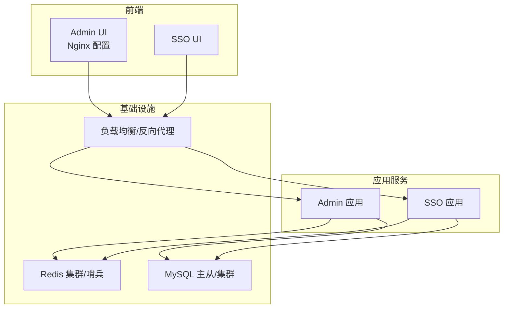
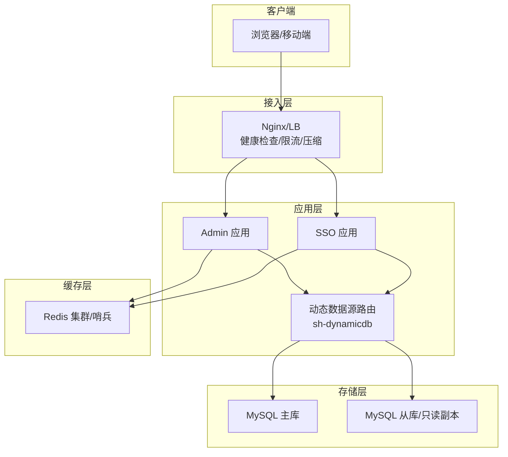
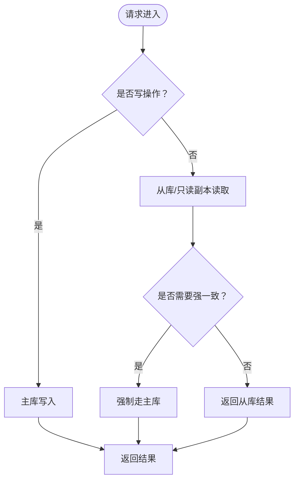
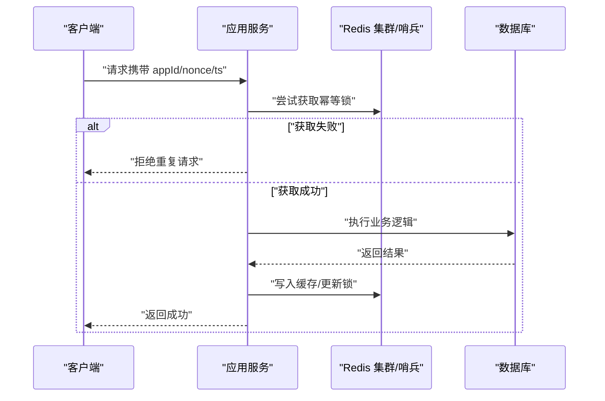
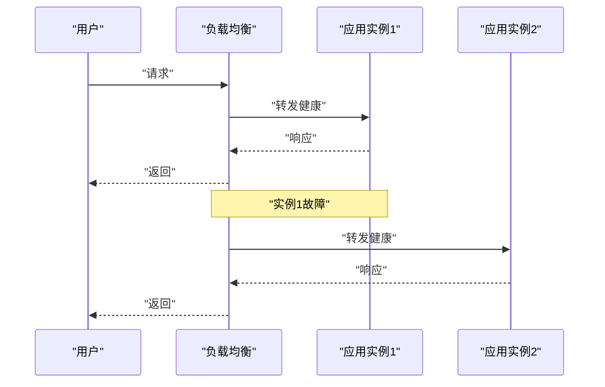
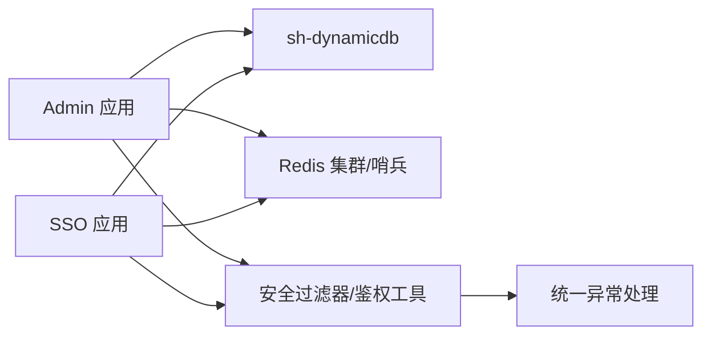

# 高可用性设计

<cite>
**本文引用的文件**
- [application.yml（IAM Admin 启动器）](file://iam-admin-starter/src/main/resources/config/application.yml)
- [application.yml（IAM SSO 启动器）](file://iam-sso-starter/src/main/resources/config/application.yml)
- [nginx.conf（IAM Admin UI）](file://iam-admin-ui/nginx.conf)
- [SKILL.md（sh-dynamicdb 动态数据源）](file://.trae/skills/sh-dynamicdb/SKILL.md)
- [IpLocalCacheHelper.java（IP 归属地缓存）](file://iam-common/src/main/java/com/wkclz/iam/common/helper/IpLocalCacheHelper.java)
- [UsernameCacheService.java（用户名缓存服务）](file://iam-sso/src/main/java/com/wkclz/iam/sso/service/UsernameCacheService.java)
- [AkSignHelper.java（AK 签名与防重放）](file://iam-sdk/src/main/java/com/wkclz/iam/sdk/helper/AkSignHelper.java)
- [database-design.md（数据库设计）](file://docs/architecture/database-design.md)
- [system-architecture.md（系统架构）](file://docs/architecture/system-architecture.md)
- [STORY-004-ip-location-cache.md（IP 归属地缓存需求）](file://docs/stories/STORY-004-ip-location-cache.md)
- [STORY-010-security-filter.md（HTTP 安全过滤器）](file://docs/stories/STORY-010-security-filter.md)
- [SKILL.md（sh-web 异常处理）](file://.trae/skills/sh-web/SKILL.md)
</cite>

## 目录
1. [引言](#引言)
2. [项目结构](#项目结构)
3. [核心组件](#核心组件)
4. [架构总览](#架构总览)
5. [详细组件分析](#详细组件分析)
6. [依赖关系分析](#依赖关系分析)
7. [性能考量](#性能考量)
8. [故障排查指南](#故障排查指南)
9. [结论](#结论)
10. [附录](#附录)

## 引言
本设计文档面向 SH-IAM 系统的高可用性目标，围绕“数据库高可用（主从复制、读写分离、集群）、缓存高可用（Redis 集群/哨兵、热点保护）、应用多实例与负载均衡、健康检查与自动恢复、降级策略、备份与灾备、业务连续性保障、性能监控与容量规划”等主题，结合仓库中的现有实现与文档进行系统化阐述。对于尚未实现但对高可用至关重要的环节（如 Redis 集群/哨兵、数据库集群、LB/HA 组件等），本文件将以“建议与最佳实践”的形式给出可落地的方案。

## 项目结构
SH-IAM 采用多模块分层架构，主要模块包括：
- IAM Admin：后台管理端（管理端应用、UI、MyBatis Mapper/XML）
- IAM SSO：认证与会话服务（登录、会话、资源、定时任务等）
- IAM SDK：对外提供的鉴权与安全过滤、会话、JWT 工具等
- IAM Common：公共实体、DTO、工具类（含 IP 归属地缓存）
- IAM Admin UI / IAM SSO UI：前端工程（含 Nginx 配置示例）
- 文档：架构设计、数据库设计、产品与规范、故事文档

图示来源
- [nginx.conf（IAM Admin UI）:67-76](file://iam-admin-ui/nginx.conf#L67-L76)
- [application.yml（IAM Admin 启动器）](file://iam-admin-starter/src/main/resources/config/application.yml)
- [application.yml（IAM SSO 启动器）](file://iam-sso-starter/src/main/resources/config/application.yml)

章节来源
- [nginx.conf（IAM Admin UI）:1-76](file://iam-admin-ui/nginx.conf#L1-L76)
- [application.yml（IAM Admin 启动器）](file://iam-admin-starter/src/main/resources/config/application.yml)
- [application.yml（IAM SSO 启动器）](file://iam-sso-starter/src/main/resources/config/application.yml)

## 核心组件
- 动态数据源路由（sh-dynamicdb）：支持运行时动态切换数据源、AOP 清理 ThreadLocal、缓存过期与异步创建，满足多租户/多数据源场景下的高可用与隔离。
- IP 归属地缓存：基于本地缓存与队列的线程安全实现，降低外部 API 调用频次，提升日志解析性能。
- 用户名缓存服务：基于 Guava Cache 的 LRU/访问频率淘汰策略，兼顾命中率与内存占用。
- AK 签名与防重放：基于 Redis 分布式锁的幂等校验，防止重放攻击。
- 安全过滤器：统一注入安全响应头与 CORS 校验，降低常见 Web 攻击面。
- 异常处理：统一异常映射与安全化输出，支持邮件告警与上下文透传。

章节来源
- [SKILL.md（sh-dynamicdb 动态数据源）:75-102](file://.trae/skills/sh-dynamicdb/SKILL.md#L75-L102)
- [IpLocalCacheHelper.java（IP 归属地缓存）:41-84](file://iam-common/src/main/java/com/wkclz/iam/common/helper/IpLocalCacheHelper.java#L41-L84)
- [UsernameCacheService.java（用户名缓存服务）:1-36](file://iam-sso/src/main/java/com/wkclz/iam/sso/service/UsernameCacheService.java#L1-L36)
- [AkSignHelper.java（AK 签名与防重放）:118-155](file://iam-sdk/src/main/java/com/wkclz/iam/sdk/helper/AkSignHelper.java#L118-L155)
- [STORY-010-security-filter.md（HTTP 安全过滤器）:1-31](file://docs/stories/STORY-010-security-filter.md#L1-L31)
- [SKILL.md（sh-web 异常处理）:31-51](file://.trae/skills/sh-web/SKILL.md#L31-L51)

## 架构总览
下图展示了 SH-IAM 的高可用架构视图：前端通过 Nginx/LB 接入，应用服务（Admin/SSO）通过动态数据源路由访问数据库；缓存层采用 Redis 集群/哨兵；安全层通过统一过滤器与鉴权工具保障请求安全；异常处理与日志统一收敛。

图示来源
- [nginx.conf（IAM Admin UI）:17-76](file://iam-admin-ui/nginx.conf#L17-L76)
- [SKILL.md（sh-dynamicdb 动态数据源）:75-102](file://.trae/skills/sh-dynamicdb/SKILL.md#L75-L102)
- [application.yml（IAM Admin 启动器）](file://iam-admin-starter/src/main/resources/config/application.yml)
- [application.yml（IAM SSO 启动器）](file://iam-sso-starter/src/main/resources/config/application.yml)

## 详细组件分析

### 数据库高可用：主从复制、读写分离与集群
- 主从复制与只读副本：通过 MySQL 主从复制构建高可用读写分离，写操作走主库，读操作走从库或只读副本，降低主库压力。
- 动态数据源路由：基于 sh-dynamicdb 的路由能力，按业务维度（租户/数据域）动态切换数据源，结合 AOP 清理 ThreadLocal，避免连接泄漏。
- 读写分离策略：
  - 明确读写路由规则（如基于注解/命名约定/上下文标识）。
  - 对于强一致要求的读请求，可临时强制走主库。
  - 对于最终一致性的读请求，优先走从库。
- 集群化建议：在主从基础上引入 MySQL Group Replication 或 Proxy（如 Vitess/MaxScale）实现自动故障转移与水平扩展。

图示来源
- [SKILL.md（sh-dynamicdb 动态数据源）:75-102](file://.trae/skills/sh-dynamicdb/SKILL.md#L75-L102)
- [database-design.md（数据库设计）](file://docs/architecture/database-design.md)

章节来源
- [SKILL.md（sh-dynamicdb 动态数据源）:75-102](file://.trae/skills/sh-dynamicdb/SKILL.md#L75-L102)
- [database-design.md（数据库设计）](file://docs/architecture/database-design.md)

### 缓存高可用：Redis 集群/哨兵与热点保护
- Redis 集群/哨兵：通过集群实现数据分片与副本冗余，通过哨兵实现主从切换与故障检测，确保缓存高可用。
- 热点保护：结合本地缓存（如 UsernameCacheService 的 Guava Cache）与分布式缓存，对热点键设置合理的 TTL 与并发访问限制，避免缓存击穿与雪崩。
- 幂等与防重放：利用 Redis 分布式锁实现请求幂等校验，防止重放攻击（见 AK 签名模块）。

图示来源
- [AkSignHelper.java（AK 签名与防重放）:118-155](file://iam-sdk/src/main/java/com/wkclz/iam/sdk/helper/AkSignHelper.java#L118-L155)
- [UsernameCacheService.java（用户名缓存服务）:1-36](file://iam-sso/src/main/java/com/wkclz/iam/sso/service/UsernameCacheService.java#L1-L36)

章节来源
- [AkSignHelper.java（AK 签名与防重放）:118-155](file://iam-sdk/src/main/java/com/wkclz/iam/sdk/helper/AkSignHelper.java#L118-L155)
- [UsernameCacheService.java（用户名缓存服务）:1-36](file://iam-sso/src/main/java/com/wkclz/iam/sso/service/UsernameCacheService.java#L1-L36)

### 应用多实例部署、负载均衡与故障转移
- 多实例部署：Admin 与 SSO 应用均支持多实例横向扩展，结合 Nginx/LB 实现流量分发。
- 健康检查：LB 层配置健康检查探针，及时摘除不健康实例；应用层可提供轻量健康检查接口。
- 故障转移：当某实例不可用时，LB 将流量转发至其他实例；应用侧通过统一异常处理与日志告警快速定位问题。
- Nginx 配置要点：启用 keepalive、gzip、epoll、多进程模型，提升并发与吞吐。

图示来源
- [nginx.conf（IAM Admin UI）:10-76](file://iam-admin-ui/nginx.conf#L10-L76)
- [application.yml（IAM Admin 启动器）](file://iam-admin-starter/src/main/resources/config/application.yml)
- [application.yml（IAM SSO 启动器）](file://iam-sso-starter/src/main/resources/config/application.yml)

章节来源
- [nginx.conf（IAM Admin UI）:1-76](file://iam-admin-ui/nginx.conf#L1-L76)
- [application.yml（IAM Admin 启动器）](file://iam-admin-starter/src/main/resources/config/application.yml)
- [application.yml（IAM SSO 启动器）](file://iam-sso-starter/src/main/resources/config/application.yml)

### 健康检查、自动恢复与降级策略
- 健康检查：LB 层与应用层分别提供健康检查端点，用于发现与剔除故障节点。
- 自动恢复：结合哨兵/集群的自动故障转移与应用自愈（重启/回滚）策略，缩短 MTTR。
- 降级策略：
  - 读降级：缓存失效时允许直连从库或降级为弱一致读。
  - 写降级：对非关键写路径降级为异步或延迟写。
  - 功能降级：缓存/鉴权/会话等模块在极端情况下可降级为最小可用能力。

章节来源
- [STORY-010-security-filter.md（HTTP 安全过滤器）:1-31](file://docs/stories/STORY-010-security-filter.md#L1-L31)
- [SKILL.md（sh-web 异常处理）:31-51](file://.trae/skills/sh-web/SKILL.md#L31-L51)

### 数据备份、灾难恢复与业务连续性
- 备份策略：数据库采用增量/全量备份，定期校验与异地容灾；缓存层通过 RDB/AOF 或集群快照实现持久化。
- 灾难恢复：制定 RTO/RPO 指标，演练主从切换、集群重建、缓存恢复流程。
- 业务连续性：多机房/多活部署，跨区域复制与流量切换预案，确保在区域性故障下仍可提供基本服务能力。

章节来源
- [database-design.md（数据库设计）](file://docs/architecture/database-design.md)
- [system-architecture.md（系统架构）](file://docs/architecture/system-architecture.md)

### 性能监控、容量规划与扩展性设计
- 监控指标：应用层（QPS/响应时间/P95/P99/错误率/GC/线程池）、数据库层（连接数/慢查询/主从延迟）、缓存层（命中率/内存使用/集群状态）、LB 层（连接数/丢包/健康探针）。
- 容量规划：基于历史峰值与增长趋势，预留 CPU/内存/IO/网络带宽；数据库与缓存按容量与性能双维度评估。
- 扩展性设计：应用侧采用无状态化与水平扩展；存储侧通过分库分表/读写分离/集群化实现纵向与横向扩展。

章节来源
- [nginx.conf（IAM Admin UI）:1-76](file://iam-admin-ui/nginx.conf#L1-L76)
- [SKILL.md（sh-dynamicdb 动态数据源）:75-102](file://.trae/skills/sh-dynamicdb/SKILL.md#L75-L102)

## 依赖关系分析
- Admin/SSO 依赖动态数据源路由以实现读写分离与多数据源隔离。
- 缓存层为 Admin/SSO 提供会话、鉴权与热点数据支撑。
- 安全过滤器与鉴权工具贯穿请求链路，统一安全策略。
- 异常处理模块提供统一错误映射与告警通道。

图示来源
- [SKILL.md（sh-dynamicdb 动态数据源）:75-102](file://.trae/skills/sh-dynamicdb/SKILL.md#L75-L102)
- [STORY-010-security-filter.md（HTTP 安全过滤器）:1-31](file://docs/stories/STORY-010-security-filter.md#L1-L31)
- [SKILL.md（sh-web 异常处理）:31-51](file://.trae/skills/sh-web/SKILL.md#L31-L51)

章节来源
- [SKILL.md（sh-dynamicdb 动态数据源）:75-102](file://.trae/skills/sh-dynamicdb/SKILL.md#L75-L102)
- [STORY-010-security-filter.md（HTTP 安全过滤器）:1-31](file://docs/stories/STORY-010-security-filter.md#L1-L31)
- [SKILL.md（sh-web 异常处理）:31-51](file://.trae/skills/sh-web/SKILL.md#L31-L51)

## 性能考量
- Nginx 层优化：启用 epoll、多进程、keepalive、gzip 压缩，合理设置缓冲区与超时，降低网络与 CPU 开销。
- 应用层优化：使用连接池、异步 I/O、缓存预热与批量加载，减少数据库与外部依赖的往返。
- 存储层优化：主从延迟监控、慢查询分析、索引与分区策略；缓存层设置合理的 TTL 与淘汰策略。
- 安全层优化：统一安全头与 CORS 校验前置，减少后续中间件负担。

章节来源
- [nginx.conf（IAM Admin UI）:1-76](file://iam-admin-ui/nginx.conf#L1-L76)
- [UsernameCacheService.java（用户名缓存服务）:1-36](file://iam-sso/src/main/java/com/wkclz/iam/sso/service/UsernameCacheService.java#L1-L36)
- [IpLocalCacheHelper.java（IP 归属地缓存）:41-84](file://iam-common/src/main/java/com/wkclz/iam/common/helper/IpLocalCacheHelper.java#L41-L84)

## 故障排查指南
- 健康检查失败：检查 LB 探针配置与应用健康端点；确认数据库/缓存连通性。
- 读写分离异常：核对路由规则与当前数据源键；检查 AOP 是否正确清理 ThreadLocal。
- 缓存穿透/击穿：检查缓存键策略与 TTL；对空值进行短 TTL 缓存；开启批量加载。
- 幂等校验失败：检查 Redis 锁是否正确释放；核对 nonce 时间戳有效期。
- 安全告警：核对安全响应头与 CORS 白名单配置；排查异常映射与日志输出。

章节来源
- [STORY-010-security-filter.md（HTTP 安全过滤器）:1-31](file://docs/stories/STORY-010-security-filter.md#L1-L31)
- [SKILL.md（sh-web 异常处理）:31-51](file://.trae/skills/sh-web/SKILL.md#L31-L51)
- [AkSignHelper.java（AK 签名与防重放）:118-155](file://iam-sdk/src/main/java/com/wkclz/iam/sdk/helper/AkSignHelper.java#L118-L155)

## 结论
SH-IAM 已具备动态数据源路由、缓存与安全过滤等高可用关键能力。结合本文提出的数据库主从/集群、Redis 集群/哨兵、LB/HA、健康检查与自动恢复、降级策略、备份与灾备、监控与容量规划建议，可进一步完善整体高可用体系，确保在高并发与复杂故障场景下保持业务连续性与用户体验。

## 附录
- 配置参考：Admin/SSO 的 application.yml 与 Nginx 配置文件可作为部署与调优的基础。
- 文档参考：数据库设计与系统架构文档提供了高层设计依据。

章节来源
- [application.yml（IAM Admin 启动器）](file://iam-admin-starter/src/main/resources/config/application.yml)
- [application.yml（IAM SSO 启动器）](file://iam-sso-starter/src/main/resources/config/application.yml)
- [nginx.conf（IAM Admin UI）:1-76](file://iam-admin-ui/nginx.conf#L1-L76)
- [database-design.md（数据库设计）](file://docs/architecture/database-design.md)
- [system-architecture.md（系统架构）](file://docs/architecture/system-architecture.md)