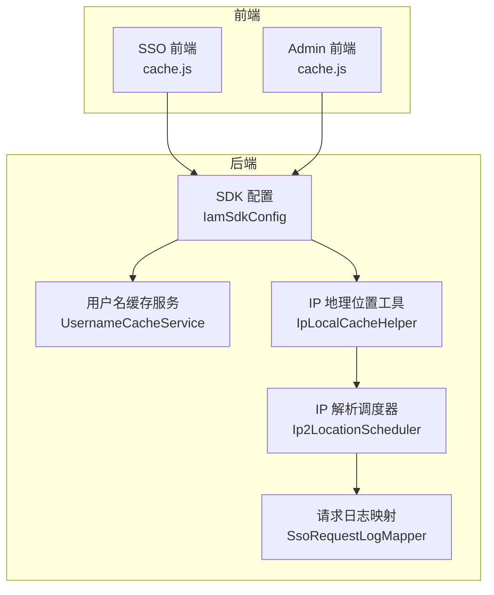
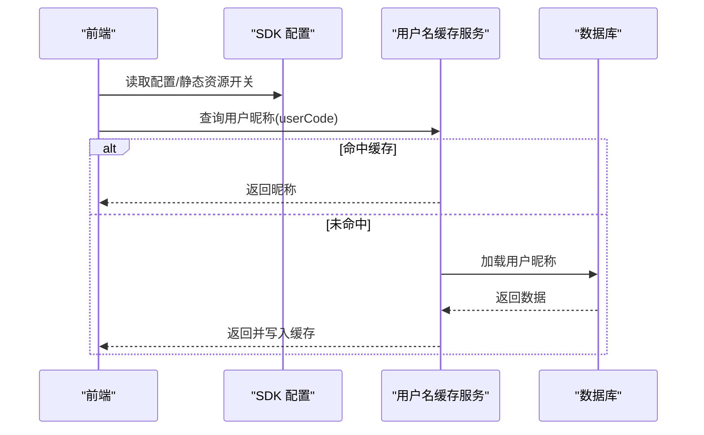
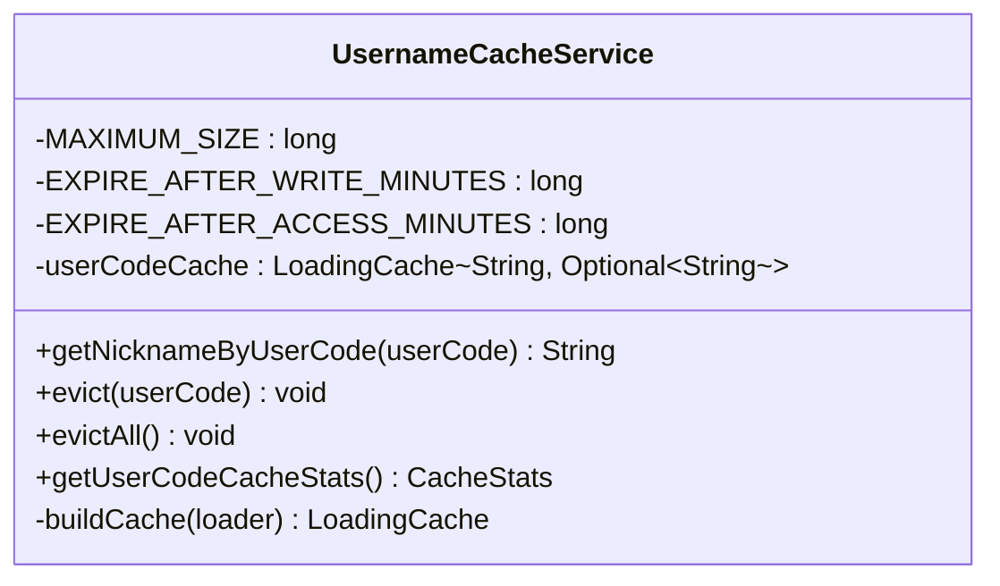
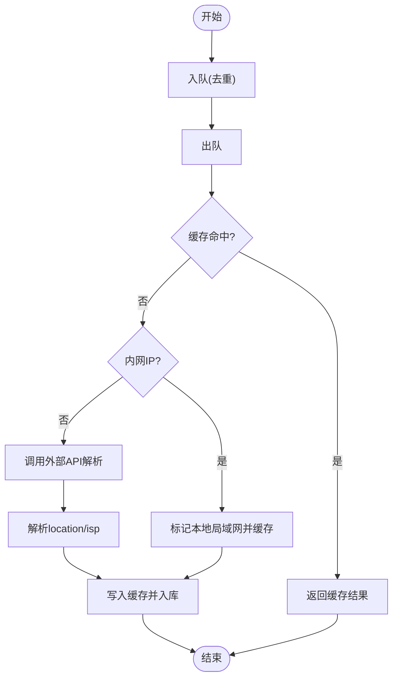
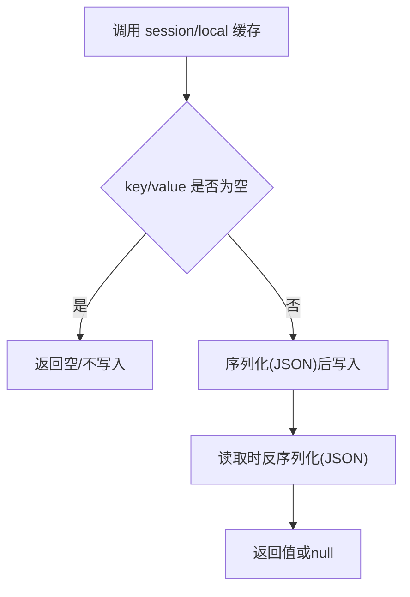
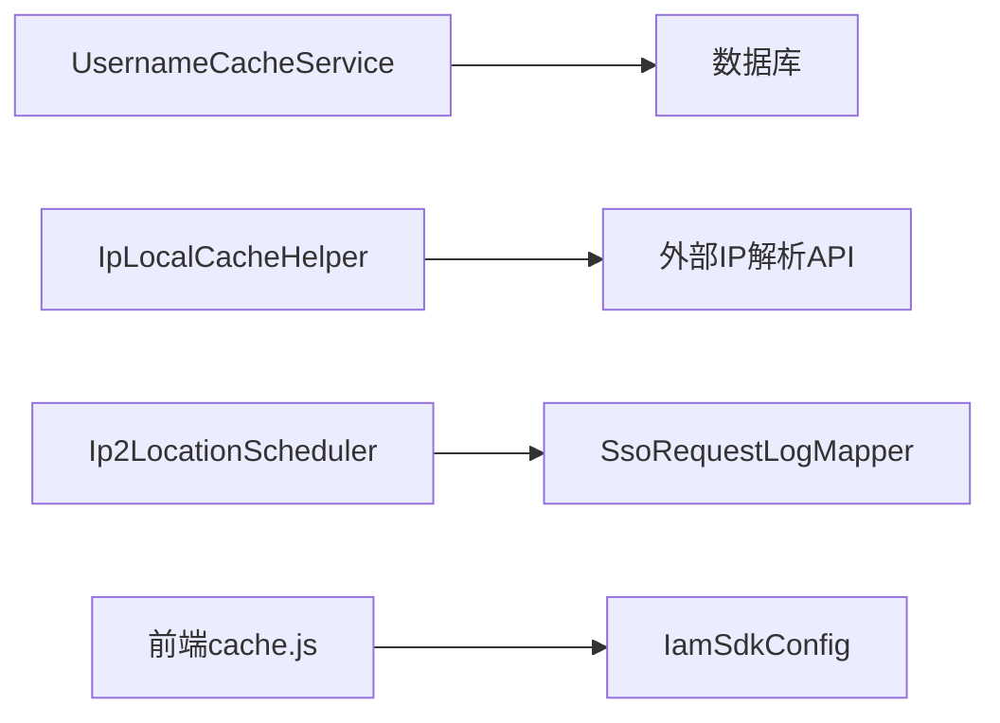

# 缓存与性能

<cite>
**本文引用的文件**
- [STORY-004-ip-location-cache.md](file://docs/stories/STORY-004-ip-location-cache.md)
- [IpLocalCacheHelper.java](file://iam-common/src/main/java/com/wkclz/iam/common/helper/IpLocalCacheHelper.java)
- [Ip2LocationScheduler.java](file://iam-sso/src/main/java/com/wkclz/iam/sso/schedule/Ip2LocationScheduler.java)
- [UsernameCacheService.java](file://iam-sso/src/main/java/com/wkclz/iam/sso/service/UsernameCacheService.java)
- [cache.js（SSO前端）](file://iam-sso-ui/src/plugins/cache.js)
- [cache.js（Admin前端）](file://iam-admin-ui/src/plugins/cache.js)
- [application.yml（SSO启动器）](file://iam-sso-starter/src/main/resources/config/application.yml)
- [application.yml（Admin启动器）](file://iam-admin-starter/src/main/resources/config/application.yml)
- [nginx.conf（Admin UI）](file://iam-admin-ui/nginx.conf)
- [IamSdkConfig.java](file://iam-sdk/src/main/java/com/wkclz/iam/sdk/config/IamSdkConfig.java)
- [SKILL.md（sh-web 异常与线程上下文）](file://.trae/skills/sh-web/SKILL.md)
- [SKILL.md（sh-mybatis 元数据缓存）](file://.trae/skills/sh-mybatis/SKILL.md)
- [SKILL.md（sh-dynamicdb 动态数据源）](file://.trae/skills/sh-dynamicdb/SKILL.md)
</cite>

## 目录
1. [简介](#简介)
2. [项目结构](#项目结构)
3. [核心组件](#核心组件)
4. [架构总览](#架构总览)
5. [组件详解](#组件详解)
6. [依赖关系分析](#依赖关系分析)
7. [性能考量](#性能考量)
8. [故障排查指南](#故障排查指南)
9. [结论](#结论)
10. [附录](#附录)

## 简介
本文件聚焦 SH-IAM 的缓存策略与性能优化，涵盖以下方面：
- Redis 缓存配置现状与建议
- 会话缓存管理（前后端）
- IP 地理位置缓存的实现与调度
- 缓存策略设计、命中率优化与并发处理
- 数据库查询优化、缓存失效机制与性能监控指标
- 性能调优建议、瓶颈分析方法与扩展性考虑
- 缓存相关配置参数与最佳实践

## 项目结构
围绕缓存与性能的关键目录与文件：
- iam-common：公共组件，包含 IP 地理位置缓存工具
- iam-sso：单点登录服务，包含用户名缓存与 IP 解析调度
- iam-sso-ui / iam-admin-ui：前端缓存插件（会话/本地存储）
- iam-sso-starter / iam-admin-starter：应用启动器配置（含示例）
- iam-sdk：SDK 配置（如静态资源开关）
- .trae/skills：框架技能文档（异常处理、线程上下文、MyBatis 元数据缓存、动态数据源）

图表来源
- [UsernameCacheService.java:1-189](file://iam-sso/src/main/java/com/wkclz/iam/sso/service/UsernameCacheService.java#L1-L189)
- [IpLocalCacheHelper.java:1-112](file://iam-common/src/main/java/com/wkclz/iam/common/helper/IpLocalCacheHelper.java#L1-L112)
- [Ip2LocationScheduler.java:1-61](file://iam-sso/src/main/java/com/wkclz/iam/sso/schedule/Ip2LocationScheduler.java#L1-L61)
- [cache.js（SSO前端）:1-79](file://iam-sso-ui/src/plugins/cache.js#L1-L79)
- [cache.js（Admin前端）:1-79](file://iam-admin-ui/src/plugins/cache.js#L1-L79)
- [IamSdkConfig.java:1-61](file://iam-sdk/src/main/java/com/wkclz/iam/sdk/config/IamSdkConfig.java#L1-L61)

章节来源
- [UsernameCacheService.java:1-189](file://iam-sso/src/main/java/com/wkclz/iam/sso/service/UsernameCacheService.java#L1-L189)
- [IpLocalCacheHelper.java:1-112](file://iam-common/src/main/java/com/wkclz/iam/common/helper/IpLocalCacheHelper.java#L1-L112)
- [Ip2LocationScheduler.java:1-61](file://iam-sso/src/main/java/com/wkclz/iam/sso/schedule/Ip2LocationScheduler.java#L1-L61)
- [cache.js（SSO前端）:1-79](file://iam-sso-ui/src/plugins/cache.js#L1-L79)
- [cache.js（Admin前端）:1-79](file://iam-admin-ui/src/plugins/cache.js#L1-L79)
- [IamSdkConfig.java:1-61](file://iam-sdk/src/main/java/com/wkclz/iam/sdk/config/IamSdkConfig.java#L1-L61)

## 核心组件
- 用户名缓存服务（Guava LoadingCache）：提供用户编码到昵称的缓存，具备容量限制、写后/访问后过期、穿透防护与批量加载能力。
- IP 地理位置缓存工具：基于并发容器与队列的本地缓存，结合后台调度器异步更新数据库。
- 前端缓存插件：基于 sessionStorage/localStorage 的会话/本地缓存封装。
- SDK 配置：提供静态资源开关、JWT 密钥等运行时参数。

章节来源
- [UsernameCacheService.java:1-189](file://iam-sso/src/main/java/com/wkclz/iam/sso/service/UsernameCacheService.java#L1-L189)
- [IpLocalCacheHelper.java:1-112](file://iam-common/src/main/java/com/wkclz/iam/common/helper/IpLocalCacheHelper.java#L1-L112)
- [cache.js（SSO前端）:1-79](file://iam-sso-ui/src/plugins/cache.js#L1-L79)
- [cache.js（Admin前端）:1-79](file://iam-admin-ui/src/plugins/cache.js#L1-L79)
- [IamSdkConfig.java:1-61](file://iam-sdk/src/main/java/com/wkclz/iam/sdk/config/IamSdkConfig.java#L1-L61)

## 架构总览
整体缓存与性能相关流程：
- 前端通过 cache.js 进行会话/本地缓存；SDK 配置影响静态资源与鉴权行为。
- 后端 UsernameCacheService 通过 Guava 缓存减少数据库访问；IP 地址解析通过 IpLocalCacheHelper 缓存，并由 Ip2LocationScheduler 异步落库。

图表来源
- [UsernameCacheService.java:64-147](file://iam-sso/src/main/java/com/wkclz/iam/sso/service/UsernameCacheService.java#L64-L147)
- [IamSdkConfig.java:1-61](file://iam-sdk/src/main/java/com/wkclz/iam/sdk/config/IamSdkConfig.java#L1-L61)

## 组件详解

### 用户名缓存服务（Guava LoadingCache）
- 缓存键：用户编码
- 缓存值：可选昵称（防穿透）
- 策略：
  - 最大容量：限制内存占用
  - 写后过期：保证最终一致性
  - 访问后过期：释放长期不活跃条目
  - 统计记录：便于监控命中率与失效情况
- 接口：
  - 单键获取、驱逐单条、清空全部、获取统计

图表来源
- [UsernameCacheService.java:34-189](file://iam-sso/src/main/java/com/wkclz/iam/sso/service/UsernameCacheService.java#L34-L189)

章节来源
- [UsernameCacheService.java:1-189](file://iam-sso/src/main/java/com/wkclz/iam/sso/service/UsernameCacheService.java#L1-L189)

### IP 地理位置缓存与调度
- 缓存结构：
  - 并发队列：待解析 IP 队列
  - 并发 Map：IP -> 请求日志（含地理位置与运营商）
- 流程：
  - offerQueue：去重入队
  - pollQueue：后台线程消费
  - getLocation：命中缓存直接返回；内网 IP 标记本地；公网 IP 调用外部接口解析并缓存
  - Ip2LocationScheduler：轮询队列，解析后更新数据库
- 注意：当前实现为本地缓存，未见 Redis 配置；若需分布式缓存，应引入 Redis 并替换本地缓存实现。

图表来源
- [IpLocalCacheHelper.java:25-110](file://iam-common/src/main/java/com/wkclz/iam/common/helper/IpLocalCacheHelper.java#L25-L110)
- [Ip2LocationScheduler.java:27-56](file://iam-sso/src/main/java/com/wkclz/iam/sso/schedule/Ip2LocationScheduler.java#L27-L56)

章节来源
- [IpLocalCacheHelper.java:1-112](file://iam-common/src/main/java/com/wkclz/iam/common/helper/IpLocalCacheHelper.java#L1-L112)
- [Ip2LocationScheduler.java:1-61](file://iam-sso/src/main/java/com/wkclz/iam/sso/schedule/Ip2LocationScheduler.java#L1-L61)
- [STORY-004-ip-location-cache.md:1-48](file://docs/stories/STORY-004-ip-location-cache.md#L1-L48)

### 前端会话与本地缓存
- 会话缓存：基于 sessionStorage
- 本地缓存：基于 localStorage
- 支持字符串与 JSON 存取、删除

图表来源
- [cache.js（SSO前端）:1-79](file://iam-sso-ui/src/plugins/cache.js#L1-L79)
- [cache.js（Admin前端）:1-79](file://iam-admin-ui/src/plugins/cache.js#L1-L79)

章节来源
- [cache.js（SSO前端）:1-79](file://iam-sso-ui/src/plugins/cache.js#L1-L79)
- [cache.js（Admin前端）:1-79](file://iam-admin-ui/src/plugins/cache.js#L1-L79)

### SDK 配置与静态资源
- 关键参数：启用开关、静态资源后缀、服务端地址、应用标识与密钥等
- 对性能的影响：静态资源缓存与压缩可降低带宽与延迟

章节来源
- [IamSdkConfig.java:1-61](file://iam-sdk/src/main/java/com/wkclz/iam/sdk/config/IamSdkConfig.java#L1-L61)

## 依赖关系分析
- UsernameCacheService 依赖数据库映射器进行懒加载与批量加载优化
- IpLocalCacheHelper 依赖网络工具与外部 API，调度器负责异步落库
- 前端 cache.js 与 SDK 配置共同影响静态资源加载与会话持久化

图表来源
- [UsernameCacheService.java:59-60](file://iam-sso/src/main/java/com/wkclz/iam/sso/service/UsernameCacheService.java#L59-L60)
- [IpLocalCacheHelper.java:22-108](file://iam-common/src/main/java/com/wkclz/iam/common/helper/IpLocalCacheHelper.java#L22-L108)
- [Ip2LocationScheduler.java:24-46](file://iam-sso/src/main/java/com/wkclz/iam/sso/schedule/Ip2LocationScheduler.java#L24-L46)
- [cache.js（SSO前端）:1-79](file://iam-sso-ui/src/plugins/cache.js#L1-L79)
- [IamSdkConfig.java:1-61](file://iam-sdk/src/main/java/com/wkclz/iam/sdk/config/IamSdkConfig.java#L1-L61)

## 性能考量

### 缓存策略设计
- 用户名缓存：容量上限 + 写后/访问后过期，适合高并发读取场景
- IP 地址缓存：本地并发容器 + 后台异步调度，避免阻塞请求路径
- 前端缓存：会话/本地存储，减少重复请求与跨页面状态丢失

章节来源
- [UsernameCacheService.java:36-49](file://iam-sso/src/main/java/com/wkclz/iam/sso/service/UsernameCacheService.java#L36-L49)
- [IpLocalCacheHelper.java:25-26](file://iam-common/src/main/java/com/wkclz/iam/common/helper/IpLocalCacheHelper.java#L25-L26)
- [cache.js（SSO前端）:1-79](file://iam-sso-ui/src/plugins/cache.js#L1-L79)

### 命中率优化
- UsernameCacheService：利用统计接口观测命中率，按需调整过期策略与容量
- IP 地址缓存：合理设置队列长度与调度间隔，避免解析积压
- 前端缓存：对高频数据采用本地缓存，会话缓存用于短期状态

章节来源
- [UsernameCacheService.java:170-175](file://iam-sso/src/main/java/com/wkclz/iam/sso/service/UsernameCacheService.java#L170-L175)
- [Ip2LocationScheduler.java:27-56](file://iam-sso/src/main/java/com/wkclz/iam/sso/schedule/Ip2LocationScheduler.java#L27-L56)

### 并发处理策略
- UsernameCacheService：基于 Guava 的并发安全与批量加载
- IP 地址缓存：并发队列 + 同步方法保证原子性
- 前端缓存：浏览器端同步 API，注意避免主线程阻塞

章节来源
- [UsernameCacheService.java:64-70](file://iam-sso/src/main/java/com/wkclz/iam/sso/service/UsernameCacheService.java#L64-L70)
- [IpLocalCacheHelper.java:29-51](file://iam-common/src/main/java/com/wkclz/iam/common/helper/IpLocalCacheHelper.java#L29-L51)

### 数据库查询优化
- MyBatis 元数据缓存：避免重复反射，提升映射效率
- 动态数据源：缓存过期与异步创建，降低切换成本
- 建议：对热点查询建立索引、使用分页与条件裁剪

章节来源
- [SKILL.md（sh-mybatis 元数据缓存）:84-99](file://.trae/skills/sh-mybatis/SKILL.md#L84-L99)
- [SKILL.md（sh-dynamicdb 动态数据源）:75-132](file://.trae/skills/sh-dynamicdb/SKILL.md#L75-L132)

### 缓存失效机制
- UsernameCacheService：单条驱逐、全量失效、统计接口
- IP 地址缓存：本地缓存按过期策略自然失效；数据库更新通过调度器异步完成
- 前端缓存：按需删除或页面关闭时清理

章节来源
- [UsernameCacheService.java:150-168](file://iam-sso/src/main/java/com/wkclz/iam/sso/service/UsernameCacheService.java#L150-L168)
- [Ip2LocationScheduler.java:44-46](file://iam-sso/src/main/java/com/wkclz/iam/sso/schedule/Ip2LocationScheduler.java#L44-L46)

### 性能监控指标
- UsernameCacheService：缓存命中率、加载次数、淘汰数、平均加载时间
- IP 地址缓存：队列长度、解析耗时、入库成功率
- 前端缓存：读写命中、存储使用量
- 建议：接入指标系统（如 Micrometer/Actuator）采集关键指标

章节来源
- [UsernameCacheService.java:170-175](file://iam-sso/src/main/java/com/wkclz/iam/sso/service/UsernameCacheService.java#L170-L175)

### 性能调优建议
- 引入 Redis 分布式缓存：替换本地缓存，提升多实例共享与一致性
- 调整过期策略：根据业务访问模式动态调整写后/访问后过期时间
- 前端静态资源：开启压缩与缓存头，减少首屏与交互延迟
- Nginx 优化：长连接、Gzip、缓冲区大小等参数调优

章节来源
- [nginx.conf（Admin UI）:35-76](file://iam-admin-ui/nginx.conf#L35-L76)

### 瓶颈分析方法
- 使用线程上下文与异常处理框架定位慢点与异常传播路径
- 结合日志滚动与告警策略，快速发现性能退化

章节来源
- [SKILL.md（sh-web 异常与线程上下文）:31-50](file://.trae/skills/sh-web/SKILL.md#L31-L50)
- [SKILL.md（sh-web 异常与线程上下文）:132-160](file://.trae/skills/sh-web/SKILL.md#L132-L160)

### 扩展性考虑
- 服务拆分：将 IP 解析与用户名解析解耦，独立扩缩容
- 多级缓存：本地缓存 + Redis 缓存 + CDN 静态资源
- 异步化：队列 + 调度器 + 批量入库，降低峰值压力

章节来源
- [Ip2LocationScheduler.java:27-56](file://iam-sso/src/main/java/com/wkclz/iam/sso/schedule/Ip2LocationScheduler.java#L27-L56)
- [UsernameCacheService.java:177-187](file://iam-sso/src/main/java/com/wkclz/iam/sso/service/UsernameCacheService.java#L177-L187)

## 故障排查指南
- IP 解析异常：检查外部 API 可达性与返回格式，确认异常分支标记为“未知”
- 缓存未命中：核对过期策略与容量上限，查看统计指标
- 前端缓存失效：确认 sessionStorage/localStorage 可用性与同源策略
- 日志与告警：依据异常处理框架定位错误上下文与请求日志

章节来源
- [IpLocalCacheHelper.java:83-107](file://iam-common/src/main/java/com/wkclz/iam/common/helper/IpLocalCacheHelper.java#L83-L107)
- [UsernameCacheService.java:170-175](file://iam-sso/src/main/java/com/wkclz/iam/sso/service/UsernameCacheService.java#L170-L175)
- [cache.js（SSO前端）:1-79](file://iam-sso-ui/src/plugins/cache.js#L1-L79)
- [SKILL.md（sh-web 异常与线程上下文）:31-50](file://.trae/skills/sh-web/SKILL.md#L31-L50)

## 结论
- 当前实现以本地缓存与异步调度为主，满足单实例场景下的性能需求
- 建议引入 Redis 分布式缓存与前端静态资源优化，进一步提升并发与用户体验
- 通过统计指标与异常处理体系，持续监控与优化缓存命中率与响应时延

## 附录

### Redis 缓存配置建议（无现有实现，建议新增）
- 连接池：最大连接数、超时时间、空闲检测
- 序列化：JSON/JSONB（视数据库而定）
- 过期策略：写后过期 + 访问后过期组合
- 分布式锁：热点键加锁，避免缓存穿透
- 命中率监控：结合指标系统采集命中率与延迟

### 会话缓存管理（前后端）
- 前端：使用 cache.js 进行会话/本地缓存，避免敏感信息明文存储
- 后端：结合 SDK 配置与会话存储，确保跨请求状态一致

章节来源
- [cache.js（SSO前端）:1-79](file://iam-sso-ui/src/plugins/cache.js#L1-L79)
- [cache.js（Admin前端）:1-79](file://iam-admin-ui/src/plugins/cache.js#L1-L79)
- [IamSdkConfig.java:1-61](file://iam-sdk/src/main/java/com/wkclz/iam/sdk/config/IamSdkConfig.java#L1-L61)

### IP 地理位置缓存实现要点
- 队列入队去重、异步解析、内网直返、外网调用 API、异常兜底
- 调度器周期性更新数据库，避免阻塞请求路径

章节来源
- [IpLocalCacheHelper.java:25-110](file://iam-common/src/main/java/com/wkclz/iam/common/helper/IpLocalCacheHelper.java#L25-L110)
- [Ip2LocationScheduler.java:27-56](file://iam-sso/src/main/java/com/wkclz/iam/sso/schedule/Ip2LocationScheduler.java#L27-L56)

### 数据库查询优化清单
- 元数据缓存：避免重复反射
- 动态数据源：缓存过期与异步创建
- 索引与分页：热点查询建立索引与分页

章节来源
- [SKILL.md（sh-mybatis 元数据缓存）:84-99](file://.trae/skills/sh-mybatis/SKILL.md#L84-L99)
- [SKILL.md（sh-dynamicdb 动态数据源）:75-132](file://.trae/skills/sh-dynamicdb/SKILL.md#L75-L132)