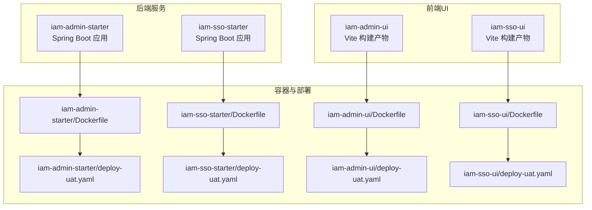
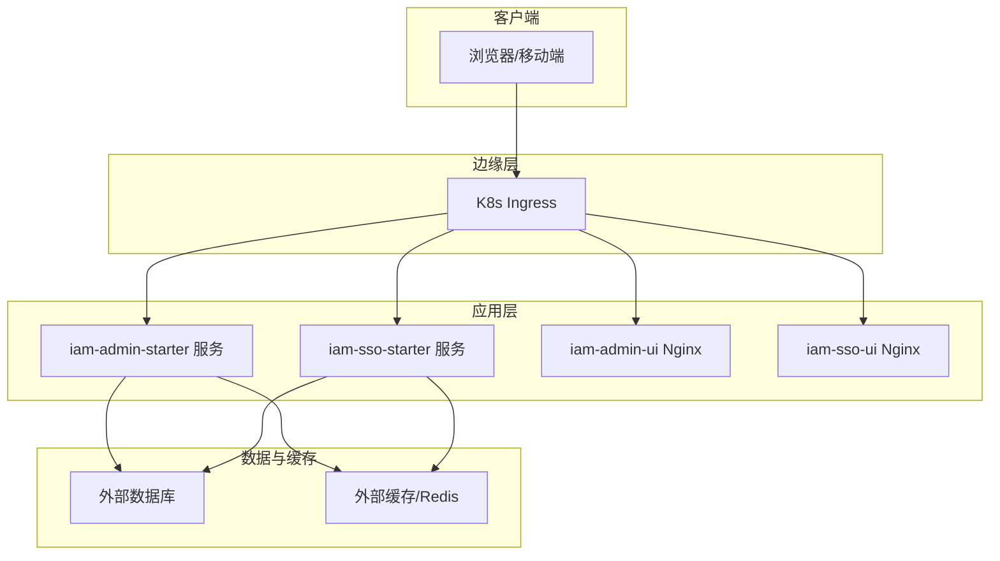
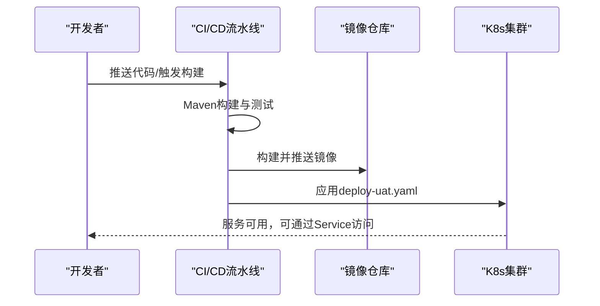
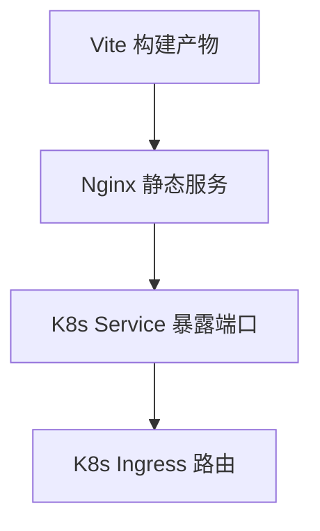
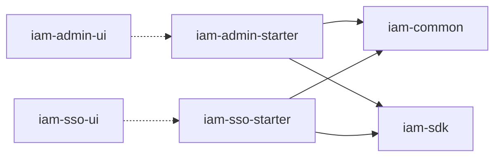

# 部署运维

<cite>
**本文引用的文件**
- [iam-admin-starter/Dockerfile](file://iam-admin-starter/Dockerfile)
- [iam-admin-starter/deploy-uat.yaml](file://iam-admin-starter/deploy-uat.yaml)
- [iam-admin-starter/src/main/resources/config/application.yml](file://iam-admin-starter/src/main/resources/config/application.yml)
- [iam-admin-starter/src/main/java/com/wkclz/iam/admin/starter/IamAdminApplication.java](file://iam-admin-starter/src/main/java/com/wkclz/iam/admin/starter/IamAdminApplication.java)
- [iam-admin-ui/Dockerfile](file://iam-admin-ui/Dockerfile)
- [iam-admin-ui/deploy-uat.yaml](file://iam-admin-ui/deploy-uat.yaml)
- [iam-admin-ui/nginx.conf](file://iam-admin-ui/nginx.conf)
- [iam-admin-ui/package.json](file://iam-admin-ui/package.json)
- [iam-sso-starter/Dockerfile](file://iam-sso-starter/Dockerfile)
- [iam-sso-starter/deploy-uat.yaml](file://iam-sso-starter/deploy-uat.yaml)
- [iam-sso-starter/src/main/resources/config/application.yml](file://iam-sso-starter/src/main/resources/config/application.yml)
- [iam-sso-starter/src/main/java/com/wkclz/iam/sso/starter/IamSsoApplication.java](file://iam-sso-starter/src/main/java/com/wkclz/iam/sso/starter/IamSsoApplication.java)
- [iam-sso-ui/Dockerfile](file://iam-sso-ui/Dockerfile)
- [iam-sso-ui/deploy-uat.yaml](file://iam-sso-ui/deploy-uat.yaml)
- [iam-sso-ui/nginx.conf](file://iam-sso-ui/nginx.conf)
- [iam-sso-ui/package.json](file://iam-sso-ui/package.json)
- [pom.xml](file://pom.xml)
</cite>

## 目录
1. [简介](#简介)
2. [项目结构](#项目结构)
3. [核心组件](#核心组件)
4. [架构总览](#架构总览)
5. [详细组件分析](#详细组件分析)
6. [依赖分析](#依赖分析)
7. [性能考虑](#性能考虑)
8. [故障排除指南](#故障排除指南)
9. [结论](#结论)
10. [附录](#附录)

## 简介
本操作指南面向SH-IAM系统的部署与运维团队，覆盖Docker容器化部署、Kubernetes（K8s）部署、环境配置管理、应用监控、数据库与缓存监控、部署配置与环境变量、运维监控与故障排除、性能调优以及CI/CD流程与版本发布策略。文档基于仓库中现有的容器化与部署文件进行梳理，并结合Spring Boot应用的通用实践给出可执行的操作步骤。

## 项目结构
SH-IAM采用多模块Maven工程组织，包含后端服务（iam-admin-starter、iam-sso-starter）、前端UI（iam-admin-ui、iam-sso-ui），以及公共模块与SDK模块。每个后端Starter均提供独立的Dockerfile与K8s部署清单，前端UI提供静态资源构建与Nginx配置示例。

图表来源
- [iam-admin-starter/Dockerfile](file://iam-admin-starter/Dockerfile)
- [iam-sso-starter/Dockerfile](file://iam-sso-starter/Dockerfile)
- [iam-admin-ui/Dockerfile](file://iam-admin-ui/Dockerfile)
- [iam-sso-ui/Dockerfile](file://iam-sso-ui/Dockerfile)
- [iam-admin-starter/deploy-uat.yaml](file://iam-admin-starter/deploy-uat.yaml)
- [iam-sso-starter/deploy-uat.yaml](file://iam-sso-starter/deploy-uat.yaml)
- [iam-admin-ui/deploy-uat.yaml](file://iam-admin-ui/deploy-uat.yaml)
- [iam-sso-ui/deploy-uat.yaml](file://iam-sso-ui/deploy-uat.yaml)

章节来源
- [pom.xml](file://pom.xml)

## 核心组件
- 后端Starter模块：分别提供管理后台与SSO服务的启动入口与配置，支持通过application.yml进行环境化配置。
- 前端UI模块：基于Vite构建，提供静态资源与Nginx配置示例，便于容器化部署。
- 容器化与K8s：每个模块均提供Dockerfile与UAT环境的K8s部署清单，便于快速上线与扩缩容。
- 公共模块与SDK：为业务模块提供实体、DTO、工具类与SSO能力封装。

章节来源
- [iam-admin-starter/src/main/java/com/wkclz/iam/admin/starter/IamAdminApplication.java](file://iam-admin-starter/src/main/java/com/wkclz/iam/admin/starter/IamAdminApplication.java)
- [iam-sso-starter/src/main/java/com/wkclz/iam/sso/starter/IamSsoApplication.java](file://iam-sso-starter/src/main/java/com/wkclz/iam/sso/starter/IamSsoApplication.java)
- [iam-admin-starter/src/main/resources/config/application.yml](file://iam-admin-starter/src/main/resources/config/application.yml)
- [iam-sso-starter/src/main/resources/config/application.yml](file://iam-sso-starter/src/main/resources/config/application.yml)

## 架构总览
下图展示容器化与K8s部署视角下的系统架构：后端Starter以无状态服务形式运行，前端UI作为静态站点提供HTTP服务，两者均可通过K8s Service暴露并配合Ingress对外提供访问；数据库与缓存由外部基础设施提供，应用通过连接串与凭据进行访问。

图表来源
- [iam-admin-starter/deploy-uat.yaml](file://iam-admin-starter/deploy-uat.yaml)
- [iam-sso-starter/deploy-uat.yaml](file://iam-sso-starter/deploy-uat.yaml)
- [iam-admin-ui/deploy-uat.yaml](file://iam-admin-ui/deploy-uat.yaml)
- [iam-sso-ui/deploy-uat.yaml](file://iam-sso-ui/deploy-uat.yaml)

## 详细组件分析

### 后端Starter（管理后台与SSO）
- 启动类：各Starter模块提供独立的Spring Boot启动类，负责加载自动配置与引导应用。
- 配置文件：application.yml用于定义数据库连接、缓存连接、日志级别、端口等基础参数；建议通过环境变量或K8s ConfigMap/Secret进行注入与覆盖。
- 容器镜像：Dockerfile基于多阶段构建，最终以精简的基础镜像运行Spring Boot应用。
- K8s部署：deploy-uat.yaml定义了Deployment、Service与必要的环境变量挂载，便于在UAT环境中快速部署。

图表来源
- [iam-admin-starter/Dockerfile](file://iam-admin-starter/Dockerfile)
- [iam-sso-starter/Dockerfile](file://iam-sso-starter/Dockerfile)
- [iam-admin-starter/deploy-uat.yaml](file://iam-admin-starter/deploy-uat.yaml)
- [iam-sso-starter/deploy-uat.yaml](file://iam-sso-starter/deploy-uat.yaml)

章节来源
- [iam-admin-starter/src/main/java/com/wkclz/iam/admin/starter/IamAdminApplication.java](file://iam-admin-starter/src/main/java/com/wkclz/iam/admin/starter/IamAdminApplication.java)
- [iam-sso-starter/src/main/java/com/wkclz/iam/sso/starter/IamSsoApplication.java](file://iam-sso-starter/src/main/java/com/wkclz/iam/sso/starter/IamSsoApplication.java)
- [iam-admin-starter/src/main/resources/config/application.yml](file://iam-admin-starter/src/main/resources/config/application.yml)
- [iam-sso-starter/src/main/resources/config/application.yml](file://iam-sso-starter/src/main/resources/config/application.yml)
- [iam-admin-starter/Dockerfile](file://iam-admin-starter/Dockerfile)
- [iam-sso-starter/Dockerfile](file://iam-sso-starter/Dockerfile)
- [iam-admin-starter/deploy-uat.yaml](file://iam-admin-starter/deploy-uat.yaml)
- [iam-sso-starter/deploy-uat.yaml](file://iam-sso-starter/deploy-uat.yaml)

### 前端UI（管理后台与SSO）
- 构建与运行：前端模块基于Vite构建，提供静态资源；Dockerfile将构建产物放入Nginx容器，实现静态站点托管。
- Nginx配置：nginx.conf提供基础的静态文件服务与反向代理示例，便于对接后端API。
- K8s部署：deploy-uat.yaml定义了前端服务的Deployment与Service，便于与后端服务协同部署。

图表来源
- [iam-admin-ui/Dockerfile](file://iam-admin-ui/Dockerfile)
- [iam-sso-ui/Dockerfile](file://iam-sso-ui/Dockerfile)
- [iam-admin-ui/nginx.conf](file://iam-admin-ui/nginx.conf)
- [iam-sso-ui/nginx.conf](file://iam-sso-ui/nginx.conf)
- [iam-admin-ui/deploy-uat.yaml](file://iam-admin-ui/deploy-uat.yaml)
- [iam-sso-ui/deploy-uat.yaml](file://iam-sso-ui/deploy-uat.yaml)

章节来源
- [iam-admin-ui/Dockerfile](file://iam-admin-ui/Dockerfile)
- [iam-sso-ui/Dockerfile](file://iam-sso-ui/Dockerfile)
- [iam-admin-ui/nginx.conf](file://iam-admin-ui/nginx.conf)
- [iam-sso-ui/nginx.conf](file://iam-sso-ui/nginx.conf)
- [iam-admin-ui/deploy-uat.yaml](file://iam-admin-ui/deploy-uat.yaml)
- [iam-sso-ui/deploy-uat.yaml](file://iam-sso-ui/deploy-uat.yaml)

### 配置与环境变量管理
- application.yml：集中存放数据库、缓存、日志、端口等配置项，建议将敏感信息（如数据库密码、缓存密码）通过环境变量注入。
- K8s集成：deploy-uat.yaml通过envFrom挂载ConfigMap与Secret，实现配置与密钥的解耦。
- 前端环境：package.json中的构建脚本与环境变量配置，确保构建时的API地址等参数正确。

章节来源
- [iam-admin-starter/src/main/resources/config/application.yml](file://iam-admin-starter/src/main/resources/config/application.yml)
- [iam-sso-starter/src/main/resources/config/application.yml](file://iam-sso-starter/src/main/resources/config/application.yml)
- [iam-admin-starter/deploy-uat.yaml](file://iam-admin-starter/deploy-uat.yaml)
- [iam-sso-starter/deploy-uat.yaml](file://iam-sso-starter/deploy-uat.yaml)
- [iam-admin-ui/package.json](file://iam-admin-ui/package.json)
- [iam-sso-ui/package.json](file://iam-sso-ui/package.json)

### 监控与可观测性
- 应用监控：建议在K8s中启用HPA与PodDisruptionBudget，结合Prometheus/Grafana对CPU、内存、请求速率与错误率进行采集与告警。
- 数据库监控：通过外部数据库提供的监控面板或云厂商监控服务，关注慢查询、连接数、锁等待等指标。
- 缓存监控：针对Redis等缓存组件，关注命中率、内存使用、命令耗时与连接池状态等指标。

[本节为通用运维建议，不直接分析具体文件，故无“章节来源”]

### 运维监控与故障排除
- 健康检查：K8s readiness/liveness探针可用于快速发现异常实例并重启。
- 日志采集：建议统一接入日志收集系统，按应用与环境聚合日志，便于定位问题。
- 故障排查步骤：
  - 检查Pod状态与事件
  - 查看应用日志与错误堆栈
  - 校验数据库与缓存连通性
  - 回滚至上一个稳定版本

[本节为通用运维建议，不直接分析具体文件，故无“章节来源”]

### 性能调优
- JVM参数：根据容器CPU/内存限制合理设置JVM堆大小与GC参数。
- 连接池：调整数据库与缓存连接池大小，避免过度连接导致资源争用。
- 前端优化：开启静态资源压缩与缓存策略，减少首屏加载时间。

[本节为通用性能建议，不直接分析具体文件，故无“章节来源”]

## 依赖分析
- 模块间关系：后端Starter模块彼此独立，前端UI模块亦独立于后端；公共模块与SDK模块为业务与工具能力提供支撑。
- 外部依赖：数据库与缓存由外部基础设施提供，应用通过连接串与凭据访问。

图表来源
- [pom.xml](file://pom.xml)

章节来源
- [pom.xml](file://pom.xml)

## 性能考虑
- 容器资源配额：为Starter与UI容器设置合理的requests/limits，避免资源抢占。
- 数据库与缓存：优化查询SQL与索引，合理设置缓存失效策略与预热机制。
- 前端静态资源：利用CDN与缓存头，提升用户访问体验。

[本节为通用性能建议，不直接分析具体文件，故无“章节来源”]

## 故障排除指南
- 启动失败：检查application.yml与环境变量是否正确注入，确认数据库与缓存可达。
- 502/503：检查Ingress配置与后端Service端口映射，确认Pod健康状态。
- 登录/鉴权异常：核对SSO服务与前端UI的API路由与跨域配置。
- 日志定位：查看容器日志与应用日志，结合错误码与堆栈信息定位问题。

[本节为通用故障排除建议，不直接分析具体文件，故无“章节来源”]

## 结论
通过Docker容器化与K8s部署清单，SH-IAM实现了后端服务与前端UI的标准化交付。结合环境变量与ConfigMap/Secret的配置管理、完善的监控与日志体系，以及明确的故障排除与性能调优策略，可有效保障系统的稳定性与可维护性。

[本节为总结性内容，不直接分析具体文件，故无“章节来源”]

## 附录

### Docker容器化部署步骤
- 构建镜像
  - 后端Starter：在对应模块根目录执行构建命令，生成Docker镜像。
  - 前端UI：在对应UI模块根目录执行构建命令，生成静态资源并打包为Nginx镜像。
- 推送镜像：将镜像推送到企业镜像仓库。
- 应用部署：使用deploy-uat.yaml在目标命名空间创建Deployment与Service。

章节来源
- [iam-admin-starter/Dockerfile](file://iam-admin-starter/Dockerfile)
- [iam-sso-starter/Dockerfile](file://iam-sso-starter/Dockerfile)
- [iam-admin-ui/Dockerfile](file://iam-admin-ui/Dockerfile)
- [iam-sso-ui/Dockerfile](file://iam-sso-ui/Dockerfile)
- [iam-admin-starter/deploy-uat.yaml](file://iam-admin-starter/deploy-uat.yaml)
- [iam-sso-starter/deploy-uat.yaml](file://iam-sso-starter/deploy-uat.yaml)
- [iam-admin-ui/deploy-uat.yaml](file://iam-admin-ui/deploy-uat.yaml)
- [iam-sso-ui/deploy-uat.yaml](file://iam-sso-ui/deploy-uat.yaml)

### Kubernetes部署要点
- 命名空间与资源隔离：为不同环境划分命名空间，避免资源冲突。
- 服务暴露：通过Service与Ingress对外提供访问，配置TLS与限流策略。
- 存储与持久化：数据库与缓存由外部提供，应用无需持久卷；如需日志持久化，可配置Sidecar或外部存储。
- 扩缩容策略：结合HPA与手动扩缩容，确保流量波动下的稳定性。

章节来源
- [iam-admin-starter/deploy-uat.yaml](file://iam-admin-starter/deploy-uat.yaml)
- [iam-sso-starter/deploy-uat.yaml](file://iam-sso-starter/deploy-uat.yaml)
- [iam-admin-ui/deploy-uat.yaml](file://iam-admin-ui/deploy-uat.yaml)
- [iam-sso-ui/deploy-uat.yaml](file://iam-sso-ui/deploy-uat.yaml)

### 环境变量与配置文件管理
- application.yml：集中管理非敏感配置；敏感信息通过环境变量注入。
- K8s ConfigMap/Secret：将配置与密钥解耦，支持滚动更新。
- 前端构建：通过package.json中的脚本与环境变量，确保构建产物指向正确的后端API地址。

章节来源
- [iam-admin-starter/src/main/resources/config/application.yml](file://iam-admin-starter/src/main/resources/config/application.yml)
- [iam-sso-starter/src/main/resources/config/application.yml](file://iam-sso-starter/src/main/resources/config/application.yml)
- [iam-admin-ui/package.json](file://iam-admin-ui/package.json)
- [iam-sso-ui/package.json](file://iam-sso-ui/package.json)

### CI/CD流程与版本发布策略
- 流水线阶段：代码提交 → 自动构建与测试 → 镜像构建与推送 → K8s部署 → 健康检查 → 发布完成。
- 版本策略：采用语义化版本号，主版本用于破坏性变更，次版本用于功能新增，修订版本用于缺陷修复。
- 回滚策略：保留最近若干个镜像版本，出现严重问题时快速回滚至上一个稳定版本。

[本节为通用CI/CD与版本策略建议，不直接分析具体文件，故无“章节来源”]