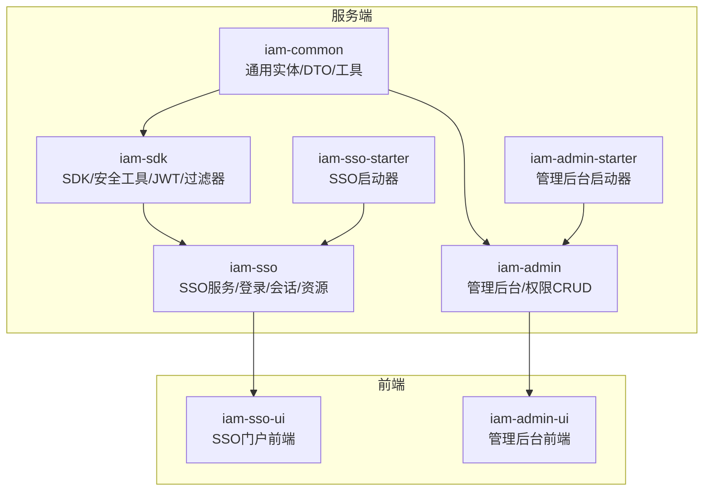
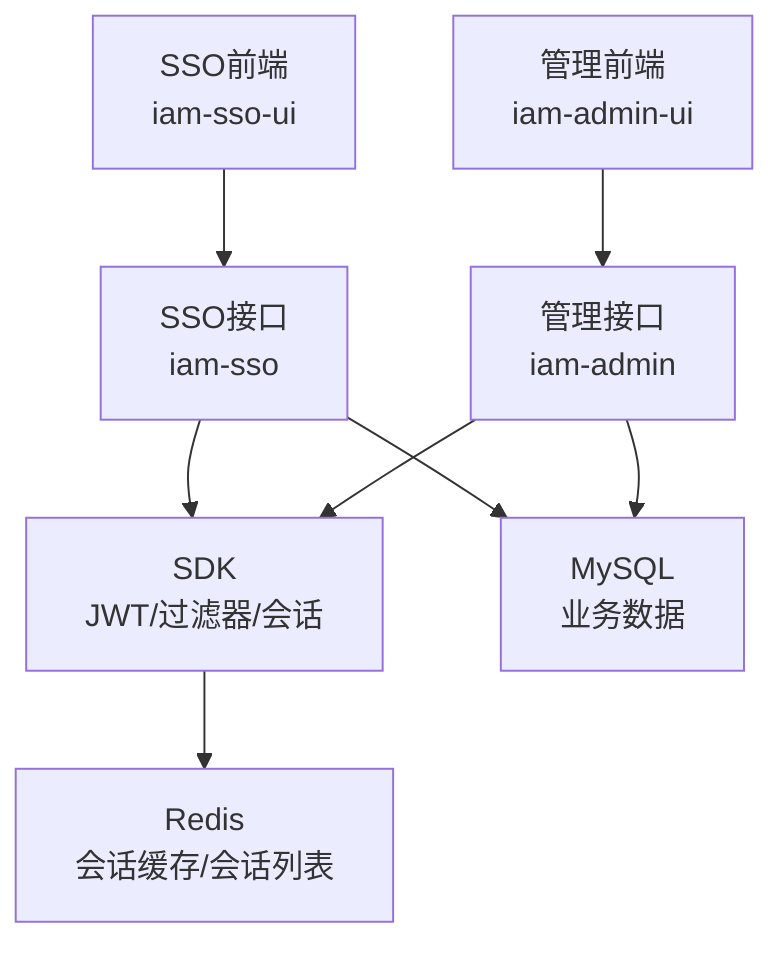
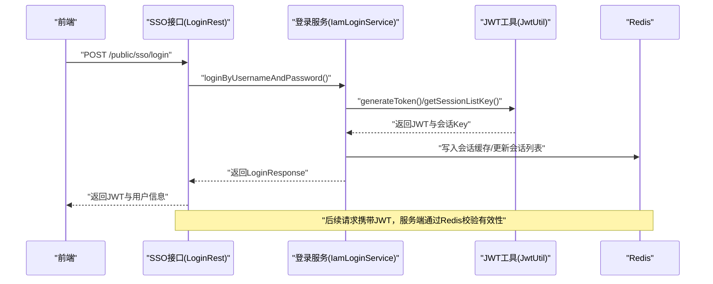
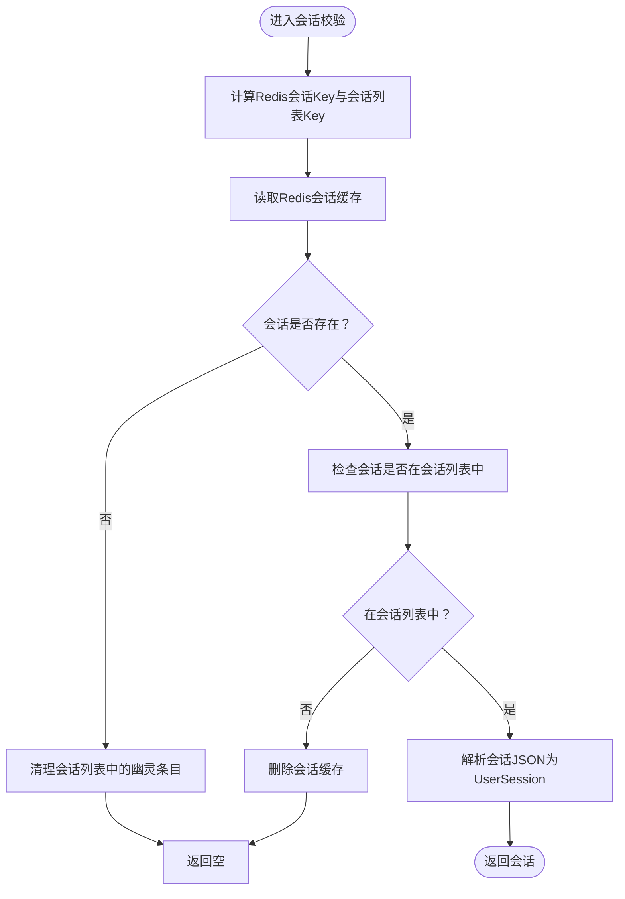
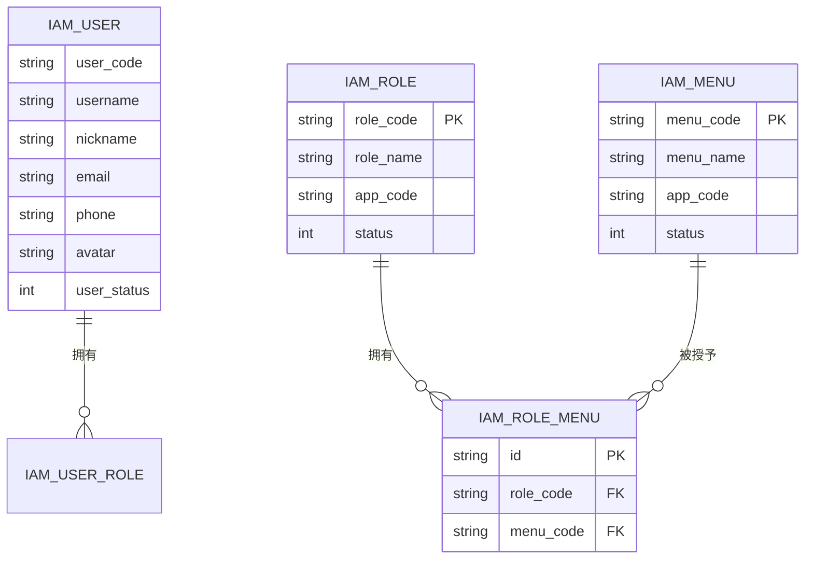
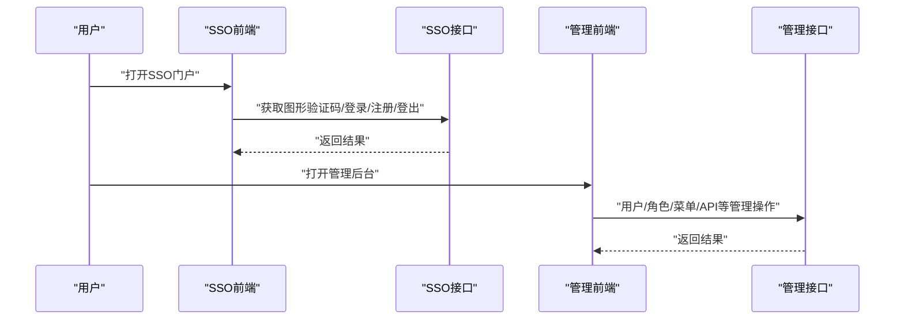
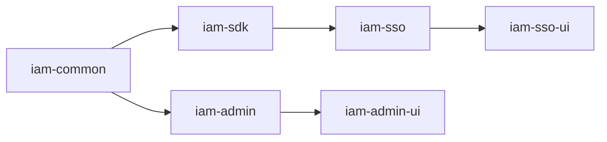

# 项目概述

<cite>
**本文引用的文件**
- [README.md](file://README.md)
- [pom.xml](file://pom.xml)
- [application.yml（SSO启动器）](file://iam-sso-starter/src/main/resources/config/application.yml)
- [application.yml（管理后台启动器）](file://iam-admin-starter/src/main/resources/config/application.yml)
- [LoginRest.java](file://iam-sso/src/main/java/com/wkclz/iam/sso/rest/LoginRest.java)
- [IamSsoServiceImpl.java](file://iam-sso/src/main/java/com/wkclz/iam/sso/service/IamSsoServiceImpl.java)
- [JwtUtil.java](file://iam-sdk/src/main/java/com/wkclz/iam/sdk/util/JwtUtil.java)
- [SsoFacade.java](file://iam-sdk/src/main/java/com/wkclz/iam/sdk/facade/SsoFacade.java)
- [IamUser.java](file://iam-common/src/main/java/com/wkclz/iam/common/entity/IamUser.java)
- [IamUserDto.java](file://iam-common/src/main/java/com/wkclz/iam/common/dto/IamUserDto.java)
- [IamRoleMapper.java](file://iam-admin/src/main/java/com/wkclz/iam/admin/mapper/IamRoleMapper.java)
- [IamUserRoleMapper.java](file://iam-admin/src/main/java/com/wkclz/iam/admin/mapper/IamUserRoleMapper.java)
- [IamRoleMenuMapper.java](file://iam-admin/src/main/java/com/wkclz/iam/admin/mapper/IamRoleMenuMapper.java)
- [RoleMenuRest.java](file://iam-admin/src/main/java/com/wkclz/iam/admin/rest/RoleMenuRest.java)
- [sso.js（SSO前端接口）](file://iam-sso-ui/src/api/sso.js)
- [sso.js（管理端前端接口）](file://iam-admin-ui/src/api/sso.js)
- [admin-owner.md](file://.harness/agents/admin-owner.md)
- [STORY-018-user-logout.md](file://docs/stories/STORY-018-user-logout.md)
- [STORY-005-jwt-token.md](file://docs/stories/STORY-005-jwt-token.md)
- [STORY-034-role-menu-binding.md](file://docs/stories/STORY-034-role-menu-binding.md)
</cite>

## 目录
1. [引言](#引言)
2. [项目结构](#项目结构)
3. [核心组件](#核心组件)
4. [架构总览](#架构总览)
5. [详细组件分析](#详细组件分析)
6. [依赖关系分析](#依赖关系分析)
7. [性能考虑](#性能考虑)
8. [故障排查指南](#故障排查指南)
9. [结论](#结论)
10. [附录](#附录)

## 引言
SH-IAM 是一个面向企业级的“身份识别与访问管理”（IAM）解决方案，围绕账号(Account)、认证(Authentication)、授权(Authorization)与审计(Audit)四大能力展开，提供单点登录(SSO)、用户与组织管理、角色权限体系、菜单与API权限控制、访问密钥管理、会话与日志审计等能力。项目采用多模块分层设计，包含通用领域模型、SDK、SSO服务、管理后台与配套UI，既可作为独立服务运行，也可通过SDK集成到其他系统。

本概述旨在帮助初学者快速理解系统目标与基本概念，同时为有经验的开发者提供足够的技术深度与实现线索，涵盖架构设计、关键流程、数据模型、依赖关系以及常见问题排查方法。

章节来源
- [README.md:1-11](file://README.md#L1-L11)

## 项目结构
项目以 Maven 多模块聚合的方式组织，核心模块如下：
- iam-common：通用实体与DTO、工具类（如密码、IP位置缓存）
- iam-sdk：SDK与安全工具（JWT、过滤器、会话、验证码等）
- iam-sso：SSO服务与对外REST接口、会话与登录服务、资源与调度
- iam-sso-starter：SSO服务启动器与基础配置
- iam-admin：管理后台服务与REST接口、RBAC相关CRUD
- iam-admin-starter：管理后台启动器与基础配置
- iam-admin-ui：管理后台前端（Vue生态）
- iam-sso-ui：SSO门户前端（Vue生态）

图表来源
- [pom.xml:20-27](file://pom.xml#L20-L27)

章节来源
- [pom.xml:1-37](file://pom.xml#L1-L37)

## 核心组件
- 单点登录（SSO）：提供统一登录入口、会话校验、登出与用户信息/菜单查询接口，支持JWT令牌与Redis会话缓存联动
- 用户与组织：用户实体与DTO、用户状态管理、用户与角色/数据维度的关联
- 权限控制：基于角色的权限模型（RBAC），支持角色-菜单-按钮级权限，菜单与API关联实现前后端统一权限
- 安全工具：JWT生成/校验/刷新、会话Key管理、过滤器链、验证码与会话辅助
- 管理后台：提供用户、角色、菜单、API、访问密钥、数据维度等的CRUD与关联管理
- 前端UI：SSO门户与管理后台的Vue前端，提供登录、菜单树、用户资料、权限分配等界面

章节来源
- [IamUser.java:17-108](file://iam-common/src/main/java/com/wkclz/iam/common/entity/IamUser.java#L17-L108)
- [IamUserDto.java:13-34](file://iam-common/src/main/java/com/wkclz/iam/common/dto/IamUserDto.java#L13-L34)
- [IamRoleMapper.java:17-24](file://iam-admin/src/main/java/com/wkclz/iam/admin/mapper/IamRoleMapper.java#L17-L24)
- [IamUserRoleMapper.java:13-21](file://iam-admin/src/main/java/com/wkclz/iam/admin/mapper/IamUserRoleMapper.java#L13-L21)
- [IamRoleMenuMapper.java:13-21](file://iam-admin/src/main/java/com/wkclz/iam/admin/mapper/IamRoleMenuMapper.java#L13-L21)
- [RoleMenuRest.java:14-43](file://iam-admin/src/main/java/com/wkclz/iam/admin/rest/RoleMenuRest.java#L14-L43)

## 架构总览
系统采用“服务+SDK+前端”的分层架构：
- 服务层：SSO与管理后台分别提供REST服务，使用MyBatis进行数据持久化
- 安全层：SDK提供JWT工具、过滤器链、会话与验证码辅助，统一接入鉴权与安全策略
- 前端层：SSO门户与管理后台UI，通过HTTP接口与后端交互
- 存储层：MySQL存储业务数据，Redis用于JWT会话缓存与会话列表管理

图表来源
- [application.yml（SSO启动器）:1-52](file://iam-sso-starter/src/main/resources/config/application.yml#L1-L52)
- [application.yml（管理后台启动器）:1-52](file://iam-admin-starter/src/main/resources/config/application.yml#L1-L52)
- [JwtUtil.java:25-31](file://iam-sdk/src/main/java/com/wkclz/iam/sdk/util/JwtUtil.java#L25-L31)
- [IamSsoServiceImpl.java:22-46](file://iam-sso/src/main/java/com/wkclz/iam/sso/service/IamSsoServiceImpl.java#L22-L46)

## 详细组件分析

### 单点登录（SSO）与会话校验
- 登录流程：前端调用SSO登录接口，后端校验凭据并签发JWT，同时写入Redis会话缓存与会话列表
- 会话校验：通过SDK提供的JWT工具与Redis会话键进行双重校验，支持会话剔除与幽灵条目清理
- 登出流程：从请求中获取Token与UserSession，删除Redis中的Session缓存，使Token即时失效

图表来源
- [LoginRest.java:22-34](file://iam-sso/src/main/java/com/wkclz/iam/sso/rest/LoginRest.java#L22-L34)
- [JwtUtil.java:25-41](file://iam-sdk/src/main/java/com/wkclz/iam/sdk/util/JwtUtil.java#L25-L41)
- [IamSsoServiceImpl.java:22-46](file://iam-sso/src/main/java/com/wkclz/iam/sso/service/IamSsoServiceImpl.java#L22-L46)

章节来源
- [LoginRest.java:1-37](file://iam-sso/src/main/java/com/wkclz/iam/sso/rest/LoginRest.java#L1-L37)
- [IamSsoServiceImpl.java:1-48](file://iam-sso/src/main/java/com/wkclz/iam/sso/service/IamSsoServiceImpl.java#L1-L48)
- [JwtUtil.java:1-44](file://iam-sdk/src/main/java/com/wkclz/iam/sdk/util/JwtUtil.java#L1-L44)
- [STORY-018-user-logout.md:17-27](file://docs/stories/STORY-018-user-logout.md#L17-L27)

### JWT令牌与会话缓存
- 令牌生成：支持生成短期访问令牌与长期刷新令牌，默认访问令牌过期时间为24小时
- 会话Key：Redis键格式为“iam:session:{identifier}:{md5(token)}”，会话列表键为“iam:session:list:{username}”
- 会话校验：若Redis中无对应会话或会话不在会话列表中，则判定为无效或已被踢出

图表来源
- [IamSsoServiceImpl.java:22-46](file://iam-sso/src/main/java/com/wkclz/iam/sso/service/IamSsoServiceImpl.java#L22-L46)
- [JwtUtil.java:25-31](file://iam-sdk/src/main/java/com/wkclz/iam/sdk/util/JwtUtil.java#L25-L31)

章节来源
- [STORY-005-jwt-token.md:17-29](file://docs/stories/STORY-005-jwt-token.md#L17-L29)
- [JwtUtil.java:17-41](file://iam-sdk/src/main/java/com/wkclz/iam/sdk/util/JwtUtil.java#L17-L41)

### 用户与角色权限模型
- 用户模型：包含用户编码、用户名、昵称、邮箱、手机、头像、状态等字段，支持拷贝与条件拷贝
- 角色与菜单：角色-菜单为多对多关系，通过中间表进行绑定；菜单与API通过IamMenuApi关联，实现前后端统一权限控制
- 管理端接口：提供角色-菜单的查询、绑定与解绑接口，确保权限配置的原子性与一致性

图表来源
- [IamUser.java:21-61](file://iam-common/src/main/java/com/wkclz/iam/common/entity/IamUser.java#L21-L61)
- [IamRoleMapper.java:20](file://iam-admin/src/main/java/com/wkclz/iam/admin/mapper/IamRoleMapper.java#L20)
- [IamUserRoleMapper.java:13-21](file://iam-admin/src/main/java/com/wkclz/iam/admin/mapper/IamUserRoleMapper.java#L13-L21)
- [IamRoleMenuMapper.java:13-21](file://iam-admin/src/main/java/com/wkclz/iam/admin/mapper/IamRoleMenuMapper.java#L13-L21)

章节来源
- [IamUser.java:17-108](file://iam-common/src/main/java/com/wkclz/iam/common/entity/IamUser.java#L17-L108)
- [IamUserDto.java:13-34](file://iam-common/src/main/java/com/wkclz/iam/common/dto/IamUserDto.java#L13-L34)
- [RoleMenuRest.java:21-41](file://iam-admin/src/main/java/com/wkclz/iam/admin/rest/RoleMenuRest.java#L21-L41)
- [STORY-034-role-menu-binding.md:17-26](file://docs/stories/STORY-034-role-menu-binding.md#L17-L26)

### 前端对接与典型使用场景
- SSO门户前端：提供图形验证码、登录、注册、登出、用户信息与菜单树查询等接口
- 管理后台前端：提供用户、角色、菜单、API、访问密钥、数据维度等管理接口

图表来源
- [sso.js（SSO前端接口）:1-25](file://iam-sso-ui/src/api/sso.js#L1-L25)
- [sso.js（管理端前端接口）:1-26](file://iam-admin-ui/src/api/sso.js#L1-L26)

章节来源
- [sso.js（SSO前端接口）:1-26](file://iam-sso-ui/src/api/sso.js#L1-L26)
- [sso.js（管理端前端接口）:1-26](file://iam-admin-ui/src/api/sso.js#L1-L26)

## 依赖关系分析
- 模块耦合：common为所有模块提供实体与DTO；sdk为sso与admin提供安全与工具能力；sso与admin分别提供对外服务；ui通过HTTP接口依赖后端服务
- 外部依赖：Spring Boot、MyBatis、Redis、JWT、MySQL驱动等
- 配置与部署：各模块通过独立的application.yml配置端口、数据源、分页插件与监控端点

图表来源
- [pom.xml:20-27](file://pom.xml#L20-L27)

章节来源
- [pom.xml:1-37](file://pom.xml#L1-L37)
- [application.yml（SSO启动器）:1-52](file://iam-sso-starter/src/main/resources/config/application.yml#L1-L52)
- [application.yml（管理后台启动器）:1-52](file://iam-admin-starter/src/main/resources/config/application.yml#L1-L52)

## 性能考虑
- 会话缓存：使用Redis存储JWT会话与会话列表，降低数据库压力，提升鉴权效率
- 令牌过期：短期访问令牌与长期刷新令牌结合，平衡安全性与用户体验
- 分页与SQL：MyBatis配置开启下划线转驼峰映射，配合PageHelper实现分页，减少一次性加载大量数据
- 监控与健康：管理端点暴露健康检查与指标，便于运维观测

## 故障排查指南
- 登录失败或Token无效
  - 检查JWT签名密钥与算法配置，确认生成与校验一致
  - 核对Redis中会话Key与会话列表是否存在
- 会话被踢出或立即失效
  - 确认会话是否仍存在于会话列表；若不存在，需重新登录
- 登出后仍可访问
  - 确认登出接口已删除Redis中的Session缓存，并使Token失效
- 权限不生效
  - 检查角色-菜单绑定是否正确，菜单-API关联是否完成
  - 确认前端路由与按钮权限与后端权限一致

章节来源
- [STORY-018-user-logout.md:24-27](file://docs/stories/STORY-018-user-logout.md#L24-L27)
- [IamSsoServiceImpl.java:22-46](file://iam-sso/src/main/java/com/wkclz/iam/sso/service/IamSsoServiceImpl.java#L22-L46)
- [RoleMenuRest.java:21-41](file://iam-admin/src/main/java/com/wkclz/iam/admin/rest/RoleMenuRest.java#L21-L41)

## 结论
SH-IAM以清晰的模块划分与稳健的技术栈，构建了从认证、授权到审计的完整IAM能力。通过JWT与Redis会话缓存实现高性能的SSO体验，结合RBAC模型与菜单-API关联，满足复杂权限场景需求。项目提供前后端分离的UI与完善的SDK，便于二次集成与扩展。

## 附录
- 版本信息：项目版本为5.0.0-SNAPSHOT，基于sh-parent 5.0.0-SNAPSHOT
- 社区与贡献：项目内含Harness智能体说明与Story文档，体现结构化的开发与协作方式
- 开发者建议：遵循最小权限原则与应用隔离原则，合理设置令牌过期与刷新策略，完善日志与监控

章节来源
- [pom.xml:29-35](file://pom.xml#L29-L35)
- [.harness/agents/admin-owner.md:75-80](file://.harness/agents/admin-owner.md#L75-L80)