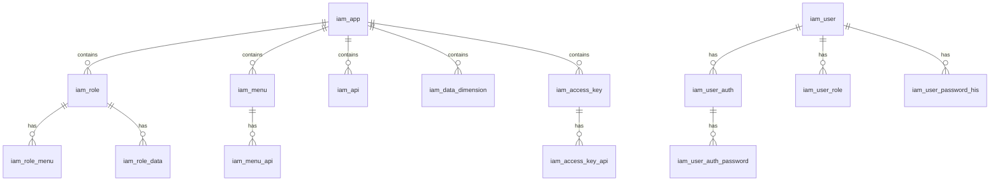

# 数据库设计

## 数据库概述

sh-iam 使用 MySQL 8.0+ 作为持久化存储，采用逻辑删除和乐观锁机制。

## 表结构总览

### 基础实体表

| 表名 | 说明 | 关键字段 |
|------|------|---------|
| iam_user | 用户信息 | userCode, username, nickname |
| iam_role | 角色信息 | roleCode, roleName, appCode |
| iam_menu | 菜单信息 | menuCode, menuName, appCode |
| iam_api | API路由 | apiCode, apiUri, apiMethod |
| iam_app | 应用信息 | appCode, appName |
| iam_access_key | 访问密钥 | appId, accessKey, secretKey |
| iam_data_dimension | 数据维度 | dimCode, dimName |

### 关联关系表

| 表名 | 说明 | 关联字段 |
|------|------|---------|
| iam_user_role | 用户-角色 | userCode, roleCode |
| iam_role_menu | 角色-菜单 | roleCode, menuCode |
| iam_menu_api | 菜单-API | menuCode, apiCode |
| iam_access_key_api | AK-API | appId, apiCode |
| iam_role_data | 角色-数据维度 | roleCode, dimCode |

### 用户认证表

| 表名 | 说明 | 关键字段 |
|------|------|---------|
| iam_user_auth | 用户认证方式 | userCode, authType, authIdentifier |
| iam_user_auth_password | 密码凭据 | userCode, salt, password |
| iam_user_password_his | 密码历史 | userCode, password, changeTime |

### 日志表

| 表名                 | 说明   | 关键字段                    |
|--------------------|------|-------------------------|
| iam_login_record   | 登录日志 | userCode, loginTime, ip |
| iam_request_record | 请求日志 | traceId, uri, method    |

## 表字段约定

所有表统一包含以下系统字段：

| 字段名 | 类型 | 说明 |
|--------|------|------|
| id | BIGINT UNSIGNED | 主键，自增 |
| sort | INT | 排序字段 |
| create_time | DATETIME | 创建时间 |
| create_by | VARCHAR(64) | 创建人 |
| update_time | DATETIME | 更新时间 |
| update_by | VARCHAR(64) | 更新人 |
| remark | VARCHAR(500) | 备注 |
| version | INT | 乐观锁版本 |
| deleted | TINYINT(1) | 逻辑删除标识 |

## ER 关系图

## 核心表设计

### iam_user (用户表)

| 字段名 | 类型 | 约束 | 说明 |
|--------|------|------|------|
| userCode | VARCHAR(64) | UNIQUE NOT NULL | 用户编码 |
| username | VARCHAR(64) | UNIQUE NOT NULL | 用户名 |
| nickname | VARCHAR(64) | | 昵称 |
| email | VARCHAR(128) | | 邮箱 |
| phone | VARCHAR(32) | | 手机号 |
| avatar | VARCHAR(256) | | 头像URL |
| userStatus | TINYINT(1) | DEFAULT 1 | 状态(1启用/2禁用/3锁定) |

### iam_role (角色表)

| 字段名 | 类型 | 约束 | 说明 |
|--------|------|------|------|
| tenantCode | VARCHAR(64) | | 租户编码 |
| appCode | VARCHAR(64) | NOT NULL | 应用编码 |
| parentCode | VARCHAR(64) | | 父角色编码 |
| roleCode | VARCHAR(64) | UNIQUE NOT NULL | 角色编码 |
| roleName | VARCHAR(64) | NOT NULL | 角色名称 |

### iam_menu (菜单表)

| 字段名 | 类型 | 约束 | 说明 |
|--------|------|------|------|
| appCode | VARCHAR(64) | NOT NULL | 应用编码 |
| parentCode | VARCHAR(64) | | 父菜单编码 |
| menuCode | VARCHAR(64) | UNIQUE NOT NULL | 菜单编码 |
| menuName | VARCHAR(64) | NOT NULL | 菜单名称 |
| menuType | VARCHAR(16) | NOT NULL | 类型(MENU/BUTTON) |
| routePath | VARCHAR(256) | | 路由路径 |
| component | VARCHAR(256) | | 组件路径 |
| buttonCode | VARCHAR(64) | | 按钮编码 |
| icon | VARCHAR(64) | | 图标 |

### iam_api (API表)

| 字段名 | 类型 | 约束 | 说明 |
|--------|------|------|------|
| module | VARCHAR(64) | | 模块名称 |
| appCode | VARCHAR(64) | NOT NULL | 应用编码 |
| apiCode | VARCHAR(64) | UNIQUE NOT NULL | API编码 |
| apiUri | VARCHAR(512) | NOT NULL | API路径 |
| apiMethod | VARCHAR(16) | NOT NULL | HTTP方法 |
| apiName | VARCHAR(128) | | API名称 |
| writeFlag | TINYINT(1) | DEFAULT 0 | 是否写操作 |

## 索引设计

### 用户表索引
- PRIMARY KEY (id)
- UNIQUE KEY (userCode)
- UNIQUE KEY (username)
- INDEX (userStatus)

### 角色表索引
- PRIMARY KEY (id)
- UNIQUE KEY (roleCode)
- INDEX (appCode)
- INDEX (parentCode)

### 菜单表索引
- PRIMARY KEY (id)
- UNIQUE KEY (menuCode)
- INDEX (appCode)
- INDEX (parentCode)
- INDEX (menuType)

### API表索引
- PRIMARY KEY (id)
- UNIQUE KEY (apiCode)
- INDEX (appCode)
- INDEX (apiUri, apiMethod)

### 关联表索引
- iam_user_role: INDEX (userCode), INDEX (roleCode)
- iam_role_menu: INDEX (roleCode), INDEX (menuCode)
- iam_menu_api: INDEX (menuCode), INDEX (apiCode)

## 数据字典

### 用户状态 (userStatus)
| 值 | 说明 |
|----|------|
| 1 | 启用 |
| 2 | 禁用 |
| 3 | 锁定 |

### 认证类型 (authType)
| 值 | 说明 |
|----|------|
| PASSWORD | 密码认证 |
| LDAP | LDAP认证 |

### 菜单类型 (menuType)
| 值 | 说明 |
|----|------|
| MENU | 菜单 |
| BUTTON | 按钮 |

### 认证状态 (authStatus)
| 值 | 说明 |
|----|------|
| 0 | 禁用 |
| 1 | 启用 |
