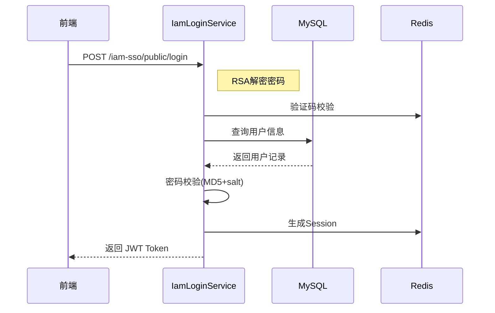
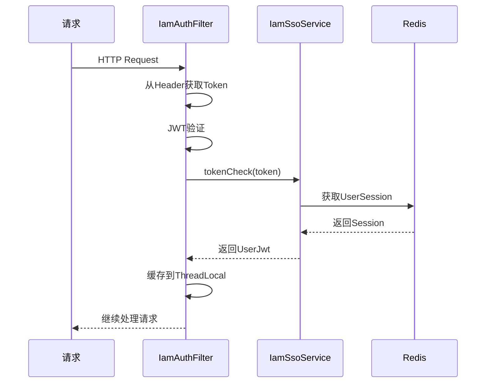

# 系统架构设计

## 整体架构

sh-iam 采用经典的分层架构设计，分为表现层、业务层、数据访问层和基础设施层。

### 架构图

```
┌─────────────────────────────────────────────────────────────┐
│                    前端层 (Frontend)                        │
│  ┌──────────────┐    ┌──────────────┐                      │
│  │  iam-admin-ui│    │  iam-sso-ui  │                      │
│  │   Vue3 +     │    │   Vue3 +     │                      │
│  │  ElementPlus │    │  ElementPlus │                      │
│  └──────┬───────┘    └──────┬───────┘                      │
└─────────┼────────────────────┼─────────────────────────────┘
          │                    │
          ▼                    ▼
┌─────────────────────────────────────────────────────────────┐
│                    API 网关层                               │
│            Spring Boot Rest Controller                      │
│  ┌────────────────────┐  ┌────────────────────┐            │
│  │   /iam-admin/**    │  │   /iam-sso/**      │            │
│  │  (AdminRest)       │  │  (LoginRest, etc)  │            │
│  └────────────────────┘  └────────────────────┘            │
└────────────────────────────┬────────────────────────────────┘
                             │
┌────────────────────────────┼────────────────────────────────┐
│                    业务逻辑层                               │
│  ┌──────────────────────────────────────────────────────┐   │
│  │  iam-admin          │  iam-sso         │  iam-sdk    │   │
│  │  ├─ UserService     │  ├─ LoginService │  ├─ Filter  │   │
│  │  ├─ RoleService     │  ├─ SsoService   │  ├─ Helper  │   │
│  │  ├─ MenuService     │  └─ ResourceSvc  │  └─ Util    │   │
│  │  └─ ...             │                  │            │   │
│  └──────────────────────────────────────────────────────┘   │
└────────────────────────────┬────────────────────────────────┘
                             │
┌────────────────────────────┼────────────────────────────────┐
│                    数据访问层                               │
│              MyBatis Mapper + XML                          │
│  ┌──────────────────────────────────────────────────────┐   │
│  │  IamUserMapper  │  IamRoleMapper  │  SsoLoginMapper │   │
│  │  IamMenuMapper  │  IamApiMapper   │  ...            │   │
│  └──────────────────────────────────────────────────────┘   │
└────────────────────────────┬────────────────────────────────┘
                             │
┌────────────────────────────┴────────────────────────────────┐
│                    数据存储层                               │
│  ┌────────────────────┐  ┌────────────────────┐            │
│  │    MySQL 8.0+      │  │    Redis 7.0+      │            │
│  │  (持久化存储)       │  │  (缓存/Session)   │            │
│  └────────────────────┘  └────────────────────┘            │
└─────────────────────────────────────────────────────────────┘
```

## 模块职责

### iam-common
- 公共实体定义
- DTO 数据传输对象
- 通用工具类

### iam-sdk
- JWT 令牌生成与校验
- 鉴权过滤器
- Session 管理
- AK 签名验证

### iam-sso
- 用户登录/登出
- 验证码服务
- 用户注册
- Token 校验

### iam-admin
- 用户管理 CRUD
- 角色管理 CRUD
- 菜单管理 CRUD
- 应用管理 CRUD
- API 路由管理

## 核心流程图

### 登录流程



### 鉴权流程



## 数据流向

| 数据流 | 方向 | 说明 |
|--------|------|------|
| 登录请求 | Client → SSO → DB → Redis → Client | 用户登录完整流程 |
| 鉴权请求 | Client → Filter → SSO → Redis → Filter → Controller | Token校验流程 |
| 管理操作 | Client → Admin → DB → Client | CRUD操作流程 |
| 日志记录 | Filter → SsoFacade → DB | 请求日志持久化 |

## 关键设计决策

### 1. Token 方案选择
- 使用 JWT + Redis Session 双重验证
- JWT 无状态验证，减轻服务端压力
- Redis Session 支持主动过期和并发控制

### 2. 密码安全
- RSA 前端加密传输
- MD5 + salt 存储
- 密码历史记录防止重复使用

### 3. 权限设计
- 基于角色的访问控制 (RBAC)
- 支持菜单级和按钮级权限
- 数据维度权限隔离

### 4. 缓存策略
- Guava LocalCache 用于高频访问数据
- Redis 用于 Session 和验证码
- 合理设置过期时间避免缓存击穿