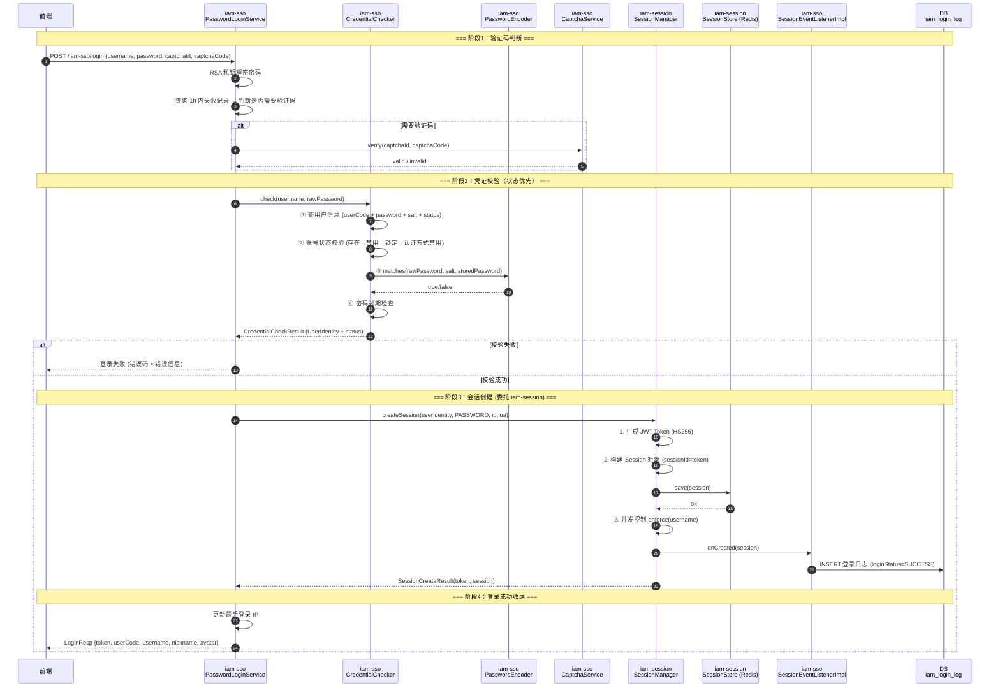
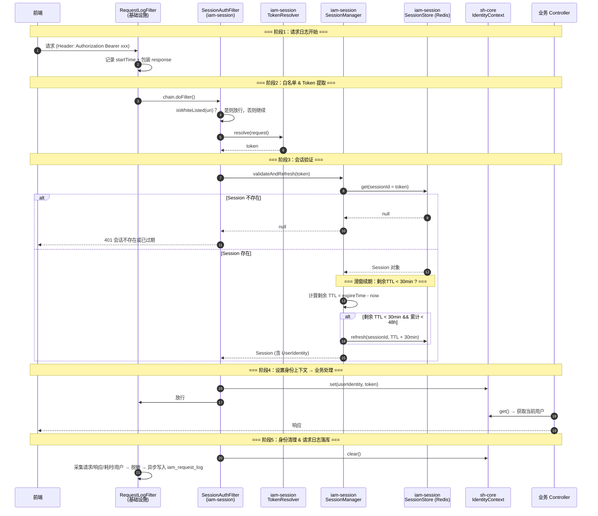
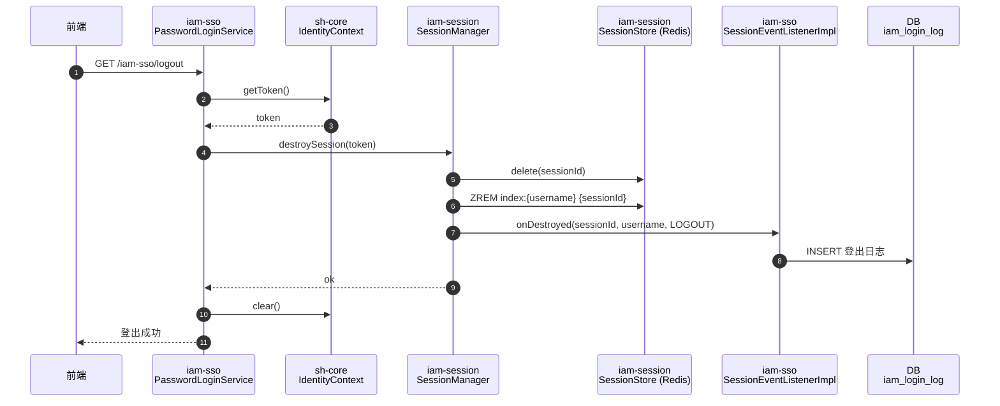
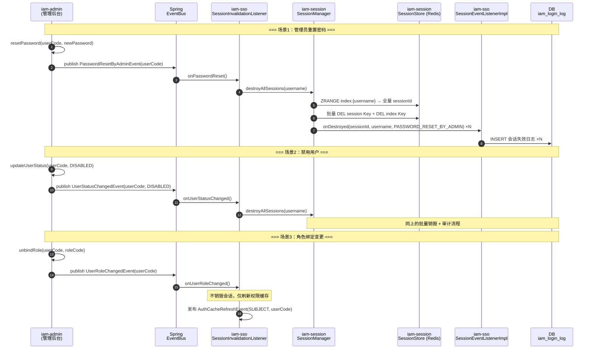
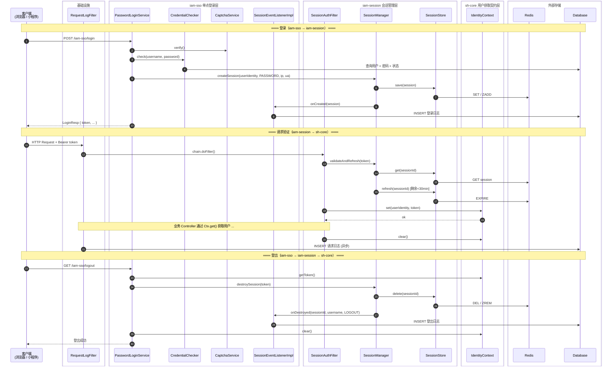

# 会话功能重设计 — 功能清单与模块划分

> 日期：2026-07-17
> 基于：[session-analysis.md](./session-analysis.md)（现状分析）
> 原则：不参照现有代码设计细节，从功能需求 + 行业惯例出发重新梳理

---

## 一、行业参考

本设计参考以下行业惯例：

| 参考对象                       | 借鉴点                                                                |
|----------------------------|--------------------------------------------------------------------|
| Spring Security            | `SecurityContextHolder` 的 ThreadLocal 模式、`UserDetailsService` 契约分离 |
| OAuth 2.0 / OpenID Connect | Token 签发与用户信息端点的分离、`id_token` + `access_token` 双令牌模型               |
| Servlet HttpSession        | 会话生命周期事件（`HttpSessionListener`）、滑窗过期                               |
| Redis 会话最佳实践               | Hash 替代多 Key、Pipeline 批量操作、Lua 脚本保证原子性                             |
| 小程序登录 (wx.login)           | code 换 session_key 模式，与密码登录共享会话管理层                                 |

---

## 二、模块职责边界（概要）

```
┌──────────────────────────────────────────────────────────┐
│                                                          │
│   ┌──────────────────────┐                               │
│   │  SSO 单点登录层        │  ← 用户名密码登录专属           │
│   │  (iam-sso)           │    凭证校验、验证码、登录编排    │
│   └──────────┬───────────┘                               │
│              │ 依赖                                       │
│   ┌──────────▼───────────┐                               │
│   │  会话管理层            │  ← 认证方式无关                │
│   │  (iam-session)       │    Session CRUD、Token、并发   │
│   └──────────┬───────────┘                               │
│              │ 依赖                                       │
│   ┌──────────▼───────────┐                               │
│   │  sh-core（框架层）     │  ← 最底层，仅获取用户身份        │
│   │  (com.wkclz.core     │    UserIdentity + IdentityCtx │
│   │   .identity)         │                               │
│   └──────────────────────┘                               │
│                                                          │
│   ★ 三方依赖方向：上层 → 下层，下层不知上层存在               │
│   ★ 未来小程序登录：依赖会话管理层 + sh-core 即可            │
│                                                          │
└──────────────────────────────────────────────────────────┘
```

---

## 三、模块 1：用户获取契约层（sh-core `com.wkclz.core.identity`）

> 定位：整个体系中最低层、最稳定的契约。**仅负责"当前请求是谁"这一个问题。**
> 越简单越好 — 不包含任何存储、校验、业务逻辑。
> 已从独立模块 `iam-identity` 迁移至框架层 `sh-core`，仅 2 个类。

### 3.1 功能点

| ID         | 功能       | 说明                                                           | 来源        |
|------------|----------|--------------------------------------------------------------|-----------|
| **IDT-01** | 用户身份模型   | `UserIdentity`：userCode、username、nickname、avatar（仅标识字段，不含权限） | 现状 #16 简化 |
| **IDT-02** | 请求级身份上下文 | 每个请求线程独立的身份持有者，ThreadLocal 实现，支持 set / get / clear           | 现状 #16    |

### 3.2 明确不包含

- 不做身份上下文的自动清理（依赖 Spring MVC Filter/Interceptor，属于会话管理层）
- 不做 Token 提取（依赖 HttpServletRequest，属于会话管理层）
- 不做白名单路径匹配（依赖 Spring MVC，属于会话管理层）
- 不做 JWT 解析
- 不做 Session 查活
- 不做权限判断
- 不做用户信息数据库查询

### 3.3 契约（已实现）

```java
// 用户身份 — 简单实体类（@Data + Serializable）
public class UserIdentity implements Serializable {
    private String userCode;
    private String username;
    private String nickname;
    private String avatar;
    private Map<String, Object> attributes = Collections.emptyMap();
    // addAttribute(key, value) 便捷方法
}

// 身份上下文 — final 类，全部 static 方法，ThreadLocal 实现
public final class IdentityContext {
    // 身份
    public static void set(UserIdentity identity, String token);
    public static UserIdentity get();
    public static String getToken();
    public static String getUserCode();
    public static String getUsername();
    public static String getNickname();
    public static String getAvatar();
    // 应用/租户（独立于 UserIdentity，线程变量）
    public static void setAppCode(String appCode);
    public static String getAppCode();
    public static void setTenantCode(String tenantCode);
    public static String getTenantCode();
    // 清理
    public static void clear();
}
```

---

## 四、模块 2：会话管理层（iam-session）

> 定位：管理会话的完整生命周期。**与认证方式无关** — 无论是密码登录还是小程序 code 登录，都通过此层管理会话。
> 克制原则：只做会话本身的 CRUD，不关心"用户是怎么认证通过的"。

### 4.1 功能点

| ID         | 功能          | 说明                                                                                                                                                               | 来源                    |
|------------|-------------|------------------------------------------------------------------------------------------------------------------------------------------------------------------|-----------------------|
| **SES-01** | 会话模型        | `Session` 对象：sessionId、userId（subjectId）、authType（PASSWORD / WECHAT_MINI / WECHAT_MP / LDAP / OAUTH）、createTime、expireTime、clientIp、userAgent、metadata（扩展属性 Map） | 现状 Bean.Session 扩展    |
| **SES-02** | 会话创建        | 输入 UserIdentity + authType + 客户端信息 → 生成 Session + Token → 持久化 → 返回 (Session, Token)                                                                              | 现状 #8                 |
| **SES-03** | Token 生成    | JWT HS256 签名，claims 仅含 userCode/username（最小信息集），TTL 可配置，默认 24h                                                                                                   | 现状 #9, #10, #39       |
| **SES-04** | Token 验证    | JWT 签名 + 过期校验，解析出 userCode/username                                                                                                                              | 现状 #9, #10            |
| **SES-05** | 会话持久化       | `SessionStore` 具体类（直接依赖 Redis），Hash + ZSet 结构，方法：save / get / delete / deleteBySubjectId / refresh / getSessionIds                                               | 现状 #11, #36（合并 US-04） |
| **SES-07** | 会话验证        | 从 Token 定位 Session，检查 Session 是否存在且未过期                                                                                                                           | 现状 #5 部分              |
| **SES-08** | 会话 TTL 滑窗续期 | 规则：剩余 TTL < 30 分钟时，续期 +30 分钟；累计最长不超过 48 小时；续期间隔可配置（如 5 分钟内不重复续）                                                                                                  | **新增**（弥补现状缺口 G6）     |
| **SES-09** | 会话主动销毁      | 销毁单个会话：删 Session + 从用户索引移除                                                                                                                                       | 现状 #12, #28           |
| **SES-10** | 会话批量销毁      | 销毁用户所有会话（改密、禁用等场景触发）：按用户索引全量删除                                                                                                                                   | 现状 #12, #29           |
| **SES-11** | 并发会话控制      | 同一用户最大活跃会话数限制，超出时踢最早会话（按创建时间排序）；maxConcurrent 可配置（0=不限制）                                                                                                         | 现状 #13, #37           |
| **SES-12** | 活跃会话查询      | 按用户查询所有活跃 Session 列表（含 sessionId、创建时间、IP、UA 等元数据）                                                                                                                | 现状 #11 补齐             |
| **SES-13** | 会话事件 SPI    | `SessionEventListener` 接口（onCreated / onDestroyed / onExpired），由会话层定义，SSO 层提供审计实现；Spring EventBus 做消息路由                                                          | **新增**                |
| **SES-14** | Token 刷新    | 基于旧 Token 签发新 Token（新 iat/exp），同步更新 Session 中的 Token 绑定                                                                                                          | 现状 #9（未集成，需补齐 G9）     |
| **SES-15** | Token 提取    | 从 HTTP 请求中提取 token 的 SPI（默认：`Authorization: Bearer xxx` 头 > `token` 自定义头）                                                                                        | 从 sh-core 下沉          |
| **SES-16** | 白名单路径匹配     | 定义哪些路径不需要身份验证（Ant 风格路径匹配，默认 `/public/**`），提供 `isWhiteListed(uri)` 方法                                                                                             | 从 sh-core 下沉          |
| **SES-17** | 身份上下文清理     | 请求结束后在 Filter/Interceptor 的 finally 块中调用 `IdentityContext.clear()`，防止内存泄漏                                                                                        | 从 sh-core 下沉          |

### 4.2 明确不包含

- 不做密码校验
- 不做用户名/密码登录流程
- 不做验证码生成/校验
- 不做用户状态检查（锁定/禁用）
- 不做登录日志写入（通过 SES-13 事件让上层自行消费）
- 不做请求日志采集
- 不做菜单/资源查询

### 4.3 核心接口（概念）

```java
// 会话管理器 — 对外唯一入口
interface SessionManager {
    SessionCreateResult createSession(UserIdentity user, AuthType authType,
                                      String clientIp, String userAgent);

    Session validateAndRefresh(String token);

    void destroySession(String sessionId);

    void destroyAllSessions(String subjectId);

    List<SessionInfo> getActiveSessions(String subjectId);

    Token refreshToken(String oldToken);
}

// Session 存储 — 具体类，直接依赖 StringRedisTemplate
class SessionStore {
    void save(Session session, long ttlSeconds);
    Session get(String sessionId);
    void delete(String sessionId);
    void deleteBySubjectId(String subjectId);
    void refresh(String sessionId, long ttlSeconds);
    List<String> getSessionIds(String subjectId);
}

// Token 提取策略 — 可替换（默认：Authorization: Bearer xxx > token 头）
interface TokenResolver {
    String resolve(HttpServletRequest request);
}

// 白名单路径匹配
interface WhiteListMatcher {
    boolean isWhiteListed(String requestUri);
}

// 会话事件监听器 SPI — 会话层定义接口
interface SessionEventListener {
    void onCreated(Session session);

    void onDestroyed(String sessionId, String subjectId, DestroyReason reason);

    void onExpired(String sessionId, String subjectId);
}

// 销毁原因枚举
enum DestroyReason {
    LOGOUT, PASSWORD_CHANGED, PASSWORD_RESET_BY_ADMIN,
    USER_DISABLED, CONCURRENT_KICK, SESSION_EXPIRED
}
```

### 4.4 Redis Key 设计（简化）

| Key                             | 类型   | 内容                                                                                                              | TTL        |
|---------------------------------|------|-----------------------------------------------------------------------------------------------------------------|------------|
| `iam:session:{sessionId}`       | Hash | sessionId(MD5), subjectId, authType, userIdentity(JSON), clientIp, userAgent, createTime, expireTime, token(原始) | 可配置 (24h)  |
| `iam:session:index:{subjectId}` | ZSet | member=sessionId(MD5), score=createTime                                                                         | 跟随 session |

相比现状从 3 个 Key 简化为 2 个。sessionId = MD5(token)，固定 32 字符，方便 Redis 管理工具浏览。Hash 内存储原始 token
用于反向定位。

---

## 五、模块 3：单点登录层（iam-sso）

> 定位：**用户名密码登录**的完整实现。只做密码认证相关的事情，不越界到会话管理。
> 未来若有小程序登录，新建独立模块，不放在此层。

### 5.1 功能点

| ID          | 功能            | 说明                                                                                                                               | 来源                                                 |
|-------------|---------------|----------------------------------------------------------------------------------------------------------------------------------|----------------------------------------------------|
| **SSO-01**  | 密码登录端点        | `POST /iam-sso/login`：接收 username + password + captchaId + captchaCode，返回 LoginResp(token, userCode, username, nickname, avatar) | 现状 #27, #30                                        |
| **SSO-02**  | RSA 密码解密      | 前端 RSA 公钥加密，后端 RSA 私钥解密；仅密文 length > 32 时执行解密（明文兼容）                                                                              | 现状 #27                                             |
| **SSO-03**  | 密码凭证校验 SPI    | `CredentialChecker` 接口：根据 username 查出 userCode + storedPassword + salt + 状态信息                                                    | 现状 #35                                             |
| **SSO-04**  | 密码匹配          | PBKDF2WithHmacSHA256 编码 + 校验；兼容历史 {MD5} 和无前缀格式；修改密码时自动升级                                                                         | 现状 #15                                             |
| **SSO-05**  | 账号状态校验        | 校验顺序：①用户是否存在 → ②是否禁用(userStatus=2) → ③是否锁定(userStatus=3) → ④认证方式是否禁用(authStatus=0)；发生在密码匹配之前                                     | 现状 #35                                             |
| **SSO-06**  | 密码过期检查        | lastChangedTime + expireDays > now → 提示密码已过期（可配置，默认 180 天）                                                                       | 现状 #35                                             |
| **SSO-07**  | 验证码触发判断       | 同一用户名 1h 内失败登录次数 ≥ 阈值 → 要求输入验证码                                                                                                  | 现状 #27                                             |
| **SSO-08**  | 验证码生成         | 图形验证码生成（CAPTCHA），返回 captchaId + base64 图片                                                                                        | 现状 #31, #38                                        |
| **SSO-09**  | 验证码校验         | Redis 存储，TTL 5min，verify 一次性消费（getAndDelete）                                                                                     | 现状 #34                                             |
| **SSO-10**  | 登录成功处理        | 凭证校验通过 → 构建 UserIdentity → 调用 SessionManager.createSession() → 发布 LoginSuccessEvent → 返回 LoginResp                               | **重新编排**（现状的 IamLoginService 逻辑下沉到 SessionManager） |
| **SSO-11**  | 登录失败处理        | 记录失败次数 → 发布 LoginFailedEvent → 返回错误信息                                                                                            | 现状 #34                                             |
| **SSO-12**  | 登录审计事件        | `LoginSuccessEvent` / `LoginFailedEvent`，含 username、ip、userAgent、timestamp、failureReason。审计日志服务独立消费                              | **新增**（解耦，替代现状 #34 的 recordLoginLog 硬编码）           |
| **SSO-12a** | 会话事件监听实现      | 实现 `SessionEventListener` 接口，将 onCreated/onDestroyed/onExpired 写入登录日志表（iam_login_log）                                            | **新增**（会话层定义接口，SSO 层提供审计实现）                        |
| **SSO-13**  | 登出端点          | `GET /iam-sso/logout`：从 IdentityContext 取当前 token → 调用 SessionManager.destroySession() → 发布 LogoutEvent                          | 现状 #28                                             |
| **SSO-14**  | 登出审计事件        | `LogoutEvent`，含 username、token（脱敏）、timestamp                                                                                     | **新增**                                             |
| **SSO-15**  | 修改密码          | 旧密码校验 → 历史密码检查（最近 N 条不重复）→ 编码新密码 → 更新 DB → 调用 SessionManager.destroyAllSessions() → 发布 PasswordChangedEvent                      | 现状 #29                                             |
| **SSO-16**  | 密码修改事件        | `PasswordChangedEvent`，触发全会话失效已在 SSO-15 中处理，事件用于审计通知                                                                             | **新增**                                             |
| **SSO-17**  | 管理员重置密码（事件触发） | 管理员后台重置密码时发布 `PasswordResetByAdminEvent` → 监听器调用 SessionManager.destroyAllSessions()                                             | **新增**（弥补缺口 G1）                                    |
| **SSO-18**  | 用户状态变更（事件触发）  | 用户禁用/锁定/认证方式禁用时发布 `UserStatusChangedEvent` → 监听器调用 SessionManager.destroyAllSessions()                                           | **新增**（弥补缺口 G2, G3）                                |

### 5.2 明确不包含

- 不做 Session 存储/Token 生成（委托 SessionManager）
- 不做并发会话控制（委托 SessionManager）
- 不做 Token 刷新（委托 SessionManager）
- 不做用户 CRUD（属于 iam-admin）
- 不做角色/菜单/API 管理
- 不做请求日志采集（独立基础设施）
- 不做小程序登录（未来独立模块）

### 5.3 核心接口（概念）

```java
// 密码登录服务 — SSO 对外入口
interface PasswordLoginService {
    LoginResult login(String username, String password,
                      String captchaId, String captchaCode,
                      HttpServletRequest request);

    void logout();

    void changePassword(String oldPassword, String newPassword);
}

// 凭证校验 SPI — 可替换（LDAP 等场景）
interface CredentialChecker {
    CredentialCheckResult check(String username, String rawPassword);
}

// 密码编码器
interface PasswordEncoder {
    String encode(String rawPassword, String salt);

    boolean matches(String rawPassword, String salt, String encodedPassword);
}
```

---

## 六、功能与模块归属总表

以下将从现状分析中梳理出的全部功能点重新分配到新模块，并标注新增项。

| #  | 功能点                              | 归属模块        | 状态           |
|----|----------------------------------|-------------|--------------|
| 1  | 用户身份模型 (UserIdentity)            | sh-core     | 已完成          |
| 2  | 请求级身份上下文 (IdentityContext)       | sh-core     | 已完成          |
| 3  | Token 提取 (TokenResolver)         | iam-session | 下沉           |
| 4  | 白名单路径匹配                          | iam-session | 下沉           |
| 5  | 身份上下文自动清理                        | iam-session | 下沉           |
| 6  | 会话模型 (Session)                   | iam-session | 重构           |
| 7  | 会话创建                             | iam-session | 重构           |
| 8  | Token 生成 (JWT HS256)             | iam-session | 保留           |
| 9  | Token 验证 (签名+过期)                 | iam-session | 保留           |
| 10 | 会话持久化 (SessionStore)             | iam-session | 重构（合并 US-04） |
| 11 | 会话验证（存在+未过期）                     | iam-session | 保留           |
| 13 | 会话 TTL 滑窗续期                      | iam-session | **新增**       |
| 14 | 会话主动销毁（单个）                       | iam-session | 保留           |
| 15 | 会话批量销毁（按用户）                      | iam-session | 保留           |
| 16 | 并发会话控制                           | iam-session | 保留           |
| 17 | 活跃会话查询                           | iam-session | 补齐           |
| 18 | 会话事件 (Created/Destroyed/Expired) | iam-session | **新增**       |
| 19 | Token 刷新                         | iam-session | 补齐           |
| 20 | 密码登录端点                           | iam-sso     | 保留           |
| 21 | RSA 密码解密                         | iam-sso     | 保留           |
| 22 | 密码凭证校验 SPI                       | iam-sso     | 重构           |
| 23 | 密码匹配 (PBKDF2+MD5兼容)              | iam-sso     | 保留           |
| 24 | 账号状态校验                           | iam-sso     | 保留           |
| 25 | 密码过期检查                           | iam-sso     | 保留           |
| 26 | 验证码触发判断                          | iam-sso     | 保留           |
| 27 | 验证码生成                            | iam-sso     | 保留           |
| 28 | 验证码校验                            | iam-sso     | 保留           |
| 29 | 登录成功编排                           | iam-sso     | 重构           |
| 30 | 登录失败处理                           | iam-sso     | 保留           |
| 31 | 登录审计事件                           | iam-sso     | **新增**       |
| 32 | 登出端点                             | iam-sso     | 保留           |
| 33 | 登出审计事件                           | iam-sso     | **新增**       |
| 34 | 修改密码 + 全会话失效                     | iam-sso     | 保留           |
| 35 | 密码修改事件                           | iam-sso     | **新增**       |
| 36 | 管理员重置密码 → 全会话失效                  | iam-sso     | **新增**（事件监听） |
| 37 | 用户状态变更 → 全会话失效                   | iam-sso     | **新增**（事件监听） |

**未纳入新三模块的功能（暂时保留现状，待下一步决策）：**

| 功能                                          | 所处位置             |
|---------------------------------------------|------------------|
| 请求体缓存包装 (EagerContentCachingRequestWrapper) | sh-auth Filter   |
| 请求日志采集 Filter (RequestRecordFilter)         | sh-auth Filter   |
| 安全头注入 Filter (SecurityHeaderFilter)         | sh-auth Filter   |
| 鉴权 Filter (AuthorizationFilter)             | sh-auth Filter   |
| 三层缓存 (AuthCacheManager)                     | sh-auth Cache    |
| 请求日志持久化 (IamRequestService)                 | iam-sso          |
| AK 签名工具                                     | sh-auth          |
| 用户注册                                        | iam-sso（空占位）     |
| 用户信息/菜单资源查询                                 | iam-sso          |
| SsoFacade 跨应用远程调用                           | iam-sso contract |

> 以上功能将在下一步设计中决定归属：是纳入新三模块、保留为独立基础设施、还是废弃重写。

---

## 七、Sequence Diagram：完整调用关系

### 7.1 密码登录流程



### 7.2 每次请求 — 会话验证与请求日志流程



### 7.3 登出流程



### 7.4 管理员安全操作 — 全会话失效（事件驱动）



---

### 7.5 模块间交互总览（模块级 Sequence Diagram）

> 仅展示三个新模块之间的调用关系，不含模块内部细节。



---

## 八、模块依赖关系（最终态）

```
┌────────────────────────────────────────────┐
│                                            │
│   ┌──────────┐     ┌──────────┐            │
│   │ iam-sso  │     │  未来     │            │
│   │ 密码登录  │     │ 小程序登录 │            │
│   └────┬─────┘     └────┬─────┘            │
│        │                │                  │
│        └───────┬────────┘                  │
│                │ 依赖                       │
│        ┌───────▼────────┐                  │
│        │  iam-session    │                  │
│        │  会话管理        │                  │
│        │  + Token提取     │                  │
│        │  + 白名单匹配     │                  │
│        │  + 身份清理      │                  │
│        └───────┬────────┘                  │
│                │ 依赖                       │
│        ┌───────▼────────┐                  │
│        │  sh-core        │                  │
│        │  用户获取契约     │                  │
│        │  (UserIdentity   │                  │
│        │   + IdentityCtx) │                  │
│        └────────────────┘                  │
│                                            │
│   ★ 三者无循环依赖                            │
│   ★ sh-core 仅 JDK 依赖（框架层）              │
│   ★ iam-session 依赖 sh-core + Servlet      │
│   ★ iam-sso 依赖 iam-session + DB + Redis    │
│                                            │
└────────────────────────────────────────────┘
```

---

## 九、与现状的关键差异总结

| 维度                | 现状                                                                   | 新设计                                                                            |
|-------------------|----------------------------------------------------------------------|--------------------------------------------------------------------------------|
| 模块划分              | sh-auth（框架）→ iam-sso（实现），边界模糊                                        | 三层独立：identity → session → sso，职责明确                                             |
| LoginService 模板方法 | 抽象类包含 7 步，子类继承实现 4 个钩子                                               | 撤销模板方法，登录流程在 iam-sso 中自行编排，会话创建委托 SessionManager                               |
| 会话管理              | 分散在 StandardLoginPipeline + RedisSessionStore + DefaultLogoutService | 集中在 SessionManager + SessionStore，对外一个入口                                       |
| 安全上下文             | SecurityContext 混在 sh-auth 中                                         | `sh-core` 中 `UserIdentity`（实体类） + `IdentityContext`（静态工具类），零外部依赖               |
| 审计日志              | LoginService 中硬编码 recordLoginLog                                     | 会话层定义 `SessionEventListener` 接口，SSO 层实现并写入登录日志表                                |
| 管理员操作联动           | 缺失（G1-G5）                                                            | 事件驱动：PasswordResetByAdminEvent / UserStatusChangedEvent → 监听器调用 SessionManager |
| 会话续期              | 未实现（G6）                                                              | 滑窗续期：剩余 < 30min 时 +30min，累计最长 48h                                              |
| Token 刷新          | 未集成（G9）                                                              | Token 刷新集成到 SessionManager                                                     |
| 凭证校验顺序            | 密码匹配 → 状态检查（不合理）                                                     | 状态检查 → 密码匹配 → 密码过期（先拒非法用户，再校验凭证）                                               |
| Redis Key         | 3 种 Key + MD5 单向映射                                                   | 2 种 Key（Hash + ZSet），sessionId 可读                                              |
| 跨模块通信             | 直接调用                                                                 | 内部直接调用 + 事件解耦（安全操作场景）                                                          |
| 扩展性               | 仅密码登录                                                                | 会话管理层认证方式无关，轻松扩展小程序/OAuth/LDAP                                                 |
