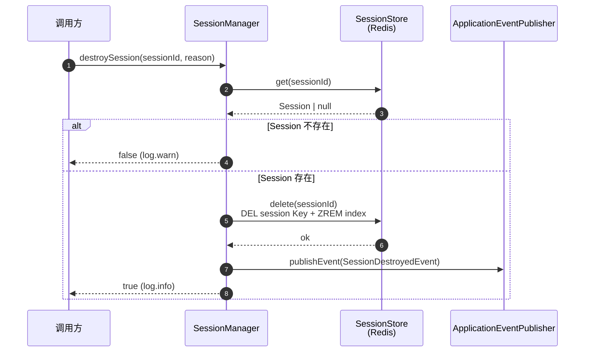
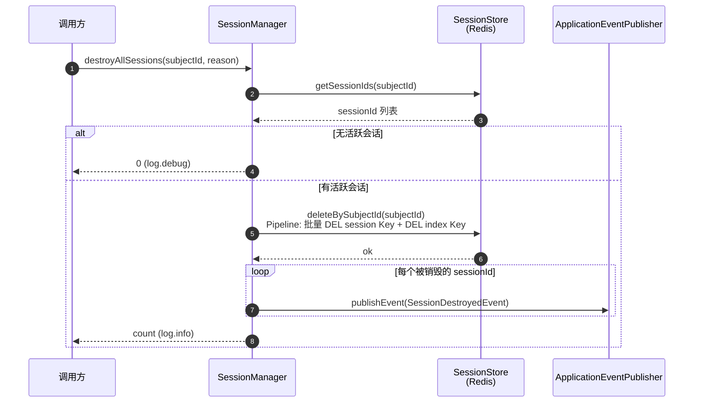

# US-07：会话销毁：单个销毁与批量销毁

> **模块**：iam-session（会话管理层）
> **依赖**：US-02（SessionStore）、US-04（RedisSessionStore）
> **来源设计**：[session-design.md](../../session-design.md) — SES-09, SES-10
> **讨论日期**：2026-07-19

## 用户故事

**作为** 用户 / 管理员
**我想要** 能够主动登出销毁当前会话，以及当密码被修改或账号被禁用时系统自动销毁我的所有会话
**以便** 我可以安全退出，且安全事件发生后旧会话立即失效

## 包含功能点

| ID     | 功能     | 说明                                   |
|--------|--------|--------------------------------------|
| SES-09 | 会话主动销毁 | 销毁单个会话：删 Session Key + 从用户索引 ZSet 移除 |
| SES-10 | 会话批量销毁 | 销毁用户所有会话（改密、禁用等场景触发）：按用户索引全量删除       |

## 明确不包含

- 不做登出端点（属于 US-13）
- 不做修改密码逻辑（属于 US-15）
- 不做管理员操作的事件发布（属于 US-16）
- 不做审计日志写入（由 US-14 监听器处理）

## 输入

- US-02：`SessionStore` 接口（get/delete/getSessionIds/deleteBySubjectId）
- US-04：`RedisSessionStore`（运行时实现）

## 输出

- `SessionManager.destroySession(sessionId, reason)` → boolean
- `SessionManager.destroyAllSessions(subjectId, reason)` → int
- `SessionDestroyedEvent` 事件类

## 核心流程

### destroySession（单个销毁）

### destroyAllSessions（批量销毁）

## 影响范围

| 文件                           | 变更类型 | 说明                                                                        |
|------------------------------|------|---------------------------------------------------------------------------|
| `SessionDestroyedEvent.java` | 新增   | 事件类（sessionId, subjectId, reason）                                         |
| `SessionManager.java`        | 修改   | +`destroySession()`, +`destroyAllSessions()`，注入 ApplicationEventPublisher |
| `SessionManagerTest.java`    | 修改   | +4 个测试用例                                                                  |

## 验收标准

- [ ] `destroySession(sessionId)` 删除 Redis Session Key + 从 ZSet 移除
- [ ] `destroyAllSessions(subjectId)` 通过 ZSet 获取全量 sessionId → Pipeline 批量 DEL + DEL index Key
- [ ] 批量删除使用 Redis Pipeline 优化，避免逐个网络往返
- [ ] 销毁操作后对应的 Session Key 和 ZSet 成员不存在
- [ ] 销毁不存在的 sessionId 时返回 false，日志记录 warn
- [ ] `destroyAllSessions` 传入无活跃会话的 subjectId 时返回 0
- [ ] 销毁成功后发布 `SessionDestroyedEvent`
