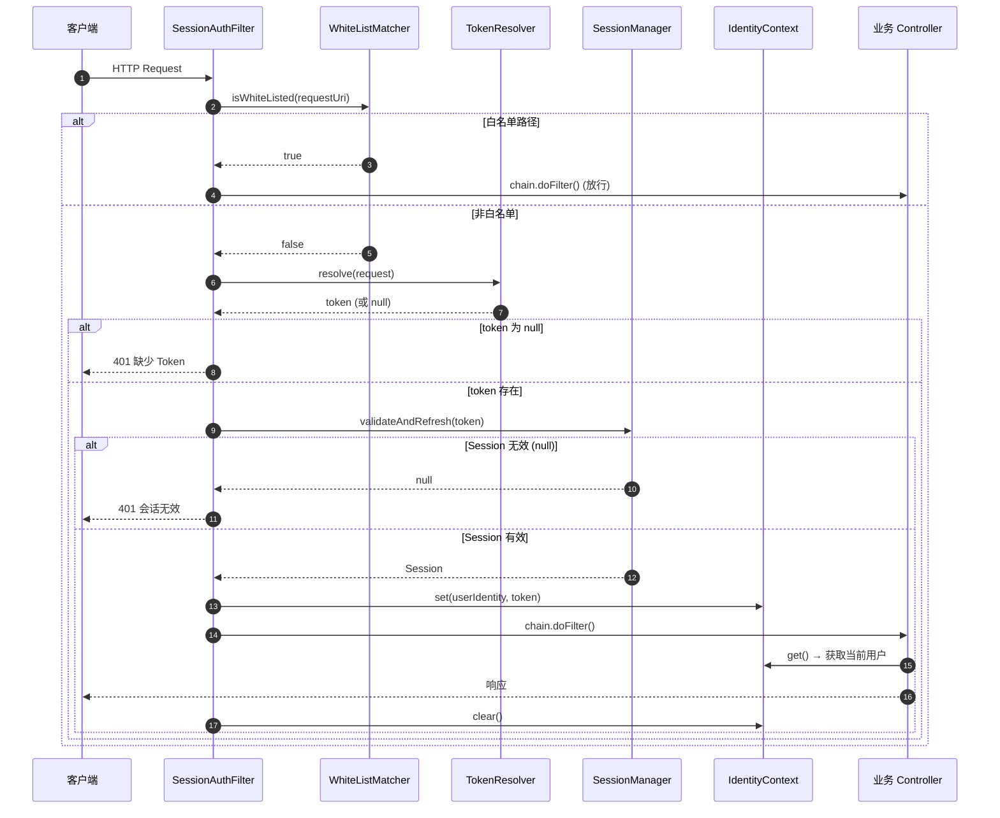

# US-09：认证过滤器：令牌提取、白名单匹配、身份上下文管理

> **模块**：iam-session（会话管理层）
> **依赖**：US-01（IdentityContext）、US-06（validateAndRefresh）
> **来源设计**：[session-design.md](../../session-design.md) — SES-15, SES-16, SES-17

## 用户故事

**作为** 系统
**我想要** 一个 `SessionAuthFilter`，在每次请求时从 HTTP Header 提取 Token（默认 `Authorization: Bearer xxx`），判断白名单路径（Ant
风格，默认 `/**/public/**`），调用 SessionManager 验证会话，将用户身份设置到 IdentityContext，并在请求结束后清理上下文
**以便** 每个受保护请求都能获取当前用户身份，且不会发生内存泄漏

## 包含功能点

| ID     | 功能       | 说明                                                                                    |
|--------|----------|---------------------------------------------------------------------------------------|
| SES-15 | Token 提取 | `TokenResolver` SPI：从 HTTP 请求中提取 token（默认：`Authorization: Bearer xxx` > `token` 自定义头） |
| SES-16 | 白名单路径匹配  | `WhiteListMatcher`：Ant 风格路径匹配，默认 `/**/public/**`，提供 `isWhiteListed(uri)` 方法           |
| SES-17 | 身份上下文清理  | 请求结束后在 Filter 的 finally 块中调用 `IdentityContext.clear()`，防止 ThreadLocal 内存泄漏            |

## 明确不包含

- 不做 Token 验证/续期（委托 US-06 的 validateAndRefresh）
- 不做请求日志采集（属于独立基础设施）
- 不做安全头注入（属于独立基础设施）

## 输入

- US-01：`IdentityContext` 接口
- US-06：`SessionManager.validateAndRefresh()`

## 输出

- `TokenResolver` 接口 + 默认实现 `DefaultTokenResolver`
- `WhiteListMatcher` 接口 + 默认实现 `AntPathWhiteListMatcher`
- `SessionAuthFilter` — Spring Filter 实现
- 配置项：
    - `iam.session.white-list`：白名单路径列表（默认 `/**/public/**`）

## 核心接口（概念）

```java
interface TokenResolver {
    String resolve(HttpServletRequest request);
}

interface WhiteListMatcher {
    boolean isWhiteListed(String requestUri);
}
```

## SessionAuthFilter 核心流程



```text
doFilter(request, response, chain):
  try:
    1. 获取请求 URI
    2. whiteListMatcher.isWhiteListed(uri)?
       → 是：chain.doFilter()，直接放行
       → 否：继续
    3. tokenResolver.resolve(request) → token
       → 若 token 为 null：返回 401
    4. sessionManager.validateAndRefresh(token) → Session
       → 若 Session 为 null（不存在/已过期）：返回 401
    5. identityContext.set(session.userIdentity, token)
    6. chain.doFilter() → 业务处理
  finally:
    7. identityContext.clear()
```

## 验收标准

- [ ] `TokenResolver` 默认实现：优先取 `Authorization: Bearer xxx`，其次取 `token` 自定义头
- [ ] `WhiteListMatcher` 默认支持 Ant 风格路径匹配
- [ ] 默认白名单 `/**/public/**` 可通过 `iam.session.white-list` 配置扩展
- [ ] 白名单路径直接放行，不设置 IdentityContext
- [ ] 非白名单路径缺少 Token 时返回 401，日志 warn（含请求 URI）
- [ ] Session 验证失败（不存在/过期）返回 401，日志 warn（含请求 URI）
- [ ] 验证成功后 `IdentityContext` 正确设置用户身份
- [ ] 请求结束后在 finally 中调用 `IdentityContext.clear()`
- [ ] Filter 中不包含任何业务逻辑（不查数据库、不写日志）
