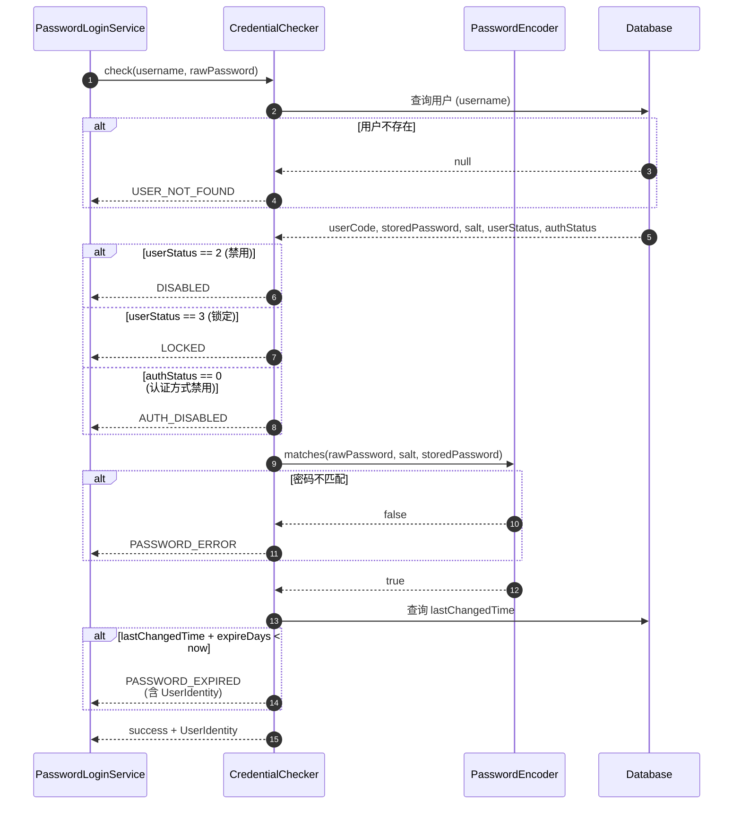

# US-10：密码凭证校验 SPI 与密码编码

> **模块**：iam-sso（单点登录层）
> **依赖**：US-01（UserIdentity）
> **来源设计**：[session-design.md](../../session-design.md) — SSO-03, SSO-04, SSO-05, SSO-06

## 用户故事

**作为** 用户
**我想要** 系统按照正确的顺序校验我的登录凭证：先检查账号是否存在/是否禁用/是否锁定/认证方式是否启用，再进行 PBKDF2
密码匹配（兼容历史 MD5 和无前缀格式），最后检查密码是否过期
**以便** 非法用户在被拒绝时不会消耗密码匹配的计算资源，且密码存储安全

## 包含功能点

| ID     | 功能         | 说明                                                                                           |
|--------|------------|----------------------------------------------------------------------------------------------|
| SSO-03 | 密码凭证校验 SPI | `CredentialChecker` 接口：根据 username 查出 userCode + storedPassword + salt + 状态信息                |
| SSO-04 | 密码匹配       | PBKDF2WithHmacSHA256 编码 + 校验；兼容历史 {MD5} 和无前缀格式；修改密码时自动升级                                     |
| SSO-05 | 账号状态校验     | 校验顺序：①用户是否存在 → ②是否禁用(userStatus=2) → ③是否锁定(userStatus=3) → ④认证方式是否禁用(authStatus=0)；发生在密码匹配之前 |
| SSO-06 | 密码过期检查     | lastChangedTime + expireDays > now → 提示密码已过期（可配置，默认 180 天）                                   |

## 明确不包含

- 不做登录端点编排（属于 US-12）
- 不做 RSA 密码解密（属于 US-12）
- 不做验证码（属于 US-11）
- 不做修改密码逻辑（属于 US-15）

## 输入

- US-01：`UserIdentity`（校验结果中返回）

## 输出

- `CredentialChecker` SPI 接口
- `CredentialCheckResult` 结果类
- `PasswordEncoder` 接口
- `Pbkdf2PasswordEncoder` 默认实现
- 配置项：`iam.sso.password-expire-days`（默认 180）

## 核心接口（概念）

```java
interface CredentialChecker {
    CredentialCheckResult check(String username, String rawPassword);
}

class CredentialCheckResult {
    boolean success;
    UserIdentity userIdentity;  // 校验成功时返回
    String failReason;          // 校验失败时：USER_NOT_FOUND / DISABLED / LOCKED / AUTH_DISABLED / PASSWORD_ERROR / PASSWORD_EXPIRED
}

interface PasswordEncoder {
    String encode(String rawPassword, String salt);
    boolean matches(String rawPassword, String salt, String encodedPassword);
}
```

## 校验顺序



```text
check(username, rawPassword):
  1. 查用户信息 → userCode, storedPassword, salt, userStatus, authStatus, lastChangedTime
  2. 用户不存在 → 返回 USER_NOT_FOUND
  3. userStatus == 2 (禁用) → 返回 DISABLED
  4. userStatus == 3 (锁定) → 返回 LOCKED
  5. authStatus == 0 (认证方式禁用) → 返回 AUTH_DISABLED
  6. passwordEncoder.matches(rawPassword, salt, storedPassword) → 不匹配返回 PASSWORD_ERROR
  7. lastChangedTime + expireDays < now → 返回 PASSWORD_EXPIRED
  8. 返回 success + UserIdentity
```

## 密码编码格式

| 格式             | 说明         | 处理方式                |
|----------------|------------|---------------------|
| `{PBKDF2}xxxx` | 新格式 PBKDF2 | 直接 PBKDF2 匹配        |
| `{MD5}xxxx`    | 历史 MD5 格式  | MD5 匹配后自动升级为 PBKDF2 |
| 无前缀（纯 MD5 hex） | 历史无前缀格式    | MD5 匹配后自动升级为 PBKDF2 |

## 验收标准

- [ ] `CredentialChecker.check()` 返回包含 userIdentity 或 failReason 的完整结果
- [ ] 校验顺序严格为：存在 → 禁用 → 锁定 → 认证方式禁用 → 密码匹配 → 密码过期
- [ ] 状态检查失败时不执行密码匹配（避免无效计算）
- [ ] PBKDF2WithHmacSHA256 使用随机 salt + 足够迭代次数（推荐 10000+）
- [ ] 兼容 {MD5} 前缀和无前缀 MD5 格式，匹配成功后自动升级密码
- [ ] 密码过期天数可通过 `iam.sso.password-expire-days` 配置
- [ ] 密码过期时仍返回 userIdentity（允许登录后强制修改密码）
