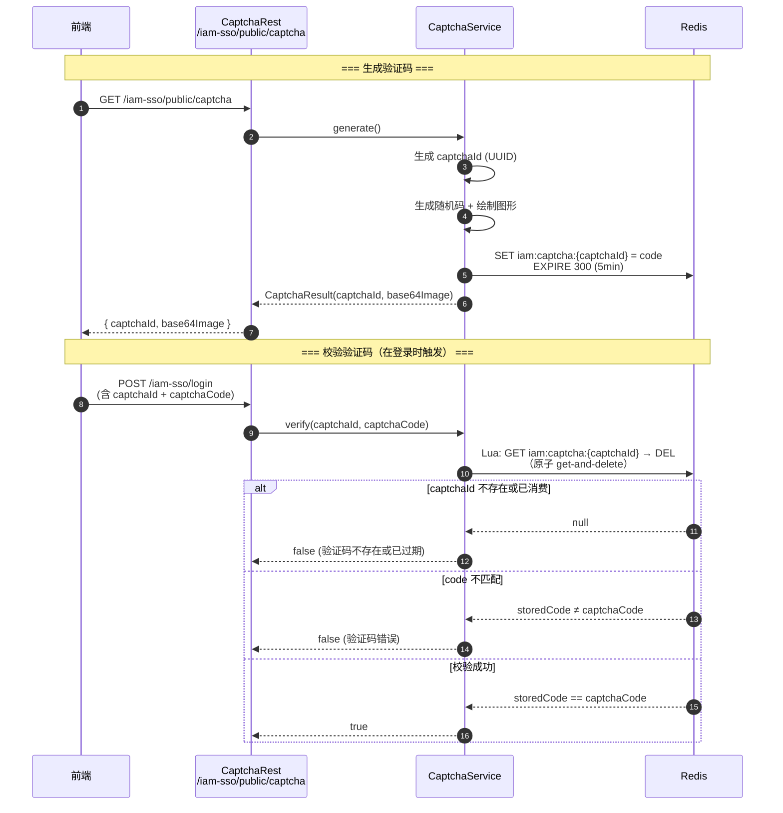

# US-11：图形验证码生成与校验

> **模块**：iam-sso（单点登录层）
> **依赖**：无（独立功能，仅依赖 Redis）
> **来源设计**：[session-design.md](../../session-design.md) — SSO-08, SSO-09

## 用户故事

**作为** 用户
**我想要** 系统提供图形验证码（返回 captchaId + base64 图片），校验时一次性消费（Redis 存储 5 分钟 TTL）
**以便** 防止自动化暴力破解登录

## 包含功能点

| ID     | 功能    | 说明                                             |
|--------|-------|------------------------------------------------|
| SSO-08 | 验证码生成 | 图形验证码生成（CAPTCHA），返回 captchaId + base64 图片      |
| SSO-09 | 验证码校验 | Redis 存储，TTL 5min，verify 一次性消费（get-and-delete） |

## 明确不包含

- 不做验证码触发判断逻辑（属于 US-12 的登录端点）
- 不做短信/邮件验证码
- 不做第三方验证码服务集成

## 输入

- 无业务依赖（独立功能，仅依赖 Redis）

## 输出

- `CaptchaService` — 生成/校验
- `CaptchaRest` — `GET /iam-sso/public/captcha`（生成端点和校验端点）
- Redis Key：`iam:captcha:{captchaId}`

## 核心流程



## 核心接口（概念）

```java
interface CaptchaService {
    // 生成验证码，返回 captchaId + base64 图片
    CaptchaResult generate();

    // 校验验证码，一次性消费
    boolean verify(String captchaId, String captchaCode);
}

class CaptchaResult {
    String captchaId;
    String base64Image;
}
```

## 验收标准

- [ ] `GET /iam-sso/public/captcha` 返回 `{ captchaId, base64Image }`
- [ ] 验证码存入 Redis，Key 为 `iam:captcha:{captchaId}`，TTL 5min
- [ ] 校验使用 `GET` + `DEL`（Lua 脚本保证原子性 get-and-delete）
- [ ] 校验成功后 Key 被删除，不可重复使用
- [ ] 验证码图片支持配置：宽高、字符数、干扰线数量
- [ ] 验证码不区分大小写（或配置是否区分）
- [ ] captchaId 不存在时校验返回 false，不抛异常
