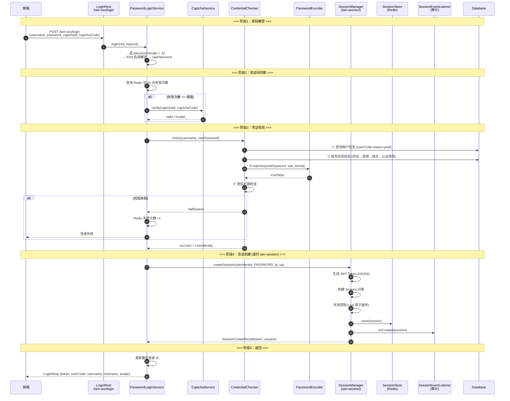

# US-12：密码登录端点与登录编排

> **模块**：iam-sso（单点登录层）
> **依赖**：US-05（createSession）、US-10（CredentialChecker）、US-11（Captcha）、US-08（SessionEventListener）
> **来源设计**：[session-design.md](../../session-design.md) — SSO-01, SSO-02, SSO-07, SSO-10, SSO-11, SSO-12

## 用户故事

**作为** 用户
**我想要** 通过 `POST /iam-sso/login` 提交用户名和密码（前端 RSA 加密）登录系统，系统自动判断是否需要验证码，凭证校验通过后为我创建会话并返回
Token 和用户信息
**以便** 我能安全地登录并获取访问凭证

## 包含功能点

| ID     | 功能       | 说明                                                                                                                               |
|--------|----------|----------------------------------------------------------------------------------------------------------------------------------|
| SSO-01 | 密码登录端点   | `POST /iam-sso/login`：接收 username + password + captchaId + captchaCode，返回 LoginResp(token, userCode, username, nickname, avatar) |
| SSO-02 | RSA 密码解密 | 前端 RSA 公钥加密，后端 RSA 私钥解密；仅密文 length > 32 时执行解密（明文兼容）                                                                              |
| SSO-07 | 验证码触发判断  | 同一用户名 1h 内失败登录次数 ≥ 阈值 → 要求输入验证码                                                                                                  |
| SSO-10 | 登录成功处理   | 凭证校验通过 → 构建 UserIdentity → 调用 SessionManager.createSession() → 发布 LoginSuccessEvent → 返回 LoginResp                               |
| SSO-11 | 登录失败处理   | 记录失败次数 → 发布 LoginFailedEvent → 返回错误信息                                                                                            |
| SSO-12 | 登录审计事件   | `LoginSuccessEvent` / `LoginFailedEvent`，含 username、ip、userAgent、timestamp、failureReason                                         |

## 明确不包含

- 不做 Session 存储/Token 生成（委托 US-05 的 SessionManager）
- 不做凭证校验逻辑（委托 US-10 的 CredentialChecker）
- 不做验证码生成/校验逻辑（委托 US-11 的 CaptchaService）
- 不做登录日志写入（由 US-08 事件 → US-14 监听器处理）

## 输入

- US-05：`SessionManager.createSession()`
- US-10：`CredentialChecker.check()`
- US-11：`CaptchaService.verify()`
- US-08：`SessionEventListener`（事件发布）

## 输出

- `LoginRest` — `POST /iam-sso/login`
- `PasswordLoginService.login()` 方法
- `LoginResp` 响应类（token, userCode, username, nickname, avatar）
- `LoginReq` 请求类（username, password, captchaId, captchaCode）
- 配置项：`iam.sso.private-key`（RSA 私钥）、`iam.sso.public-key`（RSA 公钥）

## 核心流程



```text
POST /iam-sso/login {username, password, captchaId, captchaCode}:

  阶段1：密码解密
  1. 若 password.length > 32 → RSA 私钥解密 → rawPassword
     否则 → rawPassword = password（明文兼容）

  阶段2：验证码判断
  2. 查询 Redis 中近 1h 内该 username 的登录失败次数
  3. 若失败次数 ≥ 阈值 → captchaService.verify(captchaId, captchaCode)
     → 校验失败 → 返回 "验证码错误"

  阶段3：凭证校验（委托 CredentialChecker）
  4. credentialChecker.check(username, rawPassword) → result
  5. 若 !result.success → 发布 LoginFailedEvent → 返回错误信息

  阶段4：会话创建（委托 SessionManager）
  6. 构建 UserIdentity(userCode, username, nickname, avatar)
  7. sessionManager.createSession(userIdentity, PASSWORD, clientIp, userAgent)
     → SessionCreateResult(token, session)
  8. 发布 LoginSuccessEvent
  9. 返回 LoginResp(token, userCode, username, nickname, avatar)
```

## 验收标准

- [ ] `POST /iam-sso/login` 接收 username + password + captchaId + captchaCode
- [ ] RSA 私钥解密密码（仅密文 length > 32 时执行，兼容明文）
- [ ] 同一用户名 1h 内失败次数达到可配置阈值时要求验证码
- [ ] 凭证校验失败 → 失败计数 +1 → 返回对应错误码和错误信息
- [ ] 凭证校验成功 → 调用 SessionManager.createSession() → 返回 LoginResp
- [ ] 登录成功/失败事件正确发布
- [ ] 不包含 Session/Token 的创建或存储逻辑
- [ ] 不包含密码匹配逻辑
