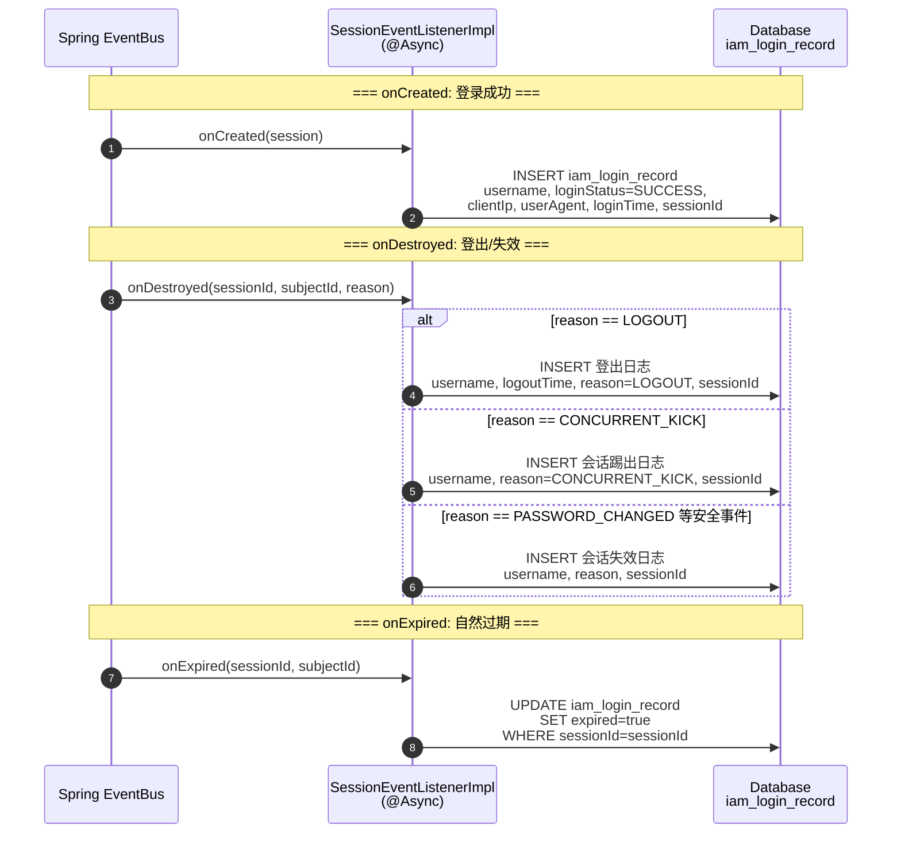

# US-14：会话审计事件监听实现

> **模块**：iam-sso（单点登录层）
> **依赖**：US-08（SessionEventListener 接口）
> **来源设计**：[session-design.md](../../session-design.md) — SSO-12a

## 用户故事

**作为** 系统
**我想要** 在 iam-sso 中实现 `SessionEventListener` 接口，将 onCreated / onDestroyed / onExpired 事件写入
`iam_login_record`
表
**以便** 所有会话生命周期事件都有持久化的审计记录

## 包含功能点

| ID      | 功能       | 说明                                                                     |
|---------|----------|------------------------------------------------------------------------|
| SSO-12a | 会话事件监听实现 | 实现 `SessionEventListener` 接口，将 onCreated/onDestroyed/onExpired 写入登录日志表 |

## 明确不包含

- 不做 `SessionEventListener` 接口定义（属于 US-08）
- 不做 `iam_login_record` 表结构定义（使用现有表结构）
- 不做事件发布逻辑（US-08 已定义）
- 不做请求日志（属于独立基础设施）

## 输入

- US-08：`SessionEventListener` 接口
- 现有：`iam_login_record` 表结构

## 输出

- `SessionEventListenerImpl` — 实现 `SessionEventListener` 接口
- `LoginLog` 实体 + Mapper（或复用现有）
- 注入 Spring 容器，自动订阅 Session 事件

## 审计流程



## 核心实现

```java
@Component
class SessionEventListenerImpl implements SessionEventListener {

    void onCreated(Session session) {
        // INSERT iam_login_record:
        //   username = session.subjectId
        //   loginStatus = SUCCESS
        //   clientIp = session.clientIp
        //   userAgent = session.userAgent
        //   loginTime = session.createTime
        //   sessionId = session.sessionId
        log.info("登录日志记录: username={}, ip={}", session.subjectId, session.clientIp);
    }

    void onDestroyed(String sessionId, String subjectId, DestroyReason reason) {
        // INSERT 或 UPDATE iam_login_record:
        //   记录登出/失效事件，标记 reason
        log.info("会话销毁日志: username={}, sessionId={}, reason={}",
                 subjectId, mask(sessionId), reason);
    }

    void onExpired(String sessionId, String subjectId) {
        // UPDATE iam_login_record:
        //   标记对应登录记录为已过期
        log.info("会话过期日志: username={}, sessionId={}",
                 subjectId, mask(sessionId));
    }
}
```

## 日志表字段映射

| 事件          | 操作     | 关键字段                                                                     |
|-------------|--------|--------------------------------------------------------------------------|
| onCreated   | INSERT | username, loginStatus=SUCCESS, clientIp, userAgent, loginTime, sessionId |
| onDestroyed | INSERT | username, loginStatus 按 reason 映射, logoutTime, sessionId                 |
| onExpired   | UPDATE | 标记原登录记录的 expired 字段                                                      |

## 验收标准

- [ ] `onCreated` → INSERT 登录日志（loginStatus=SUCCESS，含完整客户端信息）
- [ ] `onDestroyed` → INSERT 登出/失效日志，记录对应的 DestroyReason
- [ ] `onExpired` → UPDATE 对应登录日志标记为过期
- [ ] 日志包含 username、clientIp、userAgent、timestamp、操作类型
- [ ] sessionId 在日志中适当脱敏
- [ ] 监听器异常不影响主流程（事件处理 try-catch + log.error）
- [ ] 事件处理使用 `@Async` 异步执行
