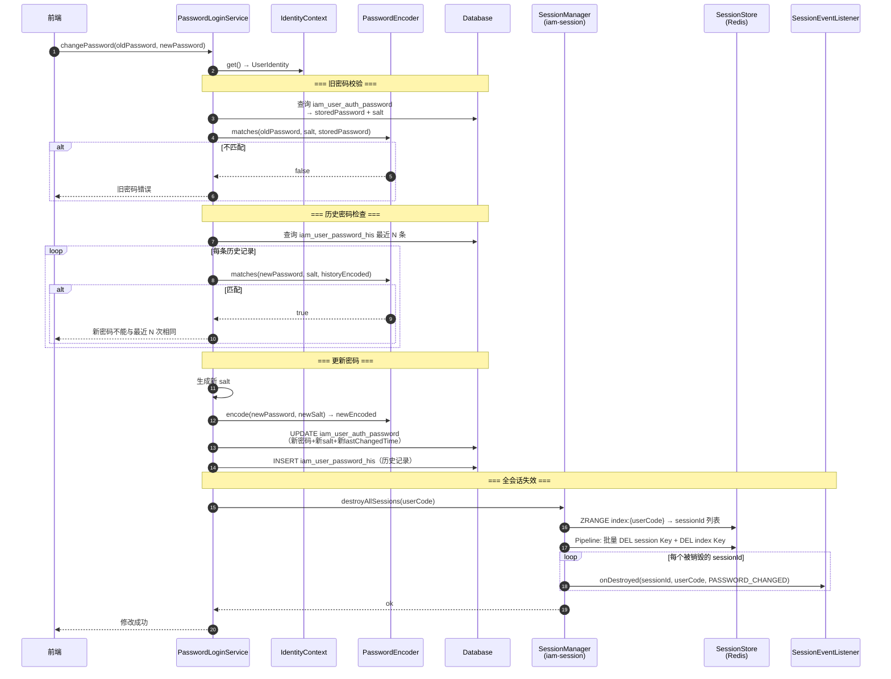

# US-15：修改密码与全会话失效

> **模块**：iam-sso（单点登录层）
> **依赖**：US-01（IdentityContext）、US-07（destroyAllSessions）、US-10（PasswordEncoder）
> **来源设计**：[session-design.md](../../session-design.md) — SSO-15, SSO-16

## 用户故事

**作为** 用户
**我想要** 修改密码时系统验证旧密码、检查新密码不与最近 N 次历史密码重复、编码新密码后更新数据库，并自动使我所有设备的登录会话失效
**以便** 密码修改后旧会话立即不可用，保障账号安全

## 包含功能点

| ID     | 功能     | 说明                                                                                |
|--------|--------|-----------------------------------------------------------------------------------|
| SSO-15 | 修改密码   | 旧密码校验 → 历史密码检查（最近 N 条不重复）→ 编码新密码 → 更新 DB → 调用 SessionManager.destroyAllSessions() |
| SSO-16 | 密码修改事件 | `PasswordChangedEvent`，触发全会话失效已在 SSO-15 中处理，事件用于审计通知                              |

## 明确不包含

- 不做管理员重置密码（属于 US-16）
- 不做 Session 销毁逻辑（委托 US-07 的 SessionManager）
- 不做密码编码逻辑（委托 US-10 的 PasswordEncoder）

## 输入

- US-01：`IdentityContext.get()`（获取当前用户）
- US-07：`SessionManager.destroyAllSessions()`
- US-10：`PasswordEncoder.matches()` + `PasswordEncoder.encode()`

## 输出

- `PasswordLoginService.changePassword()` 方法
- `PasswordChangedEvent` 事件类
- 配置项：`iam.sso.password-history-size`（历史密码检查数量，默认 5）

## 核心流程



```text
changePassword(oldPassword, newPassword):
  1. identityContext.get() → UserIdentity（获取当前用户）
  2. 根据 userCode 查询 iam_user_auth_password → 获取 storedPassword + salt
  3. passwordEncoder.matches(oldPassword, salt, storedPassword)
     → 不匹配 → 返回 "旧密码错误"
  4. 查询 iam_user_password_his 最近 N 条记录
  5. 检查 newPassword 是否与历史密码重复
     → 重复 → 返回 "新密码不能与最近 N 次密码相同"
  6. 生成新 salt → passwordEncoder.encode(newPassword, newSalt) → newEncodedPassword
  7. UPDATE iam_user_auth_password（新密码 + 新 salt + 新 lastChangedTime）
  8. INSERT iam_user_password_his（历史记录）
  9. sessionManager.destroyAllSessions(userCode)
     → 销毁该用户所有活跃会话
  10. 发布 PasswordChangedEvent(userCode, timestamp)
  11. 返回修改成功
```

## 验收标准

- [ ] 从 IdentityContext 获取当前用户身份
- [ ] 校验旧密码正确性（委托 PasswordEncoder）
- [ ] 检查新密码不在最近 N 条历史密码中（N 可通过 `iam.sso.password-history-size` 配置）
- [ ] 使用 PBKDF2 编码新密码 → 更新 iam_user_auth_password 表
- [ ] 记录密码变更历史到 iam_user_password_his
- [ ] 调用 `SessionManager.destroyAllSessions(subjectId)` 销毁全设备会话
- [ ] 发布 PasswordChangedEvent
- [ ] 不包含密码编码的具体算法逻辑
