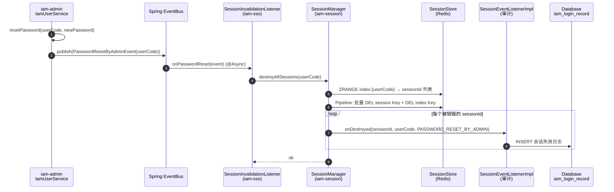
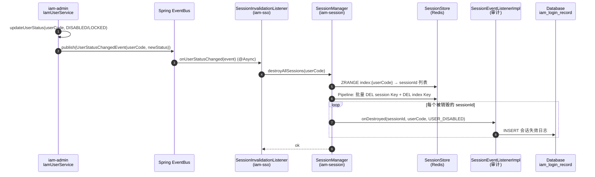
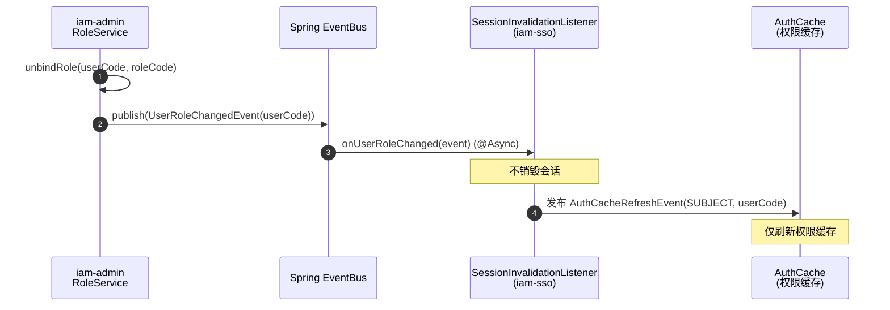

# US-16：管理员安全操作驱动的全会话失效（事件驱动）

> **模块**：iam-sso（单点登录层）+ iam-admin（事件发布集成）
> **依赖**：US-07（destroyAllSessions）、US-08（SessionEventListener）
> **来源设计**：[session-design.md](../../session-design.md) — SSO-17, SSO-18

## 用户故事

**作为** 管理员
**我想要** 当我重置用户密码或变更用户状态（禁用/锁定）时，系统自动发布事件并触发该用户所有活跃会话的销毁
**以便** 安全操作立即生效，被操作的用户无法继续使用旧会话访问系统

## 包含功能点

| ID     | 功能              | 说明                                                                                       |
|--------|-----------------|------------------------------------------------------------------------------------------|
| SSO-17 | 管理员重置密码 → 全会话失效 | 管理员后台重置密码时发布 `PasswordResetByAdminEvent` → 监听器调用 `SessionManager.destroyAllSessions()`   |
| SSO-18 | 用户状态变更 → 全会话失效  | 用户禁用/锁定/认证方式禁用时发布 `UserStatusChangedEvent` → 监听器调用 `SessionManager.destroyAllSessions()` |

## 明确不包含

- 不做管理员重置密码的业务逻辑（属于 iam-admin，本故事仅添加事件发布）
- 不做用户状态变更的业务逻辑（属于 iam-admin，本故事仅添加事件发布）
- 不做 Session 销毁逻辑（委托 US-07 的 SessionManager）
- 不做角色绑定变更的会话销毁（暂不处理，仅刷新权限缓存）

## 涉及模块

| 模块         | 职责                                                          |
|------------|-------------------------------------------------------------|
| iam-common | 事件类定义（`PasswordResetByAdminEvent`、`UserStatusChangedEvent`） |
| iam-admin  | 在重置密码/状态变更接口中发布事件                                           |
| iam-sso    | 事件监听器 `SessionInvalidationListener` 监听事件并调用 SessionManager  |

## 输入

- US-07：`SessionManager.destroyAllSessions()`
- US-08：`SessionEventListener`（事件发布/订阅基础设施）

## 输出

- `PasswordResetByAdminEvent` 事件类
- `UserStatusChangedEvent` 事件类
- `SessionInvalidationListener` 事件监听器
- iam-admin 中集成事件发布（在重置密码和状态变更方法中）

## 核心流程

### 场景1：管理员重置密码



### 场景2：用户状态变更（禁用/锁定）



### 场景3：角色绑定变更（不销毁会话，仅刷新权限缓存）



```text
### 场景1：管理员重置密码

iam-admin IamUserService.resetPassword(userCode, newPassword):
  1. 重置密码逻辑（已有）
  2. 发布 PasswordResetByAdminEvent(userCode)
     ↓ Spring EventBus
iam-sso SessionInvalidationListener.onPasswordReset(event):
  3. sessionManager.destroyAllSessions(event.userCode)
  4. → SessionStore 批量删除 → 发布 SessionDestroyedEvent ×N
  5. → SessionEventListenerImpl.onDestroyed() → INSERT 审计日志

### 场景2：用户状态变更

iam-admin IamUserService.updateUserStatus(userCode, newStatus):
  1. 状态变更逻辑（已有）
  2. 若 newStatus == DISABLED 或 LOCKED:
     发布 UserStatusChangedEvent(userCode, newStatus)
     ↓ Spring EventBus
iam-sso SessionInvalidationListener.onUserStatusChanged(event):
  3. sessionManager.destroyAllSessions(event.userCode)
  4. → 同上审计流程

### 场景3：角色绑定变更（暂不销毁会话）

iam-admin RoleService.unbindRole(userCode, roleCode):
  1. 解绑逻辑（已有）
  2. 发布 UserRoleChangedEvent(userCode)
     ↓ Spring EventBus
iam-sso SessionInvalidationListener.onUserRoleChanged(event):
  3. 不销毁会话，仅发布 AuthCacheRefreshEvent 刷新权限缓存
```

## 验收标准

- [ ] `PasswordResetByAdminEvent` 和 `UserStatusChangedEvent` 定义在 iam-common
- [ ] iam-admin 重置密码接口执行成功后发布 `PasswordResetByAdminEvent`
- [ ] iam-admin 用户禁用/锁定接口执行成功后发布 `UserStatusChangedEvent`
- [ ] `SessionInvalidationListener` 监听上述事件 → 调用 `SessionManager.destroyAllSessions()`
- [ ] 会话销毁事件被 `SessionEventListenerImpl`（US-14）捕获并写入审计日志
- [ ] 角色绑定变更不销毁会话，仅发权限缓存刷新事件
- [ ] 事件监听器异常不影响 iam-admin 主流程（异步 + try-catch）
- [ ] 用户不存在活跃会话时 `destroyAllSessions` 正常返回不报错
