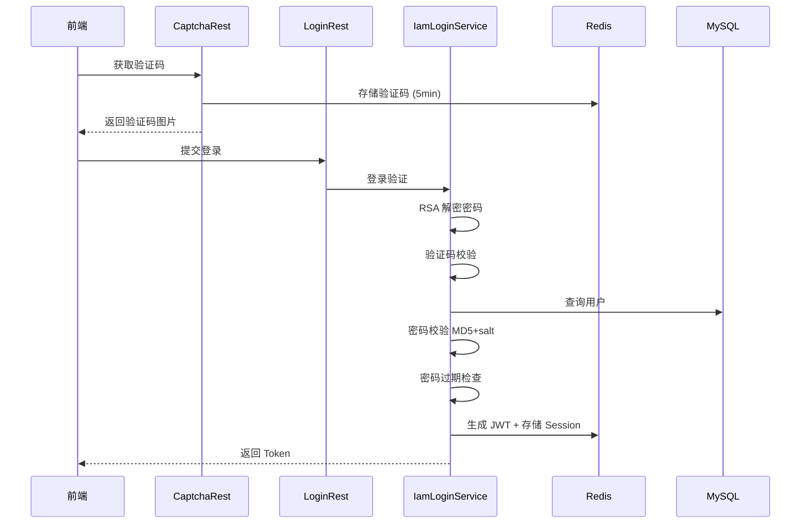

# 业务流程索引

最后更新：2026-06-19

## 流程列表

| 流程名      | 触发条件         | 业务价值     |
|----------|--------------|----------|
| 用户名密码登录  | 用户提交登录表单     | 身份认证     |
| Token 鉴权 | 请求到达需鉴权的 API | 访问控制     |
| 用户创建     | 管理员新增用户      | 用户管理     |
| 角色菜单绑定   | 管理员配置角色权限    | 权限管理     |
| API 自动扫描 | 应用启动时        | API 路由同步 |
| 用户角色过期检查 | 定时任务触发       | 权限回收     |

## 核心流程

### 用户名密码登录

