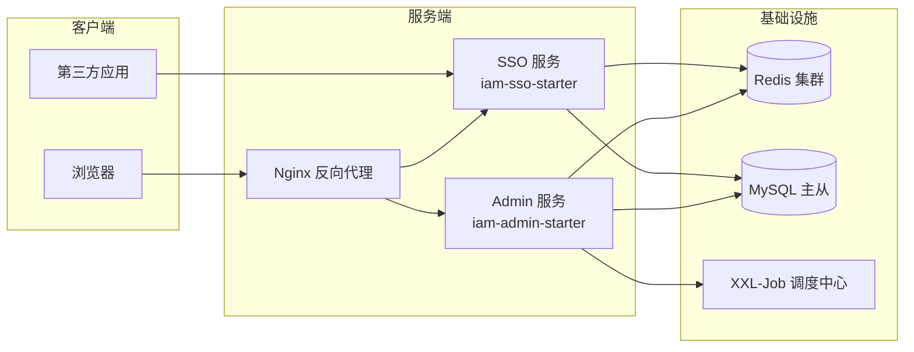

# 部署架构

## 部署架构图

## 部署环境说明

sh-iam 支持两种部署模式：SSO 服务和 Admin 服务可独立部署，也可合并部署。

## 环境配置

| 环境   | 说明     | 配置要点                                   |
|------|--------|----------------------------------------|
| 开发环境 | 本地开发调试 | application-local.yml，连接本地 MySQL/Redis |
| 测试环境 | 集成测试   | application-test.yml，连接测试环境基础设施        |
| 生产环境 | 正式运行   | application-prod.yml，高可用 Redis/MySQL   |

## 部署流程

1. Maven 构建：`mvn package -DskipTests`
2. 部署 SSO 服务：`iam-sso-starter.jar`
3. 部署 Admin 服务：`iam-admin-starter.jar`
4. 配置 Nginx 反向代理

## 运维注意事项

- SSO 服务必须高可用，所有第三方应用依赖其鉴权
- Redis 是会话存储的关键依赖，需确保高可用
- JWT 密钥变更会导致所有会话失效，需谨慎操作
