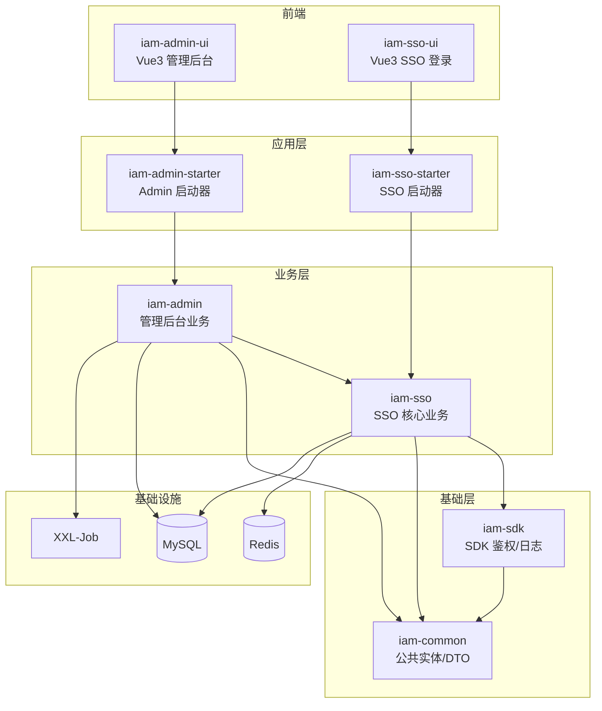

# 架构概览

## 系统架构图

## 架构描述

sh-iam 采用分层架构设计，分为前端层、应用层、业务层和基础层：

- **前端层**：Vue3 SPA 应用，管理后台和 SSO 登录各自独立
- **应用层**：Spring Boot 可部署启动器，分别对应 Admin 和 SSO 两个独立服务
- **业务层**：核心业务逻辑，Admin 依赖 SSO，SSO 依赖 SDK 和 Common
- **基础层**：SDK 提供鉴权/日志过滤器供第三方应用集成，Common 提供公共实体和工具

## 核心技术组件说明

| 组件     | 说明               | 技术选型                      |
|--------|------------------|---------------------------|
| 鉴权过滤器  | JWT + Redis 会话校验 | IamAuthFilter             |
| 请求日志   | AK 签名 + 远程保存     | LoggingFilter + SsoFacade |
| 密码加密   | MD5 + salt       | PasswordHelper            |
| JWT 工具 | HS256 签名         | JwtUtil                   |
| 会话管理   | Redis 存储         | SessionHelper             |
| ID 生成  | 时间戳 + Redis 自增   | RedisIdGenerator          |
| API 扫描 | @Router 注解扫描     | RestfulScan               |

## 组件交互流程

请求进入后依次经过 RequestWrapperFilter → LoggingFilter → IamAuthFilter，鉴权通过后进入 Controller → Service → Mapper
处理链路。
