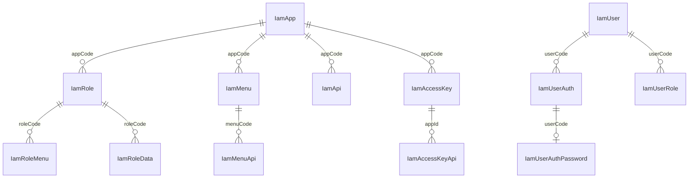

# 数据模型索引

## 数据模型列表

| 实体名                 | 说明        | 关联模块       |
|---------------------|-----------|------------|
| IamUser             | 用户        | iam-common |
| IamRole             | 角色        | iam-common |
| IamMenu             | 菜单        | iam-common |
| IamApi              | API 路由    | iam-common |
| IamApp              | 应用        | iam-common |
| IamAccessKey        | 访问密钥      | iam-common |
| IamUserAuth         | 用户认证方式    | iam-common |
| IamUserAuthPassword | 密码凭据      | iam-common |
| IamUserPasswordHis  | 密码变更历史    | iam-common |
| IamUserRole         | 用户-角色关联   | iam-common |
| IamRoleMenu         | 角色-菜单关联   | iam-common |
| IamMenuApi          | 菜单-API 关联 | iam-common |
| IamAccessKeyApi     | AK-API 关联 | iam-common |
| IamRoleData         | 角色-数据维度关联 | iam-common |
| IamDataDimension    | 数据维度      | iam-common |
| IamLoginLog         | 登录日志      | iam-common |
| IamRequestLog       | 请求日志      | iam-common |
| IamApiField         | API 字段    | iam-common |
| IamMenuField        | 菜单字段      | iam-common |
| IamTenant           | 租户        | iam-common |

## 数据模型关系图

