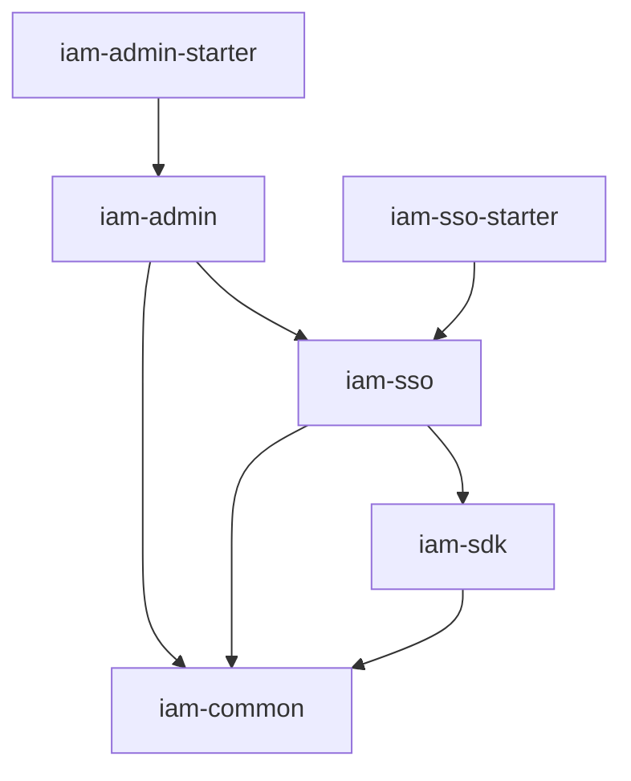

# 依赖索引

## 外部依赖列表

| 依赖名               | 版本         | 用途         |
|-------------------|------------|------------|
| Spring Boot       | 3.x        | Web 框架     |
| MyBatis           | sh-mybatis | ORM 封装     |
| Redis (Lettuce)   | sh-redis   | 缓存/会话/分布式锁 |
| XXL-Job           | sh-xxljob  | 分布式定时任务    |
| Guava             | 33.5.0-jre | 本地缓存/工具    |
| Fastjson2         | BOM 管理     | JSON 序列化   |
| JJWT              | BOM 管理     | JWT 生成/解析  |
| Eclipse Paho MQTT | sh-mqtt    | MQTT 消息    |

## 内部模块依赖关系

## 框架依赖 (sh-parent BOM)

| 库名           | 用途           | 备注                                         |
|--------------|--------------|--------------------------------------------|
| sh-web       | Web 基础能力     | IpHelper, RequestHelper, R 响应封装            |
| sh-mybatis   | MyBatis 封装   | BaseService, PageQuery, BaseMapper         |
| sh-redis     | Redis 封装     | RedisIdGenerator, RedisTemplate, RedisLock |
| sh-xxljob    | XXL-Job 定时任务 | XxlJobConfig, @XxlJob 注解                   |
| sh-bom       | 统一版本管理       | guava, fastjson2, jjwt 等                   |
| sh-spring    | Spring 扩展    | SpringContextHolder, SnowflakeHelper       |
| sh-tool      | 底层工具         | 加密/字符串/日期/Bean/文件/网络工具                     |
| sh-core      | 核心基础         | 实体体系/异常体系/ResultCode/R                     |
| sh-dynamicdb | 动态数据源        | 运行时数据源切换                                   |
| sh-mqtt      | MQTT 消息      | 注解驱动消息处理                                   |
| micro-dict   | 字典服务         | 字典查询                                       |
