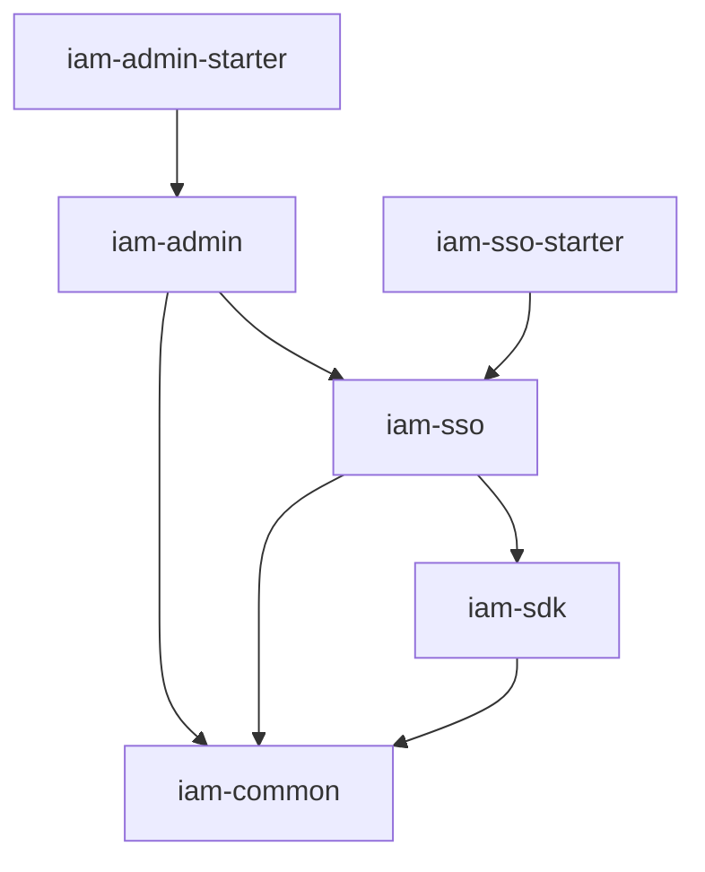

# 模块索引

## 模块列表

| 模块名               | 职责              | 技术栈                           | 入口路径                        |
|-------------------|-----------------|-------------------------------|-----------------------------|
| iam-common        | 公共实体、DTO、工具类    | Java                          | com.wkclz.iam.common        |
| iam-sdk           | SDK 鉴权/日志/会话工具  | Java + Spring Boot AutoConfig | com.wkclz.iam.sdk           |
| iam-sso           | SSO 登录/个人中心核心业务 | Java + Spring Boot + MyBatis  | com.wkclz.iam.sso           |
| iam-sso-starter   | SSO 启动器         | Spring Boot                   | com.wkclz.iam.sso.starter   |
| iam-admin         | 管理后台业务          | Java + Spring Boot + MyBatis  | com.wkclz.iam.admin         |
| iam-admin-starter | Admin 启动器       | Spring Boot                   | com.wkclz.iam.admin.starter |
| iam-admin-ui      | Vue3 管理后台前端     | Vue3 + Element Plus           | src/views/                  |
| iam-sso-ui        | Vue3 SSO 登录前端   | Vue3 + Element Plus           | src/views/                  |

## 模块依赖关系

