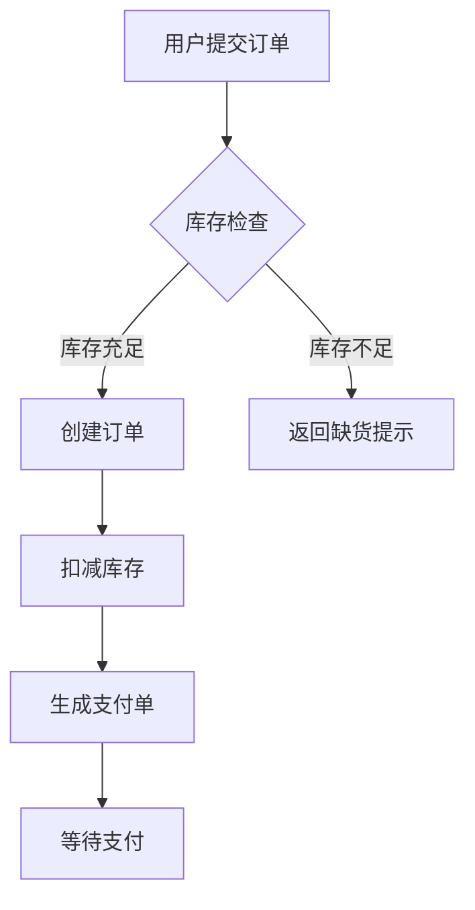
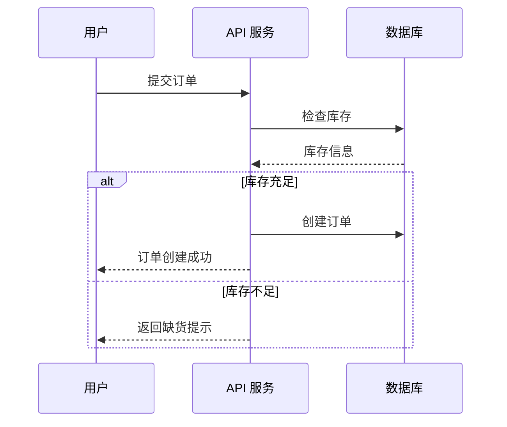

# Stories 拆解规则

## 分析系统逻辑的步骤

1. 识别系统中的核心业务流程（用户操作路径）
2. 识别系统中的数据流转（数据从哪里来，到哪里去）
3. 识别系统中的外部交互（API 调用、消息队列、数据库操作）
4. 识别系统中的定时任务和异步流程

## 拆解为 Stories 的原则

- 每个 story 代表一个完整的业务流程或技术流程
- story 粒度：一个 story 应能独立理解和验证
- story 命名：动词开头，描述做什么（如"用户注册"、"订单支付"）
- 优先级：P0（核心流程）→ P1（重要流程）→ P2（辅助流程）

## Mermaid 流程图编写规范

- 使用 flowchart（流程图）或 sequenceDiagram（时序图）
- 流程图必须包含：开始节点、结束节点、判断节点、处理节点
- 节点命名使用业务语言，不使用技术术语
- 分支必须标注条件
- 错误/异常路径用红色标注（style fill:#f9f,stroke:#333）

### 流程图示例



### 时序图示例



## Story 文件组织

- 文件存放于 docs/stories/ 目录，按业务域/模块分组
- 每个分组一个独立子目录，目录名使用中文（如 用户管理/、订单系统/、支付系统/）
- 文件命名：{序号}-{故事名称}.md（如 001-用户注册.md、001-订单创建.md）
- 序号：3 位数字，分组内从 001 开始递增
- 每个分组目录下包含 README.md 索引文件

### 目录结构示例

```
docs/stories/
├── 用户管理/
│   ├── README.md
│   ├── 001-用户注册.md
│   ├── 002-用户登录.md
│   └── 003-密码重置.md
├── 订单系统/
│   ├── README.md
│   ├── 001-订单创建.md
│   ├── 002-订单支付.md
│   └── 003-订单取消.md
└── 支付系统/
    ├── README.md
    ├── 001-支付发起.md
    └── 002-支付回调.md
```

### 分组 README.md 索引

每个分组目录下必须包含 README.md，格式如下：

```markdown
# {分组名称}

| 序号 | 名称 | 优先级 | 状态 | 文件 |
|------|------|--------|------|------|
| 001 | 故事名称 | P0 | 待开发 | [链接](./001-故事名称.md) |
```

### 分组原则

- 按业务域分组：同一业务领域的 story 放在同一目录
- 按模块分组：独立功能模块可单独分组
- 分组粒度：每组 3-10 个 story 为宜，过少则合并，过多则拆分
- 分组命名：使用简洁的中文名词，如"用户管理"而非"用户管理模块"

## 初始化时的 Stories 生成

当对目标项目执行 harness 初始化时：

1. 分析项目所有源码文件
2. 识别核心业务逻辑
3. 按上述原则拆解为 stories
4. 为每个 story 生成 mermaid 流程图
5. 将 stories 按分组放入 docs/stories/{分组名称}/ 目录
6. 为每个分组创建 README.md 索引文件
