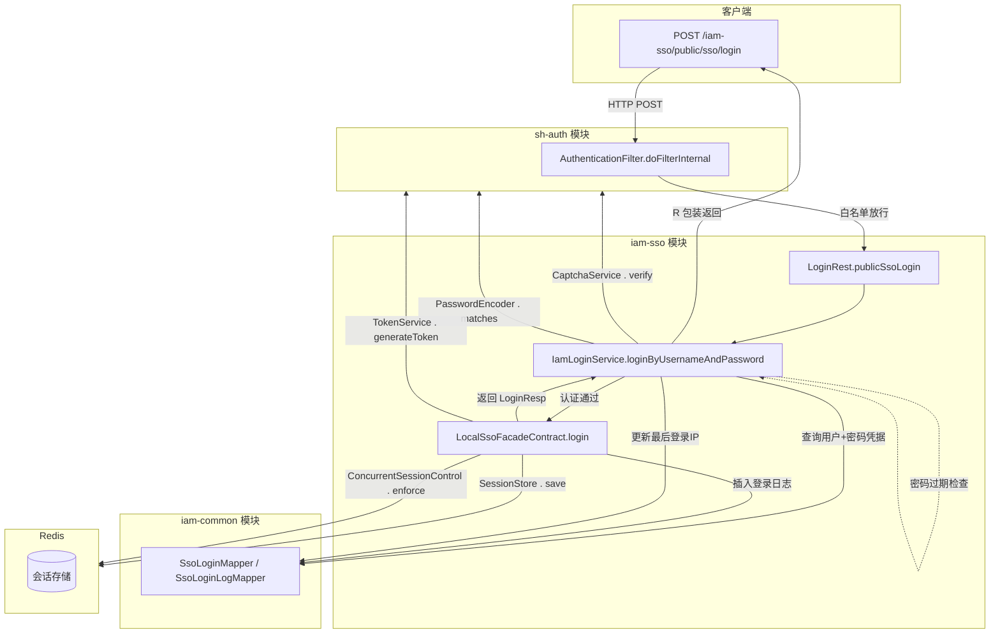

# STORY-015 — 用户名密码登录

| 属性       | 值          |
|----------|------------|
| Story ID | STORY-015  |
| 所属 Epic  | SSO 登录认证模块 |
| 所属模块     | iam-sso    |
| 优先级      | P0         |
| 状态       | 已完成        |

## 用户故事

**作为** 系统用户，**我希望** 通过用户名和密码登录系统，**以便** 获取 JWT 令牌并访问受保护的资源。

## 验收标准

1. API 端点：`POST /iam-sso/public/sso/login`
2. 接收 `LoginReq`（username、password、captchaId、captchaCode）
3. 登录流程（10 步校验）：
    - RSA 解密前端密码（若配置了 RSA 私钥且密码长度 > 32）
    - 跨三表 JOIN 查询用户认证信息
   - 检查是否需要验证码（1h 内登录失败次数，含失败历史）
    - 验证码校验（Redis 获取并删除，忽略大小写）
   - 用户不存在返回 USERNAME_OR_PASSWORD_ERROR
   - 登录方式已禁用返回 ACCOUNT_DISABLED
    - 用户已锁定返回 ACCOUNT_LOCKED
    - 用户已禁用返回 ACCOUNT_DISABLED
   - 密码错误返回 USERNAME_OR_PASSWORD_ERROR
   - 密码过期返回 CREDENTIALS_EXPIRED
4. 登录成功：
    - `SsoFacadeContract.login()` 创建会话
    - 生成 JWT Token（HS256，24h 过期）
    - 构建 Session 存入 Redis（LocalSsoFacadeContract）
    - 并发会话控制（超出上限踢出最早会话）
    - 记录登录日志（登录成功/失败均记录）
    - 更新用户最后登录 IP
5. 返回 `LoginResp`（含 token、用户编码、用户名、昵称、头像）

## 模块间调用关系

### 各模块入口方法

| 步骤 | 模块                         | 入口方法                                                                        |
|----|----------------------------|-----------------------------------------------------------------------------|
| ①  | **iam-sso**                | `IamLoginService.loginByUsernameAndPassword()` — 启动登录流程                     |
| ②  | **iam-sso**→**sh-auth**    | `CaptchaService.verify()` — 验证码校验                                           |
| ③  | **iam-sso**→**iam-common** | `SsoLoginMapper.getUserAuth4PasswordByUsername()` — 三表 JOIN 查询              |
| ④  | **iam-sso**→**sh-auth**    | `PasswordEncoder.matches()` — `DefaultPasswordEncoder` PBKDF2/MD5 兼容校验      |
| ⑤  | **iam-sso**                | `IamLoginService` 内置 — 密码过期时间比较                                             |
| ⑥  | **iam-sso**→**iam-sso**    | `LocalSsoFacadeContract.login()` — 创建会话                                     |
| ⑦  | **iam-sso**→**sh-auth**    | `TokenService.generateToken()` — `JwtTokenService` 生成 JWT                   |
| ⑧  | **iam-sso**→**Redis**      | `SessionStore.save()` — `RedisSessionStore` 写入 Redis                        |
| ⑨  | **iam-sso**→**Redis**      | `ConcurrentSessionControl.enforce()` — `RedisConcurrentSessionControl` 超限踢出 |
| ⑩  | **iam-sso**→**iam-common** | `SsoLoginLogMapper.insertLoginLog()` — 记录登录日志                               |

## 技术实现要点

### 架构分层

| 层      | 模块             | 职责                                                 |
|--------|----------------|----------------------------------------------------|
| SSO 专属 | **iam-sso**    | RSA 密码解密、1h 验证码需求判断、更新最后登录 IP                      |
| 标准认证   | **sh-auth**    | `LoginService` 模板方法编排、`StandardLoginPipeline` 会话创建 |
| 数据访问   | **iam-common** | `SsoLoginMapper`/`SsoLoginLogMapper`               |

### 核心类关系

- `IamLoginService` → 构建 `AuthRequest` → 委托 `LoginService.login()` (sh-auth 模板方法)
- `LoginService` → `checkCaptcha`/`authenticate`/`recordLoginLog` 等抽象方法由 `IamLoginPipeline` 实现
- `IamPasswordAuthenticationProvider` → 实现 `AuthenticationProvider.authenticate()`，处理 IAM 专属凭证校验
- `StandardLoginPipeline` → 通用会话创建管道：`TokenService → SessionStore → ConcurrentSessionControl`

- **过滤器链**：`RequestWrapperFilter` → `RequestRecordFilter` → `SecurityHeaderFilter` → `AuthenticationFilter`（白名单放行
  `/public/**`）
- **密码解密**：`RsaTool.decryptByPrivateKey()`，仅当配置了 RSA 私钥且密码长度 > 32 时执行
- **用户查询**：`ssoLoginMapper.getUserAuth4PasswordByUsername()` 跨 `iam_user` + `iam_user_auth` +
  `iam_user_auth_password` 三表 JOIN
- **验证码判断**：查询最近 1 小时内该用户的登录失败记录（SSO 专属，在 `IamLoginService` 中提前判断）
- **验证码校验**：`CaptchaService.verify()` 从 Redis 获取并删除（一次性使用），忽略大小写（标准流程中
  `IamLoginPipeline.checkCaptcha()` 处理）
- **密码校验**：`PasswordEncoder.matches()` — `DefaultPasswordEncoder` 自动识别 `{PBKDF2}` / `{MD5}` / 无前缀
- **密码过期检查**：`lastChangedTime + passwordExpireDays`（默认 180 天），在
  `IamPasswordAuthenticationProvider.authenticate()` 中处理
- **JWT 生成**：`JwtTokenService.generateToken()`（jjwt HS256，24h 过期），由 `StandardLoginPipeline` 调用
- **Redis Session**：`sh-auth:session:{md5(token)}` → Session JSON，由 `RedisSessionStore.save()` 处理
- **并发控制**：`RedisConcurrentSessionControl.enforce()` 按 ZSet 踢出最早超限会话，由 `StandardLoginPipeline` 调用
- **SsoFacade 双实现**：`LocalSsoFacadeContract`（本地，默认，内部委托 `StandardLoginPipeline`）或 `HttpSsoFacadeContract`（远程
  SDK，AK 签名 POST）
- **安全提示**：用户不存在时提示"用户名或密码错误"，防止信息泄露

## 依赖故事

- STORY-003（密码加密校验工具 — 已迁移至 sh-auth `PasswordEncoder`）
- STORY-005（JWT 令牌工具 — 已迁移至 sh-auth `TokenService`）
- STORY-012（图形验证码生成 — 已迁移至 sh-auth `CaptchaService`）
- STORY-007/SHA-010（认证过滤器 — sh-auth `AuthenticationFilter`）

## 涉及文件

### iam-sso

| 文件                            | 路径                                                                                 |
|-------------------------------|------------------------------------------------------------------------------------|
| LoginRest                     | iam-sso/src/main/java/com/wkclz/iam/sso/rest/LoginRest.java                        |
| IamLoginService               | iam-sso/src/main/java/com/wkclz/iam/sso/service/IamLoginService.java               |
| LocalSsoFacadeContract        | iam-sso/src/main/java/com/wkclz/iam/sso/contract/LocalSsoFacadeContract.java       |
| HttpSsoFacadeContract         | iam-sso/src/main/java/com/wkclz/iam/sso/contract/HttpSsoFacadeContract.java        |
| RedisSessionStore             | iam-sso/src/main/java/com/wkclz/iam/sso/service/RedisSessionStore.java             |
| RedisConcurrentSessionControl | iam-sso/src/main/java/com/wkclz/iam/sso/service/RedisConcurrentSessionControl.java |
| SsoLoginMapper                | iam-sso/src/main/java/com/wkclz/iam/sso/mapper/SsoLoginMapper.java                 |
| SsoLoginLogMapper             | iam-sso/src/main/java/com/wkclz/iam/sso/mapper/SsoLoginLogMapper.java              |
| LoginReq                      | iam-sso/src/main/java/com/wkclz/iam/sso/bean/req/LoginReq.java                     |
| LoginResp                     | sh-auth/src/main/java/com/wkclz/auth/bean/LoginResp.java                           |
| SessionCreateReq              | sh-auth/src/main/java/com/wkclz/auth/bean/SessionCreateReq.java                    |

### sh-auth

| 文件                       | 路径                                                                               |
|--------------------------|----------------------------------------------------------------------------------|
| LoginService             | sh-auth/src/main/java/com/wkclz/auth/contract/auth/LoginService.java             |
| StandardLoginPipeline    | sh-auth/src/main/java/com/wkclz/auth/contract/auth/StandardLoginPipeline.java    |
| AuthenticationFilter     | sh-auth/src/main/java/com/wkclz/auth/filter/AuthenticationFilter.java            |
| RequestRecordFilter      | sh-auth/src/main/java/com/wkclz/auth/filter/RequestRecordFilter.java             |
| DefaultPasswordEncoder   | sh-auth/src/main/java/com/wkclz/auth/contract/auth/DefaultPasswordEncoder.java   |
| CaptchaService           | sh-auth/src/main/java/com/wkclz/auth/contract/auth/CaptchaService.java           |
| TokenService             | sh-auth/src/main/java/com/wkclz/auth/contract/auth/TokenService.java             |
| SessionStore             | sh-auth/src/main/java/com/wkclz/auth/contract/auth/SessionStore.java             |
| ConcurrentSessionControl | sh-auth/src/main/java/com/wkclz/auth/contract/auth/ConcurrentSessionControl.java |
| AuthenticationProvider   | sh-auth/src/main/java/com/wkclz/auth/contract/auth/AuthenticationProvider.java   |
| AccountStatusChecker     | sh-auth/src/main/java/com/wkclz/auth/contract/auth/AccountStatusChecker.java     |
| RateLimitChecker         | sh-auth/src/main/java/com/wkclz/auth/contract/auth/RateLimitChecker.java         |
| MfaService               | sh-auth/src/main/java/com/wkclz/auth/contract/auth/MfaService.java               |

### iam-sso 新增

| 文件                                | 路径                                                                                           |
|-----------------------------------|----------------------------------------------------------------------------------------------|
| IamLoginPipeline                  | iam-sso/src/main/java/com/wkclz/iam/sso/contract/auth/IamLoginPipeline.java                  |
| IamPasswordAuthenticationProvider | iam-sso/src/main/java/com/wkclz/iam/sso/contract/auth/IamPasswordAuthenticationProvider.java |
| NoopRateLimitChecker              | iam-sso/src/main/java/com/wkclz/iam/sso/contract/auth/NoopRateLimitChecker.java              |
| NoopMfaService                    | iam-sso/src/main/java/com/wkclz/iam/sso/contract/auth/NoopMfaService.java                    |
